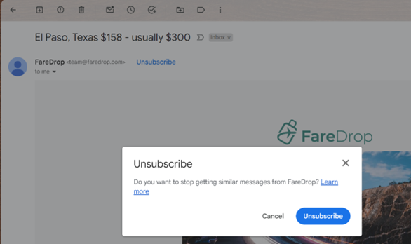
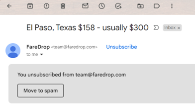

# One-click unsubscribe support for emails

> [!TIP]
> Google has clarified that senders that include an unsubscribe link in an email message have until June 1, 2024 to implement one-click unsubscribe in all commercial and promotional emails.
>
> For more up-to-date information, refer to [Google's one-click unsubscribe FAQ](https://support.google.com/a/answer/14229414?sjid=761938282406717544-NC#zippy=%2Cdo-all-messages-require-one-click-unsubscribe).

> [!IMPORTANT]
> Starting on October 10, 2024, unsubscribe links will expire six months after the link is created and will no longer work.

Email providers and the [underlying protocols](https://datatracker.ietf.org/doc/html/rfc8058) support giving email recipients the ability to unsubscribe from emails using "one click" without leaving their email application. For example, Google surfaces an **Unsubscribe** link at the top of their email user interface:

> [!div class="mx-imgBorder"]
> 

When selected, a dialog asks the user to confirm the unsubscribe. If the user selects the **Unsubscribe** button, they're unsubscribed from the email without visiting a web page:

> [!div class="mx-imgBorder"]
> 

To support this capability, the email sender adds information in the email headers that tells the email client how to automatically unsubscribe. The receiving email client uses this information to show users easy ways to unsubscribe from unwanted messages.

In October 2023, [Google](https://support.google.com/mail/answer/81126?hl=en#requirements-5k&zippy=%2Crequirements-for-sending-or-more-message-per-day%2Crequirements-for-sending-or-more-messages-per-day) and [Yahoo](https://senders.yahooinc.com/best-practices/) announced that they require email senders to support one-click unsubscribe and include a visible unsubscribe link in the message body for all promotional emails. Google requires any sender who sends more than 5,000 emails per day to Gmail accounts to follow this rule.

Email providers use this information to determine spam and reputation scores for email senders, even if it isn't a strict requirement.

## Enable one-click unsubscribe in Customer Insights - Journeys

Customer Insights - Journeys automatically includes one-click unsubscribe headers in all commercial emails, across outbound marketing and real-time journeys, without changing any existing email or journey.

To turn on one-click unsubscribe:

1. Go to **Settings** > **Other settings** > **Feature switches**.
1. Set the **One-click unsubscribe** toggle to **On**.
1. Select **Save** in the upper right of the page.

> [!IMPORTANT]
> To use the one-click unsubscribe feature, upgrade to the December 2023 release or a later version.
>
> It can take up to 30 minutes for the feature switch to take effect. Any email sent after the feature is active automatically includes the headers needed to support one-click unsubscribe.

## General functionality

When you enable the one-click unsubscribe feature, the product automatically adds two headers to the email:
1. List-Unsubscribe
1. List-Unsubscribe-Post

These headers follow the guidance in the [Internet Engineering Task Force RFC](https://datatracker.ietf.org/doc/html/rfc8058) for one-click unsubscribe and let email clients show easy unsubscribe options.

## How does one-click unsubscribe work?

The concepts of consent management differ between real-time journeys and outbound marketing areas of the product, resulting in different actions being performed in the system for one-click unsubscribe. Let’s look at how one-click unsubscribe is handled for real-time journeys and outbound marketing.

### One-click unsubscribe in real-time journeys

> [!NOTE]
> Real-time journeys have a multi-brand consent feature that you must enable before you can use the one-click unsubscribe feature. For outbound marketing, the multi-brand consent feature is irrelevant and doesn't affect anything.

In real-time journeys, consent is collected, managed, and enforced at a [contact point level](real-time-marketing-compliance-settings.md#manage-user-compliance-settings-and-consent-data) (that is, an email address, phone number or a custom channel address). Each email can be sent to only one purpose and one (optional) topic. Any commercial email, sent from real-time journeys, includes the one-click unsubscribe headers.

If the email only has a commercial purpose selected, then once the recipient selects the one-click unsubscribe link in their email client, the app marks them as opted-out for the specific purpose. This ensures that any future emails for the same purpose aren't sent to that user.

If the email is being sent for a specific topic, then once the recipient selects the one-click unsubscribe link in their email client, the app marks them as opted-out for the specific topic only. This ensures that any future emails for the same topic aren't sent to that user.

Any emails to the topic’s parent purpose remains unblocked, ensuring that other email messages with just the purpose selected or another topic, from underneath the same purpose, are still sent to that user.

Commercial emails using an [external link](compliance-overview.md#external-links) type of compliance profile also automatically include the one-click unsubscribe headers. When the recipient selects the one-click unsubscribe link, they're opted out of the purpose or topic for which the email message was sent (as described above).

If a [subscription center based compliance profile](real-time-marketing-outbound-subscription.md) is used in the email that is sent through Customer Insights - Journeys and the recipient selects the one-click unsubscribe link, then there are two actions taken:

1. The recipient’s email address is set to **opted-out** for the purpose or the topic for which the email was sent.
1. The **Bulk Email** attribute of the recipient’s contact record is set to **Do Not Allow** (that is, future commercial emails won't be sent to this contact).

#### How to identify if a contact point consent record was updated because of a one-click unsubscribe action performed by the recipient

When contact point consent (CPC) records are updated due to the recipient selecting the one-click unsubscribe link in their email client, the system indicates the source of the update and the reason with the following values:
- **Source**: “Email - list-unsubscribe”
- **Reason**: “Opt-out - One-click unsubscribe”

### Outbound marketing

If the user opens a commercial email sent from an outbound marketing journey and selects the one-click unsubscribe link presented to them in the email client, then their contact record’s **Bulk Email** field is set to **Do Not Allow** (that is, future commercial emails won't be sent to this contact). 

> [!IMPORTANT]
> If you maintain a consent data store outside of Customer Insights – Journeys, you'll also need to consider how to synchronize consent changes made from one-click unsubscribe to your external systems.

> [!IMPORTANT]
> If you use outbound marketing journeys and manage consent separately for multiple lines of business, you may need to update your implementation to properly respond to one-click unsubscribe requests. Read the next section to understand how you can use a custom handler to manage this process according to your business needs.

In outbound marketing journeys, one-click unsubscribe sets a contact’s **Bulk Email** field to **Do Not Allow** to prevent sending any commercial emails to the contact in the future. One-click unsubscribe for outbound marketing doesn't update subscription lists or custom consent fields. Additional work may be required to handle subscription lists or custom content fields.

#### Troubleshooting one-click unsubscribe in outbound marketing

Problems with one-click unsubscribe functionality in outbound marketing are typically related to customizations tied to synchronous contact updates.

:::image type="content" source="media/outbound-unsubscribe-flow.png" alt-text="Diagram of outbound marketing contact update flow." lightbox="media/outbound-unsubscribe-flow.png":::

To resolve one-click unsubscribe problems in outbound marketing:

1. Temporarily [enable plugin trace logs](/power-apps/developer/data-platform/logging-tracing#enable-trace-logging). Enabling plugin trace logs can impact performance negatively, so make sure to disable them once you're done.
1. Trigger the one click unsubscribe flow (select the unsubscribe button in an email *or* create a POST request against a one-click unsubscribe header).
1. Check the logs. If there's a plugin-related error, there should be a plugin name and a reason why the plugin crashed. Follow up with the plugin provider or [disable the plugin](https://community.dynamics.com/blogs/post/?postid=33f947e8-a5f8-4cb2-b2d9-45b444c56060). Don't disable Microsoft plugins (any plugin name that starts with "Microsoft.Dynamics.Cxp.Forms.").
1. If there's a log indicating a privilege failure during a contact update, make sure the `Marketing Service user extensible role` has privileges for such an operation.

#### Creating a custom workflow to manage the one-click unsubscribe process

Outbound marketing users that manage consent for different brands separately and want to update different properties of the contact (instead of the **Bulk Email** property) can use the steps below to create and register a custom workflow to manage this process themselves.

1. Open the **Settings** menu  at the top of the page and select **Advanced settings**.
1. The advanced-settings area opens in a new browser tab. Note that this area uses a horizontal navigator at the top of the page instead of a side navigator. Navigate to **Settings** > **Process center** > **Processes**.
1. To create a process for custom unsubscribe, select the **+New** icon. Add a **Process name**. For **Category**, select **Action** and for **Entity**, select **None (global)**.

    :::image type="content" source="media/create-unsubscribe-process.png" alt-text="Create unsubscribe process." lightbox="media/create-unsubscribe-process.png":::

1. A new window opens to add process details. Create a mandatory input parameter name **contactid**. Make sure it's of the **EntityReference** type and points to the **Contact** entity.
    
    :::image type="content" source="media/add-an-input-parameter.png" alt-text="Create a mandatory input parameter as contactid." lightbox="media/add-an-input-parameter.png":::

1. Select the **Add Step** dropdown at the bottom of the window and select **Update record**. Enter a description for the changes that should happen to contact on unsubscribe, then select **Set properties**. A new window opens where you can set the **Contact preferences** that change when a customer uses the one-click unsubscribe button. For example, in the image below, **Phone** and **Fax** are set to **Do not allow** on one-click unsubscribe.
    
    :::image type="content" source="media/describe-changes-when-unsubscribed.png" alt-text="Describe changes when the functionality is unsubscribed." lightbox="media/describe-changes-when-unsubscribed.png":::

1. Select **Save and close**. Then, on the main process window, select **Save** and then select **Activate** in the top toolbar to start the process.

1. Go to the [maker portal](https://make.powerapps.com/) and select the applicable environment.
    
    :::image type="content" source="media/select-the-environment.png" alt-text="Select the environment." lightbox="media/select-the-environment.png":::

1. Select the **Setting definition** entity and search for **Outbound marketing one-click unsubscribe**.
    
    :::image type="content" source="media/select-setting-definitions-to-unsubscribe.png" alt-text="Select the setting definitions to one-click unsubscribe." lightbox="media/select-setting-definitions-to-unsubscribe.png":::

1. Edit this value and make sure that it's pointing to the unique name of your custom workflow that you created earlier in **Step 2**. For example, in this case, the name of the workflow is **new_msdyncrm_custom_unsubscribe**. Save the changes.
    
    :::image type="content" source="media/add-the-attribute-values.png" alt-text="Add the attribute values." lightbox="media/add-the-attribute-values.png":::

1. Test that your handler is executed when the one-click unsubscribe action is performed. To test this:
    1. Temporarily [enable plugin trace logs](/power-apps/developer/data-platform/logging-tracing#enable-trace-logging). Enabling plugin trace logs can impact performance negatively, so make sure to disable them once you're done.
    1. Open the developer console (<kbd>Ctrl</kbd>+<kbd>Shift</kbd>+<kbd>I</kbd>) on any Dataverse page.
    1. Paste the following snippet into the console (adjust as needed); it executes the unsubscribe action.
    1. Make sure it executed correctly. You should be aware that in a real scenario the marketing service executes this action, so if you're accessing any entities, ensure that `Marketing Service user extensible role` has privileges for such.
```
var Sdk = window.Sdk || {};

Sdk.OneClickUnsubscribe = function(contactid) {
    this.contactid = contactid;
};

Sdk.OneClickUnsubscribe.prototype.getMetadata = function() {
    return {
        boundParameter: null,
        parameterTypes: {
            "contactid": {
                "typeName": "mscrm.crmbaseentity",
                "structuralProperty": 5
            }
        },
        operationType: 0, // This is an action. Use '1' for functions and '2' for CRUD
        operationName: "new_msdyncrm_custom_unsubscribe"
    };
};

// replace c60e0283-5bf2-e311-945f-6c3be5a8dd64 with actual valid contact id
var contactId = {
    "contactid@odata.bind": "/contacts(c60e0283-5bf2-e311-945f-6c3be5a8dd64)"
}

// Create variable calculateRollupFieldRequest and pass those variables created above
var request = new Sdk.OneClickUnsubscribe(contactId);

// Use the request object to execute the function
Xrm.WebApi.online.execute(request)
.then(function(response) {
    if (response.ok) { // If a response was received.
        console.log("Status: %s %s", response.status, response.statusText);

        // Use response.json() to access the content of the response body.
        return response.json();
    }
})
.then(function(responseBody) { 
    //Do something with the response
    console.log("The response is: %s", responseBody);
})
```

## Frequently asked questions

**What types of emails does the system include one-click unsubscribe headers on?**

The one-click unsubscribe headers are in emails with a message designation of commercial (if they're sent from an outbound marketing journey) or a purpose type of commercial (if they're sent from a real-time journey).

Transactional emails don't have one-click unsubscribe headers.

**What happens if the contact to which the email was sent is deleted and the recipient selects the one-click unsubscribe link?**

For emails sent using outbound marketing, the system does nothing because it can't find the contact record.

For emails sent using real-time journeys, the system opts the recipient’s email address out of the purpose or topic the email was sent for.

**What happens if an email is updated after it's sent and is now associated with a new purpose or topic? If the recipient selects the one-click unsubscribe link, what action does the system take?**

The system opts the recipient’s email address out of the purpose or topic that was associated with the email when it was sent.

**How does the one-click unsubscribe feature work if the email is set up with an external link type of compliance profile? Does the customer need to add POST support to their external preference center?**

No. For all compliance profile types, the product includes a system-generated one-click unsubscribe URL that handles POST requests. You don't need to change your own preference centers right now.

**In the case of outbound marketing emails that are sent to a subscription list, how does the system manage one-click unsubscribe? Does clicking the unsubscribe link remove the recipient from the subscription list?**

No. For any outbound marketing journey, only the **Bulk Email** field on the recipient’s contact record is set to **Do Not Allow**. 

**I've turned on the feature switch. Do I need to do anything else to enable one-click unsubscribe in my emails?**

No.

**Would one-click unsubscribe apply to emails that have already been sent out to my customers and are in their inbox?**

No. You can't retroactively apply the one-click headers to emails that are already sent to your customers.

**Why is Gmail not showing the one-click unsubscribe link even though I have the feature switch turned on? How would I know that the functionality is working as expected?**

Gmail considers several factors before surfacing the one-click unsubscribe link in the email client, even when the one-click unsubscribe headers are present in the email. Here's a community thread from Google where this has been discussed: [List-Unsubscribe header not providing the option to unsubscribe](https://support.google.com/mail/thread/49653586).

If you've turned on the feature switch, all future emails sent from the system include the one-click unsubscribe headers. As long as the email has the headers as specified, you can be confident that you're complying with Google’s guidelines. To check, download the message or select “Show Original” in the message menu to verify that the headers are present.

[!INCLUDE [footer-include](./includes/footer-banner.md)]
