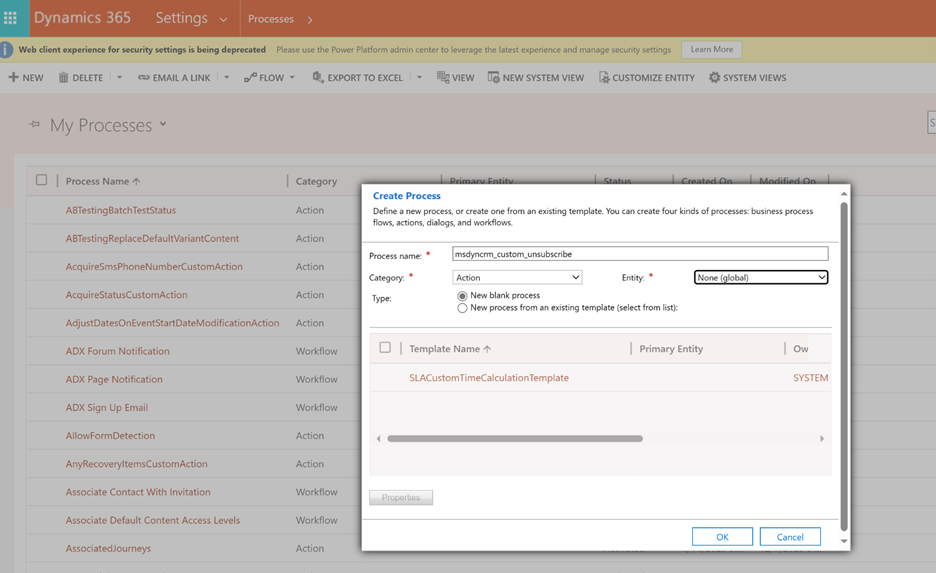
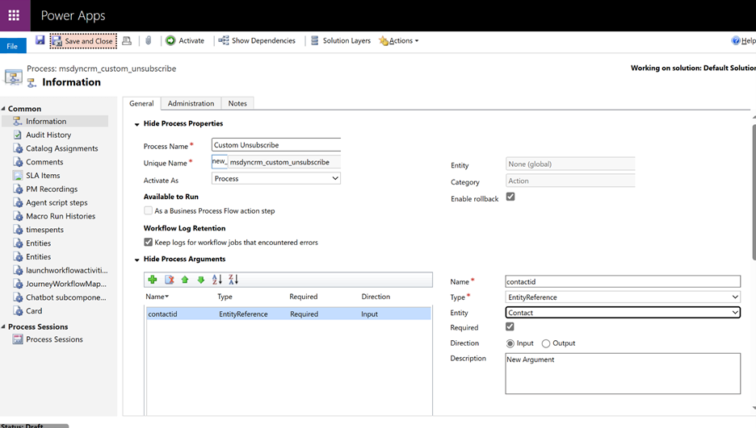
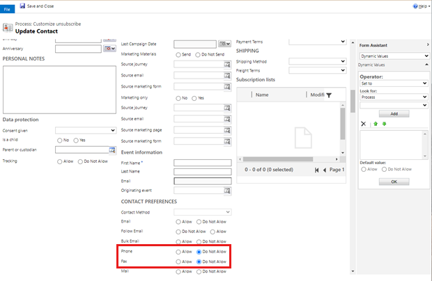
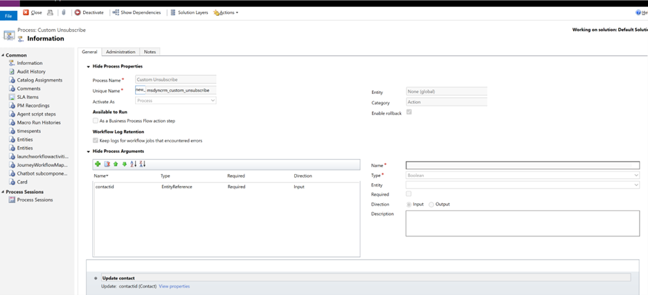
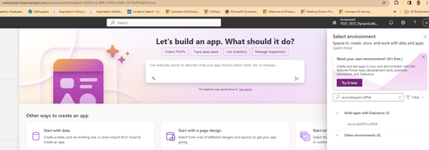
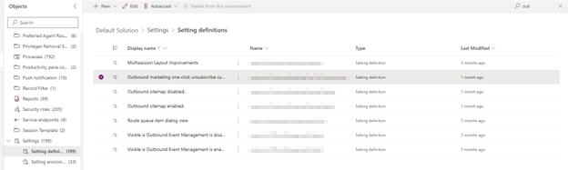
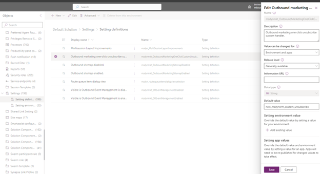

## One-click unsubscribe support for emails 

> [!IMPORTANT]
> Google has clarified that senders that include an unsubscribe link in the email message will have until June 1st, 2024 to implement one-click unsubscribe in all commercial, promotional emails. 
>
> Please refer to this FAQ from google for more up-to-date information [here](https://support.google.com/a/answer/14229414?sjid=761938282406717544-NC#zippy=%2Cdo-all-messages-require-one-click-unsubscribe)

Email providers and the [underlying protocols](https://datatracker.ietf.org/doc/html/rfc8058) support giving email recipients the ability to unsubscribe from emails in one-click without leaving their email application. For example, Google surfaces an Unsubscribe link at the top of their email UI. 

> [!div class="mx-imgBorder"]
> 

When selected, a dialog asking the user to confirm the unsubscribe is shown. If the “**Unsubscribe**” button is selected, the user is unsubscribed from this email without visiting a web page.

> [!div class="mx-imgBorder"]
> 

To support this capability, the email sender provides information in the email headers telling the email client how to automatically unsubscribe. The receiving email client can use this information to surface to the user easy ways to unsubscribe from unwanted messages.

Dynamics 365 Customer Insights - Journeys provides support for automatically including the one-click unsubscribe headers in all commercial emails, across outbound marketing and real-time journeys, without having to change any existing email or journey.

In October 2023, [Google](https://support.google.com/mail/answer/81126?hl=en#requirements-5k&zippy=%2Crequirements-for-sending-or-more-message-per-day%2Crequirements-for-sending-or-more-messages-per-day) and [Yahoo](https://senders.yahooinc.com/best-practices/) announced that they would require email senders to start supporting one-click unsubscribe and include a visible unsubscribe link in the message body for all promotional emails. Google has made it a specific requirement for any sender who sends more than 5000 emails per day to Gmail accounts to comply with this mandate.

Furthermore, email providers presently utilize the presence of this information to determine spam/reputation scores for email senders, even if it isn't a strict requirement.

## Enable one-click unsubscribe 

1. Go to **Settings > Other settings > Feature switches**.
1. Set the **One-click unsubscribe** toggle to **On**.
1. Select **Save** in the upper right corner of the page.

> [!IMPORTANT]
> To utilize the one-click unsubscribe feature, you will need to upgrade to the December 2023 release or a later version.
>
> It can take up to 30 minutes for the feature switch to take effect in the product. Any email that is sent after the feature is effective will automatically include the headers required to support one-click unsubscribe.

## General functionality 

When one-click unsubscribe feature is enabled, the product automatically includes two additional headers in the email -
1. List-Unsubscribe
1. List-Unsubscribe-Post

These headers follow the guidance provided in the [IETF RFC](https://datatracker.ietf.org/doc/html/rfc8058) for one-click unsubscribe and enable email clients to surface easy unsubscribe options to users.

## How does one-click unsubscribe work?

The concepts of consent management differ between Customer Insights - Journeys and outbound marketing areas of the product, resulting in different actions being performed in the system for one-click unsubscribe. Let’s look at how one-click unsubscribe is handled for Customer Insights - Journeys and outbound marketing.

### Customer Insights - Journeys

In Customer Insights - Journeys, consent is collected, managed, and enforced at a [contact point level](real-time-marketing-compliance-settings.md#contact-point-consent) (that is, an email address, phone number or a custom channel address). Each email can be sent to only one purpose and one (optional) topic. Any commercial email, sent from real-time journeys, will include the one-click unsubscribe headers.

If the email only has a commercial purpose selected, then once the recipient selects the one-click unsubscribe link in their email client, we mark them as opted-out for the specific purpose. This would ensure that any future emails for the same purpose wouldn't be sent to that user.

If the email is being sent for a specific topic, then once the recipient selects the one-click unsubscribe link in their email client, we mark them as opted-out for the specific topic only. This would ensure that any future emails for the same topic wouldn't be sent to that user. 

However, any emails to the topic’s parent purpose remains unblocked, allowing other email messages with just the purpose selected or another topic, from underneath the same purpose, will still be sent to that user.

Commercial emails using an [external link](compliance-overview.md#external-links) type of compliance profile will also automatically include the one-click unsubscribe headers. When the recipient selects the one-click unsubscribe link, they are opted out of the purpose or topic for which the email message was sent (as described above).

If a [subscription center based compliance profile](real-time-marketing-outbound-subscription.md) is used in the email that is sent through Customer Insights - Journeys and the recipient select on the one-click unsubscribe link, then there are "two actions taken:"
1. The recipient’s email address is set to opted-out for the purpose or the topic for which the email was sent.
1. The Bulk Email attribute of the recipient’s contact record is set to Do Not Allow (that is, future commercial emails won't be sent to this contact).

#### How to identify if a contact point consent record was updated because of a one-click unsubscribe action performed by the recipient?

Contact point consent (CPC) records that are updated due to the recipient clicking on the one-click unsubscribe link in their email client, the system will clearly indicate the source of their update and the reason with the following values - 
- **Source**: “Email - list-unsubscribe”
- **Reason**: “Opt-out - One-click unsubscribe”

### Outbound Marketing

If the user opens a commercial email sent from an outbound marketing journey and they select the one-click unsubscribe link presented to them in the email client, then their contact record’s Bulk Email field will be set to Do Not Allow (that is, future commercial emails won't be sent to this contact). 

> [!IMPORTANT]
> If you maintain a consent data store outside of Dynamics Customer Insights – Journeys, you will also need to consider how to synchronize consent changes made from one-click unsubscribe to your external systems.

> [!IMPORTANT]
> Customers who are using outbound marketing journeys and manage consent separately for multiple lines of business may need to update their implementation to properly respond to the one-click unsubscribe. Read the next section to understand how you can use a custom handler to manage this process according to your business needs.

For outbound marketing journeys, one-click unsubscribe will set a contact’s Bulk Email field to Do Not Allow to prevent sending any commercial emails to the contact in the future. One-click unsubscribe for outbound marketing won't update subscription lists or any custom consent fields and additional work may be required at your end for handling that.

#### Creating a custom workflow to manage the one-click unsubscribe process

Outbound marketing customers that manage consent for different brands separately and want to update different properties of the contact, instead of the Bulk Email property, can use the steps below to create and register a custom workflow to manage this process themselves.

1. Create a process for custom unsubscribe.
   > [!div class="mx-imgBorder"]
   > 
1. Create mandatory input parameter "contactid", make sure it is of "EntityReference" type and pointing to "Contact" entity.
   > [!div class="mx-imgBorder"]
   > 
1. Through "Add Step", describe changes that should happen to contact on unsubscribe (sample - Setting Phone and Fax to "do not allow" on one-click unsubscribe).
   > [!div class="mx-imgBorder"]
   > 
1. Save & close and activate the process.
   > [!div class="mx-imgBorder"]
   > 
1. Go to [maker portal](https://make.powerapps.com/) and select correct environment.
   > [!div class="mx-imgBorder"]
   > 
1. Select Setting definition entity, search for Outbound marketing one-click unsubscribe.
   > [!div class="mx-imgBorder"]
   > 
1. Edit this value, make it part of, make sure that is pointing to unique name of your custom workflow we created earlier in step 2. - for example, for our case it would be new_msdyncrm_custom_unsubscribe and save it.
   > [!div class="mx-imgBorder"]
   > 
1. Test that your handler is executed when one-click unsubscribe action is performed.

## Frequently Asked Questions

## What types of emails does the system include one-click unsubscribe headers on?

The one-click unsubscribe headers are included in emails that have a message designation of Commercial (if they're sent from an outbound marketing journey) or the purpose type of Commercial (if they're sent from a real-time journey). 

Transactional emails won't include one-click unsubscribe headers.

## What happens if the contact to which the email was sent is deleted and the recipient select the one-click unsubscribe link?

For emails sent using outbound marketing, the system does nothing as it would be unable to find the contact record.

For emails sent using real-time journeys, the system opts the recipient’s email address out of the purpose or topic for which the email was sent.

## What happens if an email is updated after it's sent and is now associated to a new purpose or topic. If the recipient select the one-click unsubscribe link, what action will the system take?

The recipient’s email address would be opted out of the purpose or topic that was associated to the email when it was sent. 

## How would the one-click unsubscribe feature work if the email is set up with an external link type of compliance profile? Would the customer be required to add POST support to their external preference center?

No. For all the compliance profile types, the product is designed to include a system generated one-click unsubscribe URL that is designed to handle the POST requests. You don't need to make any modifications to your own preference centers currently. 

## In the case of outbound marketing emails that are sent to a subscription list, how does the system manage one-click unsubscribe? Does clicking the unsubscribe link remove the recipient from the subscription list?

No. For any outbound marketing journey, we'll only the Bulk Email field on the recipient’s contact record to Do Not Allow. 

## I have turned on the feature switch. Do I need to do anything else to enable one-click unsubscribe in my emails?
No. 

## Would one-click unsubscribe apply to emails that have already been sent out to my customers and are in their inbox?

No. We can't retroactively apply the one-click headers to emails that are already sent to your customers. 

## Why is Gmail not showing the one-click unsubscribe link even though I have the feature switch turned on? How would I know that the functionality is working as expected?

Gmail considers several factors before surfacing the one-click unsubscribe link in the email client even when the one-click unsubscribe headers are present in the email. Here's a community thread from google where this has been discussed - [List-Unsubscribe header not providing the option to unsubscribe - Gmail Community (google.com)](https://support.google.com/mail/thread/49653586).

If you have turned on the feature switch, all the future emails sent from the system includes the one-click unsubscribe headers. As long as the email contains the headers as per the specification, you can be rest assured that you're complying with google’s guidelines. To verify this, you can download the message or select on “Show Original” in the menu item of the message to verify that the headers are present. 

