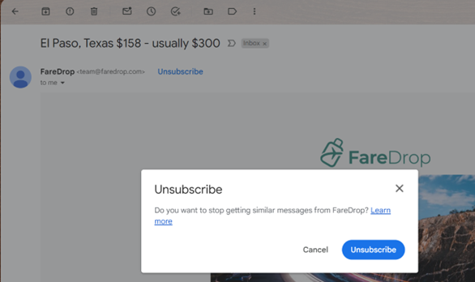
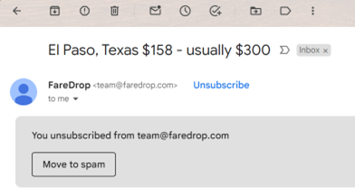

# One-click unsubscribe support for emails

> [!TIP]
> Google has clarified that senders that include an unsubscribe link in an email message have until June 1, 2024 to implement one-click unsubscribe in all commercial and promotional emails.
>
> For more up-to-date information, refer to [Google's one-click unsubscribe FAQ](https://support.google.com/a/answer/14229414?sjid=761938282406717544-NC#zippy=%2Cdo-all-messages-require-one-click-unsubscribe).

> [!IMPORTANT]
> Starting on October 10, 2024, unsubscribe links will expire six months after the link is created and will no longer work.

Email providers and the [underlying protocols](https://datatracker.ietf.org/doc/html/rfc8058) support giving email recipients the ability to unsubscribe from emails using "one click" without leaving their email application. For example, Google surfaces an **Unsubscribe** link at the top of their email user interface:

> [!div class="mx-imgBorder"]
> 

When selected, a dialog asks the user to confirm the unsubscribe. If the user selects the **Unsubscribe** button, they're unsubscribed from the email without visiting a web page:

> [!div class="mx-imgBorder"]
> 

To support this capability, the email sender adds information in the email headers that tells the email client how to automatically unsubscribe. The receiving email client uses this information to show users easy ways to unsubscribe from unwanted messages.

In October 2023, [Google](https://support.google.com/mail/answer/81126?hl=en#requirements-5k&zippy=%2Crequirements-for-sending-or-more-message-per-day%2Crequirements-for-sending-or-more-messages-per-day) and [Yahoo](https://senders.yahooinc.com/best-practices/) announced that they require email senders to support one-click unsubscribe and include a visible unsubscribe link in the message body for all promotional emails. Google requires any sender who sends more than 5,000 emails per day to Gmail accounts to follow this rule.

Email providers use this information to determine spam and reputation scores for email senders, even if it isn't a strict requirement.

## Enable one-click unsubscribe in Customer Insights - Journeys

Customer Insights - Journeys automatically includes one-click unsubscribe headers in all commercial emails without changing any existing email or journey.

To turn on one-click unsubscribe:

1. Go to **Settings** > **Other settings** > **Feature switches**.
1. Set the **One-click unsubscribe** toggle to **On**.
1. Select **Save** in the upper right of the page.

> [!IMPORTANT]
> To use the one-click unsubscribe feature, upgrade to the December 2023 release or a later version.
>
> It can take up to 30 minutes for the feature switch to take effect. Any email sent after the feature is active automatically includes the headers needed to support one-click unsubscribe.

## General functionality

When you enable the one-click unsubscribe feature, the product automatically adds two headers to the email:
1. List-Unsubscribe
1. List-Unsubscribe-Post

These headers follow the guidance in the [Internet Engineering Task Force RFC](https://datatracker.ietf.org/doc/html/rfc8058) for one-click unsubscribe and let email clients show easy unsubscribe options.

## How does one-click unsubscribe work?

In real-time journeys, consent is collected, managed, and enforced at a [contact point level](real-time-marketing-compliance-settings.md#manage-user-compliance-settings-and-consent-data) (that is, an email address, phone number or a custom channel address). Each email can be sent to only one purpose and one (optional) topic. Any commercial email, sent from real-time journeys, includes the one-click unsubscribe headers.

If the email only has a commercial purpose selected, then once the recipient selects the one-click unsubscribe link in their email client, the app marks them as opted-out for the specific purpose. This ensures that any future emails for the same purpose aren't sent to that user.

If the email is being sent for a specific topic, then once the recipient selects the one-click unsubscribe link in their email client, the app marks them as opted-out for the specific topic only. This ensures that any future emails for the same topic aren't sent to that user.

Any emails to the topic’s parent purpose remains unblocked, ensuring that other email messages with just the purpose selected or another topic, from underneath the same purpose, are still sent to that user.

Commercial emails using an [external link](compliance-overview.md#external-links) type of compliance profile also automatically include the one-click unsubscribe headers. When the recipient selects the one-click unsubscribe link, they're opted out of the purpose or topic for which the email message was sent (as described above).

### How to identify if a contact point consent record was updated because of a one-click unsubscribe action performed by the recipient

When contact point consent (CPC) records are updated due to the recipient selecting the one-click unsubscribe link in their email client, the system indicates the source of the update and the reason with the following values:
- **Source**: “Email - list-unsubscribe”
- **Reason**: “Opt-out - One-click unsubscribe”

## Frequently asked questions

**What types of emails does the system include one-click unsubscribe headers on?**

The one-click unsubscribe headers are in emails with a message designation of commercial (if they're sent from an outbound marketing journey) or a purpose type of commercial (if they're sent from a real-time journey).

Transactional emails don't have one-click unsubscribe headers.

**What happens if the contact to which the email was sent is deleted and the recipient selects the one-click unsubscribe link?**

For emails sent using real-time journeys, the system opts the recipient’s email address out of the purpose or topic the email was sent for.

**What happens if an email is updated after it's sent and is now associated with a new purpose or topic? If the recipient selects the one-click unsubscribe link, what action does the system take?**

The system opts the recipient’s email address out of the purpose or topic that was associated with the email when it was sent.

**How does the one-click unsubscribe feature work if the email is set up with an external link type of compliance profile? Does the customer need to add POST support to their external preference center?**

No. For all compliance profile types, the product includes a system-generated one-click unsubscribe URL that handles POST requests. You don't need to change your own preference centers right now.

**I've turned on the feature switch. Do I need to do anything else to enable one-click unsubscribe in my emails?**

No.

**Would one-click unsubscribe apply to emails that have already been sent out to my customers and are in their inbox?**

No. You can't retroactively apply the one-click headers to emails that are already sent to your customers.

**Why is Gmail not showing the one-click unsubscribe link even though I have the feature switch turned on? How would I know that the functionality is working as expected?**

Gmail considers several factors before surfacing the one-click unsubscribe link in the email client, even when the one-click unsubscribe headers are present in the email. Here's a community thread from Google where this has been discussed: [List-Unsubscribe header not providing the option to unsubscribe](https://support.google.com/mail/thread/49653586).

If you've turned on the feature switch, all future emails sent from the system include the one-click unsubscribe headers. As long as the email has the headers as specified, you can be confident that you're complying with Google’s guidelines. To check, download the message or select “Show Original” in the message menu to verify that the headers are present.

[!INCLUDE [footer-include](./includes/footer-banner.md)]
