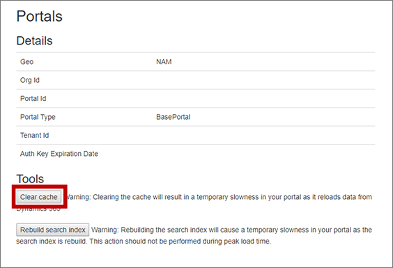

# Portals FAQs

> [!IMPORTANT]
> **This article only applies to [outbound marketing](user-guide.md), which is gradually being removed from Customer Insights - Journeys.** To avoid interruptions, stop using outbound marketing and transition to real-time journeys. Learn more: [Transition overview](transition-overview.md).

Read this article to find answers to common questions and solutions to known issues associated with using Power Apps portals in the outbound marketing area of Dynamics 365 Customer Insights.

## How can I fix occasional portal issues?

Marketing pages and the event website both run on Power Apps portals. Sometimes, you may notice that settings you make in Customer Insights - Journeys aren't reflected on the portal right away, such as (for the event website): updates to banner images, speaker images, or payment gateway assignments&mdash;or, your portal may become unresponsive or otherwise unreliable. You can often solve all of these issues either by [clearing the portal cache](portals-faqs.md#clear-the-portal-cache), or [restarting it](#restart-the-portal). It's faster to clear the cache, but restarting it will sometimes solve more or other issues.
          
### Clear the portal cache
        
You can solve many portal issues by clearing the portal cache. Once you have a portal user set up and configured as an administrator, this is faster and easier than [restarting the portal](#restart-the-portal), though some problem may still require a restart.
          
The subsections below explain how to set up the required portal user and then run the clear-cache command. If you already have a portal user that's configured as an administrator, just skip ahead to [Step 3: Clear the portal cache](#step-3-clear-the-portal-cache).
          
### Step 1: Create an account on your portal

Start by adding yourself as a portal user, just as your contacts would do when registering themselves and others for an event (this is not the same as your Dynamics 365 user account). To do this:
          
1. Open your event website, for example by opening any event record and selecting the globe button next to the **Event URL** field.
1. On the event website, select the **Sign In** button at the top of the page.
1. On the sign-in page, go to the **Register** tab and fill out the fields to create a new account. You must use an email address that doesn&#39;t already belong to a contact in your database. Be sure to make a note of your user name and password.
1. The **Profile** page opens. Enter your first and last names in the fields provided and select **Update**.
1. Your account is now created.
          
### Step 2: Grant your new account permission to clear the portals cache

Once you have your account and password set up, you must configure that account as an event-portal administrator. To do this:
          
1. Sign into Customer Insights - Journeys and use the app selector to go to the Dynamics 365&mdash;custom app.
          
    > [!div class="mx-imgBorder"]
    > 
          
1. In the custom app, go to the area selector menu in the lower left and select **Portals**. Then, in the left navigation pane, go to **Security** > **Contacts**.
1. The portal contacts page opens. Open the system-view selector menu and choose the **All Contacts** view.
          
    > [!div class="mx-imgBorder"]
    > 
          
1. Find your portal user in the list and open it.
1. Open the form-view selector and switch to the **Portal contact** form view.
          
    > [!div class="mx-imgBorder"]
    > 
          
1. Go to the **Details** tab, then scroll down to the **Web Roles** section.
1. Select **Add Existing Web Role** to add a role, then select the magnifying glass icon to open the role menu, and finally select the **Administrators Event Portal** role to add that role to your contact.
          
    > [!div class="mx-imgBorder"]
    > 
          
1. Select the **Add** button in the bottom corner. Your user account is now an administrator for your event website.
          
### Step 3: Clear the portal cache

Once you have your portal-administration account set up, you can use it to clear the portal cache at any time. To do this:
          
1. Open your event website, for example by opening any event record and selecting the globe button next to the **Event URL** field.
1. On the event website, select the **Sign In** button at the top of the page.
1. Sign in as a user that you have set up as an event-portal administrator.
1. Enter the following URL: `https://<YourPortalDomain>/_services/about` where `<YourPortalDomain>` is the domain of your portal. You can find it by looking at the URL shown when you signed into the portal.
1. A portal-administration page opens. Select **Clear cache**.
          
    
          
1. Your portal cache is cleared, which also has the effect of signing you out of the portal.
          
### Restart the portal

If clearing the cache didn't fix your portal issues, restarting it may help. This operation takes a bit longer than clearing cache, and your portal will be offline until the process is complete.
          
To restart your portal:
          
1. [Open the installation management area](uninstall.md) and go to **Resources** > **Portals** on the left navigation pane.
1. Each configured portal app is listed using the name of the Dynamics 365 instance it is assigned to (so it probably doesn't have "portal" in its name), and shows a value of **Configured** in the **Status** column. Find and select your portal in the list and then select **Manage** in top navigation ribbon.  
          
    > [!div class="mx-imgBorder"]
    > 
          
1. The portals manager opens. Select **Portal actions** in the side panel, and then select the **Restart** tile to restart the portal. 
          
    
          
1. You'll be asked to confirm the action. Choose **Restart** to continue and then allow a few minutes for the process to complete.
          
## How can I fix my portal after changing my instance name?

The Power Platform admin center enables you to change the  name of any of your instances at any time. If you do so, then the URL for the affected instance will also change to match and, as a result, your portal will no longer be configured correctly and will stop working. To fix it, you must reconfigure your portal as follows:
          
1. [Open the installation management area](uninstall.md) and go to **Resources** > **Portals** on the left navigation pane.
1. Each configured portal app is listed using the name of the Dynamics 365 instance it is assigned to (so it probably doesn't have "portal" in its name), and shows a value of **Configured** in the **Status** column. Find and select your portal in the list and then select **Manage** top ribbon.  
          
    > [!div class="mx-imgBorder"]
    > 
          
1. The portals manager opens. Select **Portal actions** in the side panel, and then select the **Update Dynamics 365 URL** tile to update the URL.  
          
    
          
1. You'll be asked to confirm the action. Choose **Update URL** to continue and then allow a few minutes for the process to complete.

[!INCLUDE [footer-include](./includes/footer-banner.md)]
