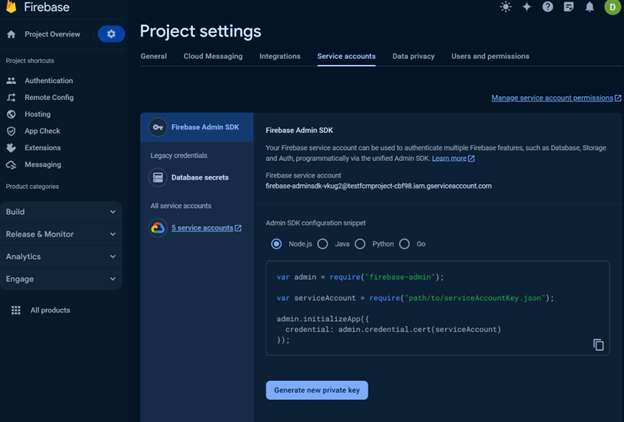

# Transition Andriod push notifications to FCM tokens for authorization

## Summary

In June 2024, Google Firebase is deprecating authentication using an API key in favor of leveraging a Service Account JSON token. Customers currently using the API key method will need to change to the token. Doing so requires creating the token in Firebase, downloading it, and switching authentication methods in Customer Insights - Journeys. Learn more from [Google Firebase](https://firebase.google.com/docs/cloud-messaging/migrate-v1).

## Instructions

In June 2024, the FCM Token authentication approach for Android push notifications will be deprecated and replaced with a service account JSON file-based approach. You'll need to replace an existing FCM token with the JSON file generated within your Google Firebase account.

To generate this file, login to your Firebase account, navigate to the Firebase project for your application, and open project settings by clicking the gear icon next to Project Overview.

> [!div class="mx-imgBorder"]
> 

Then, visit the **Service accounts** tab and select **Generate a new private key**.

> [!div class="mx-imgBorder"]
> 

This creates and downloads a JSON file that you can save.

> [!div class="mx-imgBorder"]
> 

Once you have the new file, navigate to the **Settings\Push notifications** area of Customer Insights - Journeys. Open the push notification configuration for the application you wish to update. Here, you can change your FCM authentication mode from **API Key** to **Service Account JSON**.

Doing so allows you to upload the JSON file you created. Once saved, the authentication method is updated and push notifications will continue sending successfully.

> [!IMPORTANT]
> If you have multiple applications, including a test and production differentiation, it’s important to ensure you upload the FCM token that was generated for the right application to ensure Push notifications continue sending. Failure to do so will result in failed authentication, preventing Push notifications from sending.

In addition, we recommend testing this process with a test or development account prior to making the updates in production.
