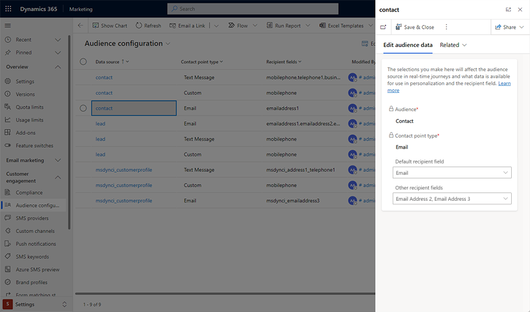

# Select the audience source for journeys

Audience configuration lets you manage your audience data sources. Customer Insights - Journeys supports **Contact**, **Lead**, and **Customer profile** entities. In the audience configuration, you map the default attributes for these entities that are then used by other components of Customer Insights - Journeys to find audience members, personalize content, or send messages. In this configuration, you map the core contact point types (for example, email, text message) to the fields on those entities which should be used.

To access the **Audience configuration settings**, go to **Settings** > **Customer engagement** > **Audience configuration**.

> [!div class="mx-imgBorder"]
> 

Contacts and leads have default recipient fields set up for emails and phone numbers. The values from these fields are automatically populated in the *Send-to* field. You can modify the default settings by adding more recipient fields or changing the default field content.

Customer profiles have no default fields set. You can choose which fields from a customer profile should be used when sending an email or text message.

## Change your audience configuration

To change the audience configuration, select a data source (**Contact**, **Lead**, or **Customer profile**) and review the information in the right pane.

> [!div class="mx-imgBorder"]
> 

You can change the default recipient or add more recipient fields. You can select any of the fields you added when adding an email or text message tile to a customer journey.

A default value is displayed in the *Send-to* field, but you can select any other recipient field from the drop-down menu.

> [!Important]
> Starting in the February 2024 release, it's possible to configure multiple email addresses for a contact's email channel. However, for any release version before February 2024, you can only select a single email address for a contact's email channel configuration.

[!INCLUDE [footer-include](./includes/footer-banner.md)]
