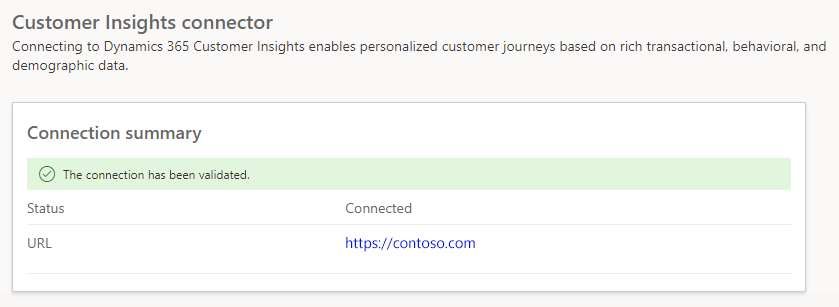

# Use Customer Insights - Data profiles and segments in Customer Insights - Journeys

Customer Insights - Journeys enables you to deeply personalize your customer engagement using transactional, behavioral, and demographic data from [Dynamics 365 Customer Insights - Data](/dynamics365/customer-insights). With Customer Insights - Data, you can:
- Target unified Customer Insights - Data customer profiles and segments. This enables you to engage every customer, regardless of whether the customer's data is in Customer Insights - Journeys or Customer Insights - Data.
- Base dynamic content (such as personalized dynamic text) in emails, text messages, and push notifications on measures such as loyalty status, subscription renewal date, parent account, or any other measure you have captured in the unified customer profile.

For example, let's say you have an e-commerce website. You capture information about the visitors and shoppers on the website as customer profiles in Customer Insights - Data. You decide you want to target visitors who have abandoned their carts while shopping.

To target visitors with abandoned carts, you first need to define a [custom trigger](real-time-marketing-custom-triggers.md) for any shopper who abandons a cart. You'll need to set the **Data type** field for the trigger's **Customer Data** property to **Profile (Customer Insights - Data)**. You'll then need to set up a [trigger-based journey](real-time-marketing-trigger-based-journey.md) using the abandoned cart trigger.

> [!div class="mx-imgBorder"]
> 

Alternately, you can create a scheduled journey targeting the customers in an abandoned cart segment. When creating your journey, you'll be able to see segments from both Customer Insights - Journeys and Customer Insights - Data in the **Audience** dropdown list.

## Set up your Customer Insights - Data environment for use with Customer Insights - Journeys

To set up your Customer Insights - Data environment for Customer Insights - Journeys, complete the following steps:

1. Ensure that the Customer Insights - Data environment is set up in a [region where Customer Insights - Journeys is available](real-time-marketing-overview.md). If your current environment is not in a region where Customer Insights - Journeys is available, you can create a new Customer Insights - Data environment using a copy of the previous environment.
1. Enable data sharing between your Customer Insights - Data environment and the Microsoft Dataverse organization where Dynamics 365 Customer Insights - Journeys is or will be installed. This can be done in the Advanced settings of the [Customer Insights - Data environment configuration](../data/own-data-lake-storage.md#enable-data-sharing-with-dataverse-from-your-own-azure-data-lake-storage-preview).
1. Set up **Map**, **Match**, and **Merge** rules in Customer Insights - Data to unify customer data and create unified customer profiles. Be careful while setting up the unification rules. Any future changes to the rule can impact or break live customer journeys.
1. Create at least one segment.

## Set up your Dynamics 365 Customer Insights - Journeys environment to automatically discover Customer Insights - Data

Customer Insights - Journeys can automatically discover Customer Insights - Data and make it available for Customer Insights - Journeys. To ensure automatic discovery, complete the following steps:

1. If you haven't provisioned the Dynamics 365 Customer Insights - Journeys application in a Dataverse org, complete the steps [in the section above](real-time-marketing-ci-profile.md#set-up-your-customer-insights---data-environment-for-use-with-customer-insights---journeys) to first set up your Customer Insights - Data environment. If you complete these steps before Customer Insights - Journeys is installed in the Dataverse org, the Customer Insights - Journeys app will automatically discover the Customer Insights - Data environment. You can verify whether Customer Insights - Journeys has discovered the Customer Insights - Data environment by going to **Settings** > **Data management** > **Customer Insights - Data connector**.
1. If you’ve already enabled Customer Insights - Journeys in the Customer Insights - Journeys app prior to setting up Customer Insights - Data as described above, the automatic discovery won't take place. In this case, **Settings** > **Data management** > **Customer Insights - Data connector** shows the following screen:

> [!div class="mx-imgBorder"]
> 

  - To retry Customer Insights - Data discovery, complete the [above-listed steps](real-time-marketing-ci-profile.md#set-up-your-customer-insights---data-environment-for-use-with-customer-insights---journeys) in your Customer Insights - Data environment, and then return to **Settings** > **Data management** > **Customer Insights - Data connector** and select **Connect**.
  - If the setup is correct, Customer Insights - Journeys will be able to discover Customer Insights - Data and you should see the success indicator.

> [!div class="mx-imgBorder"]
> 

## Set up default properties for unified customer profiles

When using Customer Insights - Data customer profiles in real-time customer journeys, you'll be required to specify which attributes in the profile correspond to the customer’s preferred email and phone number. To eliminate the need for specifying this information every time, you can create default settings that customer journeys will automatically use from that point on.

Learn more: [Audience configuration](real-time-marketing-audience-data.md)

[!INCLUDE [footer-include](./includes/footer-banner.md)]
