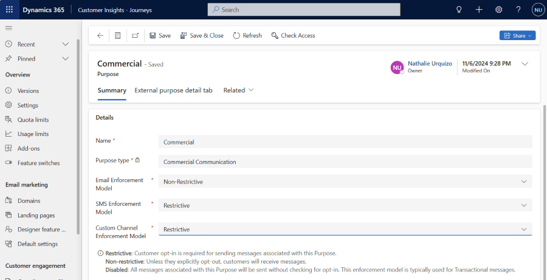

# Consent management overview

> [!IMPORTANT]
> This article applies to real-time journeys *and* outbound marketing.

Real-time journeys and outbound marketing have distinct but related constructs for supporting consent and regulatory compliance for communications with customers. This article provides an overview of these differences along with references to more detailed information on ways to approach compliance.

## Consent data capture and storage

In real-time journeys, consent is captured and stored at the contact point. A contact point is the destination for a message (for example, an email address or phone number). Customer consent is stored on a per-channel basis. For example, the email `somebody@example.com` has consented to receive commercial communications about upcoming events.  

The primary benefit of contact point consent is that it allows Customer Insights - Journeys to orchestrate real-time journeys across any entity. Orchestrating across journeys means you can enforce consent for leads, Customer Insights - Data profiles, contacts, and any other entity. This approach is opposed to outbound marketing journeys, which can only orchestrate journeys for contact entities.

In outbound marketing, consent is captured and stored on the contact entity the `DoNotEmail`, `DoNotBulkEmail` and `DoNotTrack` fields that apply to the entire contact record and all its email addresses. This approach doesn't allow for different consent to be captured for a contact’s multiple email addresses, phone numbers, etc.

> [!IMPORTANT]
> Real-time journeys may check the contact's `DoNotEmail`, `DoNotBulkEmail`, and `DoNotTrack` fields to match outbound marketing's consent enforcement behavior and aid in the transition from outbound marketing to real-time journeys. Learn more below in [Manage user compliance settings in real-time journeys](real-time-marketing-compliance-settings.md#manage-user-compliance-settings-in-real-time-journeys)

> [!IMPORTANT]
> Outbound marketing does not check contact point consent records to evaluate consent when sending messages. This means that outbound marketing messages will not be affected by contact point consent records.

## Compliance profiles

Compliance profiles are the hubs to manage consent and compliance in Customer Insights - Journeys. Compliance profiles govern how consent is captured and enforced. Compliance profiles store information such as company address, the preference management experience, and related configuration. Compliance profile settings vary based on the type of compliance profile you're creating or modifying.  

## User contact preferences

> [!IMPORTANT]
> Starting on October 10, 2024, unsubscribe links will expire six months after the link is created and will no longer work.

There are four ways that users can manage their contact preferences: preference centers, preference pages, subscription centers, and external links.  

### Preference centers

> [!TIP]
> Preference centers are the recommended way to enable customers to manage their communication preferences with your organization for real-time journeys.

> [!IMPORTANT]
> Preference centers do not modify a contact's `DoNotEmail`,  `DoNotBulkEmail`, or `DoNotTrack` fields. This means that outbound marketing messages are not affected by changes made to consent from preference centers. If you are sending messages from outbound marketing and real-time journeys at the same time, we recommend you use subscription centers in your real-time journeys.

Customer Insights - Journeys uses preference centers to enable customers to control the types of communications they wish to receive and the contact point at which they wish to receive them. They work with all supported entity types: leads, contacts, etc. Preference centers can be configured to match company branding and can include options for users to manage the consent for purposes and topics. Preference centers also support multi-brand consent, enabling you to manage consent independently for each of your lines of business.

Learn more: [Create Customer Insights - Journeys preference centers](real-time-marketing-preference-centers.md)

### Preference pages

> [!IMPORTANT]
> We recommend replacing preference pages with preference centers to take full advantage of the consent features available in Customer Insights - Journeys.

Customer Insights - Journeys uses preference pages as another way to manage user consent. A preference page is a web page where your customers can change their consent settings for receiving emails and text messages and for tracking. You can't create a new preference page. Instead, you can customize the language on the page for updating contact point consent as used in Customer Insights - Journeys. With the introduction of preference centers, existing preference pages will continue to support users updating their consent. However, moving forward, all new compliance profiles use the enhanced functionality of preference centers.  

### Subscription centers

> [!CAUTION]
> Subscription centers can only be used with contact entities. Leads and Customer Insights - Data profiles are not supported by subscription centers. If you plan to send communication to these entity types we recommend using a preference center.

Outbound marketing subscription centers are marketing pages that contacts can use to manage their communication preferences and contact details with your organization. Subscription centers must be configured in outbound marketing but can be used for real-time journeys. Subscription centers don't work with real-time journey purposes and topics. Only data on the contact record (such as the `DoNotBulkEmail` field) and subscription lists can be updated from a subscription center.

Customer Insights - Journeys can also use subscription centers if your journeys only target contacts. Using subscription centers from a real-time journey can enable you to start sending messages from real-time journeys before you transition to the newer preference center option.

> [!NOTE]
> When a subscription center is used in a real-time journey, updates to the `DoNotBulkEmail` field made by the user will result in a contact point consent record being created or updated for the commercial purpose of the compliance profile configured on the email message.

To learn more about using an existing outbound marketing subscription center in a real-time journey, visit [Use outbound subscription centers in Customer Insights - Journeys](real-time-marketing-outbound-subscription.md)

### External links

> [!CAUTION]
> External links are currently designed to work with externally hosted subscription centers and can only be used with contact entities. Leads and Customer Insights - Data profiles are not supported by external links. If you plan to send communication to these entity types we recommend using a preference center.

> [!TIP]
> If you want to include a link to an external preference management page and the modifications made to the URL do not work for your use case, we recommend that you configure your messages to include the preference management link directly in the message template and not use the built-in compliance `{{PreferenceCenter}}` tokens.

External links allow you to configure a website URL that points to an externally hosted subscription center. The URL configured in the compliance profile will be included in messages sent with this compliance profile. When the URL is inserted into a message, it is modified to include a query string parameter at the end to enable the receiving subscription center to identify the contact that was sent the message.

## Manage user compliance settings in real-time journeys

Managing compliance settings is key to ensuring your business processes conform with privacy laws and regulations. This article gives an overview of administrator compliance setup, preference centers, and real-time journeys concepts. For information on outbound marketing compliance, visit [Outbound marketing compliance settings](privacy-use-features.md).

> [!VIDEO https://www.microsoft.com/videoplayer/embed/RW137KU]

### Real-time journeys compliance overview

To configure real-time journeys compliance, administrators can go to **Settings** > **Customer engagement** > **Compliance profiles** to define the consent model, the company address, and customize the preference center page for your end users.

#### Contact point consent

A contact point is the destination for a message. For example, an email address or phone number is a contact point. Real-time journeys consent is contact point based, which means that consent is stored per destination and per channel. For example, the email `somebody@contoso.com` has consented to receive commercial communications about upcoming events. Consent in real-time journeys is stored in contact point consent records. In comparison, outbound marketing's consent model only relies on the consent on the *contact record*. With real-time journeys's contact point consent, customers have more control over where they want to receive marketing messages from your organization.

Another benefit of contact point consent is that it allows for real-time journeys to orchestrate journeys across any entity including contacts, leads, etc.

#### Compliance profiles

Compliance profiles are the containers of consent settings. In some instances, customers might want to separate consent for brands or lines-of-business (LOBs) by creating separate compliance profiles for each. Compliance profiles give marketers the ability to create specific consent settings for various LOBs. For instance, if there are headquarters in different regions whose physical addresses should show for recipients in the applicable region, each compliance profile can have its own address.  

Another reason for having multiple compliance profiles would be to support different compliance requirements across regions. For example, a company that operates in the United States and France might choose to have a separate compliance profile for those two locations. Within the United States version, the commercial purpose could be set to a nonrestrictive enforcement model because the U.S. isn't subject to European regulations. Within the France version, however, they might set the commercial purpose to the restrictive enforcement model to require explicit consent before sending any commercial or promotional materials.

When you create a new compliance profile, you can **Use previously captured consent**. This option is intended to facilitate transitioning from a compliance profile with a preference page to one with a preference center. Doing so ensures that any previously captured consent applies to the new compliance profile.

> [!NOTE]
> Currently, you can deactivate a compliance profile or contact point consent record. However, deactivated profiles and contact point consent records will still be used and enforced because existing journeys or messages sent may rely on them. Should you wish to update a user's consent, go to the contact point consent record itself and change the consent value.

#### Purposes

Data use purpose consent (hereafter called “purpose”) defines the specific reason for which consent is collected. It's often associated with a specific legal basis or reason – for example, consent to be contacted for commercial marketing purposes. A purpose can be one of three types: (1) Commercial Communication, (2) Transactional Communication, and (3) Tracking Consent. When a compliance profile is created, three purposes are created by default: a Commercial, Transactional, and Tracking purpose. These purposes can be customized to meet your specific needs. You can also create and add your own purposes to a compliance profile.

Purpose consent also allows customers to create line-of-business (LOB) separation without using Dataverse business units or separate compliance profiles. Each LOB has a preference center configured for each business, and each LOB has a set of purposes associated with it that's specific to each LOB. Each message (for example, email or text message) is tied to a single preference center and an associated purpose.

Each organization might need to define separate purposes for each of their LOBs individually – for example, Contoso Northwest might want to manage consent independently from Contoso East. They would create a Commercial Communication Purpose for each LOB so they could manage opt-in or opt-out of Commercial Communication independently for each LOB.

Purposes can also be shared across compliance profiles. Sharing purposes allows you to put purposes and topics from one compliance profile into another compliance profile's preference center and use them to control message consent. For example, a Contoso Global compliance profile might have a Commercial purpose that is shared with Contoso Northwest and Contoso East. The shared purpose could then be used to allow customers who receive email from of Contoso Northwest to opt in or out of communication from the Contoso Global brand on Contoso Northwest's preference center. Additionally, sharing consent purposes allows you to create compliance profiles that share consent data but have a different preference center design. For example, by sharing all purposes across two different compliance profiles, you could create two different preference centers in two different languages but share consent.

#### Topics

Each Purpose can contain topics to add specific communications types to allow customers to refine their communications preferences. For example, Contoso Northwest might want to add topics such as "Newsletters," "Daily Deals," and "Product Announcements" to the commercial purpose to allow their customers to decide which specific topics interest them. When creating a message to send, marketers must choose a purpose and can optionally choose a topic that has been created. Recipients can then choose to opt in or out of the topics that interest them. There's a hierarchical relationship between purpose and topic. A topic can only be associated with a single purpose.

#### Consent enforcement

The **Enforcement model** settings on a purposes control how consent is evaluated before a message is sent. Messages sent to a purpose use that purpose's enforcement model to evaluate if the message is or is not sent. There are three enforcement models that can be chosen depending on your regulatory needs:

- **Restrictive**: Messages are sent only to contact points that have opted-in contact point consent records for this purpose (or topic).
- **Non-restrictive**: Messages are sent to all contact points unless they have an opted-out contact point consent record for this purpose (or topic).
- **Disabled**: Messages are sent to all contact points. Contact point consent records aren't checked before sending messages to this purpose (or topic).

> [!NOTE]
> Since the November 2024 release, you can set the enforcement model to all channels including text and custom channels.

Topics use the enforcement model of their parent purpose. Messages that are configured with both a purpose and a topic must have consent for both the purpose and the topic for the message to be sent. If a contact point doesn't have consent to send to a purpose, no messages to that purpose's topics are sent to the contact point. For example, if the parent purpose has a restrictive enforcement model, sending a message to a topic requires an opt-in contact point consent record for both the purpose and the topic associated with the contact point consent.

> [!div class="mx-imgBorder"]
> 

There can be a different .

##### Considerations for contact entities

> [!NOTE]
> If you're using Customer Insights - Journeys without the outbound marketing module installed, the additional consent enforcement checks described in this section aren't performed. If outbound marketing marketing isn't present, only the contact point consent enforcement model is used to determine if messages are sent.

When outbound marketing is provisioned, real-time journeys make consent enforcement checks using data stored on the contact record.

To aid in the transition from outbound marketing, real-time journeys check the consent stored on contact entities in addition to the purpose and topic-based consent checks. Real-time journeys look at the contact's `DoNotEmail`, `DoNotBulkEmail`, and `DoNotTrack` fields when an email message is sent to a contact entity.

In outbound marketing journeys, the contact entities `DoNotEmail` and `DoNotBulkEmail` control if an email is sent. Real-time journeys also check these two fields to match outbound marketing's consent enforcement behavior. For emails with a **commercial** purpose type, the `DoNotEmail` and `DoNotBulkEmail` fields must both be set to allow an email to be sent to the contact. Only the `DoNotEmail` field must be set to allow emails to be sent with a **transactional** purpose type. These checks are done in addition to the Customer Insights - Journeys contact point consent opt-in/opt-out checks for emails sent by journeys. These checks are not performed for other entity types (for example, leads or Customer Insights - Data profiles).

For an email to be sent to a contact from a real-time journey, both the contact's fields and the contact point consent records for the email address must all allow the message to be sent.

Similarly, the contact's `DoNotTrack` field and tracking contact point consent records must both allow tracking in order for tracking links and pixels to be inserted into a message. These three fields aren't checked for messages sent to other entities (for example, leads).

Text and custom channel messages to contacts don't use the `DoNotEmail`, `DoNotBulkEmail`, or `DoNotTrack` fields when evaluating consent.

To learn more about transitioning from outbound marketing to real-time journeys here, visit [Consent management and double opt-in transition guidance](real-time-marketing-consent-transition.md)

## See also

[Manage consent for email and text messages in Customer Insights - Journeys](real-time-marketing-email-text-consent.md)
[Customer Insights - Journeys preference centers](real-time-marketing-preference-centers.md)
[Outbound marketing compliance settings](privacy-use-features.md)

[!INCLUDE [footer-include](./includes/footer-banner.md)]
