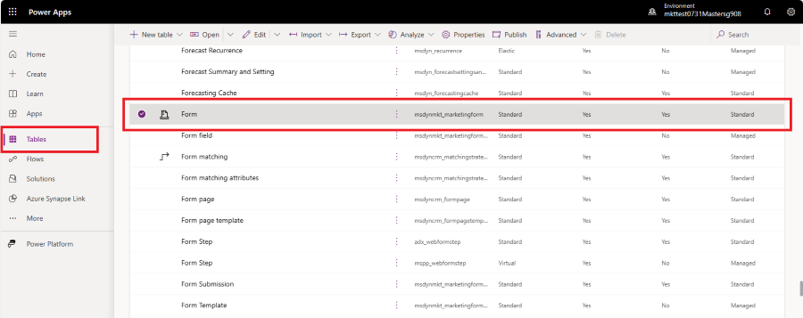
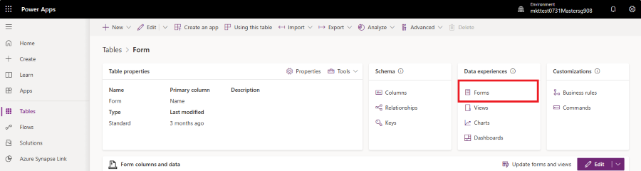
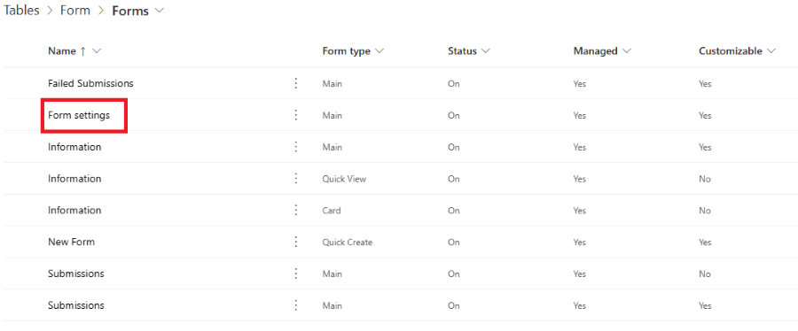
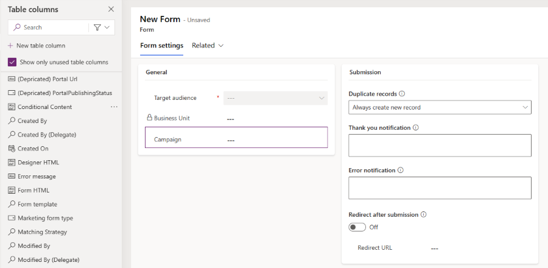
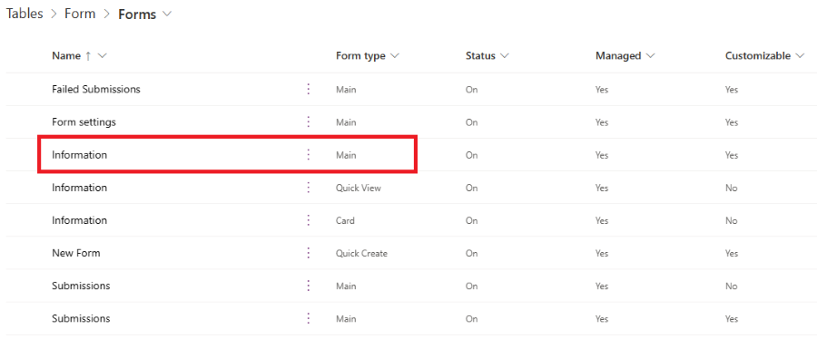
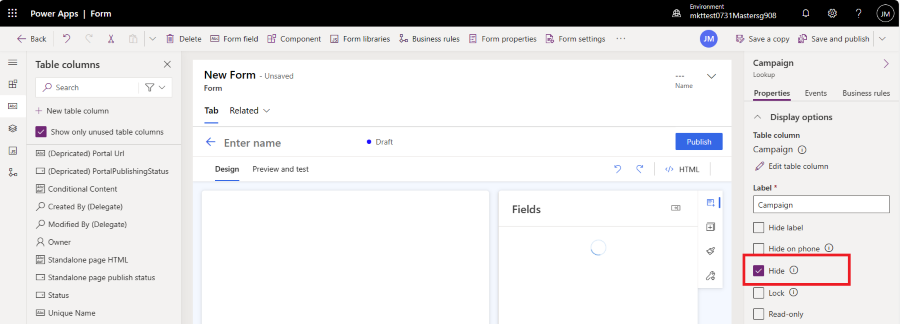
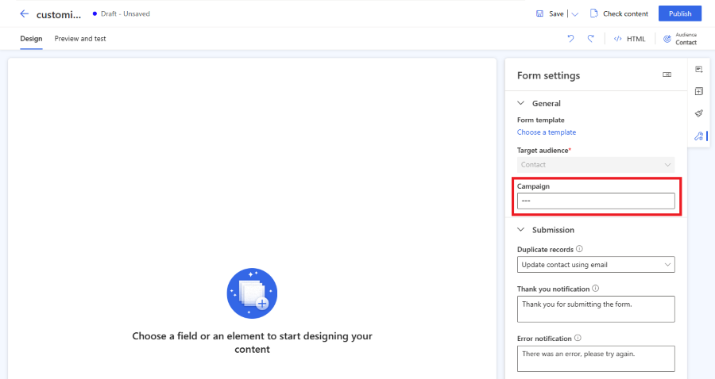

# Customize the form editor

The latest [form editor](real-time-marketing-form-overview.md) simplifies the process of designing forms or simple landing pages by providing more screen real estate for the design canvas. You can further tailor the form editor to suit your needs by implementing your own customizations.

The following are customizable form editor entities:

- **Form** (msdynmkt_marketingform)
- **Form Submission** (msdynmkt_marketingformsubmission)

Customizations made to the main form or customizations adding new fields to the **Form Settings** form *don't* require any action.

For example, you can extend the form editor by adding custom fields through Dataverse to streamline your business processes for higher efficiency. Customization allows you to add fields such as "Campaign" to your forms.

## Customizing the form editor step-by-step

Let's add a "Campaign" field to your forms in this step-by-step guide.

1. Go to **Power Apps**, and find the **Form** table (msdynmkt_marketingform) under **Dataverse** > **Tables**.

    > [!div class="mx-imgBorder"]
    > 

1. Create a new column of Form table, which is used to store the reference to your campaign. Select button New and select Column. Changing Data type to *Lookup* adds drop-down menu *Related table*. Select Campaign in Related table. Add Display name and Save the new column.

    > [!div class="mx-imgBorder"]
    > 

1. Go to **Data experiences -> Forms** to access the new form editor form

    > [!div class="mx-imgBorder"]
    > 

1. Select **Form Settings** from the list.

    > [!div class="mx-imgBorder"]
    > 

1. Drag and drop the **Campaign** field from the left column to the designated place in the form.

    > [!div class="mx-imgBorder"]
    > 

1. It's important to add the **Campaign** field to the main form, otherwise the custom field can't be rendered. Go to **Data Experiences** > **Forms** and select the form *Information* with form type *Main*.

    > [!div class="mx-imgBorder"]
    > 

1. Select the **Campaign** field in the left column to add it to the form. Once you see the **Campaign** field properties in the right column, select the **Hide** checkbox to hide this field on the main form.

    > [!div class="mx-imgBorder"]
    > 

1. To save your changes, select the **Save and publish** button in the top right corner.
1. Once you create a new marketing form in Customer Insights – Journeys, you're now able to see the **Campaign** field in the form settings. You might need to reload the Customer Insights – Journeys app to reflect the customization changes. Press F5 to reload the browser tab.

    > [!div class="mx-imgBorder"]
    > 

> [!IMPORTANT]
> It's recommended to deploy changes to the forms entity within a managed solution. [Learn more](/power-platform/alm/solution-concepts-alm)

[!INCLUDE [footer-include](./includes/footer-banner.md)]
