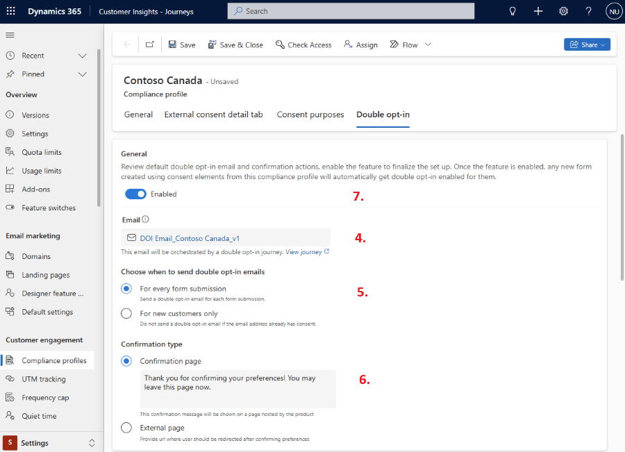

# Double opt-in in real-time journeys

Double opt-in (also known as confirmed opt-in) is a process that requires contacts or leads who sign up for new purposes or topics to confirm their subscription by selecting a link sent to their registered email address. This extra step ensures that the request is intentional by the owner of email address and the provided email address is valid and functional.

## How the double opt-in process works

1. A new or existing contact or lead uses a [form](real-time-marketing-form-overview.md) to provide their consent.
1. On submitting the form, the contact (or lead) is shown a page that tells them to check their email for a confirmation message that includes a link the contact must select to confirm their request.
1. Customer Insights - Journeys sends a confirmation email to the address registered for the contact (or lead).
1. The contact (or lead) opens the confirmation email, reads the text, and selects the link. This opens a web browser, which submits a coded URL that identifies the contact (or lead) to Customer Insights - Journeys.
1. After the double opt-in confirmation is finished, the system creates a new or updates an existing contact (or lead) and the corresponding consent records. A "thank you" page is then redirected to the contact.

> [!IMPORTANT]
> The link in the confirmation email remains valid only for 28 days. After that period, the user who received the email can't confirm their opt-in.
>
> The contact or lead record isn't created or updated unless the user confirms the opt-in by selecting the link in confirmation email.

## Who should use double opt-in?

Organizations operating in Germany, Austria, and Switzerland may need to implement Double Opt-In functionality to comply with local regulations. Additionally, any entity subject to GDPR regulations may require double opt-in. It's also becoming increasingly common for businesses outside of GDPR jurisdictions to adopt double opt-in practices. This approach not only ensures informed consent but also helps validate email addresses, therefore enhancing data accuracy and lead quality.

## Benefits of using double opt-in

- **Regulatory compliance**: Ensures explicit consent for marketing communications.
- **Customer trust**: Demonstrates transparency and respect for user preferences.
- **Better profiling and segmentation**: Accurate and verified customer data allows for advanced personalization and segmentation options.
- **Higher engagement**: Customers are more likely to open emails, select links, and demonstrate a higher level of overall engagement.

## How to enable double opt-in

To enable double opt-in:

1. Go to **Settings** > **Other settings** > **Feature switches**.
1. Set the **Double Opt-In** toggle to **On**.
1. Select **Save** in the upper right corner of the page.

> [!IMPORTANT]
> Enabling the feature switch doesn't automatically turn on double opt-in for all form submissions. It merely enables the capability. Additional setup is required to enable double opt-in for the different compliance profiles in the system.

## Where is double opt-in configured?

You can configure double opt-in for each [compliance profile](real-time-marketing-compliance-settings.md#compliance-profiles).

Once you enable double opt-in for a compliance profile, all newly created forms that capture consent for the purposes and topics of the compliance profile automatically have double opt-in enabled for their submissions.

## Set up double opt-in for a compliance profile

Once the feature switch is turned on, you can go to any compliance profile and navigate to the Double Opt-In tab to turn on double opt-in for the compliance profile.

Here are the steps that you need to follow to enable double opt-in for the compliance profile:

1. On the double opt-in tab, select the **Setup** button.
1. As soon as you select the setup button, the system automatically creates a ready-to-send confirmation email and a triggered journey that sends this confirmation email to every customer who submits the form. The journey is published and live, however, it will not target any user until the toggle for the double opt-in is enabled for the compliance profile.
1. The setup runs asynchronously and allows you to work on other areas in the product while it's running, without impacting the setup at all. You can come back to the setup process, and it will always show you the latest information on how far it has progressed.
1. Once the setup is complete, you can find the link to the confirmation email that the system created on your behalf. You should review this email and edit it to suit your business needs.
1. You can choose whether the double opt-in email is sent with **every form submission** or only to **newly created customers**. A customer is considered new if there's no existing contact point consent for their email address under the selected compliance profile. In other words, if the system doesn't find a consent record linked to that email address, the customer is treated as new.
1. Finalize what message you want to show to your customers, after they select the confirmed preferences button in their confirmation email. You can have a system hosted confirmation page with a message of your choice or redirect the customer to a URL of your choice.
1. Once you review and edit the email, you can go to the double opt-in tab of the compliance profile and enable double opt-in. This ensures that any new form submissions (from forms that capture consent for purposes and topics of the compliance profile) automatically go through the double opt-in journey.

> [!IMPORTANT]
> After reviewing the Double Opt-In email and journey and adjusting the settings, make sure to enable the toggle in the General section of the Double Opt-In tab. The feature remains inactive until this toggle is turned on

> [!div class="mx-imgBorder"]
> 

To ensure proper handling of the double opt-in process, each form can only include elements from one compliance profile at a time.

Enabling double opt-in for a compliance profile will only enable double opt-in flow for eligible forms (forms created after the feature switch was turned on). Any forms that existed prior to the feature enablement will, by default, have double opt-in turned off for them.
The Double Opt-In process is triggered even if the user submits the form without changing any consent field values.

> [!IMPORTANT]
> The system creates a journey to send the double opt-in confirmation emails after form submission. You can edit this journey to manage more advanced double opt-in scenarios. For example, you can edit the journey to send a reminder email to anyone that hasn't confirmed their opt-in within a specified period.

## Form level override for double opt-in

Once double opt-in is enabled for a compliance profile, submissions of any eligible form that captures consent for the purposes/topics of the compliance profile automatically trigger the double opt-in journey and the contact/lead that submits the form then receives the confirmation email.

However, sometimes, you might want a specific form to not trigger the double opt-in flow. In this situation, a user with sufficient privileges (for example, edit privileges on both the forms and compliance profiles) can go to the settings of a form and manually disable double opt-in even if the double opt-in settings are enabled for the compliance profile.

Once double opt-in is disabled for a form, it remains disabled irrespective of the state of double opt-in at the compliance profile level.

## Double opt-in confirmation email

The system automatically generates a double opt-in confirmation email for the compliance profile once you initiate the double opt-in setup for it.

The system generates this using a default template that we ship with the product for creating double opt-in confirmation emails. Deleting or renaming this template leads to issues with setting up double opt-in for a compliance profile.

Here are the key features of this email:

1. The email lists the content type of the confirmation message and notes it can't be changed.
1. The email’s compliance profile is set to the compliance profile for which double opt-in setup was initiated. Its purpose is set to the transactional purpose of the compliance profile.
1. Email follows a naming convention that incorporates the name of the compliance profile in its name to enable you to easily find it in the list of all emails in the system
1. Email contains three key personalization attributes:
    1. {{OptedInPurposes&Topics}} – List of all the purposes or topics that the user opted into prior to submitting the form.
    1. {{CompanyAddress}} – Company address of the compliance profile
    1. Confirmation preferences button – a button that contains a personalized confirmation link to allow the user to confirm their preferences  
1. Email uses the default brand profile of the system and the default sender from the brand profile.

    > [!IMPORTANT]
    > In cases where the default brand profile doesn’t exist for the entire org or for the specific business unit (if there are multiple business units), the email creation fails and doesn't resolve unless a default brand profile is created.
    >
    > Don't delete the confirmation preferences button or the `{{OptedinPurposes&Topics}}` token, as you must restart from the double opt-in template to get them back.

1. If this email is deleted, then the double opt-in journey doesn't function properly.

## Double opt-in confirmation journey

The system automatically generates a double opt-in confirmation journey and publishes it. With the June 2024 release, it isn't possible to edit this journey. Starting in the July 2024 release, you can edit these journeys to adapt the double opt-in flow to your business needs. For example, you can send a reminder confirmation email if the customer hasn't confirmed their preference within a certain duration. Or, you can send a different confirmation email to a specific set of customers.

## Double opt-in analytics

For any form that has double opt-in enabled you see additional analytics that represent how many users confirmed their preferences and how many are pending.

## Known limitations

This public preview release has the following known limitations:

1. Double opt-in doesn't work for event registration or preference center forms.
1. If a default brand profile isn't present for a given business unit, the double opt-in setup fails unless a brand profile is created for the business unit.

## Frequently asked questions

***Double opt-in journey is not triggering on submissions of pre-existing forms even though double opt-in is enabled for my compliance profile. Why is that so?***

These forms must have been published before you enabled double opt-in feature switch from the settings and therefore aren't eligible for automatic double opt-in enablement. Such forms are set to double opt-in disabled automatically by the system but you can go to the settings of such forms and enable double opt-in for them yourself.

***I am unable to enable double opt-in on an existing form.***

If the form uses Purposes and Topics from multiple compliance profiles, you can't enable double opt-in for it.

***Why am I unable to create a form with purposes and topics from multiple compliance profiles anymore?***

The features within compliance profiles enable our customers to accomplish even the most complicated of setups. It is for this reason that we now require every new form to have elements from only a single compliance profile. This also removes a conflict situation that the system can get into if you choose elements from two different compliance profiles; one that has double opt-in enabled and the other that doesn't.

***I clicked on the setup button in the double opt-in tab but the process is repeatedly failing. What could be the issue?***

There could be multiple things affecting the setup of double opt-in for your compliance profile. Ensure that you follow the mentioned troubleshooting steps to identify and resolve the issue:

1. Do you have permission to create an email and a journey? If not, then work with your administrator to get those privileges assigned or ask another user that has those permissions to kick off the setup.
1. The double opt-in template has been removed or modified in ways that leads to validation errors for the autocreated confirmation email: Wait for the next release to have your template reset or create a support request if you can't wait for the next release.
1. A brand profile doesn't exist for your environment or for the specific business unit (if you use business units): Create a default brand profile.
1. A default brand sender assigned to the brand profile has a different business unit assigned: Make sure that the default brand profile and default brand sender are in the same business unit.
1. Transient issues are preventing the creation or publishing of an email or the journey: Wait for a few minutes and then retry again.
1. If you have tried all these troubleshooting steps above and you're still unable to set up double opt-in, you should create a support request.

***What happens when an existing contact or lead submits a double opt-in enabled form?***

Unless the user confirms their preferences, by clicking on the button in the confirmation email sent to contacts, none of the entries made during form submission by contacts are reflected on their record in the system.

[!INCLUDE [footer-include](./includes/footer-banner.md)]