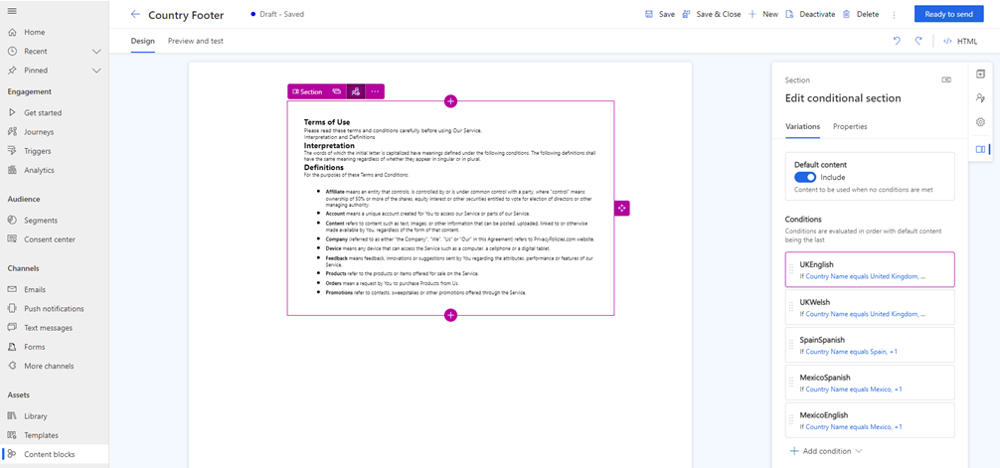
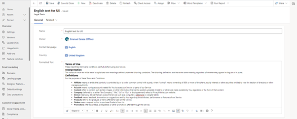
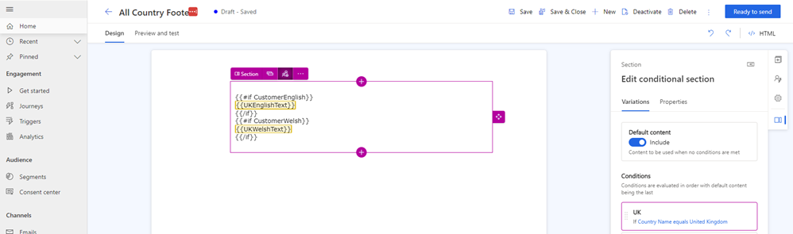
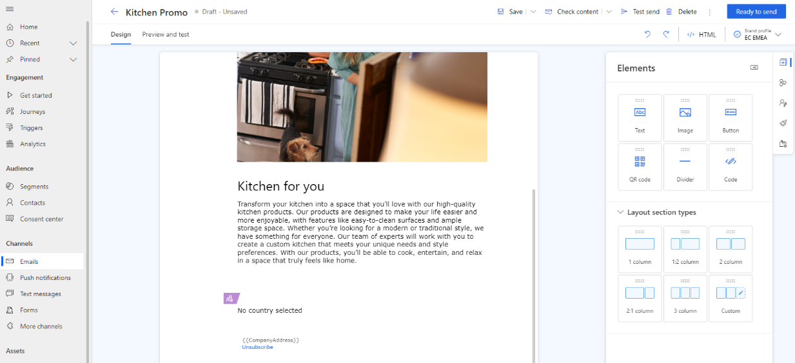

# Create dynamic email content in multiple languages

[!INCLUDE [consolidated-sku-rtm-only](./includes/consolidated-sku-rtm-only.md)]

When you have customers in multiple countries and regions, you often need to send them email with the same content but with small variations based on their location or language. Dynamics 365 Customer Insights - Journeys offers two ways to do that. Both methods use the [audience profile](./real-time-marketing-audience-data.md) to determine which content to deliver.

- Create a separate email for each country or region you want to send to and in each language your customers speak. This method is easy to set up, although time-consuming. But because each audience requires a different email, the number of emails is higher.
- Use a [conditional content block](./content-blocks.md) that adapts to your customers' preferences. This method takes more steps to set up, but reduces the number of emails to one.

In this article, you'll learn how to use conditional content blocks to create multilingual email content for different audiences. You'll also learn how to customize your data model and add inline conditions and dynamic text to your email content.

## Conditional content by free text country/region

The simplest scenario is to use the `Country/Region` column in the `Contact` table, which is a free text field that identifies your customers' country or region of residence. You can use this column to create conditions that compare the country or region with the variations you want to show in your email content.

For example, suppose you want to add a footer with terms and conditions that vary depending on the country or region of your customers. [Create a content block](./content-blocks.md#creating-a-content-block) called "All Country Footer" and add a section and column where you place the text of the terms and conditions. Then, add different conditions for each country or region where you do business; for example, the UK, Spain, and Mexico.

:::image type="content" source="./media/real-time-marketing-content-block-country-footer.png" alt-text="Screenshot showing the All Country Footer content block with conditions highlighted.":::

The following screenshot illustrates how to create a condition called "UK" that compares the value of the `Country/Region` field with the value "United Kingdom":

:::image type="content" source="./media/real-time-marketing-define-condition.png" alt-text="Screenshot showing the All Country Footer content block with a condition defined.":::

In each variation, add the appropriate text.

:::image type="content" source="./media/real-time-marketing-add-text-in-footer.png" alt-text="Screenshot showing the All Country Footer content block with a condition defined and text entered.":::

Add a condition and text for the other countries or regions and languages you want to support. When you're finished, select **Ready to send** and use it in your emails.

## Conditional content by lookup country/region

The previous scenario relies on your users typing the country or region in a free text field and matching the values exactly with the conditions in the content block. This can be prone to errors and inconsistencies. To make the solution more robust, you can extend the data model and use a lookup table instead of a free text field.

1. In the [Maker portal](https://make.powerapps.com/), [create a table](/power-apps/maker/data-platform/create-edit-entities-portal) called, for example, `Active Countries`, with a column called, for example, `Country Name`, and populate it with the countries and regions you support.

    :::image type="content" source="./media/real-time-marketing-conditional-lookup-country.png" alt-text="Screenshot of a table of countries.":::

1. [Create a table relationship](/power-apps/maker/data-platform/data-platform-entity-lookup) between the `Active Countries` table and the `Contact` table.

    This updates the form for the `Contact` table to allow users to select the country or region from a list instead of typing it manually.

1. Set the condition in the content block to use the lookup column instead of the free text column.

    :::image type="content" source="./media/real-time-marketing-define-condition-using-related-table.png" alt-text="Screenshot of a content block with a condition defined using the contact's custom country lookup column.":::

Add a condition and text for the other countries or regions and languages you want to support. When you're finished, select **Ready to send** and use it in your emails. RHANA

## Scenario 3 – Multiple languages in same country

This scenario builds on the work done in Scenario 2.
On some countries, there are multiple official languages or languages that are so common that it makes sense for communications to be done in the specific language of the audience. This second layer of personalization can also be implemented in Dynamics Customer Insights - Journeys.

### Scenario 3 - Customize Dynamics 365

To support the extra profiling needed, we create a new table for language, following the process done for countries. Then, we populate with the list of languages for which we want to create content.

> [!div class="mx-imgBorder"]
> 

Then, we create an additional Many to One relationship between the Contact table and the Language table and expose the new field on the Contact form. 

#### Multiple conditions in content block variations

Now that we have two different angles (country and language) on which to personalize the content, we update the conditions within the variations of the content block to account for comparing two different fields to the attributes of the audience. We add a different variation for each country-language pair for which content is needed. The conditions look like as follows:

> [!div class="mx-imgBorder"]
> 

Once all the variations have been configured, the content block looks like as follows:

> [!div class="mx-imgBorder"]
> 

## Scenario 4 – Easing the administration of standard content

This scenario builds on the scenarios previously described. 

If we consider that terms and conditions remain standard but when they change, we want them impacting all communications, having to update multiple conditions across multiple content blocks and emails could be a time-consuming process and some emails could be missed. To facilitate the administration of these changes, we can introduce a level of abstraction so that changing content in a single location would reflect on all communications, countries, and languages.

In addition, having a single variation in the content block where all languages are represented allows for country managers to confirm that the relevant languages for their country are represented in a reusable content. It also allows for the separation of in management, allowing the company's legal team to manage the texts independent from the journey and email processes.

### Scenario 4 = Customize Dynamics 365

To support this scenario, we make one additional extension to Customer Insights - Journeys. We create a table that holds the text that email communications use for the various country and language combinations. In this example, we are calling the table that holds the terms and conditions Legal Text. In this table, we also add a Rich-Text Field (called Formatted Text in the screenshot below) that will allow the better formatting of the content to be added to the email.

> [!div class="mx-imgBorder"]
> 

In this table we can create all the necessary combinations that will be later used in the Content Block.

> [!div class="mx-imgBorder"]
> 

#### Adding inline conditions and predefined dynamic text to content block

In the previous scenarios we have been working with conditions added to content variations in the content block. However, to reduce the number of variations and facilitate the administration, we'll now add [inline conditions](real-time-marketing-personalize-inline-conditions.md) in country variations that will be checking a contact's language against each of the language options. The following example shows the check for the English language. 

> [!div class="mx-imgBorder"]
> 

This will be complemented with an additional level of personalization will be require being able to dynamically read the formatted text of the terms and conditions from the [Legal Texts](real-time-marketing-predefined-dynamic-text.md#using-data-from-additional-tables-in-dynamic-text) table using data from additional tables feature.

> [!div class="mx-imgBorder"]
> 

After selecting the attribute with the text to select, it's necessary to pick the record with data to dynamically substitute in the email. Below it's shown how the "English text for the UK" is picked and the name "UKEnglishText" is given to the token for the personalization. 

> [!div class="mx-imgBorder"]
> 

> [!div class="mx-imgBorder"]
> 

This process needs to be repeated for the various possible combinations of country and language that are possible. 
With the tokens ready, we build the logic for each country's conditional block. To do this, each desired combination will be placed within an {{#if}} condition as shown below.

> [!div class="mx-imgBorder"]
> 

The benefit of structuring the conditional content in this manner is that we end up with one variation per country that easily shows all the language options for that country. In the above example, we can see the UK variation showing language options for English and Welsh. 

### Create the email

Regardless of the scenario built, with the content block ready we can now use in an email, knowing that the terms and conditions will be sent according to the contact's country and, if configured, the contact's language. 

> [!div class="mx-imgBorder"]
> 

This is an example will render for customers in United Kingdom and Spain with different text.

> [!div class="mx-imgBorder"]
> 

> [!div class="mx-imgBorder"]
> 

### Next steps

- [Quickly design and deliver a marketing email with send now](email-quick-send.md)
- [Send a targeted email blast in Customer Insights - Journeys](real-time-marketing-email-get-started.md)
