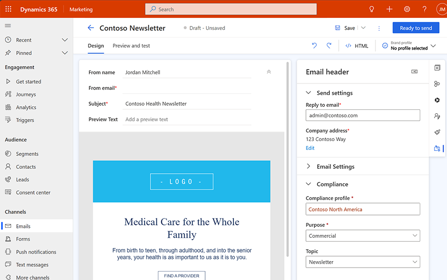

# Manage consent for email, SMS (text), and custom channel messages

> [!NOTE]
> Customer Insights - Journeys consent is contact-point based and works for messages sent to contacts, leads, and Customer Insights - Data profiles. Customer consent is stored per email address or phone number, as opposed to being stored per contact record. Outbound marketing consent processes that you have already defined aren't influenced by the Customer Insights - Journeys settings.

> [!IMPORTANT]
> As of December 2022, consent enforcement for real-time journeys for **contacts** was changed to require opt-in for emails sent using the **restrictive** consent enforcement model. If you would like to revert to the previous behavior, you can change your consent enforcement model to **non-restrictive**. Alternatively, if you have previously captured consent on **contact** records in outbound marketing, you can **load consent** to populate the contact-point consent records used to enforce consent in Customer Insights - Journeys. Learn more: [Migrate consent records to Customer Insights - Journeys](real-time-marketing-migrate-consent.md)

> [!IMPORTANT]
> For an environment that has both real-time journeys and outbound marketing installed, the app checks a contact's `DoNotEmail`, `DoNotBulkEmail`, and `DoNotTrack` fields to match outbound marketing's consent enforcement behavior and aid in the transition from outbound marketing to real-time journeys. Learn more: [Manage user compliance settings in Customer Insights - Journeys](real-time-marketing-compliance-settings.md).
>
> You can configure your environment to ignore the contact field checks. Learn more:[Disable contact-level consent checks](real-time-marketing-email-text-consent.md#disable-contact-level-consent-checks).
>

> [!CAUTION]
> In July 2023 Customer Insights - Journeys introduced new Dataverse tables to support business units and multi-brand consent compliance profiles. All Customer Insights - Journeys customers have been migrated to the new tables. Customers who have custom workflows (such as Power Automate Flows) that read or write **msdynmkt_contactpointconsent2** or **msdynmkt_contactpointconsent3** consent tables need to take action to ensure they don't lose functionality.
>
> If your custom workflows *read* from the **msdynmkt_contactpointconsent2** or **msdynmkt_contactpointconsent3** consent tables, you must update custom workflows to read from the latest **msdynmkt_contactpointconsent4** table to ensure continued functionality.
>
> If your custom workflows *write* to the **msdynmkt_contactpointconsent2** or **msdynmkt_contactpointconsent3** consent tables, any writes to these tables automatically have data synced to the **msdynmkt_contactpointconsent4** table after a delay (potentially 24 hours or longer). The data sync will continue until **June 1, 2024**. After that date, you'll need to have moved all workflows that write contact point consent records to target the **msdynmkt_contactpointconsent4** table.

## How consent is respected for emails

When creating a new email message, you choose a **Compliance Profile**, a **Purpose**, and, optionally, a **Topic** from that profile in the **Compliance** section of the **Email header** settings. To set up message designation, select the gear icon  in the email header. This opens the **Email header** settings pane on the right side of the page. Navigate to the **Email settings** section.

> [!div class="mx-imgBorder"]
> 

An email message is only sent if it passes the consent checks configured by the **Purpose** and (optional) **Topic**. The decision to send or block sending a message is made right before sending the message. This ensures that the app never mistakenly sends a message to someone who has opted out, even if they're mistakenly included in a journey segment. The enforcement rules for consent are governed by the **Enforcement model** setting on the purpose. If the purpose has a "Restrictive" enforcement model, the email is sent only if the email address explicitly opts into receiving the message. If the purpose has a "Non-restrictive" enforcement model, the email is sent as long as the email address hasn't opted out. The "Disabled" enforcement model disables consent checks on the email address and lets all messages be delivered. The default "Commercial" purposes have a "Non-restrictive" enforcement model. The default "Transactional" purpose has a "Disabled" enforcement model. The enforcement models of the purposes can be changed in the compliance profile. To learn more about the **Purpose**, **Topic**, and **Enforcement model** concepts, visit [Manage user compliance settings in Customer Insights - Journeys](real-time-marketing-compliance-settings.md)

As required for commercial email, a **Company Address** placeholder and an **Preference Center** placeholder link are added to the email footer automatically. The company address reflects the value set on the **Compliance profile** and can be edited directly from the email editor if needed. The **Preference center** link leads to the preference management page configured by the **Compliance Profile**, where customers can review and change communication preferences.

The presence of a company address and unsubscribe link is checked when you select **Ready to send**. The app warns you if one of these parameters is missing if you're sending a message to a commercial consent purpose.

> [!NOTE]
> The app displays warnings if, for example, you accidentally delete either the company address or link to the preference center. However, it doesn't block you from sending such an email. Thus, you're able to replace the given company address field with another one of your choice or add a link to a custom preference center if you like.

## How consent is respected for SMS (text) and custom channel messages by default

> [!NOTE]
> Since November 2024 release, it's possible to change the default enforcement model settings for test (SMS) and custom channels.

The Customer Insights - Journeys rules for sending SMS and custom channel messages are slightly different than the rules for sending emails by default. A user must always opt in to consent to receive commercial SMS or commercial custom channel messages. By default the transactional SMS and custom channel messages are always sent, unless you change the enforcement model from disabled.

## Consent to track user behavior

Each compliance profile has its own purpose specifically for tracking user interactions, such as message opens and link clicks. Like the commercial and transactional purposes, the enforcement model for tracking consent can be restrictive, non-restrictive, or disabled. If the tracking purpose is set to a disabled enforcement model, no tracking consent checks are made for messages sent as part of that compliance profile, meaning all interactions are tracked.

If you would like to collect tracking consent, you can add the tracking purpose to forms and preference centers.  

> [!NOTE]
> Customer Insights - Journeys always checks the **Allow Tracking** field in contact records to determine if the contact's interactions can be tracked. This check is done in addition to the Customer Insights - Journeys contact-point consent opt-in/opt-out check for tracking. These checks aren't performed for other entity types (for example, leads or Customer Insights - Data profiles).

> [!IMPORTANT]
> With the July 2023 release, customer consent data began to utilize the new multi-brand consent features. For some Customer Insights - Journeys users, the migration changed the settings that control whether tracking links are included in messages. The changes may prevent tracking in messages if the customers have not given explicit consent. After the migration, if you want to enable tracking links in messages for customers who have not provided consent, update the tracking purpose enforcement model of your compliance profile(s) to "Non-restrictive." This enables tracking links to be substituted in emails, so long as the receiver hasn't explicitly opted out of tracking.

## Consent enforcement diagram

The following diagram provides a visual representation of how consent is checked by default while executing journeys in Customer Insights - Journeys.

<table>
  <tr>
    <th>Restrictive enforcement model</th>
  </tr>
  <tr>
   <td></td>
    <td><b>Opted out</b></td>
    <td><b>None/Not-set</b></td>
    <td><b>Opted in</b></td>
  </tr>
  <tr>
   <td><b>Email channel</b></td>
    <td>Blocked</td>
    <td>Blocked</td>
    <td>Sent</td>
  </tr>
  <tr>
   <td><b>SMS/custom channel</b></td>
    <td>Blocked</td>
    <td>Blocked</td>
    <td>Sent</td>
  </tr>
  <tr>
   <td><b>Tracking purpose<b></td>
    <td>Not tracked</td>
    <td>Not tracked</td>
    <td>Tracked</td>
  </tr>
</table>

<table>
  <tr>
    <th>Non-restrictive enforcement model</th>
  </tr>
  <tr>
   <td></td>
    <td><b>Opted out</b></td>
    <td><b>None/Not-set</b></td>
    <td><b>Opted in</b></td>
  </tr>
  <tr>
   <td><b>Email channel</b></td>
    <td>Blocked</td>
    <td>Sent</td>
    <td>Sent</td>
  </tr>
  <tr>
   <td><b>SMS/custom channel</b></td>
    <td>Blocked</td>
    <td>Blocked</td>
    <td>Sent</td>
  </tr>
  <tr>
   <td><b>Tracking purpose<b></td>
    <td>Not tracked</td>
    <td>Tracked</td>
    <td>Tracked</td>
  </tr>
</table>

<table>
  <tr>
    <th>Disabled enforcement model</th>
  </tr>
  <tr>
   <td></td>
    <td><b>Opted out</b></td>
    <td><b>None/Not-set</b></td>
    <td><b>Opted in</b></td>
  </tr>
  <tr>
   <td><b>Email channel</b></td>
    <td>Sent</td>
    <td>Sent</td>
    <td>Sent</td>
  </tr>
  <tr>
   <td><b>SMS/Custom channel</b></td>
    <td>Sent</td>
    <td>Sent</td>
    <td>Sent</td>
  </tr>
  <tr>
   <td><b>Tracking purpose<b></td>
    <td>Tracked</td>
    <td>Tracked</td>
    <td>Tracked</td>
  </tr>
</table>

> [!IMPORTANT]
> For an environment that has both real-time journeys and outbound marketing installed, by default, the app always checks the **Allow email** and **Allow bulk email** fields in contact records to determine if email is allowed to be sent to the contact's email address. Both fields must be set to allow for an email with a commercial purpose type to be sent to a contact. Only the **Allow email** field must be set to allow emails to be sent with a transactional purpose type selected. These checks are done in addition to the Customer Insights - Journeys contact-point consent opt-in/opt-out checks for emails sent by journeys. These checks aren't performed for other entity types (for example, leads or Customer Insights - Data profiles). Learn more: [Manage user compliance settings in Customer Insights - Journeys](real-time-marketing-compliance-settings.md).
>
> You can configure your environment to ignore the contact field checks. Learn more: [Disable contact-level consent checks](real-time-marketing-email-text-consent.md#disable-contact-level-consent-checks).

## Disable contact-level consent checks

Starting February 2024, a new feature switch allows you to configure the system to either consider or bypass contact-level consent checks. This enables complete separation of consent by contact point for emails, enabling every entity to have consent captured and enforced by contact point and ignoring consent on the contact record for journeys targeting contacts.  

It's recommended to Disable contact-level consent checks once outbound journeys are no longer in use. To disable contact-level consent checks:

1. Go to **Settings** > **Other settings** > **Feature switches**.
1. Set the **Check contact consent for real-time journeys** toggle to **Off**.
1. Select **Save** in the upper right.

This ensures that the system enforces consent only based on contact point consent records.

## How is consent populated on different unsubscribe experiences

Customer Insights - Journeys offers [different options for providing an unsubscribe experience to your customers](real-time-marketing-compliance-settings.md#user-contact-preferences). The system computes the exact consent status that is considered for the different scenarios and always presents the user visiting the unsubscribe experience with an accurate view of their consent.  

The consent status shown to the user on an unsubscribe experience depends on several factors:

1. Whether the [check contact consent for real-time journeys feature switch](real-time-marketing-email-text-consent.md#disable-contact-level-consent-checks) is on or off.
1. The enforcement model of the purpose.
1. The channel for which consent is being displayed.
1. The contact point's consent status.

Before we begin, let's look at some important definitions.

#### Will send/will not send

- **Will send** indicates that the contact point consent record and its purpose enforcement model allow the app to send an email on that purpose to that address. For example, if the purpose is non-restrictive and no contact point consent record exists, the app evaluates that to **Will send**.  
- **Will not send** is used to indicate that the app evaluates that email address’s contact point consent record and purpose and decides not to send an email.  

#### Will track/will not track  

- Similarly, **Will track** is used to indicate that the tracking contact point consent record and its purpose enforcement model allow the app to include tracking links in messages sent to that address. For example, if the purpose is non-restrictive and no contact point consent record exists, the app evaluates that to **Will track**.  
- **Will not track** is used to indicate that the app evaluates that email address’s contact point consent record and purpose and decides not to track links in the email.

### Subscription centers used in real-time journeys

The **DoNotBulkEmail**, **DoNotEmail**, and **DoNotTrack** fields on a subscription center are prefilled for the contact based on contact data and contact point consent records of all the contact's email addresses.

1. **DoNotBulkEmail** prefills to block sending if the attribute is currently set to block or if any commercial purpose on the compliance profile from any email address on the contact evaluates to **will not send**.
1. **DoNotEmail** prefills to block sending if the attribute is currently set to block or if any transactional purpose on the compliance profile from any email address on the contact evaluates to **will not send**.
1. **DoNotTrack** prefills to block tracking if the attribute is currently set to block or if the tracking purpose on the compliance profile from any email address on the contact evaluates to **will not track**.  

When a user submits changes through a subscription center, the states of **DoNotBulkEmail**, **DoNotEmail**, and **DoNotTrack** are used to update the contact and the contact point consent records of all of the contact's email addresses as configured in the [audience configuration](real-time-marketing-audience-data.md#select-the-audience-source-for-journeys).

1. If both **DoNotBulkEmail** and **DoNotEmail** are set to allow emails, then all commercial purposes on the compliance profile for every email address on the contact record will have an opted-in contact point consent record. If any of them is set to don't allow, then all contact point consent records are updated to opted-out.
1. The **DoNotEmail** state is written to all transactional purposes on the compliance profile for every email address on the contact record.
1. The **DoNotTrack** state is written to the tracking purpose on the compliance profile for every email address on the contact record.

### Preference page and preference center  

For journeys **targeting contacts**, each email address consent prefills if they're contactable (**will send**) or traceable (**will track**) based on the specific purpose's enforcement model and its contact point consent record, combined with the contact-level consent fields (only if the [check contact consent](real-time-marketing-email-text-consent.md#disable-contact-level-consent-checks) for real-time journeys feature switch is enabled).

1. **Commercial purposes/topics** prefills to opt-in only if the contact point consent record evaluates to **will send** and both **DoNotBulkEmail** and **DoNotEmail** are set to allow emails.
1. **Transactional purposes/topics** prefills to opt-in only if the contact point consent record evaluates to **will send** and **DoNotEmail** is set to allow emails.
1. **Tracking purpose** prefills to opt-in only if the contact point consent record evaluates to **will send** and contact's **DoNotTrack** is set to allow tracking.

For journeys **targeting leads or customers insights - data profiles**, each email address consent prefills if they're contactable (**will send**) or traceable (**will track**) based on the specific purpose's enforcement model and its contact point consent record. The preference page and preference center experiences prefill email address consent to opt-in if the contact point consent record for the email evaluates to **will send**.  

When a user submits consent changes through a preference page or preference center, then the system only updates the relevant contact point consent records. No contact-level consent attribute is modified in such cases.  

## View and manage consent records

In the consent center, you can view a list of all contact point consents and their related attributes (type, status, source of consent data, and date modified). To see a compact view for a single consent record or make changes to it, select the contact-point name from the list of records.

Starting the **March 2024** release, contact and lead forms enable you to quickly see and update a customer's consent, helping you effortlessly manage what types of messages are sent to your customers. This comprehensive view can be found under the **Communication** tab and gives you one place to manage consent across every channel and line of business for your organization.

To enable this feature:

1. Go to **Settings** > **Other settings** > **Feature switches**.
1. Set the **Manage consent in contact and lead forms** toggle to **On**.
1. Select **Save** in the upper right.

Once the feature is enabled, the Communication tab allows you to:  

1. Get a summary view of the consent provided by each contact or lead to understand if the customer is contactable at a glance.
1. Easily modify the consent for the email addresses, phone numbers, and custom channels of a contact or lead directly from the contact or lead forms, giving you control over the type of messages sent to the customer on each channel. The grid view shows you not just the consent record but also its evaluated contactability. This helps provide answers to the question: "Why did my journey get blocked due to no consent?"
1. Drill down into consent provided to each compliance profile configured for your organization, giving you the ability to understand customer consent for each line of business.

The consent records for each of the purpose and topics (if present) of the selected compliance profile are shown here and can be updated from within the experience itself. You can also choose a different contact point from the drop-down as well as choose the compliance profile for which you would like to manage the consent records.  

Changes to the consent record update the contactability column as well as communication and tracking status cards immediately. Sometimes, however, updates to a consent record don't affect its contactability. For example, updating the consent status for a topic record to opt-in while the parent purpose remains opted-out doesn't change the contactability of the topic record.  

## Audit consent records

You can keep track of all consent-related changes on a per contact record basis (who made the changes and when). The **Audit history** is available under a consent record's **Related** tab.

### See also

[Grow your business with multi-brand, custom preference centers](real-time-marketing-compliance-settings.md)
[Customer Insights - Journeys preference centers](real-time-marketing-preference-centers.md)
[Outbound marketing compliance settings](privacy-use-features.md)

[!INCLUDE [footer-include](./includes/footer-banner.md)]
