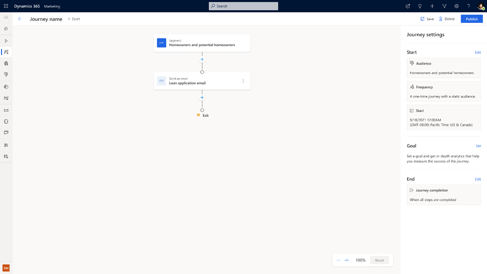
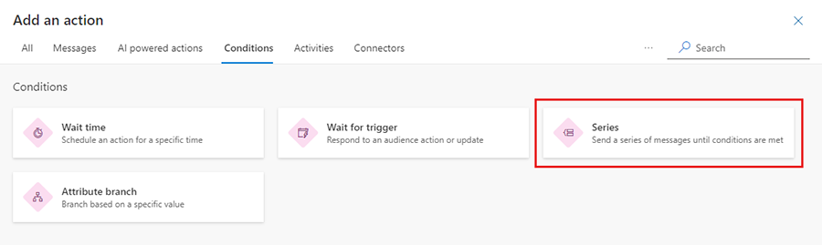
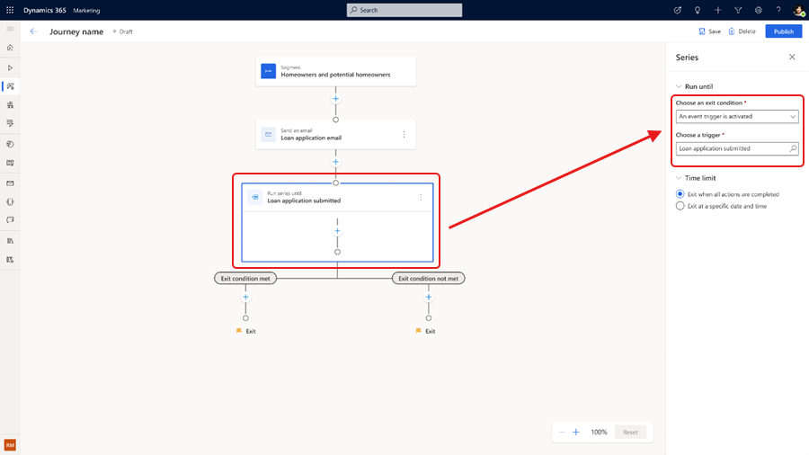
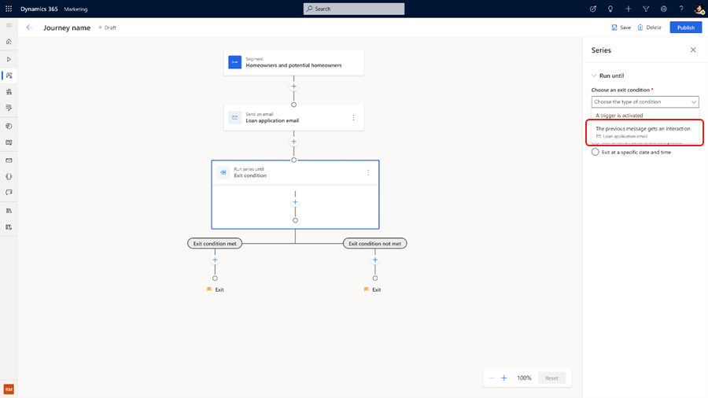
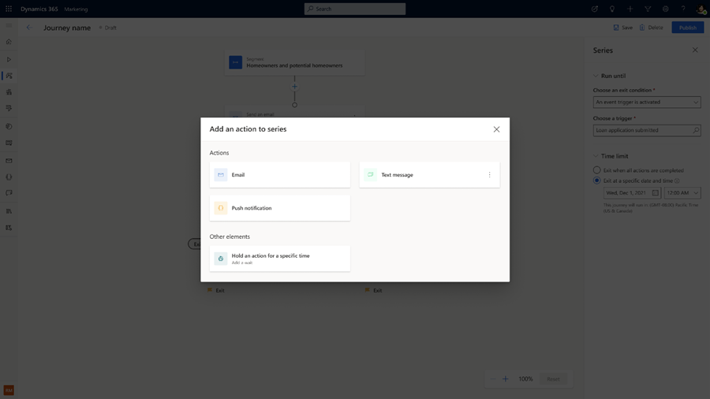
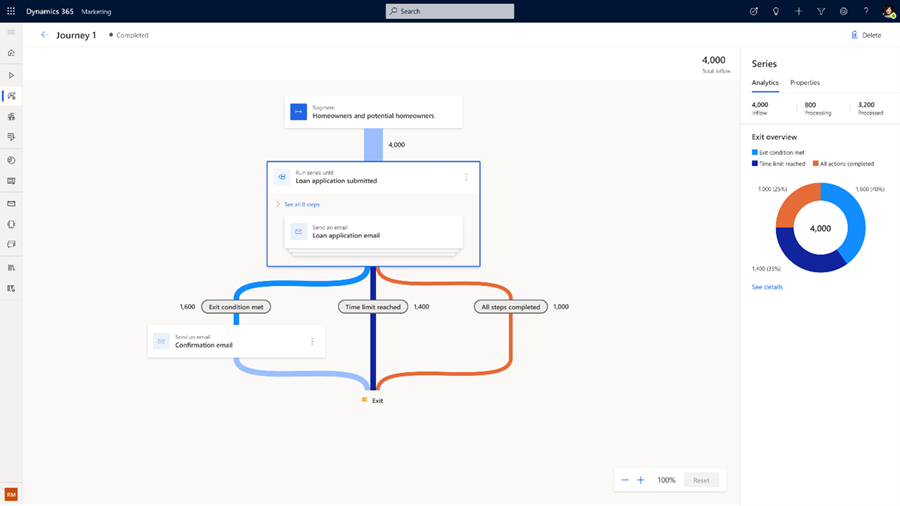

# Enhanced journey reminders

Create action-oriented journeys that remind customers to complete a call to action, with messages that stop when the customer acts or a time limit is reached. Built-in reminder orchestration eliminates the need to create cascading branches that check for the qualifying action after each step or specify conditions with more than two possibilities. This simplifies not only the journey logic required to capture the whole scenario in a single journey, but also preserves all analytics for the journey actions in a single place when journeys are live.

## Send a series of messages

The best way to show how journey reminders work is to walk through a real-life scenario. Let's say you're working for a loan company. You want to create a customer journey to remind current and future homeowners to fill out their loan applications. First, you need to create a [segment-based journey](real-time-marketing-build-segments.md) that sends out an initial loan application email.

> [!div class="mx-imgBorder"]
> 

1. To create the reminders, select the plus (**+**) symbol below the email tile, then select the **Series** tile.

    > [!div class="mx-imgBorder"]
    > 

1. The **Series** tile has two exits by default. Customers who meet the exit condition before completing all steps exit through the left branch. Customers who complete all steps without meeting the condition exit through the right branch. In this example, the exit condition is a custom trigger called "Loan application submitted."

    > [!div class="mx-imgBorder"]
    > 

1. You can also define your exit condition by how your customers interact with your previous messages. For example, the exit condition can be met if the customer opened the loan application email or clicked on a link within the email.

    > [!div class="mx-imgBorder"]
    > 

1. To bound the series to a specific window, set a **Time limit** in the **Series** properties pane. This adds a third exit branch. Customers who haven't met the exit condition when the time limit is reached exit through this branch, regardless of how many steps they've completed.

1. To complete the journey, select the plus (**+**) button inside the **Series** tile and add messages from different channels that you want to send out as part of the reminder journey. Add a wait tile between messages to control the pace of delivery.

    > [!div class="mx-imgBorder"]
    > 

> [!IMPORTANT]
> You must have at least one **Wait** tile within the series. Otherwise, the series exits immediately (even if you set up a condition and configured it to wait until a specific date and time).

## View Series tile and reminder journey analytics

After the journey is live for a while, select the **Analytics** tab in the **Series** tile properties to see how many customers are flowing through each exit branch and analytics on the delivery and interactions details of each message inside the **Series** tile.

> [!div class="mx-imgBorder"]
> 

[!INCLUDE [footer-include](./includes/footer-banner.md)]
