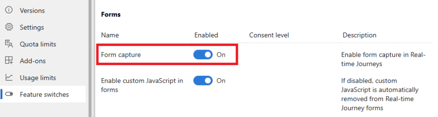

# Capture forms in Customer Insights - Journeys

The form capture is used to get submissions from existing forms that weren't created using the Customer Insights - Journeys form editor. Form capture is recommended if your existing form also sends submissions to systems other than Dynamics 365 or if the existing form contains complex logic that can't be easily recreated in the Customer Insights - Journeys form editor. If the existing form can be recreated using Customer Insights - Journeys form editor, it's *not* recommended to use the form capture feature.

Form capture uses the same API as the standard forms to process submissions. The same [security notice](real-time-marketing-form-security-privacy.md) applies for form capture.

> [!IMPORTANT]
> **Form capture requires developer assistance**. It's always easier to create a form using the Customer Insights - Journeys form editor and embed it into your existing page.

> [!IMPORTANT]
> **Form capture requires DynamicsMKT_Forms solution version 1.1.35355 or higher**. When provisioning a trial instance, you won't always have the latest version automatically. Make sure you've updated Customer Insights - Journeys before attempting form capturing.

## Enable form capture

The form capture feature is disabled by default. You can enable the *Form capture* toggle in **Settings** > **Feature switches** > **Forms**.
> [!div class="mx-imgBorder"]
> 

## How form capture works

Form capture mimics submission of a standard Customer Insights - Journeys form. To link submissions of your existing form into Customer Insights - Journeys, you need to create a form using the Customer Insights - Journeys form editor. Once you publish that form, you're able to obtain a form capture script, which needs to be embedded into the web page that contains your existing form. The script includes the definition of existing form fields mapping on attributes of the lead or contact entity. You can see all submissions and analytics inside Customer Insights - Journeys. You can also use this form in journey orchestration with the **Marketing Form Submitted** trigger. This form submission can also create or update Contact Point Consent and related Purposes or Topics.

## Step-by-step guide capturing forms

### Creating the form capture in the Customer Insights - Journeys form editor

1. To create a new capture form script, go to **Customer Insights - Journeys** > **Channels** > **Forms** and select **New** on the command bar.
1. Name the form and choose the right audience. The choice of the target audience is important. The form capture script field->attribute mapping is available only for attributes of the chosen target audience (entity).
1. Add all fields you want to map to your existing form fields. Although **field** > **attribute** mapping is defined in the form capture code, the contact or lead record isn't updated if the field isn't present in the form created using the form editor. Adding the correct fields into the form generates placeholders for attribute mapping in the form capture script, making the mapping definition easier.
1. Add consent elements like Purpose or Topic to the form and configure them. Learn more about how to [manage consent for email and text messages in Customer Insights - Journeys](real-time-marketing-email-text-consent.md).
    > [!IMPORTANT]
    > The consent definition must be done in the form editor. Changes made to consent settings in the form capture code snippet will be ignored.
1. Add a **Submit** button. The submit button is required for successful validation of the form before publishing.
1. Publish the form using the **Publish** button in the top right corner of the screen. Copy the form capture code snippet and embed the code snippet in your web page with the existing form, or hand over the code snippet to your developer. The code snippet already includes a link to documentation to guide your developer.
    > [!div class="mx-imgBorder"]
    > 

    > [!IMPORTANT]
    > The domain name where your existing form is hosted has to be enabled for external form hosting, otherwise the form submission will not be captured. Learn more about [domain authentication](domain-authentication.md).

### Embedding the capture script into your page and mapping definition

The code snippet copied in the previous step is a template and must be adjusted to the specific use case. You need to replace all elements marked as `***Please fill***` in the generated template and adjust the logic to your scenario.

Your existing form submission is sent to Customer Insights - Journeys using a JavaScript API, defined in the file `FormCapture.bundle.js` and included in the snippet.

The form capturing setup consists of these steps:

1. Get the reference to the form element on the page.
1. Define the mapping of form fields on fields (entity attributes) in Customer Insights - Journeys.
1. Define the mapping of the consent fields on the consent model in Customer Insights - Journeys.
1. Send the form submission to Customer Insights - Journeys.

#### 1. Get a reference to the form element

To get a reference to the form element, you can use the `waitForElement` helper function. It also works with dynamically rendered elements and returns a promise that is resolved once the element with the given selector is found on the page. For a reference of CSS selectors, see this [documentation](https://www.w3schools.com/cssref/css_selectors.php).

**Example:**

```HTML
<form id="form1">
...
</form>

<script>
d365mktformcapture.waitForElement("#form1").then(form => {
  ...
});
</script>
```

#### 2. Define the mapping of form fields

Fields in the form need to be mapped to the respective fields (entity attributes) in Customer Insights - Journeys. The mapping is defined in the function `d365mktformcapture.serializeForm(form, mappings)`.

**Example:**

```HTML
<form id="form1">
  <p>FirstName: <input type="text" name="firstName"/></p>
</form>

<script>
d365mktformcapture.waitForElement("#form1").then(form => {
  const mappings = [
    {
      FormFieldName: "firstName",
      DataverseFieldName: "firstname",
    },
  ];

  ...
  
  const serializedForm = d365mktformcapture.serializeForm(form, mappings);
  // console.log(JSON.stringify(serializedForm)); // NOTE: enable for debugging
  const payload = serializedForm.SerializedForm.build();
});
</script>
```

The parameter `form` is retrieved by the `waitForElement` function described in the previous section. The parameter `mappings` is an array with elements of the following structure:

```typescript
export interface IFormFieldMapping {
    FormFieldName?: string; // name of form field
    DataverseFieldName: string; // name of field on Dynamics 365 side
    DataverseFieldValue?: string | IFormValueMapping[]; // optional - either a fixed value or a value mapping
}

export interface IFormValueMapping {
    FormValue: string; // form field value
    DataverseValue: string; // mapped value for that form field value that will be sent to Dynamics 365
}
```

The function is synchronous and returns the serialization result with the following contract:

```typescript
export interface IFormSerializationResult {
    FormFieldMappingResults: IFormFieldMappingResult[]; // Status for each of the defined mappings
    SerializedForm: IFormSerializationBuilder; // The serialized form
}

export interface IFormFieldMappingResult {
    Mapping: IFormFieldMapping; // The defined mapping
    FormFieldMappingStatus: FormFieldMappingStatus; // Status of the mapping (see below for status values)
    Message: string; // Optional - an error/warning message for the mapping
}

export enum FormFieldMappingStatus {
    Success = 0,
    NotFound = 1,
    Error = 2
}
```

Make sure you handle all errors returned by the `FormFieldMappingResults`. You can create the payload to Customer Insights - Journeys by calling `serializedForm.SerializedForm.build()`.

##### 2.1 Mapping of OptionSet fields

For `OptionSet` fields, you need to define the mapping to the respective value that should be stored in Customer Insights - Journeys. You can map your existing form OptionSet fields values in the `DataverseFieldValue` property.

**Example:**

```HTML
<form id="form1">
  <p>Radio: <input type="radio" name="radioInput" value="option1"/><input type="radio" name="radioInput" value="option2"/></p>
</form>

<script>
  ...
  const mappings = [
    {
        FormFieldName: "radioInput",
        DataverseFieldName: "dvradioInput",
        DataverseFieldValue: [ 
            { FormValue: "option1", DataverseValue: "1" }, 
            { FormValue: "option2", DataverseValue: "2" },
        ]
    },
  ];
  ...
</script>
```

##### 2.2 Mapping of lookup fields

###### Set the default value for the lookup field

You can use static (default) values in the mapping logic for lookup fields. You need to define the name of the field and the value that should be stored in Customer Insights - Journeys.

**Example:**

```HTML
<form id="form1">
  ...
</form>

<script>
  ...
  const mappings = [
    {
        DataverseFieldName: "currency",
        DataverseFieldValue: "{\"Id\":\"ffffd6c1-b32d-ee11-bdf3-6045bded6105\",\"LogicalName\":\"transactioncurrency\"}"
    },
  ];
  ...
</script>
```

###### Map the value of the lookup field to a field in your form

You can also map the lookup field value to a respective value in your existing form field.

**Example:**

```HTML
<form id="form1">
  <p>Radio: <input type="radio" name="currency" value="usd"/><input type="radio" name="currency" value="eur"/></p>
</form>

<script>
  ...
  const mappings = [
    {
        FormFieldName: "currency",
        DataverseFieldName: "transactioncurrencyid",
        DataverseFieldValue: [ 
              { FormValue: "usd", DataverseValue: "{\"Id\":\"cd2cff48-08a3-ea11-a813-000d3a0a82b4\",\"LogicalName\":\"transactioncurrency\"}", }, 
              { FormValue: "eur", DataverseValue: "{\"Id\":\"91f1a052-259c-4719-a3ae-3a1d2987a3ed\",\"LogicalName\":\"transactioncurrency\"}", }, 
        ]
    },
  ];
  ...
</script>
```

##### 2.3 Mapping multi-select field values

For `multi-select` fields, you need to define the mapping to the respective value that should be stored in Customer Insights - Journeys. You can map your existing form multi-select field values in the `DataverseFieldValue` property.

**Example:**

```HTML
  <form id="form1">
    <p>Fieldset: <fieldset name="multiOptionInput">
      <input type="checkbox" name="multiOptionInput" value="100000000">0</input>
      <input type="checkbox" name="multiOptionInput" value="100000001">1</input>
      <input type="checkbox" name="multiOptionInput" value="100000002">2</input>
    </fieldset></p>
  </form>
 
<script>
...
const mappings = [
  {
    FormFieldName: "multiOptionInput",
    DataverseFieldName: "dvmultiOptionInput",
    DataverseFieldValue: [
      { FormValue: "100000000", DataverseValue: "0" },
      { FormValue: "100000001", DataverseValue: "1" },
      { FormValue: "100000002", DataverseValue: "2" },
    ]
  },
];
...
</script>
```

#### 3. Define consent field mapping

Consent fields need to be configured in the form editor in Customer Insights - Journeys. The `DataverseFieldName` and `DataverseFieldValue` mappings are autogenerated accordingly.

**Example:**

```HTML
<form id="form1">
  <p>Consent: <input type="checkbox" name="consentField"/></p>
</form>

<script>
  ...
  const mappings = [
    {
        FormFieldName: "consentField",
        DataverseFieldName: "msdynmkt_purposeid;channels;optinwhenchecked",
        DataverseFieldValue: "10000000-0000-0000-0000-000000000004;Email;true",
    },
  ];
  ...
</script>
```

#### 4. Send the form submission to Customer Insights - Journeys

Once you get a reference to the form, define the mappings, and serialize the form, you can add an event listener to the `submit` event and send it using the `d365mktformcapture.submitForm(captureConfig, payload)` function. This call returns a promise, and errors can be handled in the `catch` logic.

> [!IMPORTANT]
> If you have a custom validation in place or a Captcha check, make sure you submit the form to Customer Insights - Journeys only in case of a successful validation (for example, check for `isDefaultPrevented` on the `submit` event or explicitly call `submitForm` only after the validation passes)

**Example:**

```HTML
<form id="form1">
  <p>FirstName: <input type="text" name="firstName"/></p>
</form>

<script>
d365mktformcapture.waitForElement("#form1").then(form => {
  const mappings = [
    {
      FormFieldName: "firstName",
      DataverseFieldName: "firstname",
    },
  ];

  form.addEventListener("submit", (e) => {
    const serializedForm = d365mktformcapture.serializeForm(form, mappings);
    // console.log(JSON.stringify(serializedForm)); // NOTE: enable for debugging
    const payload = serializedForm.SerializedForm.build();

    const captureConfig = {
      FormId: "...", // the form id on Dynamics 365 side
      FormApiUrl: "..." // the API url of the Dynamics 365 backend service where the form will be submitted to
    }
    d365mktformcapture.submitForm(captureConfig, payload)
    .catch(e => {
      // error handling
    });
  }, true);
});
</script>
```

## Troubleshooting

### The call to the submission endpoint fails with a CORS error

Cross-Origin Resource Sharing (CORS) can cause  form submission capture to fail. Enable your domain for external form hosting. Learn more about [domain authentication](domain-authentication.md).

### Consent values aren't updated correctly

Make sure you've set up the respective consent fields in the form editor (see [Creating the form capture in Customer Insights - Journeys form editor](real-time-marketing-form-capture.md#creating-the-form-capture-in-the-customer-insights---journeys-form-editor)) and that you've used the correct mappings generated in the publishing process.

[!INCLUDE [footer-include](./includes/footer-banner.md)]
