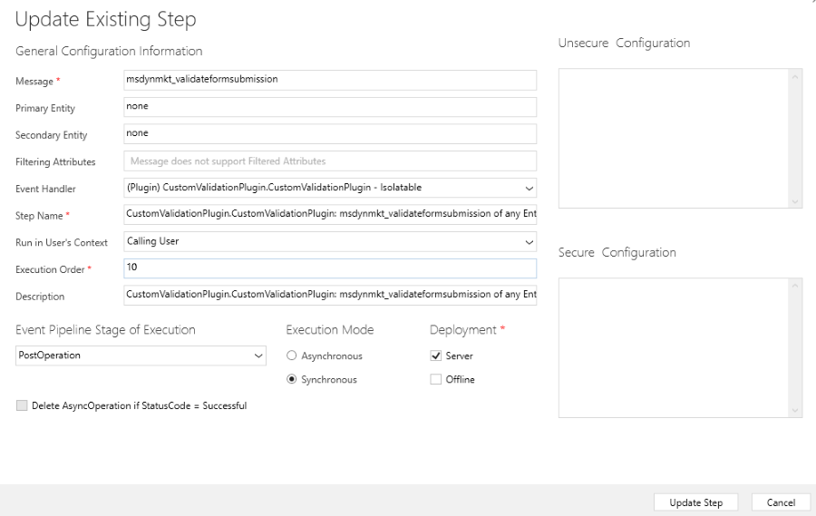

# Customize back-end validation of form submission

The client-side validation in marketing and event registration forms helps to ensure the validity of the data submitted by the customer. However, in some cases you may need a more complex validation. For example to compare submitted data with the data already existing in your system. To achieve that you can **build a custom plugin to validate the submitted data on the back-end** and trigger extra data processing logic.

## Create a plugin

> [!NOTE]
> This example of custom plugin shows how to build back-end validation for the reCAPTCHA key. It can work as an inspiration for your validation flow. In case you want to integrate reCAPTCHA to your form, you can use the prebuilt plugin, and [follow this guide](real-time-marketing-form-custom-captcha.md).

### Create a Visual Studio Project for the plugin

1. Open Visual Studio and create a new Class Library project using .NET Framework 4.6.2.
1. In Solution Explorer, select **Manage NuGet Packages** and install `Microsoft.CrmSdk.CoreAssemblies`.

### Create the plugin class

1. Rename `Class1.cs` to `CustomValidationPlugin.cs`.
1. Make the CustomValidationPlugin class inherit from the IPlugin interface and add the Execute method.

    ```cs
    public class CustomValidationPlugin : IPlugin
    {
       public void Execute(IServiceProvider serviceProvider)
       {

       }
    }
    ```

1. Add the following code into the execute method to retrieve context and tracing service.

    ```cs
    public void Execute(IServiceProvider serviceProvider)
    {
       // get tracing service
       ITracingService tracingService =
       (ITracingService)serviceProvider.GetService(typeof(ITracingService));

       // get plugin execution context
       IPluginExecutionContext context = (IPluginExecutionContext)
       serviceProvider.GetService(typeof(IPluginExecutionContext));
    }
    ```

1. Add this code to retrieve the form submission parameter string. It's a JSON encoded string representing the fields that the user submitted in the form. This process retrieves this string and deserializes it using a Deserialize helper method and FormSubmissionRequest class that is defined later. This code checks that the Fields array contains a key for g-recaptcha-response. If the reCAPTCHA key isn't found, it returns skipping validation as the form that's processing didn't contain a recaptcha element.

    ```cs
    var requestString = (string)context.InputParameters["msdynmkt_formsubmissionrequest"];
    var requestObject = Deserialize<FormSubmissionRequest>(requestString);
    if (!requestObject.Fields.TryGetValue("g-recaptcha-response", out string recaptchaToken))
    {
       tracingService.Trace("g-recaptcha-response was not present in form submission");
       return;
    }
    ```

1. Add the following code to return if `g-recaptcha-token` value is null or empty.

    ```cs
    if (String.IsNullOrEmpty(recaptchaToken))
    {
       tracingService.Trace($"g-recaptcha-response value not found");
       return;
    }
    ```

1. Add the following code to validate the Google captcha token against Google APIs.

    ```cs
    string url = "https://www.google.com/recaptcha/api/siteverify";
    using (HttpClient client = new HttpClient())
    {
       var content = new FormUrlEncodedContent(new Dictionary<string, string>
       {
          {"secret", "your_secret_key"},
          {"response", recaptchaToken}
       });

       try
       {
          var response = client.PostAsync(url, content).Result;
          if (!response.IsSuccessStatusCode)
          {
             tracingService.Trace($"Request Failed: ({response.StatusCode}){response.Content}");
             return;
          }

          var responseString = response.Content.ReadAsStringAsync().Result;

          gRecaptchaResponse = Deserialize<GRecaptchaResponse>(responseString);

          var resp = new ValidateFormSubmissionResponse()
          {
             IsValid = isValid,
             ValidationOnlyFields = new List<string>() { "g-recaptcha-response" }
          };
          context.OutputParameters["msdynmkt_validationresponse"] = Serialize(resp);
        }
        catch (Exception e)
        {
           tracingService.Trace($"{e.Message}");
        }
    }
    ```

    First, the URL is defined, then an instance of `HttpClient` is created. A `FormUrlEncodedContent` object is created containing the `recaptchaToken` retrieved in previous steps and the secret key that is provided by Google. Then a `POST` request is sent and the status code is checked, if not successful it returns. If successful, it deserializes the response using the Deserialize helper method and `GRecaptchaResponse` that's defined later. It then creates a new `ValidateFormSubmissionResponse` object, serializes it, and sets it as the value of the output parameter `msdynmkt_validationresponse`, which is the one Microsoft service it uses to accept or reject the submission. Adding the `g-recaptcha-response` string to the `ValidationOnlyFields` list hides this field from the form submission in the UI.

1. Add the following code to define Serialize and Deserialize helper methods.

    ```cs
    private T Deserialize<T>(string jsonString)
    {
       serializer = new DataContractJsonSerializer(typeof(T));
       T result;
       using (MemoryStream stream = new MemoryStream(Encoding.UTF8.GetBytes(jsonString)))
       {
          result = (T)serializer.ReadObject(stream);
       }
       return result;
    }
    
    private string Serialize<T>(T obj)
    {
        string result;
        serializer = new DataContractJsonSerializer(typeof(T));
        using (MemoryStream memoryStream = new MemoryStream())
        {
           serializer.WriteObject(memoryStream, obj);
           result = Encoding.Default.GetString(memoryStream.ToArray());
        }
        return result;
    }
    ```

1. Add the following code to define the classes needed to Serialize/Deserialize JSON strings objects.

    ```cs
    public class FormSubmissionRequest
     {
         public Dictionary<string, string> Fields { get; set; }
     }
    
     public class GRecaptchaResponse
     {
         public bool success { get; set; }
     }
    
     public class ValidateFormSubmissionResponse
     {
         public bool IsValid { get; set; }
         public List<string> ValidationOnlyFields { get; set; }
     }
    ```

### Sign and build the plugin

1. Right click on the project and select **Properties** in the **Solution Explorer**.
1. Select the **Signing** tab and check the **Sign the assembly** checkbox.
1. Select `<New...>`.
1. Enter a key file name and deselect **Protect my key file with a password**.
1. Build the project.
1. You can find the plugin assembly `CustomValidationPlugin.dll` in `\bin\Debug`.

### Register plugin

1. Open `PluginRegistration.exe`.
1. Select **Create new connection**.
1. Choose **Office 365**.
1. Select **Login**.
1. Select **Register** and then **Register new assembly**.
    > [!div class="mx-imgBorder"]
    > 
1. Select the **(...)** button in step 1 and select the dll built in previous steps.
1. Select **Register selected plugin**.

### Register Step

1. Select **CustomValidationPlugin** from the list of the registered assemblies.
1. Select **Register New Step**.
1. Enter `msdynmkt_validateformsubmission` into Message text field.
1. Make sure **Execution Mode** is set as **Synchronous**.
    > [!div class="mx-imgBorder"]
    > 
1. Make sure **Execution order** is set to `10`.
1. Make sure **Event Pipeline Stage Of Execution** is set as **Post Operation**.
1. Select **Register New Step**.

## Conclusion

When a form with the `data-validate-submission` attribute is submitted, your custom plugin runs and validates the reCAPTCHA response with Google services. The custom plugin will run after the default Microsoft validation plugin. If there are no Microsoft captcha fields in the form, the Microsoft plugin sets `IsValid:false` and the submission fails unless you overwrite it with `IsValid:true`.

> [!div class="mx-imgBorder"]
> 

[!INCLUDE [footer-include](./includes/footer-banner.md)]