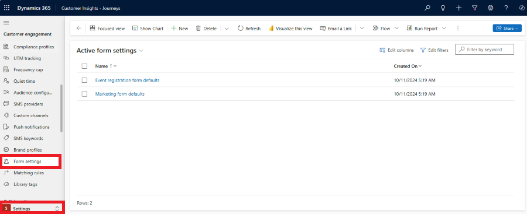
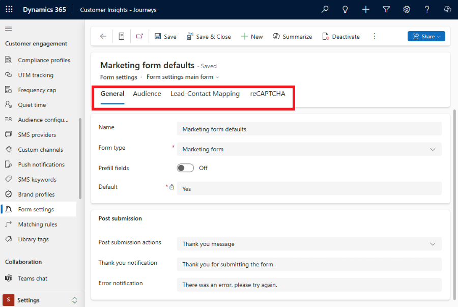
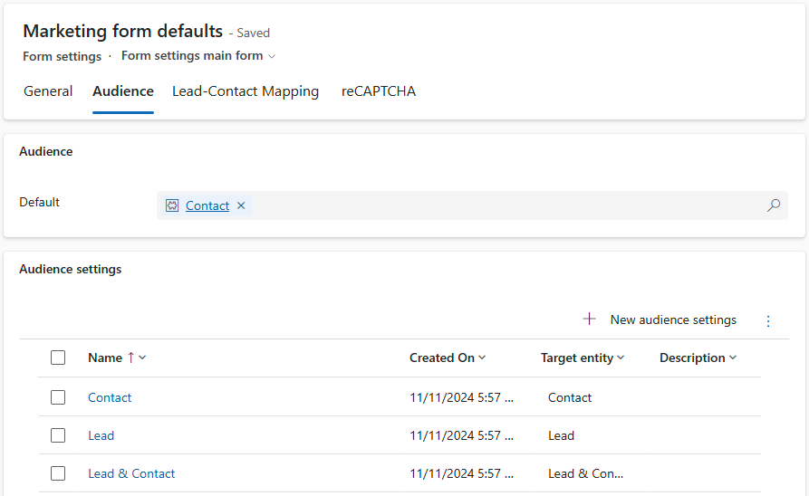
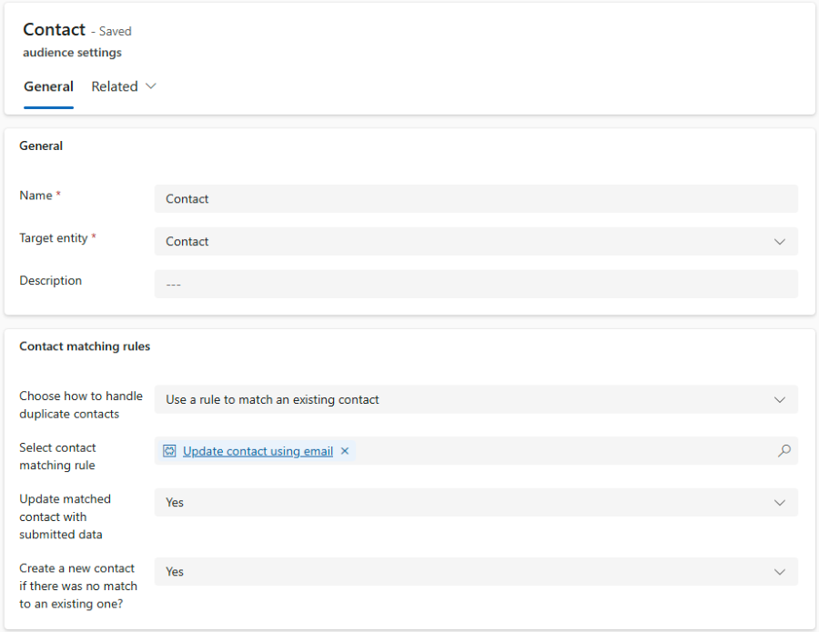
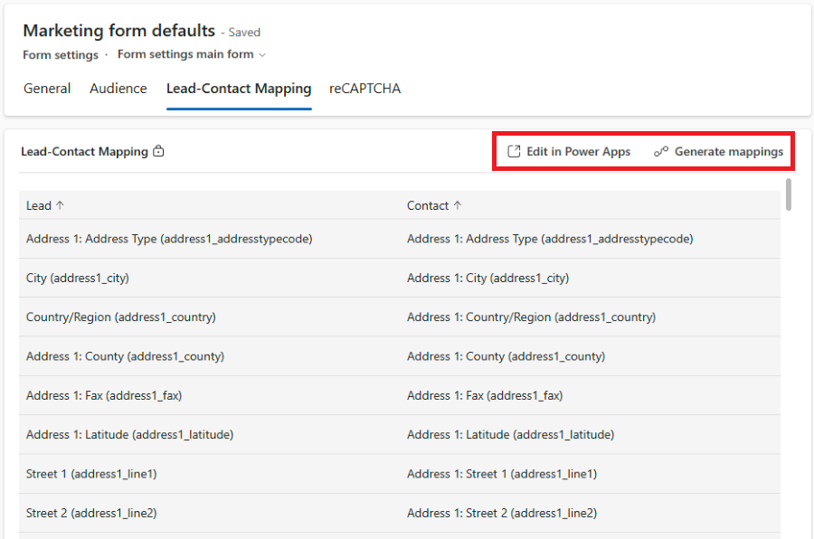
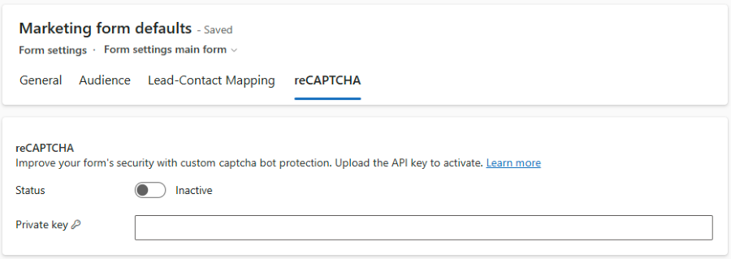

# Form settings - set default configuration of all your new forms

Creating a new form can be quite challenging for nontechnical users due to the complexity of the form configuration, which requires system knowledge. Each time you create a new form, going through the configuration process can be time-consuming and can introduce errors.

The new form configuration feature allows you to preset all your new forms, eliminating the need to think about all the details each time you create a form. You can configure defaults for all your newly created marketing or event registration forms on the *Form Settings* page, located in the Customer Engagement section of *Settings*.

> [!div class="mx-imgBorder"]
> 

There are two out-of-the-box configurations for default form values following the form type:

1. Event registration form defaults
1. Marketing form defaults

> [!IMPORTANT]
> Do not delete these out-of-the-box configurations! This may result in configuration malfunction. If you delete the out-of-the-box configuration, create a new configuration of the same type and set it as default one.

You can select the configuration to edit default values for its respective form type.

There are four tabs representing various areas of form configuration:

1. **[General](real-time-marketing-form-global-settings.md#general)** - set details of configuration and configure common settings of the form.
1. **[Audience](real-time-marketing-form-global-settings.md#audience)** - select what target audience (which entity record) will be created or updated by the form submission.
1. **[Lead-Contact Mapping](real-time-marketing-form-global-settings.md#lead-contact-mapping)** - available only for marketing form type. Review the platform mapping between attributes of lead and contact entities.
1. **[reCAPTCHA](real-time-marketing-form-global-settings.md#recaptcha)** - set up 3rd party form captcha.

> [!div class="mx-imgBorder"]
> 

## General

The first part of *General* section allows you to set details of the form configuration itself. You can set the name, select form type, and label the configuration as default. There can be only one default configuration of the same type.

You can also select if the [Form prefill](real-time-marketing-form-prefill.md) is automatically enabled for your newly created forms.

The second part of *General* section allows you to choose the default action, which will be taken after the form is submitted. Once submitted, the form can show *Thank you* notification or you can set the *Error* notification. You can customize the content of both notifications.

## Audience

> [!IMPORTANT]
> **Lead & Contact** audience is a preview feature.
> You can activate this new type of audience in Settings - Feature Switches - Forms.
>
> A preview feature is a feature that is not complete but is made available before it’s officially in a release so customers can get early access and provide feedback. Preview features aren’t meant for production use and may have limited or restricted functionality.
>
> Microsoft doesn't provide support for this preview feature. Microsoft Dynamics 365 Technical Support won’t be able to help you with issues or questions. Preview features aren’t meant for production use, especially to process personal data or other data that are subject to legal or regulatory compliance requirements.

The *Audience* section allows you to set default target audience for your newly created forms. The *Audience settings* determines what audience (entity record) is used in the submission processing and conditions under which new record is created or existing record is updated. All *Audience settings* are visible in the form editor, allowing users to select their preferred audience when creating a new form.

You can either modify the details of the out-of-the-box *Audience settings* or you can create your new one.

> [!div class="mx-imgBorder"]
> 

**Marketing form** type comes with 3 out-of-the-box Audience settings:

- **Contact** - Update existing contact using the selected matching rule (email address by default). Create a new contact if no existing was matched.
- **Lead** - Always create new lead, even if the same lead already exists (no matching rules are applied).
- **Lead & Contact** - Update existing contact using the selected matching rule (email address by default). Create a new contact if no existing was matched. Always create new lead, even if the same lead already exists (no matching rules are applied).

**Event registration form** type comes with a single out-of-the-box Audience setting:

- **Contact** - Update existing contact using the selected matching rule (email address by default). Create a new contact if no existing was matched.

### Audience settings details

You can modify audience settings to specify when a new record is created and how to update existing record to meet your business process requirements. The following example is valid for *Contact* audience.

> [!div class="mx-imgBorder"]
> 

- **Name** - name your audience settings. This name is visible in the form editor. Use short, but descriptive names.
- **Target entity** - select which entity is targeted by the form submission processing. Marketing form supports both lead and contact entities, but event registration form is limited to contact only.

#### Matching rules

Matching rules helps to configure how an existing record can be updated or when to create a new one. Matching rules follow the selected *Target entity*. You can see *Contact matching rules* if Contact is selected or *Lead matching rules* if Lead is selected.

> [!NOTE]
> We use *Contact* audience in this example. You can se the same details for *Lead* audience. The *Lead & Contact* audience allows you to set separate details for both contact and lead.

- **Choose how to handle duplicate contacts** - there are two options:
  - Always create a new contact - new contact is always created, no matching rules are applied.
  - Use a rule to match existing record - use *matching rule* to find an existing record and avoid duplicates. Selecting this value unlocks the following extra options.
- **Select contact matching rule** - matching rule defines how to find and prioritize existing records. You can use the out-of-the-box matching rule *Update contact using email* or you can create you own custom matching rules. Custom matching rules can be created in Settings -> Matching rules.
- **Update matched contact with submitted data**
  - Yes - the best matching record is updated with form submission data.
  - No - the matched record isn't updated with form submission data. The forms submission data is only linked to the matched record.
- **Create a new contact if there was no match to an existing one?**
  - Yes - if the matching rule doesn't find any suitable record to update, a new record is created.
  - No - no new record is created. The form submission data can be accessed only through the Form submission.

## Lead-Contact Mapping

The Lead-Contact Mapping section is available only for *marketing form* type. To use a combined Lead & Contact audience, it's important to define how the attributes are mapped to each other. For example, you need to link the Contact First Name attribute to the Lead First Name attribute, so the form field First Name can update attributes for both entities.

The combined Lead & Contact audience relies on [entity columns mapping](https://learn.microsoft.com/power-apps/maker/data-platform/map-entity-fields), which can be defined In Power Apps. The mapping uses the *Parent contact* relationship.

> [!IMPORTANT]
> If you use solutions as the mechanism for implementing application lifecycle management (ALM) you should define the mappings as a [solution in Power Apps](https://learn.microsoft.com/power-apps/maker/data-platform/solutions-overview).

> [!div class="mx-imgBorder"]
> 

In case you don't use solutions as the mechanism for implementing application lifecycle management (ALM), you can use the *Generate mappings* button to automatically link lead attributes to contact or you can select the *Edit in Power Apps* button to manually define the mappings.

## reCAPTCHA

Protecting your forms against bot attacks and malicious actors is crucial to ensure the quality of captured data. Marketing and event registration forms come with standard captcha, but you can also [implement a custom captcha](real-time-marketing-form-custom-captcha.md) to improve the user experience.

reCAPTCHA section allows you to enter the Private key for and activate the reCAPTCHA plugin.

> [!div class="mx-imgBorder"]
> 

[!INCLUDE [footer-include](./includes/footer-banner.md)]