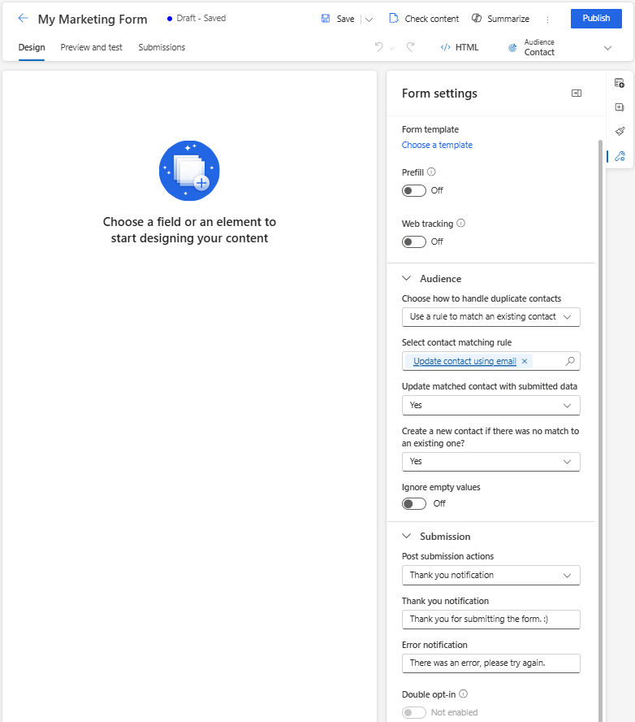

# Manage Customer Insights - Journeys forms

[!INCLUDE [consolidated-sku-rtm-only](./includes/consolidated-sku-rtm-only.md)]

This article explains how to edit, un-publish, and manage forms in Customer Insights - Journeys.

## Edit a live form

If your form has been already published and you need to update it, select the **Edit** button on the top ribbon. You can continue editing your live form and all changes are automatically published once you select the **Save** button.

> [!IMPORTANT]
> If you choose to create a copy of the form, you will have to publish the newly created copy.

The form is stored on a CDN where all data is cached to provide the shortest possible loading times to the visitors of your webpage. It may take up to 10 minutes before the cache is refreshed and before you can see the changes on your webpage. You can check the result of the changes in your page if you add this parameter `#d365mkt-nocache` to your webpage URL. Never share the link to your page including this parameter with your customers. The parameter bypasses the CDN cache and slows down the page loading.

## Un-publish a form

To un-publish a live form, select the **Stop** button. The form is removed from the CDN, so your web page visitors are no longer able to submit it. The form may be still visible due to the browser cache, but it can't be submitted. The form status is changed to *Draft*.

## Form field properties

Once you select a field on the canvas, you can see its properties in the right pane.

> [!div class="mx-imgBorder"]
> 

- **Placeholder text**: The placeholder inside the field. The placeholder automatically disappears once the user starts typing into the field.
- **Default value**: Set the default value for this field. The placeholder isn't visible if the default value is set.
- **Required**: If enabled, the user can't submit the form if this field is empty.
- **Validation**: Configure a rule that checks the content of the field. If the validation rule isn't met, the user can't submit the form. It's important to set the correct validation for email and phone number fields.
- **Hide field**: If enabled, the field isn't visible in the form. You can use hidden fields to store extra metadata along with the form submission.

> [!NOTE]
> Make sure that all phone number field validation is set to "Mobile Phone." This out-of-the-box validation checks if the phone number format is compatible with the phone number format requirements for contact consent point creation. The phone number must be in the international format starting with a "+" sign.

### Custom validation

To create custom validation, enable the **Validation** option and select **Custom**. A pop-up dialog appears where you can enter a Regular Expression (RegExp). You can, for example, use a RegExp to check if the entered value matches a specific phone number format.

## Style your forms using Theme

The Theme section can be opened by selecting the brush icon in the right pane. Theme controls the style of all types of fields, buttons, and text. Once you set the theme of a field, it affects all fields of the same type in your form.

> [!div class="mx-imgBorder"]
> 

### Preview: Copilot - Forms theme assistant

> [!IMPORTANT]
> A preview feature is a feature that is not complete but is made available before it’s officially in a release so customers can get early access and provide feedback. Preview features aren’t meant for production use and may have limited or restricted functionality.
> 
> Microsoft doesn't provide support for this preview feature. Microsoft Dynamics 365 Technical Support won’t be able to help you with issues or questions. Preview features aren’t meant for production use, especially to process personal data or other data that are subject to legal or regulatory compliance requirements.

> [!IMPORTANT]
> You must only use the theme assistant with websites that you own and operate. The theme assistant should not be used to copy third-party websites.

The theme assistant is a Copilot feature in Customer Insights - Journeys. You can use the theme assistant to fetch styles from an existing website that you own and control. To use a theme, enter the website URL and select **Fetch styles**. This process may take a few minutes. You can continue your work and return back later to check the result. Once the assistant fetches the styles from your website, it applies the styles to the theme of your form.

> [!div class="mx-imgBorder"]
> 

## Form settings

Form settings allow you to configure advanced properties of your form and define what happens after the form submission.

> [!div class="mx-imgBorder"]
> 

- **Duplicate records**: Choose your strategy on [how to handle duplicate records](#how-to-handle-duplicate-records).
- **Thank you notification**: This message appears if the user successfully submits the form.
- **Error notification**: This message appears if an error occurs when the form is submitted.
- **Redirect after submission**: If enabled, you can enter a URL to which the user will be redirected after the form submission.

## How to handle duplicate records

The default approach to duplicate records is different for contact and lead entities.

- **Contact (default: Update contact using email)**: If the user submits a form with an existing email address, the form submission updates the existing record. There's no new record created.
- **Lead (default: Always create a new record)**: If the user submits a form with an existing email address, a new record with the same email address is created.

You can change the default strategy using the **Duplicate records** drop-down in **Forms** settings. You can also create a [custom matching strategy](#create-a-custom-matching-strategy).

### Create a custom matching strategy

You can choose how to handle duplicate records by creating a new matching strategy.

1. Select the bottom left menu to access **Settings**.
1. Open **Form matching strategy** in the **Customer engagement** section.
1. Select the plus icon to create a new matching strategy.
1. Name the matching strategy and select the **Target entity**.
1. Save the matching strategy (don't select **Save & close** as you need to stay on this record).
1. Add matching strategy attributes (fields) that are used to check if the record exists.
1. Save your new matching strategy.
1. The newly created matching strategy can now be selected in the **Duplicate records** list in the form settings.

## Field types

Field types and formats are defined by the attribute metadata. It isn't possible to change field types and formats. You can, however, change the rendering control for field types where the format isn't defined.

| **Type**  | **Format** | **Rendering control** | **Description**|
|-----------|------------|-----------------------|----------------|
| Single line of text    | Email, Text, URL, Phone, Number         | Automatically set based on the format               | Simple input field. Validation is automatically set based on the format.                                |
| Multiple lines of text    | Text Area     | Text Area             | Text area input field that accepts all types of text values.                                |
| Option set             | n/a           | Radio Buttons         | Field with a limited number of predefined values (as defined in the database). Rendered as a set of radio buttons, with one button for each value.                                  |
| Option set             | n/a           | Drop-down              | Field with a limited number of predefined values (as defined in the database). Rendered as a drop-down list for selecting a value.                                                  |
| Two options            | n/a           | Check box              | Boolean field, which accepts a value of either true or false. It's rendered as a check box, which is selected when true and clear when false.                                              |
| Two options            | n/a           | Radio&nbsp;Buttons         | Field that accepts one of just two possible values (typically true or false). Rendered as a pair of radio buttons, with the display text for each defined in the database.           |
| Date and time          | Date Only     | Date Picker           | Date picker to select a date from a pop-up calendar display. It doesn't accept a time.                                                                           |
| Date and time          | Date and Time | Date-Time Picker      | Date and time picker to select a date from a pop-up calendar and a time from a drop-down list.                                                                   |
| Lookup field          | n/a | Lookup      | A lookup field is linked to a particular entity type, enabling you to add a drop-down list of options that were created in advance to your form. [More information](#lookup-fields). |

## Lookup fields

A lookup field is linked to a particular entity type, enabling you to add a drop-down list of options that were created in advance to your form. For example, you could use a lookup field called "Currency" to show a drop-down list of all currencies in your form.

After adding a lookup field, or if your lookup field isn't working, ensure that the service user used has permissions to configure the entities you're using with the lookup field. The Marketing Services User Extensible role used by the form editor needs to have read access to the entity used in the lookup field. You also have to enable **Make lookup data publicly viewable** in the lookup properties. All values within the lookup are available to anyone who sees the form. Ensure that sensitive data isn't exposed to the public. More information: [Adding lookup fields](marketing-fields.md#adding-lookup-fields-and-troubleshooting).

## Form validation

The validation process is automatically launched once a *draft* form is published or once a *live, editing* form is saved. The validation checks the form's content and can stop publishing if blocking **errors** are found or it can show **warnings** about potential issues.

You can launch the form validation process manually using the **Check content** button.

### Errors that block form publishing

The following conditions prevent forms from being published and display an error message:

- Is a **Submit** button included?
- Are the form fields linked to an editable attribute?
- Does the form contain duplicated fields?
- Does the form include all attributes required by the matching strategy (email field by default)?
- Is the target audience set?

### Warnings that don't stop form publishing

The following conditions don't prevent forms from being published. A warning message is displayed:

- Does the form include all fields linked to attributes of a selected entity that are mandatory to create or update a record?
- Are all required attributes labeled as required="required" in HTML?

## Advanced form customization

To open the HTML editor and display the source code of a form, select the **HTML button** in the top right corner.

- Customer Insights - Journeys forms can be [rendered using JavaScript API](./developer/realtime-marketing-form-client-side-extensibility.md#rendering-a-marketing-form-using-a-javascript-api), allowing you to load the form dynamically.
- You can [inject a marketing form into a react application](./developer/realtime-marketing-form-client-side-extensibility.md#injecting-a-marketing-form-into-a-react-application).
- It's also possible to [extend form events](./developer/realtime-marketing-form-client-side-extensibility.md#custom-events) like formLoad, formSubmit, etc.
- There are other possibilities to customize your forms. [Learn more](./developer/realtime-marketing-form-client-side-extensibility.md)

### Customize form CSS

You can change the CSS class definitions in the HTML editor. Editing CSS allows you to achieve more advanced design customizations on top of the possibilities in the form editor.

### Add custom JavaScript to your form

You can add custom JavaScript code to the `<head>` section of the HTML source code using the HTML editor. If the code JavaScript code is placed inside the `<body>` section, the form editor automatically removes the code without any warning.

You can apply the EventListeners to trigger actions based on events like `buttonClicked` instead of adding the reference to the JavaScript function directly on the HTML code of the button. See the following examples.

#### Example 1: Update the value of the form field using values of other form fields

In this example, a script is created that combines the first name and last name field values into the full name.

```js
<script>
    const firstName = document.getElementById("firstname-1679394382894"); // The field ID is unique in each form, make sure you replace it with the correct value.
    const lastName = document.getElementById("lastname-1679335991544"); // The field ID is unique in each form, make sure you replace it with the correct value.
    const fullName = document.getElementById("fullname-1679394390062"); // The field ID is unique in each form, make sure you replace it with the correct value.

    firstName.addEventListener('change', updateFullName);
    lastName.addEventListener('change', updateFullName);

    function updateFullName() {
    fullName.value = firstName.value + ' ' + lastName.value;
    }
</script>
```

#### Example 2: Populate a hidden field with a UTM parameter value from a URL

[UTM sources](real-time-marketing-utm.md) provide important information on where your new leads are coming from. This example script extracts the UTM source parameter from a URL and populates it into the value of a hidden field.

1. Create a new custom attribute of your lead entity called "UTM source" with the logical name `utmsource`.
1. Create a new form with "lead" as the target audience. You can see the custom attribute "UTM source" in the list of fields.
1. Add the UTM source field to the canvas and set it as hidden in the field properties.
1. Open the HTML editor.
1. Put the following script in the header section. Make sure you put the correct field ID into the code.

```js
<script>
    document.addEventListener("d365mkt-afterformload", updateUTMSourceField());
            
    function updateUTMSourceField() {
        const formField = document.getElementById("utmsource-1679335998029"); // The field ID is unique in each form, make sure you replace it with the correct value.        
        const urlParams = new URLSearchParams(window.location.search);
        const utmSource = urlParams.get('utm_source');
        formField.value = utmSource;
        console.log(utmSource); // for debug only, can be removed
    }
</script>
```

You can reuse this example to enrich your leads with more UTM parameters like utm_campaign, utm_medium, utm_term, utm_content.

## Integrate a custom captcha into the form

You can [integrate custom captcha](real-time-marketing-form-custom-captcha.md) bot protection services like [Google reCAPTCHA](https://www.google.com/recaptcha/about/) into your form.

### Custom back-end validation of form submission

It's possible to build custom back-end form submission validation that prevents form submission processing. It shows an error message to the user who tried to submit the form. You can find the inspiration for this back-end validation in the article about [integrating custom captcha](real-time-marketing-form-custom-captcha.md), where the form makes back-end validation to evaluate the result of a captcha challenge.

[!INCLUDE [footer-include](./includes/footer-banner.md)]
