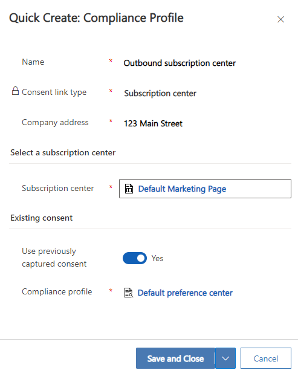
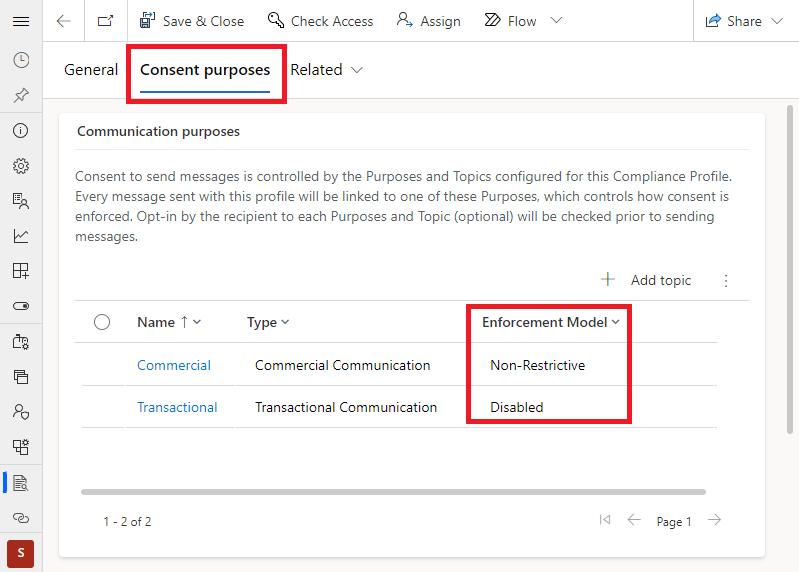
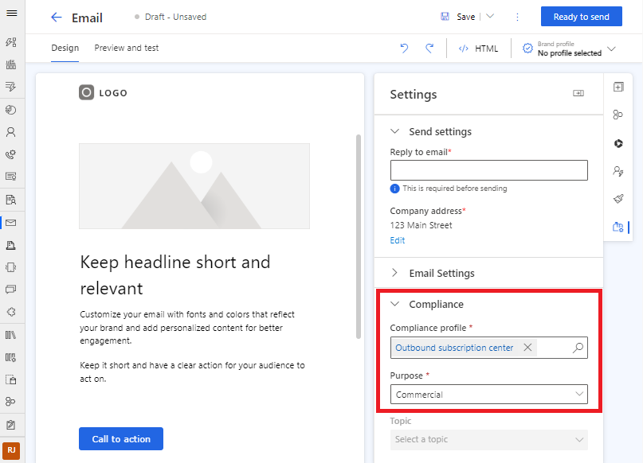

# Use outbound subscription centers in Customer Insights - Journeys

This article explains how to use outbound marketing subscription centers in real-time journeys. This capability enables you to start using real-time journeys before adopting the newer preference center compliance profiles. You should only use a subscription center in real-time journeys if you're already using outbound marketing to send emails and aren't yet ready to fully transition to real-time journeys. To learn more about transitioning from outbound marketing, visit [Consent management and double opt-in transition guidance](real-time-marketing-consent-transition.md)

> [!IMPORTANT]
> You can only use subscription centers in journeys that target contacts. Journeys that target leads or Customer Insights - Data profiles should use preference centers. Preference centers offer improved functionality, such as more customizable forms and the ability to update text message consent. Learn more: [Customer Insights - Journeys compliance profiles](real-time-marketing-compliance-settings.md) and [Preference centers](real-time-marketing-preference-centers.md)

## Prerequisites

To use outbound marketing subscription centers in real-time journeys, you must first create at least one subscription center in outbound marketing. If you haven’t already, [create your subscription centers](set-up-subscription-center.md) in outbound marketing.

## Set up subscription centers in Customer Insights - Journeys

In **Settings**, connect the outbound marketing subscription center to Customer Insights - Journeys compliance settings:

1. Go to **Settings** > **Customer engagement** > **Compliance**.
1. Select **+ New Profile** in the top toolbar, then select **+ With subscription center** from the dropdown.

    > [!div class="mx-imgBorder"]
    > 

1. Fill out the following settings in the "Quick Create: Compliance" pane:
    1. **Name**: Select a meaningful name that's easy to identify for users creating emails.
    1. **Company address**: The address that is used in the email footer.
    1. **Select a subscription center**: Select the subscription center you set up in outbound marketing.
    1. **Existing consent: (Optional)** Select an existing compliance profile from which you would like to share consent with this profile. If there's already a compliance profile (for example, preference center or preference page) that captures consent for the same line of business as the subscription center you're setting up, we recommend that you select that compliance profile. Sharing existing consent causes two compliance profiles to share the same commercial and transactional consent purposes, linking consent captured between the two profiles.
        > [!div class="mx-imgBorder"]
        > 

    1. Select **Save and close**.

## Subscription center consent enforcement

> [!IMPORTANT]
> By default, real-time journeys check the contact's `DoNotEmail`, `DoNotBulkEmail`, and `DoNotTrack` fields when outbound marketing is installed. These checks are performed to match outbound marketing's consent enforcement behavior and aid in the transition from outbound marketing to real-time journeys. To learn more, visit [Manage user compliance settings in Customer Insights - Journeys](real-time-marketing-compliance-settings.md)

Emails sent with subscription center compliance profiles enforce consent in real-time journeys by checking contact point consent records and applying the configured enforcement model. The communication purposes and their configured **enforcement model** impact if an email is sent to a contact's email address. The tracking purpose's **enforcement model** controls if tracking links and pixels are included in emails sent from real-time marketing. The contact point consent checks are done in addition to checking the fields on the contact. To learn more about purposes, contact point consent, and enforcement models, visit [Manage user compliance settings in Customer Insights - Journeys](real-time-marketing-compliance-settings.md)

For most users, the default purpose **enforcement model** settings lead to real-time journey consent enforcement being identical to the enforcement of the outbound journey. However, if you need to make changes, you can do so by editing the purposes in the compliance profile settings.

> [!div class="mx-imgBorder"]
> 

## Use a subscription center compliance profile in email

When you use a subscription center compliance profile in a real-time journey email, the system replaces `{{PreferenceCenter}}` personalization tokens in the email with a link to the outbound marketing subscription center defined in the compliance profile. Similarly, `{{CompanyAddress}}` personalization tokens are replaced with the address configured in the compliance profile.

To use a subscription center compliance profile in emails sent from real-time journeys, follow the steps below.

1. Open or create a new email message in the Customer Insights - Journeys email editor.
1. Select the email header and go to **Email Settings** in the right pane.
1. Under **Compliance**, select the compliance profile with the subscription center you set up in the "Quick Create: Compliance" settings in the previous step.
1. Choose the **Purpose** of the email you're sending (for example, you're sending a commercial marketing email).

    > [!div class="mx-imgBorder"]
    > 

### See also

[Outbound marketing compliance settings](privacy-use-features.md)  
[Manage user compliance settings in Customer Insights - Journeys](real-time-marketing-compliance-settings.md)  
[Manage consent for email and text messages in Customer Insights - Journeys](real-time-marketing-email-text-consent.md)  

[!INCLUDE [footer-include](./includes/footer-banner.md)]
