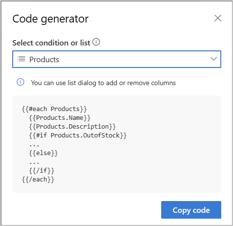

# Personalize lists of content in emails

Lists are a common way to organize information to improve readability. Examples include a list of sessions in an event, a list of products, or a list of service tickets. Customer Insights – Journey makes it easy to create lists and personalize those lists to include only the information that is relevant for the recipient in a way that is easy to parse and act upon.

## Set up a list

Let's say you want to create an email with a list of products the customer has. Follow the below steps:

1. Create a list placeholder and select the table you what to use for the list.
 
    :::image type="content" source="media/real-time-marketing-list-placeholder.png" alt-text="Screenshot showing creation of list placeholder." lightbox="media/real-time-marketing-list-placeholder.png":::

1. Next, add any attributes (columns) you want to display as the repeated content in the list. Please note: 

    * You can also specify how many items you want displayed (limited to a maximum 100 items).
    * Which attribute to order the list by.
  
    Once you've set up the list as desired, select **Save & copy** to save the list and access the code generator that provides the code for you to copy.

:::image type="content" source="media/real-time-marketing-list-attributes.png" alt-text="Screenshot showing list attributes to be added." lightbox="media/real-time-marketing-list-attributes.png":::

1. Select **Copy code** and then insert it into the email designer where you want this list to be included:

    Lists (each) statements allow you to format and display repeated content for a given table. You can add the code required to create these statements in the designer or in the HTML view. You can then use the placeholder dialog to specify the list to be evaluated including the number of rows to display and the order to display them in.

    ```
    {{#each Products}}
      {{Products.Name}}
      {{Products.Description}}
    {{/each}}
    ```

    If you're adding code to HTML, make sure to put comments around the lines {{#each}} and {{/each}}.

    ```
    <!-- {{#each Products}}  -->
      {{Products.Name}}
      {{Products.Description}}
    <!-- {{/each}}  -->
    ```

## List personalization – select items to include with a list filter

Sometimes when creating a list in an email, you'd like to only include items that meet certain conditions. For example, a confirmation email about an order shipment should only include items that are present in that shipment and exclude items that are in the same order but not in the shipment. Similarly, in a monthly newsletter, you may want to include only those events that are scheduled to occur in the next 30 days. This is achieved by defining a list filter, which is essentially a condition defined at the list level that is applied to each list item to decide whether the item should be included.

To filter a list, select a list you've already created in an email and select **+Add list filter**.

In this example, the email contains a list of products. We're applying a filter to include only those products that are currently "Active." If you don’t add a filter to this list, the entire list is included in the email (subject to the maximum number of items specified). In this case, the list would have included all products, irrespective of their status.

:::image type="content" source="media/real-time-marketing-add-items-with-list-filters.png" alt-text="Screenshot showing extra items to be added with list filters." lightbox="media/real-time-marketing-add-items-with-list-filters.png":::

The conditional statement can include one condition, for simple filtering, or many conditions for complex filtering.

> [!NOTE]
> The generated code for the list doesn’t change as the filter condition is stored within the list definition and isn't needed as inline code.

## List personalization –  date time formatting, related tables, and conditions within list

> [!VIDEO https://learn-video.azurefd.net/vod/player?id=3c5a6a13-9b59-453e-a8cd-321aaac76ab2]

A lot of personalization can be achieved with simple lists with filters. However, you aren't limited to only these types of personalization. This section describes additional capabilities available to build advanced and more personalized lists. To access these capabilities, select the **Advanced option** link.

After you select "Advanced option," the app interface changes to a more advanced version that allows for many advanced capabilities.

:::image type="content" source="media/real-time-marketing-advanced-options-for-list-personalization.png" alt-text="Screenshot showing advanced options that can be added for list personalization." lightbox="media/real-time-marketing-advanced-options-for-list-personalization.png":::

When the advanced capabilities are enabled:

1. Already selected columns are presented as dynamic text placeholders. This allows defining default values and specifies date/time formats.
1. Adding columns is done through **Add column** that allows the full power and flexibility of selecting a data source for a dynamic text (for example, traversal to a related table).
1. You can add item-level conditions.

### List columns as dynamic text

In standard mode, list columns can only be selected from attribute list of the data source (in the example above, only attributes of the “Product” table are available for selecting as list columns). In the advanced mode, columns are presented as dynamic text so all the flexibility and capabilities that come with Dynamic text become available to them as shown below.

:::image type="content" source="media/real-time-marketing-list-columns-as-dynamic-text.png" alt-text="Screenshot showing list columns as dynamic text." lightbox="media/real-time-marketing-list-columns-as-dynamic-text.png":::

1. In addition to attributes, related tables can be selected to bring in additional information. In this example, we're adding a list column that adds default price list start date for each product.

    > [!NOTE]
    > When selecting a related table, only tables related through **1-to-1** or **many-to-one** relations can be used. Tables related through **many-to-many** or **one-to-many** relations aren't supported within the list column (they're supported for dynamic text).

1. You can specify a default value when a list item is missing data.
1. If the data item is of type date/time, you can specify the display format for it.

### Condition within a list

List filters described earlier control whether a list item should be included. Conditions within a list apply to list items and are useful to include additional annotations or content when the included list item meets certain criteria. For example, the product list may have some products that are special in certain way – they may be new, soon to be discontinued, only available after certain date, etc. Conditions within the list can be used to add such callouts and annotations. By editing the HTML, you can even add clickable links or call-to-actions (for example, buttons), if needed.

Here's an example we define a condition to check if product being included in the list is out of stock:

:::image type="content" source="media/real-time-marketing-add-conditions-within-lists.png" alt-text="Screenshot showing adding conditions within lists." lightbox="media/real-time-marketing-add-conditions-within-lists.png":::

When such conditions are defined, the list code is updated to provide a basic working template for you to customize as needed:

> [!div class="mx-imgBorder"]
> 

For example, we can add annotation the "Out of stock" against the list item. This annotation will only be included if the condition is true for the list item.

```
{{#each Products}}
  {{Products.Name}}
  {{Products.Description}}
  {{#if Products.OutofStock}}
  **Out of stock**
  {{/if}}
{{/each}}
```

The code generator includes an “else” part by default that you can keep or remove as necessary. If you define multiple conditions, the code generator includes them as separate conditions (one “if” statement per condition). You can change the code to created nested “if” conditions as needed.

Here's an example where an additional condition “LowStock” was defined when quantities are less than 10. To annotate correctly for low stock vs out of stock, the "if" statement needs to be nested as shown below:

```
{{#each Products}}
  {{Products.Name}}
  {{Products.Description}}
  {{#if Products.LowStock}}
    {{#if Products.OutofStock}}
      **Out of stock**
    {{else}}
      **Low stock – order soon**
  {{/if}}
{{/each}}
```

[!INCLUDE [footer-include](./includes/footer-banner.md)]
