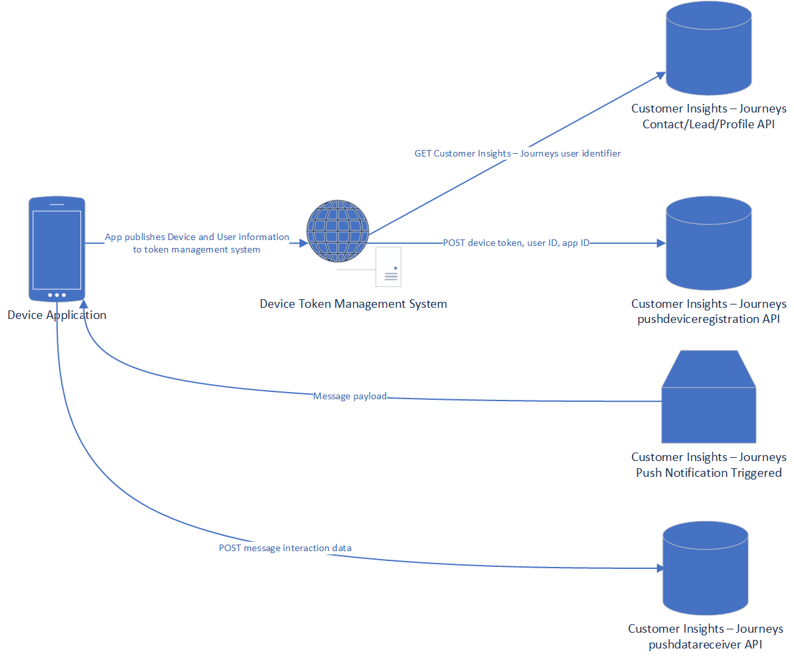

# Push notification overview

Setting up push notifications requires a few distinct steps for application developers and administrators. This document provides a high-level overview of the architecture and links to detailed documents for each component.

For detailed information about each step, visit the following documents:

1. [Push notification application configuration](real-time-marketing-push-notifications-setup.md)
1. [User mapping for push notifications](real-time-marketing-push-user-mapping.md)
1. [Device registration for push notifications](real-time-marketing-developer-push.md)
1. [Receiving push notifications on devices](real-time-marketing-developer-notifications.md)
1. [Interaction reporting for push notifications](real-time-marketing-developer-push-interactions.md)

## Register a push notification application with Customer Insights - Journeys

Once you have an application developed, the first step is to register that application with Customer Insights - Journeys. [Learn more about configuring push notification applications in Customer Insights - Journeys](real-time-marketing-push-notification-setup.md)

## Architecture diagram

The following diagrams provide an overview of the entities and relationships necessary to send push notifications from Customer Insights - Journeys.

> [!div class="mx-imgBorder"]
> 

## New application downloaded to mobile device

A mobile app will have a device token and user information. This needs to be stored somewhere, generally a cloud device management application, in order to provide this information to CI-J.

When someone downloads a new mobile application, user information and a device token need to be stored, generally in a cloud server device token management system. Approaches to storing this information can vary. The user and device information is needed to ensure the right message is delivered to the right device and to support personalization.

It's important to note that the device token can change over time. It's also not predictable what will cause the token to change. For instance, if someone removes and reinstalls the application, it's likely that the device token will change. It's important to update CI-J if the device token changes to continue to send messages to that device.

## Device and user registration with Customer Insights - Journeys

Once the user information and device token are stored in the cloud server that manages device tokens, you need to map the user to a known user in Customer Insights - Journeys because the user identifer from the device will be different from the user identifier in Dataverse, where the contacts, leads, and Customer Insights - Data profiles are stored.

To perform this mapping, you can use the public API for Customer Insights - Journeys to get the Dataverse identifier. Typically, you will query the API with an email address or phone number to get the Contact, Lead, or Profile identifier. This mapping between the mobile application user ID, device token ID, and Dataverse user identifer should be stored in the application's token management system. Because Customer Insights - Journeys supports multiple mobile applications, you need to specify the application ID when sending this data.

When the mapping is complete and stored, you can use the public API to POST the Dataverse user identifier, device token, and mobile application identifier in the device registration request to CI-J.

View full details about registering devices and users in [Push notification device and user registration](real-time-marketing-push-user-device-registration.md).

## Journey execution

When a journey runs and tries to send a push notification to a user, Customer Insights - Journeys will attempt to send the message to all device tokens to the specified user for the specified mobile application. Messages will only send to currently valid device tokens. If a user has the application installed on multiple devices that have been registered with Customer Insights - Journeys (for instance, a phone and a tablet), they would receive messages on both devices.

## Send and interaction reporting

In order to report on sending and interaction metrics for push notifications within Customer Insights - Journeys, you need to configure the application to send this information back to the Customer Insights - Journeys API.

View full details about send and interaction reporting in [Push notification send and interaction reporting](real-time-marketing-developer-notifications.md).

---

[!INCLUDE [footer-include](./includes/footer-banner.md)]