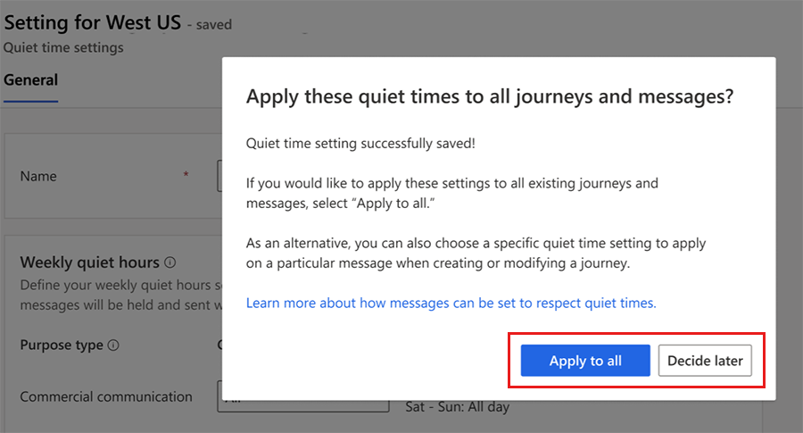

# Set quiet times to prevent messages from sending during unwanted hours

Quiet times enable you to configure specific times when messages won't send to customers to avoid contacting them when messages may be unwanted. You might not want to send messages at specific times due to regulations, business policies, or other factors. Typically, quiet times are configured for overnight hours, weekends, or holidays. When quiet times are in place, the system holds the messages until the quiet times end.

To set up quiet times, visit **Settings** > **Customer engagement** > **Quiet times**. If no quiet time setting exists, use the **New** button in the ribbon to get started.

The quiet times settings allow you to configure granular quiet times rules to respect customer time and meet local regulations. 

## Use time zone for quiet times

> [!IMPORTANT]
> A preview feature is a feature that is not complete, but is made available before it’s officially in a release so customers can get early access and provide feedback. Preview features aren’t meant for production use and may have limited or restricted functionality.
> 
> Microsoft doesn't provide support for this preview feature. Microsoft Dynamics 365 Technical Support won’t be able to help you with issues or questions. Preview features aren’t meant for production use, especially to process personal data or other data that are subject to legal or regulatory compliance requirements.

To set up quiet times, you first need to choose the type of time zone the quiet times rules apply to. This is an important because it determines how the quiet times rules are interpreted. 

:::image type="content" source="media/quiet-time-time-zone.png" alt-text="Set quiet times based on time zone." lightbox="media/quiet-time-time-zone.png":::

### Journey time zone

If you select the Journey time zone, we'll use the journey’s time zone to apply the quiet times. For example, if you set the journey time zone to be (GMT-5:00) Eastern Time (US & Canada), the quiet times and days applied to messages in that journey follow that time zone. 

### Audience time zone

If you choose the Audience time zone, the quiet times are interpreted based on the time zone of each individual in your audience. This means that the system uses the time zone information provided for each contact, lead, or Customer Insights profile to apply the quiet times rules appropriately. 

Time zone information for each contact point type is predefined under **Audience configuration** > **Contact point type** > **Time zone field**. If necessary, you can update it and select a different time zone format field for each type of audience (such as contacts, leads, or Customer Insights profiles) and each contact point type. 
> [!NOTE]
> If no time zone field is assigned under Audience configuration, the Quiet times defaults to the journey time zone. 

## Choose between general or advanced quiet times settings

The following sections outline two options you have when setting quiet times. These are *General* quiet times settings and *Advanced* quiet times settings. For advanced quiet time settings, you can create conditions on specific attributes.

### General quiet times

The General quiet times should be used when your audience is in a single geographical area or when you want to apply one simple, broad rule to avoid sending communications during certain hours. For example, you can apply one quiet times rule for the whole U.S. The General quiet times can also be used as a default quiet times rule that applies if none of the advanced quiet time conditions are met. 

:::image type="content" source="media/general-quiet-times.png" alt-text="An overview of general quiet times settings." lightbox="media/general-quiet-times.png":::

### Advanced quiet times

The Advanced quiet times setting provides more specifications. It allows you to create multiple quiet times rules based on specific conditions, such as country/region, state/province, or phone number. For example, you can create a specific quiet times rule for the state of Texas, and another for Alabama. This setting is beneficial for businesses with a diverse customer base spread across geographies. Using advanced settings, you can ensure that communications respect local regulations and time preferences.  

:::image type="content" source="media/advanced-quiet-times.png" alt-text="An overview of advanced quiet times settings." lightbox="media/advanced-quiet-times.png":::

> [!NOTE]
> When several Advanced quiet times rules are created, they're evaluated from top to bottom. The first matching rule is applied. If no rule matches, you default to General quiet times if they were configured.

#### Create conditions for advanced quiet times

To create conditions for advanced quiet times, you need to specify the criteria for when the quiet times should apply. 

You can base the conditions on the following attributes: 

•	Country/region
•	State/province
•	Phone number

For example, you might set a specific quiet times to apply if the contact country is the U.S. and the state is Texas, or from a customer's area code within their phone number.

:::image type="content" source="media/quiet-times-set-conditions.png" alt-text="Create conditions for advanced quiet times." lightbox="media/quiet-times-set-conditions.png":::

> [!NOTE]
> When you're setting conditions to match specific values in your data, you need to account for variations in how those values might be recorded based on your database cleanliness. For example, if you're trying to match the state of Texas, your data might have different representations of Texas, such as "TX," "Texas," "tex," or "texas".

You can set conditions to ensure that your customers' situation matches all possible variations. You should add a new row for each variation of the value. For example, for Texas you if state equals Texas, or if state equals TX, or if state equals tex, etc. Please note that values are case sensitive. By setting multiple conditions, you ensure that your data is matched accurately. 

To apply the quiet times the system checks if each audience member meets the condition (based on the mapped fields) before the journey runs. For Contacts and Leads, the mapped attribute fields are prepopulated. To update the fields or add the mapping for Customer Insights - Data Profile, go to **Attribute mapping** tab.

:::image type="content" source="media/quiet-times-attribute-mapping.png" alt-text="An overview of quiet times attribute mapping." lightbox="media/quiet-times-attribute-mapping.png":::

## Create quiet times rules 

Once you've chosen the quiet time setting, you can define several specific rules to tailor your communication strategy.

:::image type="content" source="media/quiet-times-rules.png" alt-text="Create quiet time rules." lightbox="media/quiet-times-rules.png":::

### Set different quiet times for commercial and transactional messages

You can set different rules for commercial and transactional messages. Many organizations prefer not to send commercial messages at odd hours to avoid annoying customers. However, they might want transactional messages (such as order confirmations or password resets) to be sent immediately regardless of the time.

### Set different quiet times by message channel

You can also differentiate quiet times based on the communication channel. For example, customers might be more sensitive about receiving calls and text messages during off-hours compared to emails. Therefore, you can set stricter quiet times for text messages while allowing emails to be sent during a broader range of hours.

### Define weekly quiet hours

You can set specific days and times during the week when messages shouldn't be sent. Select **Edit** next to "No quiet time" for that channel. You can choose specific times and days for the quiet times. Select **Add** to specify multiple times and days of the week. For example, you could set up quiet times for email to be all day on the weekends and between 9:00 PM and 7:00 AM during the work week. Once you configure the quiet times for the channel, you see the settings reflected directly on the page next to that channel.

### Set up overnight quiet times

To set up quiet times overnight, you need to create a separate evening quiet time and morning quiet time for each day. For example, if you never want to send messages after 6:00 PM and before 8:00 AM, you can create two quiet time settings for the channel:
- One time for every day from 6:00 PM to midnight
- One time from midnight to 8:00 AM

> [!NOTE]
> You can set up quiet times for a maximum of three consecutive days, as otherwise it may cause the message queue to excessively back up and messages won't get delivered. Quiet times only apply to content sent from journeys.

### Set up quiet dates

You can set up specific quiet dates when you don't want any messages to be sent, such as public holidays or company-wide events. To set up quiet dates, choose the channel and then edit the "quiet date." You can choose specific start and end dates when messages shouldn't be sent. You can use this interface to set up specific holidays or dates to prevent messages from being sent by channel.

:::image type="content" source="media/quiet-times-dates.png" alt-text="Set up quiet dates." lightbox="media/quiet-times-dates.png":::

## Initial quiet time setting

The first time you create and save a quiet time setting, the system asks if you wish to apply it to all existing journeys and messages. If you select **Apply to all**, the system applies the quiet time setting to all compliance profiles. If you select **Decide later**, you can add the quiet time setting directly to any compliance profiles you want later. Once a quiet time has been added to a compliance profile, all messages designated with that compliance profile respect the quiet times configured.

> [!div class="mx-imgBorder"]
> 

## Quiet times and journeys

In a journey you can see the type of quiet times setting that applies. It specifies if the quiet times use the journey time zone or audience time zone and General or Advanced parameters. You can also choose to change or disable quiet times for specific messages to support scenarios when a particular message in a journey shouldn't be subject to regular quiet times settings.

The number of messages held for quiet times is listed in the journey.

:::image type="content" source="media/quiet-times-and-journeys.png" alt-text="Apply quiet times in a journey." lightbox="media/quiet-times-and-journeys.png":::

## Quiet times and frequency caps

Quiet times and frequency cap settings are independent. If a message is held for quiet times, the frequency cap is evaluated when the message is released from the quiet times hold.

## Quiet times and compliance

For many organizations, quiet times are a regulatory requirement. To enable quiet times for messages, the quiet time must be set on the compliance profile that messages use. Setting the quiet times on a compliance profile enables you to have some compliance profiles that apply quiet times and others that don't. When you set up your first quiet time, the system asks you if you want to apply it to existing journeys and messages. If you choose **Yes**, the quiet time applies to all existing compliance profiles, journeys, and messages. If you choose **No**, you can always choose the quiet time you'd like to enforce later on specific compliance profiles.

## Quiet times and business units

If you use business units, the quiet times you create are available to all compliance profiles, journeys, and messages within your business unit. If you want to have quiet times for separate business units, you can create an individual quiet time setting within that business unit. If Business Unit Scoping for real-time is enabled and you have access to multiple business units, you can choose which business unit the quiet time is for.

[!INCLUDE[footer-include](./includes/footer-banner.md)]
