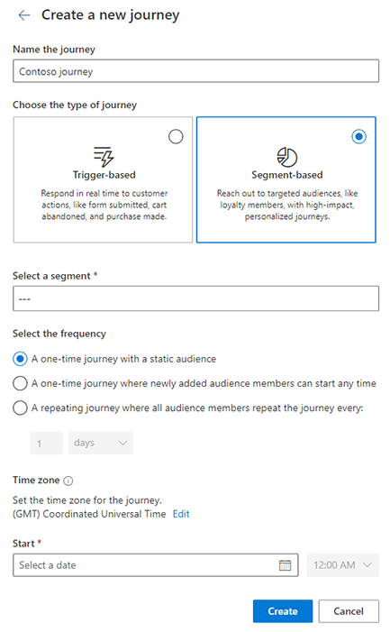

# Create a segment-based journey

You can use segment-based journeys to create outbound journeys like sending out announcements or a nurture campaign. To create journeys that can react to customers' actions in real time, see [Create a trigger-based journey](real-time-marketing-trigger-based-journey.md).

## Creating a segment-based journey to send an announcement

To illustrate the capabilities of segment-based journeys, we create a simple journey that sends an announcement to your most valuable customers about an upcoming product. If the customers show interest in the product by clicking the product link, we send them a follow-up message when the product is launched.

## Prerequisites

### Create segments

Create a segment of your *Most valuable customers*. You can [create your own contact or lead-based segment](real-time-marketing-build-segments.md). Segment-based journeys can also [work with segments from outbound marketing and segments from Customer Insights - Data](real-time-marketing-segments.md).
- If you choose to use outbound marketing segments, the email and text content must use **Contact** as the audience data for personalization.
- If you choose to use Customer Insights - Data segments, the email and text content must use **Customer Profile** as the audience data for personalization.

### Create email and text messages

- **Product announcement email**: Initial email announcement that is sent to your *most valuable customers*. This email must contain a link to the new product.
- **Product launched text message**: Follow-up text message that's sent after the product is launched. This follow-up message is sent only to customers who clicked the link in the first email.

You can build the journey while the content is in the **Draft** state. To publish and go live with the journey, the content must be in the **Ready to send** state.

## Set the journey start

> [!div class="mx-imgBorder"]
>

To create a segment-based journey, go to **Engagement** > **Journeys** and select **+New journey** in the top toolbar. A window opens allowing you to use [Copilot to create a journey](real-time-marketing-use-copilot-create-journey.md). To create a segment-based journey manually, select the **Skip and create from blank** button.

On the "Create a new journey" screen:

- Create a name for the journey
- Select **Segment-based** for the journey type. Customers start a segment-based journey when they qualify to be part of a segment.
- Select one or more segments. Please note the following when selecting multiple segments:
  - Total combined member count of all segments cannot exceed the limit noted [here](real-time-marketing-known-issues.md#segments) for a journey. You can select at most 25 segments (or fewer if the segment size limit is reached sooner).
  - Outbound segments or mixed audience types (e.g., Contacts and Leads) cannot be selected. 
  - Only one-time journey is supported at this time (recuring journeys and ongoing journeys where audience can enter any time will be supported in an upcoming release).
  - Environments that use their own [Azure Data Lake storage account](../data/own-data-lake-storage.md#connect-customer-insights---data-with-your-storage-account) are not supported.
- Choose the **frequency** at which your journey should run:
  - A **one-time** journey with a **static** audience that runs one time. When the journey starts, the current members of the segment start the journey.
  - A **one-time** journey where **newly added members can start at any time**. Responds to changes in the segment membership, letting more people start the journey after it starts. When the journey starts, the current members of the segment start the journey. Newly added segment members start the journey when the segment is refreshed. Each person goes through the journey one time, even if they're removed and then later added again to the segment.
  - A **repeating** journey runs on a schedule that you define. Every time the journey reaches the scheduled run time, all current members of the segment start the journey. Members added to the segment between the scheduled run times are included in the next run of the journey. Every time the journey runs, all segment members start the journey even if they previously entered the journey.
- Set the **start date and time**: Specify the start date and time when you want to send the announcement. If you want, you can specify the time zone for the journey.

## Add the announcement messages

Use the plus sign (**+**) on the journey canvas to add the individual steps in your journey.

1. **Send an email**: Because the first step of the journey is to send the product announcement, select the *Product announcement email*. For the **Send to** field, select the attribute that contains the email address you want to send the email to.
1. **Add an if/then branch**: Set the **Branch off this** property to the previous *Product announcement email*. You want to **Wait for** the *Email link clicked* event. For **Which link**, select the link to view the product details. Finally, set the time limit to *1 day* to indicate that customers have up to one day after receiving the email to click the product link.
1. **Add a wait**: If customers click the view product link within one day, they proceed down the **Yes** branch. Under the yes branch, add a Wait and select *Until a specific date and time*. Here, you can specify the exact date and time that the product will launch. This is helpful if, say, the product launches a few days after your email announcement. Customers wait on this step until the specific date and time. If the date and time has already passed, customers will immediately proceed to the next step.  
1. **Send a text message**: After waiting for the product launch, you can send the *Product launched text message*. For the **Send to** field, select the attribute that contains the phone number you want to send the text message to.

## Publish the journey

After adding all the steps to the journey canvas, the journey is ready to go live and message real customers. Before publishing the journey, make sure all related content (email, text messages, and push notifications) is in the **Ready to send** state. The journey can't be modified after it's published, so it's a good idea to verify that all the steps in the journey are exactly how you want them before publishing.

Once the journey is published and live, you can look at the journey [analytics page](real-time-marketing-analytics.md) to understand how it's performing.

[!INCLUDE [footer-include](./includes/footer-banner.md)]
