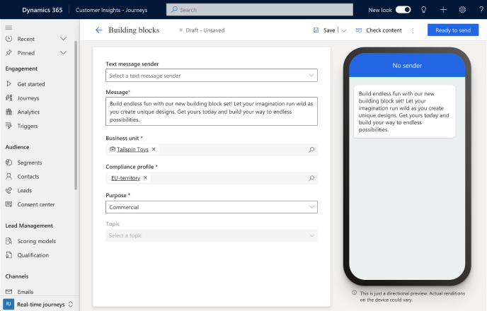

# Create outbound text messages

> [!IMPORTANT]
> Links in SMS messages are automatically shortened to reduce character count. Starting on October 10, 2024, URLs sent in SMS messages will expire six months after the message is sent and will no longer work.

Text messages (SMS) allow you to reach customers directly on their mobile devices. You can send text messages from Dynamics 365 Customer Insights - Journeys by signing up with a provider such as Azure Communication Services, Infobip, LINK Mobility, Telesign, Twilio, or Vibes and configuring Customer Insights - Journeys to work with the provider. To learn how to set up a text messaging provider account, see [Set up text messaging](real-time-marketing-text-messaging-setup.md)

> [!TIP]
> Phone numbers and messaging services are not included in the Dynamics 365 Customer Insights license. Text messaging within the app requires a separate provider subscription, which you then connect to the app to send messages.

This article explains how to create and send text messages in Customer Insights - Journeys. As [discussed below](real-time-marketing-outbound-text-messaging.md#track-your-text-message-metrics-from-channel-insights), the Customer Insights - Journeys app tracks text messaging metrics for channel insights purposes, including incoming SMS responses.

## Set up text messaging

Before sending text messages, you need to [enter the details for your text messaging provider](real-time-marketing-text-messaging-setup.md) within the Customer Insights - Journeys app.

## Create text messages

After you add a phone number, you can start authoring text messages by going to **Customer Insights - Journeys** > **Channels** > **Text messages** and selecting **+New text message** in the top ribbon. This takes you to the text messaging editor.

> [!div class="mx-imgBorder"]
> 

To create a message:

1. Select the message sender. The **Text message sender** dropdown lets you choose from the sender phone numbers (Azure Communication Services preview, Twilio, or TeleSign) you’ve added.
1. Enter your message content. You can enter text, emojis, and [personalized content](real-time-marketing-outbound-text-messaging.md#personalize-text-messages).
1. Choose a [Compliance Profile](real-time-marketing-compliance-settings.md#compliance-profiles), Purpose, and Topic for your message.

Before sending your message, select the **Check content** button in the upper right. This runs an error check on the message, much like the error check functionality in the email designer.

Next, test your message by selecting the **Test send** button in the upper right. If you’re using an Azure Communication Services preview toll-free sender number, you can test send the message to any United States mobile number. If you’re using a Twilio or TeleSign sender number, you can send the message to a mobile device in any supported country. You can also add the message to a journey to see how it can be triggered by events.

> [!NOTE]
> If your text message exceeds 160 characters, SMS protocol will split and merge content of a logical single message. SMS providers may charge for more than one message for text messages that exceed 160 characters.

## Personalize text messages

Personalizing text messages allows you to insert dynamic data that is unique to each message recipient. You might want to dynamically populate a name, an appointment time, a location, or any other unique data.

To personalize a text message:

1. Select the **Personalization**  button in the **Message** field.
1. Select **Select a data field** to choose a data source. Your data source can be based on an **Audience**, a **Trigger**, or **Compliance**.
1. After choosing the data source, you can search for the specific attribute or trigger you want.
1. Add a **Label** to quickly identify your token in the message content.

When you send the text message from a journey, it will automatically populate the token according to the attribute you selected.

## Conditional content for text messages

To add inline conditions in your text message, you have to: 

1. Add the conditional (if-then-else) statement in the text message editor:

    ```
    {{#if placeholderName}} 

      Content displayed when the expression is true 

    {{else if placeholderName2}} 

      Content displayed when the first expression is false and the second one is true 
    .
    .
    .

    {{else}} 

      Content displayed when all expressions are false 

    {{/if}} 
    ```

1. To set up the condition, select the **placeholder** name to configure (e.g., placehoderName) and click on the personalization icon:
    :::image type="content" source="media/code-text-message.png" alt-text="" lightbox="media/code-text-message.png":::
1. Select the condition you want. In the is example, the first placeholder will activate the condition if the contact’s address is in Spain:
    :::image type="content" source="media/select-condition-text-message.png" alt-text="" lightbox="media/select-condition-text-message.png":::
1. Once done, click on **Save**.
    :::image type="content" source="media/save-text-message.png" alt-text="" lightbox="media/save-text-message.png":::
1. Repeat this practice on all your needed conditions.

## Add a Customer Voice survey to a text message

Adding a Customer Voice survey link to a text message or [push notification](push-messages.md#add-a-customer-voice-survey-to-a-push-notification) allows you to seek feedback from customers on the channels they use the most.

To add a Customer Voice survey to a text message:

1. Select the **Customer Voice survey** button  in the **Message** field.
1. Choose a Customer Voice survey in the lookup field.
1. Select whether you want the survey to be anonymous and whether you want to track the survey link after customers click on it. If you select the **Survey is anonymous** option, no user data is saved with the answers.
    > [!div class="mx-imgBorder"]
    > 
1. Select **Save**.

When you send the text message from a journey, it will automatically populate the token with the survey and options you selected.

## Add SMS keywords to a text message

Adding SMS keywords in your text message allows you to use them in your customer journey to branch it based on your customer’s response to your text messages.  
 
To add a keyword to a text message:
 
1. Select the keyword icon.
2. Type the keyword that you’d like to add.
3. Select it from the list if it has been used previously in the journey or select the **New keyword** button to create it.

The following screenshot shows how to add SMS keywords in your text message.

> 
 
All keywords created through the SMS editor are also added to the [SMS keywords page](manage-sms-keywords.md ).
 
## Track your text message metrics from channel insights

You can see how customers react to your text messages by checking the text message analytics in the message itself and within journeys.

> [!NOTE]
> Delivery reports for text messages are received from different carriers in every country or region. This might result in false positives or negatives at times, depending on the carrier. Consider this when you check the delivery reports of your text messages.

[!INCLUDE [footer-include](./includes/footer-banner.md)]
