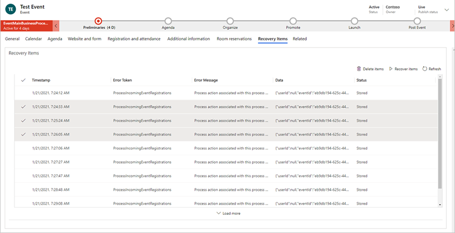

# Set up an event

The event planning process in Dynamics 365 Customer Insights - Journeys starts with creating an event record. The event record guides you through each step of event planning. The record collects all of your planning details, gives links to related records, and provides a business-process timeline. After you create the event record, you can set up your event team, manage speakers and sessions, set up event passes, and set up a venue.

## Create the root event record

Creating an event record is the first step when setting up your event in Customer Insights - Journeys. Everything related to a given event will be stored either directly in the event record or in other records that are linked to that event.

Though Customer Insights - Journeys offers many views into other record types, you'll probably do most of your work directly in the relevant event record. When working in the event record, you can view and create most types of related records and everything that you do is automatically related to that event.

You can see a list of all your event records by [opening the **Events** work area](open-events.md) and going to **Events** > **Event** > **Events**. From here you can use the standard list-view controls to search, sort, and filter the list to find and open an existing event, or to create a new event record.

As with other forms in Dynamics 365, the event form provides a summary of its most important settings at the top, where you also find the business workflow timeline, which helps organize your work at each stage of the event-management process. A standard business workflow for events is provided out of the box, but you can customize it to match the process in place at your organization.

The first time you create a new event, you must specify values for each of the required fields (marked with a red asterisk). We recommend that you fill out the business-critical fields as well (select each business workflow item, then fill out the items marked with a blue plus sign). All required and business-critical fields are available at the top of the page in the business workflow, where you can fill them out quickly and easily. All settings that you enter in the business workflow are also visible among the other event details further down the page. You can still view and edit these settings even after you move forward to the next stage in the workflow.

After you enter values for all the required fields, you can save the record. You'll probably return to the event record many times over several days while you plan your event. Use the workflow as a to-do list and to track your progress during each stage.

The main body of the page repeats all the important information requested by, and shown in, the workflow, plus much more. The main body is organized into tabs, which you can navigate by using the links near the top of the page body. You can enter your planning details in the main body of the page whenever you want to&mdash;you don't have to wait until you get to a specific part of the workflow. The following subsections give a summary of how to use each available tab.

### The General tab

Here you can see and edit your basic event information, including:

- **Key information**: Includes the name of your event and other basic details. The following settings are provided:
    - **Event name**: Enter a name for the event.
    - **Event type**: Choose the type of event. The event type is for information only and doesn't affect any features. Use it to make your event easier to find and identify.
    - **Registration count**: Shows the number of people who registered for the event. The maximum value that can be shown here is 50,000, but you can still store more registrations in the system.
    - **Check-in count**: Shows the number of attendees that checked in during the event. The maximum value that can be shown here is 50,000, but you can still store more check-ins in the system.
    - **Event image**: Allows you to select an image to represent your event. 
    - **Event URL**: Shows the address of your event website. If you're using the default location on your Power Apps portals solution, the event URL value is read-only and provided automatically. If you're hosting your website at a custom location, then select the Custom event URL check box and edit the value here. Select the globe button next the event URL field to open the site.
- **Schedule**: Provides settings for specifying the time zone, start, and end dates for your event. The schedule section also provides a countdown of the days until your event. You can also set up a recurring event here. If you change the start date for an event that's already been saved, you are asked whether you want to change the end date and the session schedule to match it.
- **Publishing**: Allows you to decide where and how your attendees register for your event. More information: [Create an event registration experience](event-registration-experience.md).
- **Stream this event online**: Set up your event as a Microsoft Teams webinar, a Teams Live Event, a Teams Meeting, or on-site only.
- **Capacity**: Set the capacity for your event. For on-site events, the maximum event capacity value displayed updates to match the capacity configured for your last selected building, room, or layout (if available). If needed, you can edit the value manually to override the capacity figure. You can also enable a waitlist. More information: [Set up and manage waitlist](set-up-and-manage-waitlist.md).
- **Location**: Specify the location where your event takes place. The location is hierarchical, and you can specify only as much detail as you need. For example, you can specify just a building. But to specify a room, you must first choose the building that contains that room. You can assign a separate location to each session if applicable. You can create location records from here, or choose from among existing venue records. Each location record can contain useful information such as address, facilities, capacity, and more.

### The Agenda tab

The **Agenda** tab includes details about the schedule of sessions happening during your event. Here you can find, create, and edit each of the following options for the current event:

- **Sessions calendar**: Shows a calendar of sessions defined for your event. You can create and edit sessions using the calendar. More information: [Work with marketing calendars](marketing-calendar.md).
- **Sessions list**: Each [session](#sessions) is typically a single presentation, class, discussion, or webinar. This table repeats the information also shown in the calendar. You can also create or edit sessions here.
- **Speaker engagements**: Each [speaker engagement](#speakers) maps a speaker to a session occurring at your event.
- **Sponsors**: Companies who are [sponsoring the event](manage-event-sponsorships.md).

### The Form tab

> [!NOTE]
> This tab was previously called "Website and form" and it also hosted publishing options. Publishing options are now moved to the General tab.

The Form tab provides options to set registration parameters and preview the registration form with dynamic preview.

:::image type="content" source="media/form-tab.png" alt-text="Form tab showing registration settings." lightbox="media/form-tab.png":::

Under the registration form options, you can edit an existing event registration form, select another, create a new form, or define other registration settings: 
- **Create leads for event registrations**: If enabled, a new lead is generated for each registration and linked to the appropriate contact.
- **Allow attendees to register for sessions**: If enabled, attendees can register for sessions. Learn more: [Set up session-level registration](real-time-journeys-event-session.md). 
    > [!Important]
    > The **Allow attendees to register for sessions** setting used to be on the **Agenda** tab and was called "Allow registrants to create their own agenda."
- **Registration period**: Allows you to define when the registration period is opened. You can define the registration start and end date. The dates are in the event timezone. In the form, you can customize the message that's shown to attendees before and after the registration period. To edit the message, navigate to the form settings and under submission, define the preregistration notification and registration closed notification. 

    :::image type="content" source="media/registration-period-notification.png" alt-text="Registration period notification settings." lightbox="media/registration-period-notification.png":::

### The Registration and attendance tab

Use the **Registration and attendance** tab to see who registered for the event and who attended. You can also create registrations and check-ins here. The following sections are available:
- **Event registration**: This table provides a list of people who [registered](invite-register-house-event-attendees.md) for your event. You can also [register people manually](invite-register-house-event-attendees.md) here. If you're using [custom registration fields](custom-registration-fields.md), then you can also view the values submitted by each attendee here.
- **Event check-ins**: Here, you can see who attended the event and enter attendance records. When a check-in record is created, the status of the registration in the registration table changes to "Checked in" and the check-in record is visible in this table together with the time and date.

### The Additional information tab

Use the **Additional information** tab to set up your event team and record general information, goals, and financial details. The following sections are provided here:

- **Additional information**: Enter a basic description and outline your goals.
- **Financials**: [View and record financial details](event-financials.md) for your event. These values appear in dashboard charts and analytics, but are intended for information only, not for formal accounting or bookkeeping.
- **Event team members**: [Set up your event team](#set-up-your-event-team) by adding links to coworkers and external contacts who are helping you organize the event. The table shows each team member's name and role, so you can easily see who to call and find their contact info when needed.

### The Room reservations tab

The **Room reservations** tab provides a calendar that shows the rooms assigned to the currently displayed event and its sessions. Unreserved rooms aren't shown, nor are events or sessions without assigned rooms. This calendar is read-only, so you can't create sessions or reservations here. More information: [Work with marketing calendars](marketing-calendar.md).

### The Recovery items tab

The **Recovery items** tab allows system administrators to track customization errors, improving the event workflow creation process. This tab contains a grid with customization errors and gives administrators options to handle them. For events, typical errors occur during registration on event websites.

> [!div class="mx-imgBorder"]
> 

After selecting rows in the Recovery items tab, you can delete the items (which will delete them from blob storage), or you can fix the issue and "recover" any item, which will replay the previously failed functionality.

> [!NOTE]
> If there are items in the Recovery items tab, non-system admin users receive a notification that says, "There seems to be some issues with this event. Ask your system admin for assistance."

### The Related menu

The **Related** menu provides links to event-related topics ranging from activities to speakers. If you select a topic in the related menu, a new temporary tab for that topic appears to the left of the related menu.

Although you can edit and save items related to the selected topic in the temporary tab, the temporary tab won't remain next to the Related menu after the event is saved and closed.

## Set up your event team

Your event team includes coworkers and external contacts who are helping you organize the event. Each event record lists each team member's name and role, plus links for more information, so you can easily see who to call and find their contact info when needed.

- You can view and edit the list of all team members who worked, are working, or will work on all your events by going to **Events** > **Event** > **Event Team Members**. Use this area to set up a database of people who are available to help with your various events.
- You can view and edit the list of team members associated with a specific event by going to **Events** > **Event** > **Events**, opening the appropriate event, and looking at the **Event Team Members** section of the **Additional information** tab. The list on the **Events** page works the same as the list on the **Event Team Members** page, except that it only shows and adds team members who are assigned to the current event.

Each team member record can be associated with a contact or user record.

- *Users* are people who work for your organization and have a Dynamics 365 license.
- *Contacts* come from your contact database, which will include customers, potential customers, vendors, partners, and other external people (or internal people who don't use Dynamics 365).

When you create a new team member record, you can choose whether to associate it with a user or a contact. If you choose to associate the record with a contact, the team-member record displays relevant information from that contact record. User records don't include any contact information, so if you associate the record with a user, the association is shown but no additional information is loaded. The team-member record also provides information about the member's role and which events the team member has worked on. You can create team members from either the **Event Team Members** list page or directly from a specific **Event** record.

When you're looking at a list view of team members, the list includes both a **User** and a **Contacts** column, but only one of the columns shows a value. From the list, you can go to the user or contact record by selecting the name in the list, or you can open the team-member record itself by double-clicking on a row anywhere away from the person's name.

## Manage event sessions and speakers

The core attractions of your event offering are typically its sessions and speakers. A simple event might have just one session, whereas a conference typically has several sessions spread over several days.

### Set up event sessions and tracks

A session represents a subdivision of things that are happening at your event. Each session is usually a something like a seminar or keynote, but the concept is flexible so you can adapt it as needed. For example, if your event is a trade show rather than a conference, you can use sessions to represent booths.

Use the **Agenda** tab of an event record to view and set up sessions and sessions tracks for that event.

- Each session is associated with a specific event and speaker, and includes scheduling details. You can view, create, and edit sessions using either the [calendar display](marketing-calendar.md) or the table.
- For each track, you can assign an audience and a few other descriptive details and then add member sessions, one at a time.

### Set up and assign session speakers

Use the following pages to manage your speakers and speaker engagements:

- **Events** > **Participants** > **Speakers**: Lists all speakers who are available for previous, current, or future events, and lets you set up new speakers.
- **Events** > **Event** > **Events**: Work on the **Agenda** tab of the appropriate event record to set up speaker engagements for that event. You can also create new speaker records here if needed while setting up speaker engagements.

When setting up a speaker engagement, you map a speaker to a specific session for the event record you're working with. To set up a speaker engagement:

- A speaker record must exist.
- If you're assigning a session, a session record must exist. (For single-session events, you might not have a session record and instead treat the event itself as a session.)

## Set up event passes

Event Passes are now available in Customer Insights – Journeys. Go to Feature Switches in settings and enable “Enable payments in Real-time Journeys.”

## Set up the event venue

A venue is any physical location where you hold an event or session. It might be a single building with just one room, or one of several rooms in a building. For each venue, you can register many types of important details, including name, location, facilities, capacity, layout, events that will or have occurred there, and more. After you set up a venue, you can assign events and sessions to it as needed.

Use the various types of venue entities in the **Events** > **Venue Management** area to construct a hierarchical model of your event location. Later, you can assign events and sessions to each venue space from your model. You only need to include as much detail as you need, so a simple building with just one room doesn't need to have any rooms defined for it, and a simple room with just one layout doesn't need to have any layouts defined for it. But you can't set up a room without a building or a layout without a room.

Use the following entities to model your venues:

- **Events** > **Venue Management** > **Buildings**: Buildings represent free-standing structures that might or might not be divided into rooms.
- **Events** > **Venue Management** > **Rooms**: Rooms represent subdivisions of buildings, and each must be assigned to a building record also stored in the system.
- **Events** > **Venue Management** > **Layouts**: During an event, you might use a single room to host several types of sessions, each of which might require a different arrangement of chairs and other facilities. The room layout might have practical consequences that affect, for example, seating capacity. Each layout must be associated with a particular room, but you can set up any number of layouts for each room.

[!INCLUDE [footer-include](./includes/footer-banner.md)]
