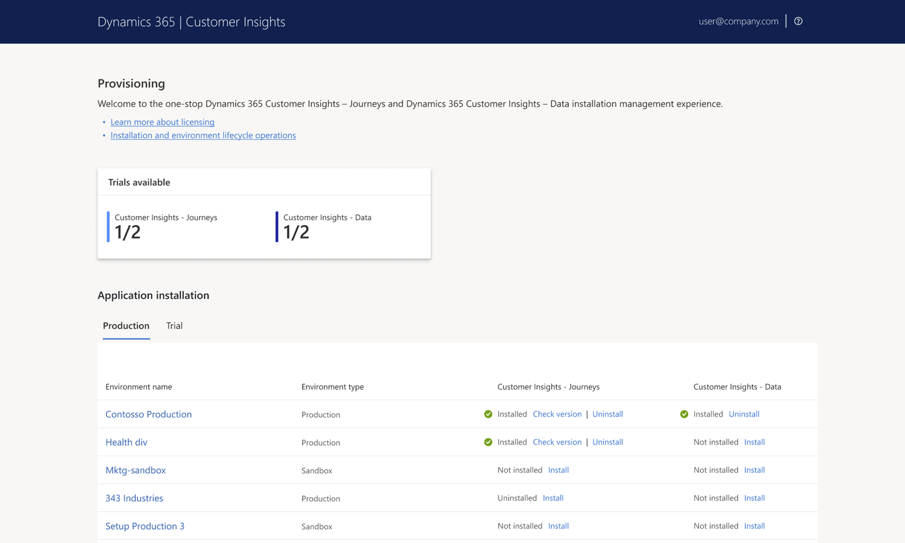

# Install and manage Dynamics 365 Customer Insights

This article explains how to access and use the installation management area for Customer Insights. In this one-stop experience, you can manage to install and uninstall the Customer Insights - Journeys and Customer Insights - Data applications.

All of your Dataverse environments are listed in the installation management area by type (**Production** or **Trial**). You can see where Customer Insights – Journeys and Customer Insights – Data are installed and take action to install or uninstall.

## Prerequisites and requirements

To install Customer Insights, you must meet all the following requirements:

- You must already have a Microsoft 365 tenant.
- You must have a Dynamics 365 Customer Insights, Dynamics 365 Marketing, or Dynamics 365 Customer Insights – Standalone license on your tenant.
- You must sign into your tenant with a user account that has all the following:
   - A security role (such as _Global admin_ or [_Service support admin_](/power-platform/admin/use-service-admin-role-manage-tenant)) that allows you to modify the target Dynamics 365 environment. (If you're reinstalling Customer Insights on an environment where Customer Insights was previously installed, then _Service support admin_ users [_Dynamics 365 administrator_ or _Power Platform administrator_] must use the same user ID as was used for the initial install. If you're not sure which ID was used for the initial install, or if you're getting errors, then try to install as a _Global admin_.)
   - Permissions to register applications in Azure. The global administrator always has this right, but other accounts can also have it. See [Do I have permissions to register applications on Azure?](setup-troubleshooting.yml#register-apps-azure) for information about how to confirm this setting for your account.
   - A Dynamics 365 license with the _System Administrator_ security role assigned on your target Dynamics 365 environment. (The Customer Insights license agreement doesn't legally require the installing user to have this license, but a known technical issue currently makes it necessary.)
- You must be located in a country/region where the product is supported. To read the latest list of countries/regions where you can use Customer Insights, download the [Microsoft Dynamics 365 International Availability](https://go.microsoft.com/fwlink/p/?linkid=875097) document (PDF).

Before starting an install, close all other browser windows and tabs and clear your browser cache. If you run into trouble while installing, see the [Administration and setup FAQ](setup-troubleshooting.yml) for some possible solutions.

> [!IMPORTANT]
> Your system is constrained by certain limits and quotas that apply to the number of contacts you can market to, monthly email messages you can send, Litmus previews you can view, and more. Familiarize yourself with the terms and limits of the product before you begin to use it. The limits are different based on whether you're running a trial or subscribed version of the product.
> 
> - For subscribed (paid) versions, download the [Microsoft Dynamics 365 Licensing Guide](https://go.microsoft.com/fwlink/p/?linkid=866544) and visit the [Fair use policy](fair-use-policy.md) page.
> - For trials, see [Dynamics 365 Customer Insights limits for trials](trial-preview-limits.md).
> 
> You can monitor your usage levels by going to  **Settings**  >  **Advanced settings**  >  **Other settings**  >  **Quota limits**. More information: [Quota limits](quota-management.md)

## Add Customer Insights to your Microsoft 365 tenant

There are several ways to get a Customer Insights license. You can purchase it from the [Dynamics 365 Customer Insights overview page](https://dynamics.microsoft.com/marketing/overview/), or by going to **Billing** > **Purchase services** in your Microsoft 365 admin center, or by contacting your Microsoft sales representative or channel partner. After you've purchased a license and it's added to your tenant, you’ll find it in the Power Platform Admin Center under **Resources** > **Dynamics 365 apps**.

You can have any number of Customer Insights licenses available on your tenant. Licenses translate to "apps" listed in the Power Platform Admin Center. Even old, expired trial licenses have records listed in the Power Platform Admin Center. You can access the installation management experience for any of these apps in the Power Platform Admin Center under **Resources** > **Dynamics 365 apps**. The app listing under **Dynamics 365 apps** is simply a means to access the management page. It shouldn't be considered as representing anything else. 

Once a paid license has been applied to your tenant, it can take up to 24 hours to sync with the Dynamics 365 licensing system and be available for installation. To see your licenses in the Microsoft Admin Center, go to **Your products**. They won't show up under **Licenses** because they're tenant-level application licenses, not assignable seat-based licenses where you pay per user. Only pay-per-user, seat-based licenses are shown on the "Licenses" page. 

## Install, uninstall, or update Customer Insights

The following sections detail how to install, uninstall, or apply updates to the Customer Insights apps.

### Install

There are two types of installations for Customer Insights - Journeys:

1. A **paid installation** or **trial** that includes the services and allows you to send messages, execute journeys, etc. You can install a paid license on an environment that has never had the journeys app installed.  
1. A free, **solutions only** installation that only installs the solutions that include the front-end user experience application components but none of the services. With a solutions only installation, you can test user experience solution customizations but you can't execute any service-related functionality in the application. Solutions only installations get solution upgrades every month with the regular releases. If you convert the solutions only environment to a paid environment by installing the services, the outbound marketing user experience is hidden. You must go to the **Settings** > **Versions** page to re-enable the outbound marketing user experience if you were building customizations on it in the solutions only mode. 

If you uninstall Customer Insights - Journeys paid or trial, the services are disconnected and the environment converts to a solutions only installation state. When the services have been uninstalled by you or by the system due to license expirations, you'll see a banner at the top of the application indicating that the environment only has the user experience solutions installed but not the services.

> [!NOTE]
> If you own the legacy Dynamics 365 Marketing license, the application installation entitlement from that business model applies, which allows one application installation per license purchased. If you own the current Dynamics 365 Customer Insights license, you're entitled to install the Customer Insights - Journeys and Customer Insights - Data applications each four times on your existing Dataverse environments. If you've signed up for a trial, you'll also see a listing for the Dynamics 365 Customer Insights license and you can launch the installation management page.

#### Set up or access a Customer Insights - Journeys environment

1. If you haven't installed other Dynamics 365 apps on the [Microsoft Power Platform admin center](/power-platform/admin/), go to [**admin.powerplatform.microsoft.com**](https://admin.powerplatform.microsoft.com) to create an environment of the desired type (production, sandbox, developer, or trial). Learn more: [Create and manage environments in the Power Platform admin center](/power-platform/admin/create-environment).
1. On the [**admin.powerplatform.microsoft.com**](https://admin.powerplatform.microsoft.com) page, find **Resources** in the left-hand site map and select **Dynamics 365 apps**.
    - Whether you have the legacy, standalone Dynamics 365 Customer Insights app or Dynamics 365 Marketing licenses (available to customers who purchased before September 2023) or the new, combined Dynamics 365 Customer Insights license that entitles you to install both the Customer Insights - Journeys and Customer Insights - Data applications, you can find them listed on **admin.powerplatform.microsoft.com** under **Resources** > **Dynamics 365 apps**.

1. To open the installation management area, select the three dots dropdown ("**...**") next to the app name then select **Manage**.

1. In the installation management area, you'll see your available environments listed and can choose where you want to install Customer Insights - Journeys or Customer Insights - Data.

    > [!div class="mx-imgBorder"]
    > 

1. After you've installed the Customer Insights - Journeys and Customer Insights - Data apps on the same environment, you need to finish connecting them. To connect the apps, go to **Customer Insights - Journeys** then go to **Settings** > **Data Management** > **Customer Insights** and select the **Connect** button. This completes the data sync for segmentation between the two applications.
  1. To clear this connection if you need to uninstall and reinstall Customer Insights - Data with a new instance ID, after you have uninstalled Customer Insights - Data from the environment, go to [the Power Apps Maker portal](https://make.powerapps.com) -> **Tables** and find the table called **msdynmkt_configurations** and set the **CXPConfig row column name "Customer Insights Status"** attribute to **NotConfigured**. This will reset the connection and allow you to click **Connect** again on the setting after you have reinstalled a new instance of Customer Insights - Data.  
1. In Customer Insights - Data there are a few more steps to connect the Dataverse environment and start generating profiles based on the contact and lead entities in Dataverse, in addition to adding more data sources. 
  1. On the installation management page, select the circled **i** icon  next to the "Installed" text to find a link to open the Customer Insights - Data environment. In Customer Insights - Data, go to **Data** > **Data sources**, select **Add Data Source**, and choose **Dataverse**. Populate the URL with the environment URL from the Customer Insights - Journeys Dataverse environment. Select the contact and lead tables only and then select **Save**. Learn more: [Connect to Dataverse](/dynamics365/customer-insights/data/connect-dataverse#connect-to-dataverse)
  1. In **Unify**, choose the contact with ContactId as the primary key and fields like email address and phone number in the deduplication rules and lead with LeadID as the primary key and fields like email address and phone number as deduplication rules from tables you ingested to add them to the profile and proceed with unification settings. Learn more: [Data unification overview](/dynamics365/customer-insights/data/data-unification)

#### Troubleshooting a failed installation

Installations can fail for many reasons unrelated to and undetectable by the Dynamics 365 Customer Insights - Journeys application. When you request an installation, Microsoft decrements your application quota (in case you start multiple installations at a time) and requests the package installation from the platform. Once the platform tries to install the package, it can run into any number of issues in your specific environment including plugins that need to be disabled, dependencies in the Dataverse entity model that the journeys application relies on such as for leads or contacts, dependencies, security, or customizations.

If your installation fails, you'll see a **Retry** link where the **Install** link used to be. Before you **Retry**, you can do some checking on your environment to see if there's anything you need to do to prepare it to allow the solution installation. 
- Click **Learn More** to receive direction on the installation failure and steps you can take to resolve it. 
- You must have a paid license on the tenant.
- You must be the admin of the environment to install the application. 
- You must disable any custom plug-ins before installing.
- If users own records in Dataverse and have left the company, those records may be locked and the installation is unable to write to them, for example the DataLake folder which analytics must access. You must update the ownership of these records to an active user. 
- Check your solutions using the solution checker to learn what failed. You may have customizations or plugins which need to be disabled. Learn more: [Troubleshoot issues with Solution Health Hub](troubleshoot-marketing-solution-health.md)
- You can go to the solutions history view in the Maker portal to see what failed and what actions you can take to prepare your environment for a successful install. Learn more: [View the history of a solution](/power-apps/maker/data-platform/solution-history/)

If your installation fails and you want to abandon the installation, you must achieve a successful installation so that you can run the uninstall process to free up the license and disconnect any services that may have succeeded during the parts of the installation process that didn't fail. If you still can't resolve the issue after attempting using the solution checker or visiting the solution history in the Maker portal, you should [file a support ticket](troubleshoot-faq.md#how-can-i-create-a-support-ticket-from-the-power-platform-admin-center) and get help to achieve a successful installation.

### Uninstall

Find detailed guidance for [uninstalling Dynamics 365 Customer Insights - Journeys](uninstall.md). 

### Update

Dynamics 365 Customer Insights - Journeys releases updates on a monthly basis with new features and fixes. When there's a new release available, you can see it in **Settings** > **Versions**. Select **Manage+Update** to launch the installation management page. Environments listed under **Production** have an **Update** link. For trials, choose **use the legacy installation experience** to update them.

## Maintain or update your installation

In addition to helping you install Customer Insights for the first time, you can access the installation management area to modify, maintain, or update your installation. You can do all of the following:

- Check for and apply [updates](apply-updates.md)
- Fix installation issues
- Connect a disconnected instance to marketing services
- Clean up after a [copy or restore operation](copy-or-restore.md)
- [Uninstall](uninstall.md) Customer Insights - Journeys

## Privacy notice

[!INCLUDE [cc-privacy-marketing-fre](./includes/cc-privacy-marketing-fre.md)]

### Collecting feedback data

As a way to refine and improve the experience, Microsoft may collect feedback data from users within the app. Administrators can disable survey feedback with a PowerShell command by turning the “disableSurveyFeedback” flag to **true**. See [list of tenant settings](/power-platform/admin/list-tenantsettings) for more detail.

[!INCLUDE [footer-include](./includes/footer-banner.md)]
