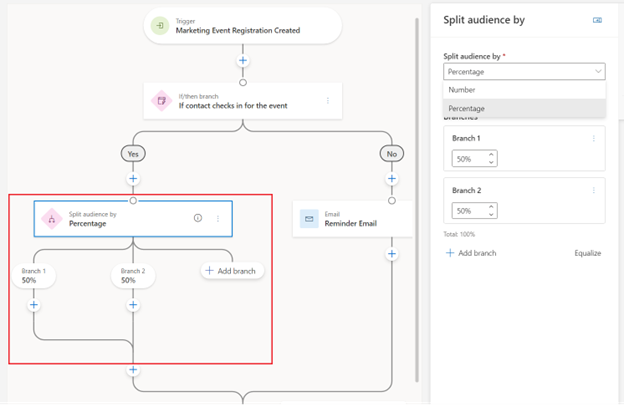

## Split your audience into groups to deliver unique customer experiences

When you want customers to have different experiences in one journey, you have the option of using attribute branches or segments. Both of these methods use customer attributes to group similar customers together to deliver an experience. There can be times when you simply want a group of a certain size or you want to select a set of customers randomly rather than based on what they have in common. For example, you might want to send a survey out to a random subset of your customers for feedback or provide a coupon to the first 100 customers. Split tile allows you to implement such situations.

Split tile divides your audience to provide a subset of your audience with unique experiences, whether that be a survey, a new type of experience to test, or a first-come promotional offer. You can split your audience by percentages (for cases where you need randomness) or by numbers (for cases where you want to deliver specific experiences to a set number of people).

The journey split tile creates branches in your journey to split up the participant population. You can add other journey tiles in each branch to deliver different experiences. All branches merge in the end so customers continue to have a common journey.

 
  
You have two ways to split the audience:

* **Split by percentage**: Splits the audience randomly into two groups where group size is specified in percentage by the journey designer. The random assignment is done for each participant individually when they arrive at the split tile. This way of splitting works best for larger populations (for example, more than few thousand participants). This option is useful for situations that need randomness, such as sending an experience survey to a subset of your customers.
* **Split by number**: Fills up branches from left to right based on how many participants are configured to go down each branch. Up to 25 branches can be created. This is best for situations that need specific numbers of participants, such as offering a promotion for the first 1,000 customers that sign up for a newsletter. As participants arrive on the split tile, they're sent to left branch until the specified number is reached. Once the specified number is reached, everyone is sent to the right branch.

## Difference between attribute branch and split

An attribute branch also creates branches that send customers to one of the available paths. However, branching criteria is based on an attribute of the customer (for example, their gender, city, etc.). A split branch, in contrast, doesn’t use any attribute allowing you to divide the customers randomly (such as when split by percentage) or by selecting customers as they come until requisite number is met (such as when split by number).

The other difference is that an attribute branch permanently forks the journey in two paths so the rest of a customer's experience is distinct. Split allows you to bring all customers back to a common path so the experience is the same for every customer.

## When to use segments vs split

Similar to attribute branch, segments also rely on attributes of customers so they're useful only when you need to create groups of customers who share certain attributes. Similarly, segment-based journeys are best for providing different experiences whereas split allows you to provide a differentiated experience for a small part of the journey.
