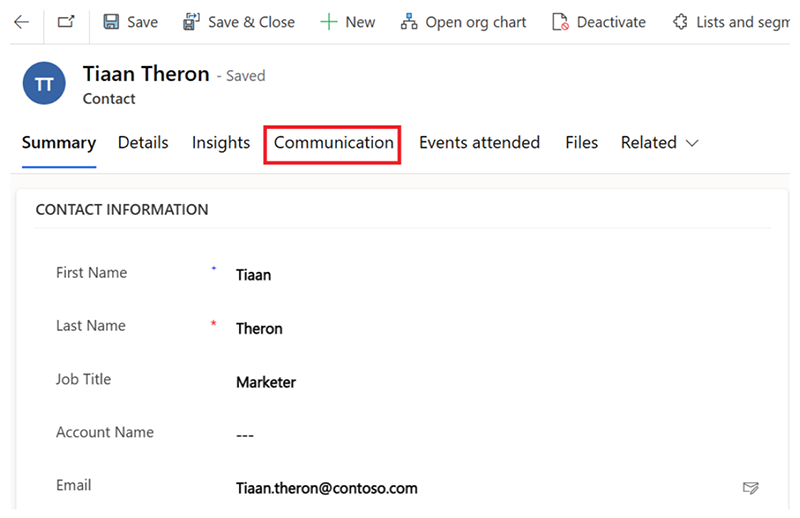

# How Customer Insights - Journeys uses suppression lists for email deliverability

A suppression list is a powerful backend tool that ensures your sending reputation stays healthy. Suppression lists prevent email messages from being sent to harmful recipient addresses.

This article discusses types of harmful address, then details how suppression lists prevent your emails from reaching these addresses.

## Recipient addresses that affect your sending reputation

### Hard-bounced addresses

Sending frequent emails to hard-bounced, invalid email addresses alerts remote spam filters to potential “spammy” behavior. These alerts affect your inbox placement and deliverability results. Sending multiple hard bounces to the same email provider in the same batch may even lead to the email provider completely blocking a sender, which can affect valid recipients.

### Addresses that mark your mail as spam (feedback loop/spam complaint)

Another type of address that's important to avoid is an email address that has marked your emails as spam. Or, in other words, an email address that has generated complaints. Continuing to send emails to a person who has marked your email campaigns as spam negatively affects your sending reputation and labels you as a spam source. Additionally, emails that generate spam complaints/feedback loops are generally to recipients that don't want to receive your emails, or even recipients that never subscribed to your mailing.

### Soft-bounced emails

Sending emails to addresses that soft bounce continuously may also harm your sending reputation. If you know that an email has bounced multiple times in a row, it doesn't make sense to send additional emails. Five consecutive sending attempts to the same email address that result in soft-bounces will result in the email address being added to suppression list similarly to a hard-bounce.

## How the suppression list works

A suppression list is an automated backend tool that protects your sending reputation.

- When customers start sending emails, the system automatically checks if any of the recipients’ email addresses are already in the suppression list and blocks sending emails to these email addresses.
- The suppression list works based on the bounce or feedback loop/spam complaint type of interactions that our platform receives from the remote recipient's mail system and doesn't block legit email addresses. The suppression list functions at an email address level, not at a contact or lead level.

The list is divided into three scopes of operation:

### Bounce suppression

Hard bounced email addresses are collected and stored in the suppression list. The hard bounce portion of the suppression list is a per organization list. The list stores cumulative information from organization sending statistics, making the list broad and reliable.

Soft bounced email addresses may also be listed in this suppression list. After five sequential failed attempts to deliver to the same email address, soft bounce addresses are also added to the suppression list. More details on bounce reasons and categories can be found here: [Email bounce categories](email-bounce-categories.md)

To keep the list up-to-date, the backend tool stores information about hard bounced addresses for 180 days (about six months). In rare cases, a hard bounced address may become valid again.

### Spam complaint suppression (feedback loop)

The spam complaint suppression list stores information about spam complaints (*feedback loop* reports) that were received regarding a specific organization and prevents such addresses from being sent to. Spam complaints are stored only for the specific organization that received a complaint. Spam complaint listings in the suppression list don't expire automatically.

### Pattern suppression

The pattern suppression is a manual list maintained by the deliverability engineers. It contains domains or email addresses that may not be a good idea to send to. For example, test mailboxes that will never read emails or domains that host temporary or disposable email addresses. Such mailboxes and domains are accessible to anyone and sending to them may harm your sending reputation.

## Suppression expiration

An email address that goes to the suppression list has a default expiration date. Expiration means that the email address is automatically removed from suppression after that date and you can send emails to that address again.

The expiration is gradual. The more frequently an email address goes to suppression, the longer its expiration. The table below correlates suppression occurrences with suppression period length.

| Suppression occurrence | Suppression period |
|------------------------|--------------------|
| First time             | 7 days             |
| Second time            | 14 days            |
| Third time             | 30 days            |
| Fourth time or more    | 180 days           |

## How to delist email addresses

### Addresses eligible for delisting:

1. Soft-bounced email addresses where the underlying issue causing the bounce has been fixed.
1. Hard-bounced email addresses that have the same domain as the sending domain.
    - For example: From [admin@contoso.com](mailto:admin@contoso.com) To: [John.Doe@contoso.com](mailto:John.Doe@contoso.com)
        - The hard bounced [John.Doe@contoso.com](mailto:John.Doe@contoso.com) address is eligible for delisting because the user owns the contoso.com domain and the recipient is considered “internal.” The user can confirm that the reason for the hard bounce has already been mitigated from their end.

Eligible email addresses have an automatic expiration date that removes the email address from the suppression list once the date arrives. Each time the same email address enters the suppression list, the default expiration time increases.

> [!NOTE]
> Email addresses listed due to feedback loop/spam complaints will never be eligible for delisting due to privacy and data protection regulations. Such emails can only be requested to be removed by the recipient owner of the email address. Senders cannot get approval to remove such addresses.

## Removing eligible email addresses

You can remove eligible email addresses from the suppression list by navigating to **Contacts** and then selecting the **Communication** tab.

> [!div class="mx-imgBorder"]
> 

In the **Communication** tab, email addresses are part of one of the following categories:

1. **Not in the suppression list**: The email address isn't listed in the suppression list and you can send emails to this email address.
1. **On suppression list** The email address is in the suppression list due to a hard bounce or multiple soft bounces. Email addresses in this category are removable. You can remove them by selecting **Remove from suppression list**.
1. **Permanently blocked**: The email address is in the suppression list due to a permanent issue or due to a direct spam complaint from a recipient. Email addresses in this category aren't removable as they're either ineligible for removal (because of, for example, spam complaints) or removing doesn't solve the problem and they go back on the suppression once you try to contact them (because of, for example, an invalid mailbox).

Learn more about bounce reasons and categories: [Email bounce categories](email-bounce-categories.md)

> [!IMPORTANT]
> You have a limited number of attempts to remove email addresses, so if you're dealing with a lot of suppression after executing a journey (for example, hundreds or thousands of suppressions), open a support to engage with our deliverability team as this is abnormal behavior and requires further investigation to identify the root cause of the problem.
>
> **In the support request, provide the following required information**:
>
> - A list of the email addresses in question (removal is case sensitive, so if an email address has capital letters, you need to provide it with them).
> - Justification as to why you believe each email address was listed by mistake.
> - Proof that each email address is valid and can be reached by any other email provider by sending a screenshot of such an email or forwarding a copy of an email received from the email address in question.
> - Measures taken to prevent same bounces for those addresses (if applicable).
>
> After that, our deliverability team will review the request and determine if the addresses are eligible for removal.

> [!TIP]
> If you have a typo in an email address listed in the suppression list, correcting the email address in the contact fixes the issue without the need to remove the incorrect email address from the suppression list. Deliverability is not affected by incorrect email addresses in the suppression list.

> [!NOTE]
> If a contact's email address that is used in a live journey is removed from a suppression list, the changes will take effect in the next iteration of the journey (if the journey is recurring), not in the current one.

[!INCLUDE [footer-include](./includes/footer-banner.md)]
