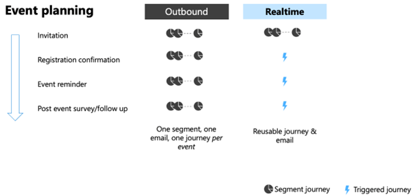

# Outbound marketing to real-time journeys transition guide for events

> [!IMPORTANT]
> The [outbound marketing](/dynamics365/customer-insights/journeys/user-guide) module will be removed from Customer Insights - Journeys on June 30, 2025. To avoid interruptions, transition to real-time journeys before this date. For more information, see [Transition overview](transition-overview.md)

## Key information

Outbound marketing and real-time journeys events are jointly presented under the Event planning work area in Dynamics 365 Customer Insights – Journeys.

The experience of creating events in real-time journeys is mostly unchanged. However, with the introduction of new features, we’re improving and enhancing your experience with outbound marketing.

> [!NOTE]
> When creating Outbound marketing events with start or end date post the Outbound-removal date, you see a warning that you have to acknowledge every time.

## Comparison of Outbound and Real-time marketing event

Event management comprises three areas:

1. **Event set up**: Create events, set up sessions, tracks, speakers, room reservations, and more.
1. **Event registration**: Registration form, custom unmapped fields, publishing of the event.
1. **Event communication**: Invitations, event registration confirmation, reminders, and post follow ups.

### Event set up

Creation and setup of events, tracks and sessions, speakers, and registrants work the same way in Real-time journeys with two differences:

- Multi-session registration in real-time journeys events allows you to manage capacity of event and sessions more efficiently. For more information, see [learn more](real-time-journeys-event-session.md)
- Improved registration and publishing experience. For more information, see [Create an event registration experience in Customer Insights - Journeys](event-registration-experience.md).

The following features are relevant as you transition from outbound marketing to real-time journeys. These features provide better functionality than those available in outbound marketing.

- [Maximize event capacity with waitlist registration](/dynamics365/release-plan/2024wave2/customer-insights/dynamics365-customer-insights-journeys/maximize-event-capacity-waitlist-registrations)
- Registration end date (available March 2025)
- Event passes (available March 2025)

### Event registration and publishing

The registration experience in Real-time journeys is different and is powered by default by a [registration form](event-registration-experience.md#event-registration-form), a type of [Customer Insights - Journeys form](real-time-marketing-form-overview.md). Real-time journeys event registration forms offer enhanced personalization options, allowing you to reuse forms between events by bringing in dynamic content (such as event name, location, list of speakers, sessions, and more). There are various options how to [Create event registration experience:](event-registration-experience.md).

- Registration form hosted as a standalone page–a single page containing the registration form with all details about the event. The page is hosted on Customer Insights infrastructure and no extra license is needed. For more information, see [Publish your form](real-time-marketing-form-create.md#publish-your-form).
- Registration form embedded into your website–you can embed the event registration form into your own website. For more information, see [Publish your form](real-time-marketing-form-create.md#publish-your-form).
- Registration portal on Power Pages – you can use the event registration template to [build a website using Power Pages Studio.](event-portal-template.md)
- Custom solution using events API. For more information, see [Using events API in real-time journeys](/dynamics365/customer-insights/journeys/developer/using-rtm-events-api).

**Relevant upcoming features for event registration and publishing:**

- [Custom unmapped fields](/dynamics365/release-plan/2024wave2/customer-insights/dynamics365-customer-insights-journeys/collect-extra-customer-information-without-creating-custom-attributes).
- [Create event portals with event and registration details using Power Pages](/dynamics365/release-plan/2024wave2/customer-insights/dynamics365-customer-insights-journeys/enable-customers-find-sign-up-events-easily).
- [Create event portals with event and registration details on your own website](/dynamics365/release-plan/2025wave1/customer-insights/dynamics365-customer-insights-journeys/create-event-portal-own-website).

### Event communication

Event-related communication in real-time journeys is now more efficient due to the availability of out of box triggers such as Marketing event registration created, Marketing event check in created, and Marketing event registration canceled.

Event-based communications in real-time journeys allow for more timely communication with attendees. This feature is illustrated in the following diagram:

:::image type="content" source="media/event-planning-rtjourneys.png" alt-text="Transition event planning diagram." lightbox="media/event-planning-rtjourneys.png":::

While the process of inviting and registering attendees is consistent with what was available in outbound marketing, communication about events requires new emails and journeys to be created. Refer to transition [segments, emails, journeys, and assets](transition-walkthrough-segments.md)

## Transition guidance

The following sections cover transition guidance for Real-time events.

### Timing of the transition

Real-time events are available for all customers. It's recommended to start transitioning as soon as possible.

All events that don't require features that are in the roadmap should be created as Real-time events by default.

The event schedule should also be taken into consideration when crafting the transition schedule.

### Migration path

1.  Migrate all event related communication to Real-time marketing regardless of if you’re using Outbound or Real-time events. Journey orchestration, segmentation, and other assets work with Outbound event registrations as well.
2.  Identify existing events that have a registration period open post-Outbound marketing removal and recreate them using Real-time marketing.
3.  Identify new events you're planning to run and check whether there's any critical functionality stopping you from using Real-time marketing currently. If there are no gaps identified, then all new events should be created in RTM only.
4.  Recreate the event registration experience as per the guidance in the next section.

#### Transition of event registration experience

RTM migration path for OBM event registration experience.docx

There were multiple options on how to build event registration experience in outbound marketing (OBM). Each of these will have a slightly different migration path.

- **Event portal hosted on Power Portals** – Build a new event registration website using Power Pages template. For more information, see [Build an event registration website using Power Pages](event-portal-template.md).
- **Event portal NOT hosted on Power Portals** – The recommended migration path is to build new event registration experience using the new code snippet listing, once available.
- **OBM Marketing form for event registration** – Replace these forms with RTM Event Registration forms. Learn more
- **Custom solution using OBM Event Management API (not using Angular application)** – Use the new Event API. Learn more about EM API.

Refer to the [RTM migration path for OBM event registration experience.docx](https://microsofteur-my.sharepoint.com/:w:/g/personal/petrjantac_microsoft_com/EWk-2RlWMFdKgGpKyaVZnlQBv8-eCxD9iUK0yX628V4YHQ?e=X7OmIE) document for more details.

## Frequently asked questions

*How are Outbound and Real-time marketing events different?*

As with other parts of the system, real-time marketing events have been built on the latest most advanced technology and infrastructure that will allow us to scale our product and offer the most up-to-date security first-driven experience. The biggest difference as described above, is the event registration experience. Another difference is that when introducing new capabilities to real-time events, we're taking into consideration feedback received from years of experience with Outbound events and introducing several improvements. Read more about the overall [Real-time transition](transition-faqs.md#why-should-i-transition-to-real-time-journeys)

*In a few words, what will happen once Outbound marketing is removed?*

Events are a shared capability between real-time journeys and outbound marketing and the same tables are used. These tables and the data won't be removed. However, there are some critical differences in the event forms and pages between outbound marketing and real-time journeys. Therefore, events created from outbound marketing stop working once outbound marketing is removed.

*What will happen to the existing Outbound marketing event records?*

The event record will still be visible in the UI. However, it will be in read-only mode. This means that you will be able to see the event, its settings, and registrations but you will not be able to edit the event any longer.

*What will happen with registrations in Outbound marketing events?*

The OBM registration records will continue to be visible in the contact record as it is a Dataverse entity.

*Will the event data tables change?*

The data structure for Real-time marketing events is the same now, but as we are introducing changes and enhancements to the system, we may implement certain features differently.

*For any features that haven't been introduced yet, can we assume that they'll work the same way?*

We're trying to avoid making any model changes to the basic event entities, but we do not recommend building custom solutions on system entities for features that aren't yet available in real-time marketing as this may present a certain level of risk.

*Will my event portal continue to work post-Outbound removal?*

Once outbound marketing is removed, it will be no longer possible to create Outbound marketing events or to register for Outbound marketing events. There were multiple options on how to build event registration experience and portals in outbound marketing. Each of these will have a different migration path. <!--- For more information, see Real-time journeys' migration path for Outbound marketing event registration \<need to link it to the correct section once this one is published too https://microsofteur-my.sharepoint.com/:w:/g/personal/petrjantac_microsoft_com/EWk-2RlWMFdKgGpKyaVZnlQBv8-eCxD9iUK0yX628V4YHQ?e=X7OmIE -->

*What will happen to the portals that are still live post-Outbound removal?*

The services stop processing registrations, and the site will no longer be available. There will be a user-friendly message informing them that the event registration page is no longer available. The recommendation is to unpublish all the existing portals before Outbound removal.

*Is there any tool that will help me transition my live events?*

No, any events that are live and are accepting registrations will have to have the registration closed before the Outbound removal as post this date, we will no longer process registrations submitted via Outbound forms.

*What should I do if the features I need for event planning aren't available?*

The most used features have a planned release date before the Outbound removal date, but we understand there might be some features that are important for your business and might not be available yet. You can **phase your transition**. Any events that don't need those features can be already created as Real-time events. You can also transition all your communication to Real-time as Outbound events can be used with Real-time journeys and Emails. This reduces the number of assets you'll need to transition closer to the date.

## Blogs and workarounds

- Workaround for custom unmapped fields: Enhanced data collection and journey personalization with unmapped form fields. For more information, see [FastTrack blog](https://community.dynamics.com/blogs/post/?postid=3a361b7e-80b0-ee11-92bd-002248527d3d)
- Cascaded fields where options provided in a field depend on a value in an earlier field aren't yet supported. For more information, see the blog [Implementing cascading dropdown fields in RTM forms](https://community.dynamics.com/blogs/post/?postid=ff86d88f-d892-ef11-ac21-6045bdd7e1ae)
- Sending timed reminders before event. For more information, see [Boost event engagement with journeys](real-time-marketing-event-registration-journey.md#step-2-send-email-reminders-seven-days-and-one-day-before-the-event).

<!---

# Transition event management

> [!IMPORTANT]
> **The [outbound marketing](user-guide.md) module will be removed from Customer Insights - Journeys on June 30, 2025.** To avoid interruptions, transition to real-time journeys before this date. More information: [Transition overview](transition-overview.md)

Event management comprises three areas:
- Event setup (including tracks and sessions, speakers, registrants, etc.)
- Communication about events
- Publishing of information about events

More granularly, the event management areas can be broken down as follows:

| Event setup                                                       | Event communication                  | Event publishing          |
|-------------------------------------------------------------------|--------------------------------------|---------------------------|
| Events, speakers, tracks, sessions, registrants | Segments, emails, journeys | Forms, portal pages |

Creation and setup of events, tracks and sessions, speakers, and registrants is unaffected by the change to real-time journeys.

Communication about events is also largely unaffected by the transition to real-time journeys. New emails and journeys are required, but the process of inviting and registering attendees remains consistent. However, there are enhancements associated with the addition of triggers that should be considered when creating event invitation and registration real-time journeys.

Event-based communications in real-time journeys allow for more timely communication with attendees. This is illustrated below:

> [!div class="mx-imgBorder"]
> 

The one thing that changes with real-time journeys events is the publishing of event information now that the dependency on Power Pages is removed. With outbound marketing, Power Pages were used as a platform to present event data (sessions, speakers, etc.) and handle registrations.

With real-time journeys events, the Power Pages dependency changes and only the registration form is provided. Registration forms can be either self-hosted or embedded into a website. This allows you to create the online presence you require for events using your technology of choice while capturing event registrations into Customer Insights - Journeys. Your technology of choice can include Power Pages (as it did with outbound marketing) if so desired, but you need to create the necessary pages for the event.

[!INCLUDE [transition-comments](./includes/transition-comments.md)]

## When to use real-time journeys and when to use outbound marketing for event management

Real-time journeys contains a subset of outbound event management features plus several improvements. The following table compares the real-time journeys and outbound marketing event management features.

|     Feature     |     Outbound marketing    |    Real-time journeys    |
|---|---|---|
|     Single session event    |     [Yes](set-up-event-outbound.md)    |     [Yes](set-up-event.md)    |
|     Multi-session event          |     [Yes](set-up-event-outbound.md#manage-event-sessions-and-speakers)    |     [Yes](set-up-event.md)    |
|     Session-level registration          |     [Yes](set-up-event-outbound.md#manage-event-sessions-and-speakers)    |     [Yes](real-time-journeys-event-session.md)    |
|     Recurring event    |     [Yes](event-recurring-outbound.md)    |     Planned    |
|     Event level templates    |     [Yes](event-templates-outbound.md)    |     Planned    |
|     Sessions, session tracks, speaker management    |     [Yes](set-up-event-outbound.md)    |     [Yes](set-up-event.md)    |
|     Venue management    |     [Yes](set-up-event-outbound.md#set-up-the-event-venue)    |     [Yes](set-up-event.md#set-up-the-event-venue)    |
|     Tracking sponsors    |     [Yes](manage-event-sponsorships-outbound.md)    |     [Yes](manage-event-sponsorships.md)    |
|     Creating Teams meetings/live events/webinars    |     [Yes](teams-webinar-outbound.md)    |     [Yes](teams-webinar.md)    |
|     Support for On24 and other generic webinar providers      |     [Yes](set-up-webinar-outbound.md)    |     Planned    |
|     Using marketing forms for registrations    |     [Yes](event-forms-outbound.md)    |     [Yes](real-time-marketing-form-create.md)   |
|     Event portal landing page    |    [Yes](set-up-event-portal-outbound.md)    |    Planned    |                     
|     Waitlist    |     [Yes](event-waitlist-outbound.md)    |     Planned    |
|     Payments    |     [Yes](event-payment-gateway-outbound.md)    |     Planned    |
|     Lead entity registration    |     [Yes](set-up-event-outbound.md#the-website-and-form-tab)    |     Planned    |
|     Custom registration fields    |     [Yes](custom-registration-fields-outbound.md)    |     Planned    |
|     Set registrations end date    |    Yes   |    Planned    |

[!INCLUDE [footer-include](./includes/footer-banner.md)]

-->