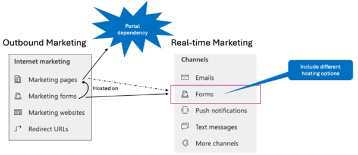

# Transition marketing pages and forms

Outbound marketing contains sitemap entries for “Internet Marketing.” The entries and the corresponding real-time journeys equivalent are depicted in the following image:

> [!div class="mx-imgBorder"]
> 

Notice that there isn't a one-to-one relationship between the outbound marketing objects and the real-time journeys objects:
- Marketing pages in outbound marketing serve as a hosting container for outbound marketing forms. They have a dependency on Power Pages, which is removed in the real-time journeys module and therefore have no equivalent in real-time journeys.
-	Outbound marketing forms allow you to design forms for landing pages, event registrations, or subscription centers. This functionality is covered in real-time journeys forms.
-	Marketing websites and redirect URLs allow you to track web activity, a feature that isn't yet available in real-time journeys but it's planned in Wave 2 2023 (see [Engage customers with content and follow-ups based on website interactions](/dynamics365/release-plan/2023wave2/marketing/dynamics365-marketing/engage-customers-content-follow-ups-based-website-interactions)).

Real-time journeys forms cover all functionality from outbound marketing forms and they also take over the publishing part from marketing pages (see [Deploy pages that contain Customer Insights - Journeys forms](real-time-marketing-deploy-pages.md)). Real-time journeys forms can also be used for event registration (in the **Website and form** tab in the event management module) and preference centers, which are the equivalent of subscription centers in outbound marketing (see [Transition consent](transition-walkthrough-consent.md) and [Create branded, customized preference centers to manage customer consent](real-time-marketing-preference-centers.md).

It's worth noting that real-time journeys forms are more advanced than their equivalent on the outbound marketing side. Real-time journeys forms have an intuitive, modern interface with an advanced form designer. Real-time journeys forms also offer enhanced personalization options, allowing you to reuse forms by bringing in dynamic content (for example, for events).

Consider the following when transitioning forms:
-	Because the underlying concept for forms is different between the modules, there's no way to automatically transition an outbound marketing form to a real-time journeys form. 
-	Real-time journeys forms are continuously improved. However, there are still details that aren't available in real-time journeys forms, for example, custom form fields, capture forms scripts, and web tracking.

## Relevant upcoming features

The features listed below may be of interest as you transition from outbound marketing to real-time journeys. These features provide parity, equivalent, or better functionality than what was available in outbound marketing.

- **Forms capture**: Maximize the potential of your external custom-built forms and generate more leads and contacts for your business without the need to recreate custom forms real-time journeys. Capture submissions from any form on your website and automatically create new leads or contacts in Customer Insights – Journeys. Learn more: [Capture responses from external, third-party forms](/dynamics365/release-plan/2023wave2/marketing/dynamics365-marketing/capture-responses-external-third-party-forms)

> [!TIP]
> If you have questions or comments, visit the [Outbound to real-time transition community forum](https://community.dynamics.com/forums/thread/?partialUrl=Outbound-to-Real-Time-Transition)

[!INCLUDE [footer-include](./includes/footer-banner.md)]