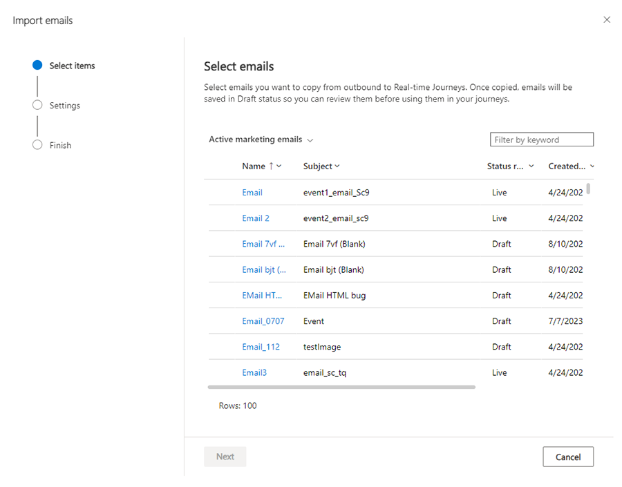

# Transition emails, journeys, and assets

> [!IMPORTANT]
> **The [outbound marketing](user-guide.md) module will be removed from Customer Insights - Journeys on June 30, 2025.** To avoid interruptions, transition to real-time journeys before this date. More information: [Transition overview](transition-overview.md)

## Emails

It's not possible to use outbound marketing e-mails directly in real-time journeys. However, you can use the **Import emails** button in the real-time journeys email editor to select and transfer any outbound marketing emails you want to use.

> [!div class="mx-imgBorder"]
> 

Importing outbound marketing emails not only saves time, but also protects your investment in expensive designs and layouts. During the import, most of the functionality like personalization and content blocks is also transitioned. After the import, make sure to check to see if all settings and personalizations are correct. Also, you need to choose the right compliance settings for the email before you can go live and use the email in a journey.

While reviewing the imported emails, it's worth considering whether you should start using [brand profiles](brand-profiles.md). Brand profiles provide the ability to standardize content like links to your company’s LinkedIn in a similar manner that content settings do for outbound marketing.

You can use the same tool to import email templates. To import templates, go to the email templates area in the real-time journeys email editor and select the **Import template** option.

**Known limitations when importing emails with content blocks**: When you import emails with the *Import content blocks used in the selected emails* option selected, each email reimports the associated content block(s), overriding any existing version. This results in the loss of any modifications made to the imported content blocks in Real-time marketing (RTM).

> [!TIP]
> To avoid unintended overwrites, import the content block first along with all related emails before making any modifications. The content block dependency from outbound marketing is stored in the `msdynmkt_obmmigrationinfo` column within the `msdynmkt_fragment` table. Clearing this value prevents automatic overwriting during imports.

## Journeys

Journeys in real-time journeys are the equivalent to customer journeys in outbound marketing. Journeys are the container that define the sequence of marketing actions that contacts are involved in. The underlying architecture for journeys in the real-time journeys module is fundamentally different from outbound marketing, which is why journeys can't be transferred automatically and manual recreation of the journey is required.

Using quiet times, you can control when messages get delivered, increasing engagement and meeting customer preferences. Quiet times allow you to comply with regulations by only reaching customers at their preferred times or by preventing nighttime, weekend, or holiday deliveries. For more information, see [Improve communication timing by setting up quiet times](real-time-marketing-quiet-times.md).

Journey end dates behave differently in real-time journeys. In outbound marketing, if a journey had a set end date, customers who already entered the journey would stop and not finish the journey. In contrast, in real-time journeys, customers who have already entered the journey complete the journey even if this takes them past the end date. However, no new customers are allowed to enter the journey after the end-date.
 
Send at a specific time (that is, 'Smart scheduling') has no equivalent in real-time journeys. 

## Asset library

No migration of the asset library should be needed. If you're using the outbound marketing asset library, the same asset library is used by real-time journeys, so you can continue to use all previously uploaded assets. If you're using an external asset library, the process remains the same (get the URL of the asset from the external library and insert it in your messages).

## Relevant upcoming features or workaround in real time

The features listed below may be of interest as you transition from outbound marketing to real-time journeys. These features provide parity, equivalent, or better functionality than what was available in outbound marketing.

### Email

- **Email A/B testing & Multivariant**: Compare and test variations of your emails on different subsets of your recipients and analyze how they interact with each to determine which variation performs better. 

*Guidance:* We do not have a published roadmap. You can create emails for each variation and [use A/B tests at the journey level](https://learn.microsoft.com/en-us/dynamics365/customer-insights/journeys/real-time-marketing-ab-tests-in-marketing-journeys)
-  **Email address can only be from Contact/Lead**: Emails can only be sent to email addresses in contact and leads.

*Guidance:* We do not plan to support sending to other email address. [Use CC (carbon copy) field](https://learn.microsoft.com/en-us/dynamics365/customer-insights/journeys/real-time-marketing-add-cc-recipients) where you can use personalization select email address from any related table of contact/lead.

### Journeys

- **Journey split by percentage or absolute number**: Split your audience into branches to provide a subset of your audience with unique experiences. Split your audience by percentages (for cases where you need randomness) or by number (for cases where you want to deliver specific experiences to a set of people). For more information, see [Provide varied experiences in one journey using journey split tiles](/dynamics365/release-plan/2023wave2/marketing/dynamics365-marketing/provide-varied-experiences-one-journey-using-journey-split-tiles).
- **Web tracking**: Trigger journeys and make decisions based on all known user interactions, from messages to web pages, making it even easier to create consistent personalized experiences across your brand's digital touch-points. For example, you can engage your customers when they show interest by sending a personalized offer after they visit your website. For more information, see [Engage customers with content and follow-ups based on website interactions](/dynamics365/release-plan/2023wave2/marketing/dynamics365-marketing/engage-customers-content-follow-ups-based-website-interactions).

[!INCLUDE [transition-comments](./includes/transition-comments.md)]

[!INCLUDE [footer-include](./includes/footer-banner.md)]
