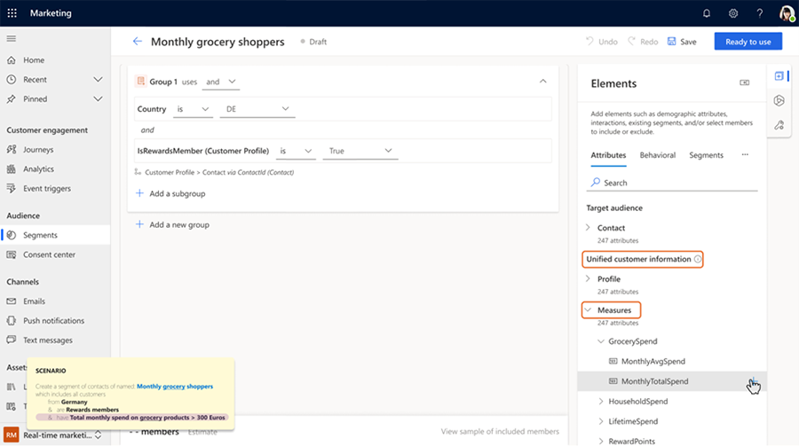

# Creating Segment using Unified Profiles and Customer Measures from CI-D

Dynamics 365 Customer Insights - Journeys lets you create highly personalized segments of your customers by using their unified profile and customer measure from Customer Insights - Data. This allows marketers to use Customer Insights - Journeys app for even more when scenarios without having to use Customer Insights - Data app to create Unified profile based segments. This also ensures all interaction data is captured against the contact, irrespective of whether you use the information from Contacts or Unified Profiles. 

In a Customer Insights - Journeys environment connected to a Customer Insights - Data environment, Unified Profiles and Customer Measures are available when you create a segment of contacts. For example, say you want to create a segment of contacts called the “Monthly grocery shoppers” that is based on location information from the contact table, “Rewards Member” property from unified profile and “MonthlyTotalSpend” from a customer measure (the latter two coming from Customer Insights - Data)

> [!div class="mx-imgBorder"]
> 

## Creating measures 

Please see [Use calculated measures in Dataverse-based applications - Dynamics 365 Customer Insights | Microsoft Learn](dataverse-measures.md) to learn how to create measures in Customer Insights – Data and what types of measures are available for use in Journeys. Please note that while the user interface presents itself as one-to-many relationship, current implementation in Customer Insights – Data only allows single dimension metric and therefore there will always be only one value returned. 
