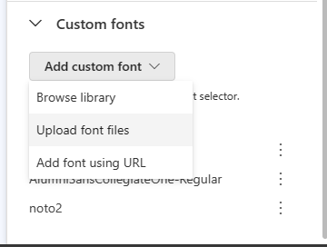
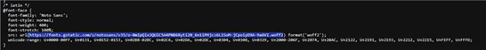

# Use Custom fonts in Dynamics 

[!INCLUDE [consolidated-sku-rtm-only](./includes/consolidated-sku-rtm-only.md)]

In the fast-changing field of marketing with Dynamics Customer Insights - Journeys, it's important to combine design, beauty, and accessibility. Typography, especially the use of web fonts, is crucial for achieving this harmony. In this guide, we'll show you how to easily use web fonts in your Dynamics Customer Insights - Journeys marketing channels, making sure they're both attractive and accessible.

> [!NOTE]
> By channels, we mean Emails, Forms and Event management.

## Understanding Web Fonts vs. Web Safe Fonts in Dynamics Customer Insights - Journeys

In the landscape of Dynamics Customer Insights - Journeys, where visual appeal is non-negotiable, it's essential to discern between web safe fonts and web fonts.

**Web Safe Fonts**: Drawing from local font directories, web safe fonts offer reliability. Common choices like Arial, Helvetica, and Times New Roman are preinstalled on most computers.

**Web Fonts**: Pulled from servers like Google or Adobe, web fonts broaden your options but pose challenges in terms of email client, system and browser font support, a crucial consideration within Dynamics Customer Insights - Journeys.

### How Fonts Operate in Dynamics Customer Insights - Journeys: 

Your code declares fonts using the font-family CSS property, either as a single font or a stack of multiple fonts for fallback. This distinction lays the foundation for comprehending web fonts and web safe fonts.

## Email Client Support within Dynamics Customer Insights - Journeys

Navigating the dynamics of fonts support is imperative for successful web font integration in Dynamics Customer Insights - Journeys. Here's a snapshot of web font support across key email clients:

| **Client** | **Support** |  |
|---|---|---|
| Outlook 2013-2021 | ✘ No |  |
| Apple mail | ✓ Yes |  |
| Gmail App | ✘ No |  |
|  | Google changes fonts – default on Android is Roboto, on iOS seems like Helvetica |  |
| Windows 11 | ✘ No |  |
|  | maybe? Some of the web fonts appeared, but it could be that the fonts were already on the compute |  |
| Outlook for Mac | ✓ Yes |  |
| Outlook Office 365 (Win & Mac) | ✘ No |  |
| iOS | ✓ Yes |  |
| Samsung Mail | ✘ No |  |
|  | Fonts changed - Roboto is the standard sans-serif |  |
| AOL Mail | ✘ No |  |
| Outlook App | ✘ No |  |
|  | Fonts changed - Roboto is the standard sans-serif |  |
| Samsung Mail  | ✘ No |  |
|  | Fonts changed - Roboto is the standard sans-serif |  |
| AOL Mail | ✘ No |  |
| Gmail | ✘ No |  |
|  | kind of. I liked Roboto, so I only support some particular web fonts - maybe   only certain ones from Google Fonts, or maybe just Roboto since it's Google's   default |  |
| Office 365 | ✘ No |  |
| Outlook.com | ✘ No |  |
| Yahoo! Mail | ✘ No |  |

## Discovering Web Fonts for Dynamics Customer Insights - Journeys 

For Dynamics Customer Insights - Journeys, the quest for the perfect web font involves exploring diverse sources:
1. **Web Font Services**: Paid services like Type Network and Fontspring offer extensive options. Ensure proper licensing for Dynamics Customer Insights - Journeys.
1. **Google Fonts**: Free and downloadable for design mock-ups.
1. **Adobe Fonts**: Included in Creative Cloud subscriptions.

## Implementing Web Fonts in Dynamics Customer Insights - Journeys Emails: Step-by-Step
You can embed fonts for use by going to the theme tab in Email and form designer or in theme tab in Brand profile. 

> [!div class="mx-imgBorder"]
> 

Here are the options and steps you can follow: 
1. **Browse font library**: upload the font files from the library
    - **Step 1**: Select browse library and you'll be presented with the list of custom fonts available to you for use.
      > [!div class="mx-imgBorder"]
      > 
    - **Step 2**: Select from the list of fonts available or upload new.
      > [!div class="mx-imgBorder"]
      > 
2. **Upload font files**: Import font files saved in your system. 
    - **Step 1**: Select upload font files from the “Add custom font” dropdown
      > [!div class="mx-imgBorder"]
      > 
    - Step 2: Select the respective font file from the system 
3. **Add font using URL**: You can import fonts by obtaining the font file URL>
How to retrieve the web font's URL from your chosen source?
Web fonts: When you use online web font services, you usually have five file formats to pick from: .eot, .woff, .woff2, .svg, and .ttf. The .woff and .woff2 formats are the most compatible with email, so we recommend using one or both of these formats when possible. 

Here’s a common @font-face declaration for importing a web font into email using Google Fonts as our chosen web font service:

**Google fonts**:
- **Step 1**: Paste the following html into a browser tab: https://fonts.googleapis.com/css2?family="fontName"

> [!NOTE] 
> This information is available in the side navigation of the Google Fonts page.

> [!div class="mx-imgBorder"]
> 

- **Step 2**: Copy the ‘**Latin**’ version of the @font-face.

> [!div class="mx-imgBorder"]
> 

- **Step 3**: Paste it in the respective dialogue box.

> [!div class="mx-imgBorder"]
> 

## Navigating Web Font Licensing in Dynamics Customer Insights - Journeys

In the journey of Dynamics Customer Insights - Journeys campaigns, it's crucial to respect the licensing landscape for web fonts. While most providers permit use, adherence to individual licensing agreements is paramount. Reach out to font providers for precise details on licensing within Dynamics Customer Insights - Journeys.

## Conclusion: A Font-Forward Future in Dynamics Customer Insights - Journeys

Integrating web fonts into Dynamics Customer Insights - Journeys offers a canvas for brand elevation. However, meticulous testing is paramount. Utilize Dynamics Customer Insights - Journeys testing tools and validate across environments to ensure flawless fallbacks. Embrace web fonts as a progressive enhancement, crafting visually stunning and accessible campaigns in Dynamics Customer Insights - Journeys. For queries or insights, reach out at Support@microsoft.com.
Happy crafting!

[!INCLUDE [footer-include](./includes/footer-banner.md)]