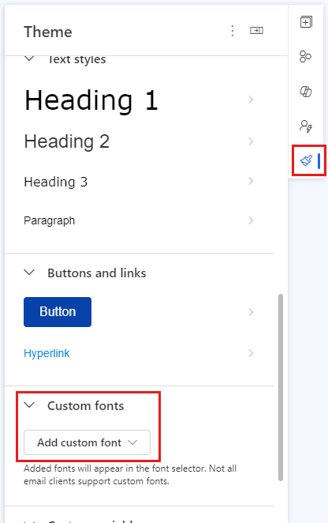
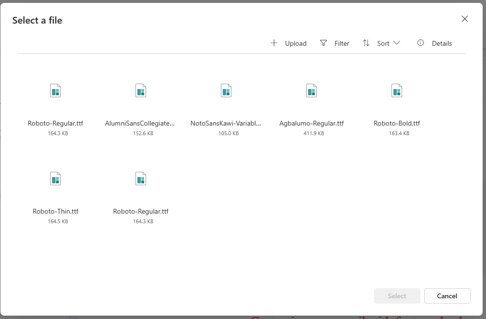
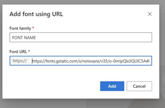

# Use custom fonts in emails

In the fast-changing field of marketing, it's important to combine design, beauty, and accessibility. Typography, especially the use of web fonts, is crucial for achieving this harmony. This article shows you how to use web fonts in your Customer Insights - Journeys marketing channels, making sure they're both attractive and accessible.

> [!NOTE]
> Channels include emails, forms, and event management.

## Understanding web-safe fonts versus web fonts

The main difference between web-safe fonts and web fonts is where they're loaded from.

- **Web-safe fonts**: Drawing from local font directories, web-safe fonts offer reliability. Common choices like Arial, Helvetica, and Times New Roman are preinstalled on most computers.
- **Web fonts**: Pulled from servers like Google or Adobe, web fonts broaden your options but pose challenges in terms of email client, system, and browser font support, a crucial consideration within Customer Insights - Journeys.

### How fonts operate in Customer Insights - Journeys

The code within the message you send on a Customer Insights - Journeys channel declares fonts using the font-family CSS property, either as a single font or a stack of multiple fonts for fallback. This distinction lays the foundation for comprehending web fonts and web safe fonts.

## Email client support within Customer Insights - Journeys

Navigating the dynamics of fonts support is imperative for successful web font integration. Here's a snapshot of web font support across key email clients:

| **Client** | **Support** |
|---|---|
| Outlook 2013-2021 | ✘ No |
| Apple mail | ✓ Yes |
| Gmail app | ✘ No |
| Windows 11 | ✘ No |
| Outlook for Mac | ✓ Yes |
| Outlook Office 365 (Win & Mac) | ✘ No |
| iOS | ✓ Yes |
| Samsung mail | ✘ No |
| AOL mail | ✘ No |
| Outlook app | ✘ No |
| Samsung mail  | ✘ No |
| AOL mail | ✘ No |
| Gmail | ✘ No |
| Office 365 | ✘ No |
| Outlook.com | ✘ No |
| Yahoo! mail | ✘ No |

## Discovering web fonts for Customer Insights - Journeys

For Customer Insights - Journeys, the quest for the perfect web font involves exploring diverse sources:
1. **Web font services**: Paid services like Type Network and Fontspring offer extensive options. Ensure proper licensing for Customer Insights - Journeys.
1. **Google Fonts**: Free and downloadable for design mock-ups.
1. **Adobe Fonts**: Included in Creative Cloud subscriptions.

## Implementing web fonts in Customer Insights - Journeys emails

You can embed fonts for use by going to the **Theme** tab in the email or form designers, or in **Theme** tab in a brand profile. 

> [!div class="mx-imgBorder"]
> 

To embed a new font, scroll down to the **Add custom font** dropdown and select one of the following options: 
1. **Browse library**: Upload the font files from the library.
    - **Step 1**: After you select **Browse library**, you're presented with the list of custom fonts available to you for use.
    - **Step 2**: Select from the list of fonts available or upload new.
      > [!div class="mx-imgBorder"]
      > 
1. **Upload font files**: Import font files saved on your system.
    - **Step 1**: Select upload font files from the **Add custom font** dropdown.
    - Step 2: Select the respective font file from the system.
1. **Add font using URL**: You can import fonts by obtaining the font file URL.

    > [!NOTE]
    > When you use online web font services, you usually have five file formats to pick from: .eot, .woff, .woff2, .svg, and .ttf. The .woff and .woff2 formats are the most compatible with email, so we recommend using one or both of these formats when possible.

### Example: Add a font with a URL using Google Fonts

Here’s a common @font-face declaration for importing a web font into an email using Google Fonts as a web font service:

1. Paste the following HTML into a browser tab: `https://fonts.googleapis.com/css?family="fontName"`. For example, for the Noto Sans font, you'd paste: `https://fonts.googleapis.com/css?family=Noto+Sans`.

    > [!NOTE]
    > This information is available in the side navigation of the [Google Fonts](https://fonts.google.com/) page.

1. Copy the URL for the **Latin** version of the @font-face.
1. Paste it into the **Add font using URL** dialogue box.

    > [!div class="mx-imgBorder"]
    > 
    >
   
## Add custom fonts and fallback fonts to your email HTML

When you use a custom font in emails or forms, it’s declared using the font-family CSS property. This allows you to specify a prioritized list of fonts, known as a font stack, so that if the primary font fails to load, the next available font is used. 

In this example, `<font-family: "Boxed", Arial, sans-serif>`:
- "Boxed" is the custom font.
- "Arial" is the fallback font.
- "Sans-serif" is the generic fallback.

Specifying custom and fallback fonts ensures that your email remains legible and visually consistent even if the recipient’s email client doesn’t support the custom font.

## Best practices and recommendations

Integrating web fonts into Customer Insights – Journeys can enhance your brand’s visual identity. To ensure consistent rendering and compliance, follow these best practices: 

- **Navigating web font licensing**: When creating campaigns, it's crucial to respect licensing requirements for web fonts. While most providers permit use, adherence to individual licensing agreements is paramount. Reach out to font providers for precise details on licensing within Customer Insights - Journeys.
- **Use reliable fallback fonts**: Include web-safe fonts such as Arial, Helvetica, or Times New Roman in your font stack. These fonts are widely supported across devices and email clients, ensuring your content remains legible even if the primary font fails to load.
- **Test across email clients**: Not all email clients support web fonts; Gmail and Outlook are notable examples. Use the built-in testing tools in Customer Insights – Journeys to preview your emails across different environments and confirm that fallback fonts render correctly.

[!INCLUDE [footer-include](./includes/footer-banner.md)]
