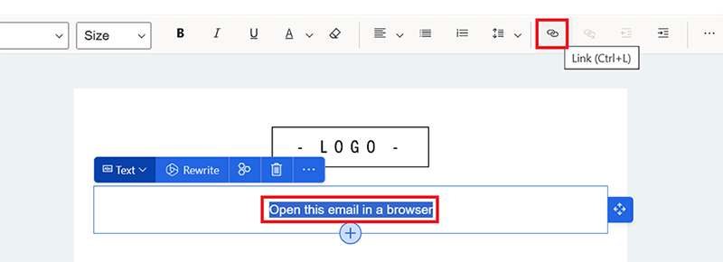
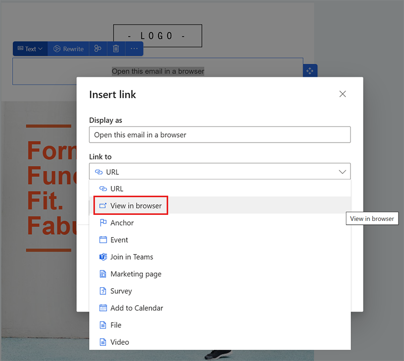

# Enhance email engagement by allowing browser viewing

You can add a link to allow customers to view your emails in a web browser. This enables customers to see emails exactly as you created them, improving their experience and making your marketing campaigns more effective. 

View in browser is a general setting that is disabled by default.

> [!NOTE]
> View in browser links are only functional when you send emails to your **contacts**, **leads**, or **Customer Insights - Data Profiles** through journeys.

## Enable view in browser

1. Go to **Settings** and select **Feature switches**. 
1. Enable the **View in browser** feature toggle in the **Email editor** section.
 
   > [!div class="mx-imgBorder"]
   > 

## How to use view in browser

1. In the email editor, you can freely name the text that you want to function as a link to view the email in a browser. Highlight the text you want to use and select the **Link** icon.
 
   > [!div class="mx-imgBorder"]
   > 

1. In the **Insert link** pop-up, expand the **Link to** dropdown menu and select **View in browser**.
 
   > [!div class="mx-imgBorder"]
   > 

[!INCLUDE[footer-include](./includes/footer-banner.md)]
