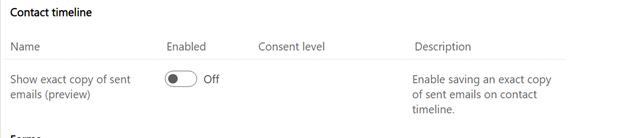
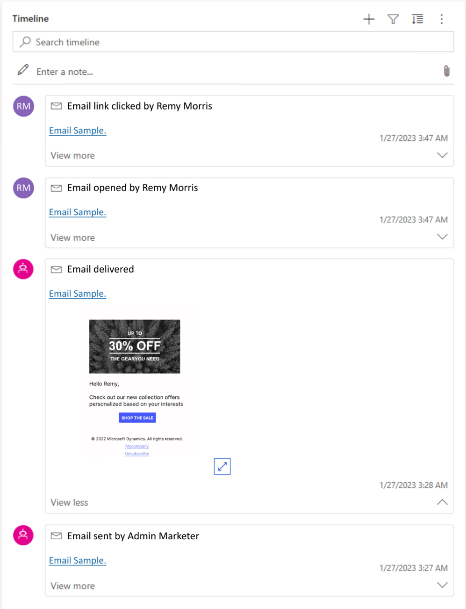

# Reference copies of sent emails in the interaction timeline

You can view an exact copy of sent emails on your contact and lead interaction timelines to deepen your customer understanding and have visibility into what's been previously shared with your customers. Email copies are available for one year on the interaction timeline.

## Enable viewing emails on the interaction timeline

1. Go to **Settings** and select **Feature switches**.
1. Enable the **Show exact copy of sent emails** feature toggle in the **Contact timeline** section.
   > [!div class="mx-imgBorder"]
   > 

## How to view emails on the interaction timeline

1. From the left navigation bar, select **Contacts** or **Leads**.
1. Choose the contact or lead where you want to view previously sent emails.
1. On the **Timeline** (the center tile on the **Summary** tab), you can see all previous interactions, including exact copies of the sent emails.
   > [!div class="mx-imgBorder"]
   > 
