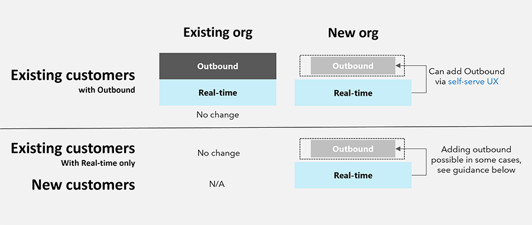
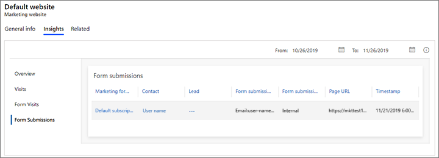

# What's new archive for Dynamics 365 Customer Insights - Journeys

This article contains archived information about new features, improvements, and bug fixes from previous years. This article is not maintained and is saved for historical reference purposes.

## 2024 updates

### December 2024 update

| App              | GA release      |
|------------------|-----------------|
| Customer Insights - Journeys        | 1.1.51539.118   |

#### General availability

- **Boost participation, simplify planning with session-based registrations** 
    - Event attendees can register for specific sessions in a multi-session event to ensure their event experience is relevant to their interests. With session registration data, you’ll be able to identify which sessions have the highest demand and tailor post-event follow-ups based on session participation.
    - [Release plan](/dynamics365/release-plan/2024wave2/customer-insights/dynamics365-customer-insights-journeys/boost-participation-simplify-planning-session-based-event-registrations) 
    - [Docs](real-time-journeys-event-session.md)  

- **Easily deliver a common experience to multiple audiences with a single journey** 
    - Reuse existing segments to deliver a common experience in a single journey – no need to create a new segment for the combined audience. If you already have segments for different purposes, you can easily create many different audiences by using one or more of them in a journey. There's no need to create another segment from scratch, combine existing segments into a composite segment, or make multiple copies of the same journeys. Specifying multiple segments is not only straightforward and efficient but also enables you to create different audiences quickly (no need to get the segment creation role or wait on other team members to create a segment for you). Additionally, it reduces the number of segments that need maintenance or cleanup later and doesn't add to the overall segment limit.
    - [Docs](real-time-marketing-segment-based-journey.md#set-the-journey-start)  

#### Public preview

- **Understand customer inflows and exits at every journey step** 
    - It’s critical to understand exactly what happened to each customer who entered and exited your real-time journeys. With improved journey analytics, you’ll gain confidence in the processing of every step in your journey through improved metrics and an increased ability to export data. For example, if your journey uses exit or exclusion segments, you'll be able to see and understand why fewer customers started your journey than were in the entry segment. You'll also be able to see the list of customers who entered and exited each step in the journey and export lists of up to 50,000 people for further analysis. 
    - [Release plan](/dynamics365/release-plan/2024wave2/customer-insights/dynamics365-customer-insights-journeys/confidently-understand-customer-inflows-exits-at-every-step-journey)
    - [Docs](real-time-marketing-analytics.md#journey-operational-analytics)

    :::image type="content" source="media/tile-analytics-release-planner.png" alt-text="Analytics shows you customer inflow and exit data at each step in the journey." lightbox="media/tile-analytics-release-planner.png":::
    
- **Personalize messages and make journey decisions based on web interactions** 
    - With Customer Insights - Journeys, you can now track and leverage your customers’ online behavior to deliver personalized experiences across your digital channels. For example, you can boost conversions and customer loyalty by sending tailored offers after customers visit your website and show interest in a product or service. By tracking additional data about customers' online journeys, you can get valuable insights into your customers' preferences and needs and easily measure your campaign’s effectiveness.
    - [Release plan](/dynamics365/release-plan/2024wave2/customer-insights/dynamics365-customer-insights-journeys/engage-customers-personalized-messages-based-website-interactions) 
    - [Docs](interaction-journey-decision.md) 

    :::image type="content" source="media/event-portal.png" alt-text="Create event portal with Power Pages." lightbox="media/event-portal.png":::
    
- **Generate leads that link to an existing contact** 
    - Your business has unique ways of organizing customer data and classifying potential leads. Now with real-time journey forms, you can manage your contacts and leads more effectively, according to your company's established processes. For example, you can recognize existing customers who fill out a lead form, so they're not mistaken for new leads.With this new set of capabilities to connect lead and contact data, you can choose how existing contact or lead details should be updated and define advanced matching rules to prevent duplicate records. Additionally, you can set defaults so everything is already configured each time a new form is created. All these new capabilities allow you to fine-tune how form data is handled to provide better quality leads and match your company's established processes.
    - [Release plan](/dynamics365/release-plan/2024wave2/customer-insights/dynamics365-customer-insights-journeys/generate-leads-that-link-existing-contact) 
    - [Docs](real-time-marketing-manage-forms.md#parent-contact-for-lead)

    :::image type="content" source="media/feature-release.png" alt-text="Generate leads that link to an existing contact." lightbox="media/feature-release.png":::
    
#### Monthly enhancements

- **Protect your forms with reCAPTCHA**
    - Protecting your forms against bot attacks and malicious actors is crucial to ensure the quality of captured data. You can now leverage the new Customer Insights - Journeys reCAPTCHA plugin and simplified setup to integrate reCAPTCHA into your forms.
    - [Docs](real-time-marketing-form-custom-captcha.md)

- **Form with new layout structure improving accessibility and responsiveness**
    - All newly created Customer Insights - Journeys forms have a new layout structure which no longer relies on the tables. This feature comes disabled by default. You can enable it in the feature switches.

- **Streamline segment management with the ability to stop live segments**
    - Marketers can now stop segments that are in a live state, eliminating the need for cumbersome workarounds like deleting the segment—risking loss of segment definitions—or leaving it in a draft state, which creates confusion about its usability. This capability enhances segment management by allowing marketers and admins to clearly distinguish between segments actively in use and those paused for adjustments. It reduces the risk of errors, such as using incorrect segments in journeys, and provides greater transparency and control over the segment catalog. By simplifying segment status management, this feature supports cleaner workflows, better organization, and more confident decision-making in audience targeting.

#### New blogs and scenario docs

Learn how to make the most of the new Dynamics 365 Customer Insights features in our latest blogs and scenario docs:

- [Optimize your email marketing campaigns with advanced analytics features - Microsoft Dynamics 365 Blog](https://www.microsoft.com/en-us/dynamics-365/blog/it-professional/2024/12/02/optimize-your-email-marketing-with-advanced-analytics-features/)
- [Import contacts from excel to create segments in RTM – FastTrack blog](https://community.dynamics.com/blogs/post/?postid=cc6aa275-47a3-ef11-8a69-7c1e52481105))
- [LinkedIn Lead Sync Integration with Dynamics 365 Customer Insights – Journeys – FastTrack blog](https://community.dynamics.com/blogs/post/?postid=fb6ed89f-67a1-ef11-8a69-7c1e520b1f9b)
- [Transition Customer Voice responses](transition-walkthrough-customer-voice.md)

### November 2024 update

| App              | GA release      |
|------------------|-----------------|
| Customer Insights - Journeys        |  1.1.50062.76  |

#### General availability

- **Split audience into groups to deliver unique customer experiences** 
    - When you want customers to have different experiences in one journey, you need to divide them into groups. While this is possible today using attribute branches or segments, sometimes the number of customers in each branch is more important than what those customers have in common. For example, you may want to send a survey out to a random subset of your customers for feedback, something that would be time-consuming to configure today. The new journey split tile allows you to split your audience into branches to provide a subset of your audience with unique experiences, whether that be a survey, a new type of experience to test, or a first-come promotional offer. You can split your audience by percentages (for cases where you need randomness) or by numbers (for cases where you want to deliver specific experiences to a set number of people). 
    - [Release plan](/dynamics365/release-plan/2024wave2/customer-insights/dynamics365-customer-insights-journeys/provide-varied-experiences-one-journey-using-journey-split-tiles) 
    - [Docs](real-time-marketing-split-audience.md)
    
    :::image type="content" source="media/split-percentage-nov.png" alt-text="Split journey audience by percentage." lightbox="media/split-percentage-nov.png":::

- **Improve engagement and compliance with double opt-in**
    - By implementing double opt-in, you can cultivate a more effective email marketing strategy, leading to improved compliance, increased open and click-through rates, and a better overall brand experience for subscribers. Privacy and data protection laws in many regions require double opt-in functionality to help verify customer information. Double opt-in requires users to confirm subscription preferences through a follow-up email after the initial subscription. By confirming subscription preferences a second time, you comply with legal requirements and improve engagement by ensuring that users who’ve subscribed are intent on receiving future communications. When customers are certain they want to receive email communications, spam complaints and bounce rates are reduced, and your sender reputation is improved. You can now configure if the double opt-in email is sent with each form submission or just once for the newly registered customers. 
    - [Release plan](/dynamics365/release-plan/2024wave2/customer-insights/dynamics365-customer-insights-journeys/improve-engagement-compliance-double-opt-in) 
    - [Docs](real-time-marketing-double-opt-in.md)

    :::image type="content" source="media/double-opt-in-nov.png" alt-text="An overview of double opt-in within Customer Insights - Journeys." lightbox="media/double-opt-in-nov.png":::

- **Export segment membership data for offline analysis** 
    - Marketers often need deeper insights and offline access to customer segment data. With this latest enhancement, you can now export segment membership data directly to Excel, supporting up to 100,000 rows per segment. This new capability makes it easier to analyze customer data in your preferred tools without the need for complex integrations or manual data handling. Previously, extracting large sets of data from segments required cumbersome workarounds. Now, you can seamlessly export detailed segment data for offline analysis and verification, enhancing your ability to make data-driven decisions. The export feature is available for segments with up to 100,000 members and includes a predefined set of columns: Contact/Lead ID, First Name, Last Name, Email, and Phone Number. This streamlined export ensures consistency and accuracy in your data analysis while maintaining simplicity. Custom columns or attributes aren't supported at this time.

     :::image type="content" source="media/export-segment-membership.png" alt-text="An overview exporting segment membership data for offline analysis within Customer Insights - Journeys." lightbox="media/export-segment-membership.png":::

#### Monthly enhancements

- **Flexible enforcement model for text and custom channels**
    - The enforcement model could be selected only for the email channel. With the latest update, you can select restrictive or non-restrictive enforcement model for text (SMS) and custom channels.
    - [Docs](real-time-marketing-compliance-settings.md#consent-enforcement)  

#### New blogs and scenario docs

Learn how to make the most of the new Dynamics 365 Customer Insights features in our latest blogs and scenario docs:

- [Implementing cascading dropdown fields in RTM forms - FastTrack blog](https://community.dynamics.com/blogs/post/?postid=ff86d88f-d892-ef11-ac21-6045bdd7e1ae)
- [Beyond open rate: Rethinking email marketing metrics - Microsoft Dynamics 365 blog](https://www.microsoft.com/dynamics-365/blog/it-professional/2024/10/16/rethinking-email-metrics-the-evolving-landscape-of-open-rates/)

### October 2024 update

| App              | GA release      |
|------------------|-----------------|
| Customer Insights - Journeys        |  1.1.49129.84   |

> [!IMPORTANT]
> Starting on October 10, 2024, changes to link functionality affect the following areas:
> - **Link tracking**: Links in messages that were sent more than six months prior no longer produce tracking results, but otherwise function correctly. Links in messages sent less than six months prior continue to generate tracking analytics.
> - **Text messages**: URLs sent in SMS messages expire six months after the message is sent and no longer work.
> - **Unsubscribe links**: Unsubscribe links expire six months after the link is created and no longer work.

#### Public preview

- **Understand customer inflows and exits at every journey step**
    - It’s critical to understand exactly what happened to each customer who entered and exited your real-time journeys. With improved journey analytics, you’ll gain confidence in the processing of every step in your journey through improved metrics and an increased ability to export data. For example, if your journey uses exit or exclusion segments, you'll be able to see and understand why fewer customers started your journey than were in the entry segment. You'll also be able to see the list of customers who entered and exited each step in the journey and export lists of up to 50,000 people for further analysis. (This preview will be available in all geos by December 16, 2024.)
    - [Release plan](/dynamics365/release-plan/2024wave2/customer-insights/dynamics365-customer-insights-journeys/confidently-understand-customer-inflows-exits-at-every-step-journey)
    - [Docs](real-time-marketing-analytics.md#journey-operational-analytics)
    
    :::image type="content" source="media/operational-analytics-1.png" alt-text="An overview of customer inflow, processed, and exit analytics." lightbox="media/operational-analytics-1.png":::

- **Get insights on email engagement with heatmap analytics**
    - Understanding the effectiveness of email campaigns can often be complex, particularly when information and links are abundant. Gaining clarity on which areas or links captivate your audience and drive them to act is crucial for refining the user experience and boosting email performance. Real-time journeys email insights now offer a clear view of your audience's preferences by illustrating their interactions within your emails. This immediate visual feedback highlights the content that resonates the most, empowering you to adjust your messaging for heightened impact and better conversion rates.
    - [Release plan](/dynamics365/release-plan/2024wave2/customer-insights/dynamics365-customer-insights-journeys/get-insights-email-engagement-heatmap-analytics)
    - [Docs](email-insights.md)

#### Monthly enhancements

- **Easily engage multiple audiences in a single journey with multiple segments**
    - If you already have created specific segments for different purposes and need to reach some or all of them, you can now easily do so by specifying multiple segments for a journey. There's no need to create another segment from scratch, combine existing segments into a composite one, or make multiple copies of the same journeys. Specifying multiple segments is not only straightforward and efficient but also enables marketers without segment creation roles to engage multiple audiences without waiting for a new segment to be created. Additionally, it reduces the number of segments that need maintenance or cleanup and does not add to the overall segment limit. 
        > [!NOTE]
        > All segments should be of the same entity, either leads or contacts or profiles. You can already specify multiple segments as exit segments or exclusion segments. This enhancement extends the ability to specify multiple segments to start a journey. Outbound marketing segments can't be used when specifying multiple segments.
    - [Docs](real-time-marketing-segment-based-journey.md#set-the-journey-start)
    
    :::image type="content" source="media/select-segment-journey.png" alt-text="Engage multiple audiences in a single journey with multiple segments." lightbox="media/select-segment-journey.png":::

#### New blogs and scenario docs

Learn how to make the most of the new Dynamics 365 Customer Insights features in our latest blogs and scenario docs:

- [Customizable error messages for form field validation - FastTrack blog](https://community.dynamics.com/blogs/post/?postid=cdcd1dbf-2b7f-ef11-ac20-7c1e521a63a7)

### September 2024 update

#### Version number

| App              | GA release      |
|------------------|-----------------|
| Customer Insights - Journeys        |   1.1.48225.52   |

> [!IMPORTANT]
> Starting on October 10, 2024, changes to link functionality will affect the following areas:
> - **Link tracking**: Links in messages that were sent more than six months prior will no longer produce tracking results, but will otherwise function correctly. Links in messages sent less than six months prior will continue to generate tracking analytics.
> - **Text messages**: URLs sent in SMS messages will expire six months after the message is sent and will no longer work.
> - **Unsubscribe links**: Unsubscribe links will expire six months after the link is created and will no longer work.

#### Public preview

- **Refine email content in running journeys**
    - To maximize customer engagement, it's crucial for customer experience teams to regularly refine email content, ensuring that communication remains current, relevant, and impactful. You can now easily edit content, layout, links, buttons, or dynamic content in your email messages while a journey is running—without creating a new version or interrupting the customer experience. Changing email messages in live journey gives you more freedom and power over your email marketing campaigns and helps you to respond to changing business or customer needs.
    - [Release plan](/dynamics365/release-plan/2024wave1/customer-insights/dynamics365-customer-insights-journeys/improve-engagement-editing-emails-live-journeys)
    - [Docs](edit-email-in-live-journey.md)

- **Streamline form filling and event registration with form prefill**
    - The repetitive task of filling out forms can be a significant deterrent to event registration. Nobody likes to repeat information that they've already provided. Imagine loyal customers who attend multiple conferences each year having to input their contact information and preferences every time. Form prefill in Dynamics 365 Customer Insights eliminates the need to repeatedly request basic details from your customers, reducing redundancy and saving time. This not only expedites the registration process but also allows for more strategic collection of customer data over time.
    - [Release plan](/dynamics365/release-plan/2024wave2/customer-insights/dynamics365-customer-insights-journeys/form-prefill-simplifies-form-filling-event-sign-up)
    - [Docs](real-time-marketing-form-prefill.md)

- **Control how fast customers can enter a journey**
    - There are times when you want to reach a large audience, but sending a message to the entire audience at the same time would cause problems for your business. With journey rate limiting, you’ll be able to space out message sending over time by setting how quickly you want customers to enter your journey. This feature helps prevent overwhelming downstream operations with a large influx of requests from customers who receive messages from your journey. For example, let's say you have a journey that sends messages to your entire customer base with a call to action to contact your call center. You may want to avoid creating a poor customer experience due to long wait times from an overwhelmed help desk if you send messages at the same time to everyone. Instead, you can now slow down how fast customers enter the journey, avoiding thousands of phone calls at the same time.
    - [Release plan](/dynamics365/release-plan/2024wave1/customer-insights/dynamics365-customer-insights-journeys/improve-customer-experience-controlling-how-fast-customers-enter-journey)
    - [Docs](control-how-fast-enter-journey.md)

#### Monthly enhancements

- **Queued messages are not sent when journey is stopped**
    - When a journey is stopped, you now see an immediate change in the journey state to “Stopping.” This assures that your request was received and is being processed. Furthermore, if your messages are still pending in the send queue (this can happen when there is high volume of messages), such messages will now be removed immediately and will not be sent. This avoids a situation where messages continue to be delivered even though the journey has been stopped.
    - [Docs](journeys-overview.md)

- **Maximize email engagement and optimize content with link insights**
    - Link insights in real-time journeys allow you to analyze the performance of individual links in your emails. You can now view key metrics such as click rate and unique clicks per link and easily compare the performance of each link within your email campaigns. Use this data to optimize your content, improve engagement, and make more informed decisions to drive better results.
    - [Docs](real-time-marketing-analytics.md)

<!---

- **Outbound marketing removal notification and ability to hide outbound**
    - In-product banners are now shown to all users to inform them that Outbound marketing will be removed as of June 30th, 2025 and that social posting and LinkedIn lead generation will be removed as of Dec 2nd, 2024. We also added a highly visible card in the Settings > Versions page that talks about moving to real-time and now provide a button that can be used to hide outbound from the site map once the transition is complete.
    - [Docs]()

-->

### August 2024 update

There is no Dynamics 365 Customer Insights - Journeys release for August. We will be back in September with new feature improvements, updates, and bug fixes.

### July 2024 update

#### Version number

| App              | GA release      |
|------------------|-----------------|
| Customer Insights - Journeys        |  1.1.46046.74   |

#### General availability

- **Build custom reports using Microsoft Fabric integration**
    - In today's data-driven world, marketers face the challenge of gaining a comprehensive view of their campaigns to make informed decisions. Each business has unique needs and requirements for aggregating data from various sources. While Dynamics 365 Customer Insights - Journeys already offers powerful out-of-the-box reports, the app also offers additional custom reporting capabilities to address your unique scenarios. Now in real-time journeys, you can effortlessly create custom Power BI reports tailored to your business needs by leveraging Microsoft Fabric capabilities. Harness seamless access to data to gain a complete understanding of your campaigns, lead management, market performance, and customer engagement, enabling you to identify new opportunities.
    - [Release plan](/dynamics365/release-plan/2024wave1/customer-insights/dynamics365-customer-insights-journeys/build-custom-reports-using-fabric-integration)
    - [Docs](fabric-integration.md)

- **Improve reliability of insights with advanced bot protection**
    - Ensuring the integrity of your data and the efficiency of your operations is paramount. Advanced bot protection in Customer Insights - Journeys empowers your business to thrive by safeguarding your business processes. Improve your business decisions with the confidence of knowing that the data you collect is accurate and represents real human interactions. With bot protection, you not only enhance the quality of your insights but also elevate the customer experience by minimizing disruptions caused by malicious bots.
    - [Release plan](/dynamics365/release-plan/2024wave1/customer-insights/dynamics365-customer-insights-journeys/improve-reliability-insights-advanced-bot-protection)
    - [Docs](bot-protection.md)

- **Optimize email content based on customer behavior across devices**
    - In real-time journeys email insights, you can now delve into comprehensive device data, including operating systems, browsers, device types, and email clients. Leverage the power of detailed engagement analysis across different platforms to fine-tune your marketing strategy. Tailor your email's design and content to align with the devices most used by your audience, ensuring seamless readability for your messages and, ultimately, leading to heightened customer interaction and loyalty.
    - [Release plan](/dynamics365/release-plan/2024wave1/customer-insights/dynamics365-customer-insights-journeys/increase-email-engagement-optimizing-content-based-customers-behavior-across-devices)
    - [Docs](real-time-marketing-analytics.md#email-insights)

#### Public preview

- **Improve engagement and compliance with double opt-in**
    - Privacy and data protection laws in many regions require double opt-in functionality to help verify customer information. Double opt-in requires users to confirm subscription preferences through a follow-up email after the initial subscription. By confirming subscription preferences a second time, you comply with legal requirements and improve engagement by ensuring that users who’ve subscribed are intent on receiving future communications. When customers are certain they want to receive email communications, spam complaints and bounce rates are reduced, and your sender reputation is improved.
    - [Release plan](/dynamics365/release-plan/2024wave1/customer-insights/dynamics365-customer-insights-journeys/improve-engagement-compliance-double-opt-in)
    - [Docs](real-time-marketing-double-opt-in.md)

- **Split your audience into groups to deliver unique customer experiences**
    - When you want customers to have different experiences in one journey, you need to divide them into groups. While this is possible today using attribute branches or segments, sometimes the number of customers in each branch is more important than what those customers have in common. For example, you may want to send a survey out to a random subset of your customers for feedback, something that would be time-consuming to configure today. The new journey split tile allows you to split your audience into branches to provide a subset of your audience with unique experiences, whether that be a survey, a new type of experience to test, or a first-come promotional offer. You can split your audience by percentages (for cases where you need randomness) or by numbers (for cases where you want to deliver specific experiences to a set number of people).
    - [Release plan](/dynamics365/release-plan/2024wave1/customer-insights/dynamics365-customer-insights-journeys/provide-varied-experiences-one-journey-using-journey-split-tiles)
    - [Docs](real-time-marketing-split-audience.md)

#### Monthly enhancements

- **Optimize your email content with enhanced insights for conditional content variations**
    - You can now effortlessly compare the performance of different email variants using conditional content within real-time journeys. Gain valuable insights into key metrics such as open rates, click rates, and unique clicks for each conditional content variant, enabling you to identify what resonates best with your audience. Optimize your email campaigns by leveraging data-driven decisions to improve engagement and drive better results.
    - [Docs](real-time-marketing-analytics.md#email-insights)

### June 2024 update

#### Version number

| App              | GA release      |
|------------------|-----------------|
| Customer Insights - Journeys        |   1.1.43992.110   |

> [!NOTE]
> On July 1, 2024, active journeys in the real-time journeys area that were created on or before May 5, 2022 will stop working. To avoid disruption, follow the steps outlined in the [Known issues for journeys](journey-known-issues.md#steps-to-avoid-journey-disruption) article before July 1, 2024.

> [!IMPORTANT]
> After July 30, 2024, custom workflows that *write* to the **msdynmkt_contactpointconsent2** or **msdynmkt_contactpointconsent3** consent tables will no longer automatically have data synced to the latest **msdynmkt_contactpointconsent4** table. To ensure continued functionality of custom workflows, update the workflows to write to the **msdynmkt_contactpointconsent4** table *before* July 30.

> [!NOTE]
> Double opt-in for real-time journeys is not included in the June release. It's projected to roll out in a future release, likely in late July.

#### General availability

- **Easily manage customer consent from contact and lead forms**
    - Enhanced contact and lead forms allow you to quickly see and update customer consent, helping you effortlessly manage what types of messages are sent to your customers. This comprehensive view gives you one place to manage consent across every channel and line of business for your organization. Quickly see if a customer has opted out of all commercial communication from your business. Explore which topics a contact has opted into or out of receiving across all channels: email, text, and custom channels. Get a complete understanding of each contact and lead's consent preferences in one easy-to-use screen.
    - [Release plan](/dynamics365/release-plan/2024wave1/customer-insights/dynamics365-customer-insights-journeys/easily-manage-customer-consent-contact-lead-forms)
    - [Docs](real-time-marketing-email-text-consent.md#view-and-manage-consent-records)

#### Monthly enhancements

- **Pre-set country code for your phone number form fields**
    - Simplify the experience of entering the phone number into form by pre-setting the right country code. Once the code is pre-set, form submissions will no longer fail if wrong phone number format was entered.
    - [Docs](real-time-marketing-manage-forms.md#pre-set-phone-number-country-code)

#### New blogs and scenario docs

Learn how to make the most of the new Dynamics 365 Customer Insights features in our latest blogs and scenario docs:

- [Announcing unlimited application installs in Dynamics 365 Customer Insights - Microsoft Dynamics 365 blog](https://www.microsoft.com/dynamics-365/blog/it-professional/2024/06/18/announcing-unlimited-application-installs-in-dynamics-365-customer-insights/)

### May 2024 update

#### Version number

| App              | GA release      |
|------------------|-----------------|
| Customer Insights - Journeys        |   1.1.41881.62    |

> [!NOTE]
> On July 1, 2024, active journeys in the real-time journeys area that were created on or before May 5, 2022 will stop working. To avoid disruption, follow the steps outlined in the [Known issues for journeys](journey-known-issues.md#steps-to-avoid-journey-disruption) article before July 1, 2024.

#### General availability

- **Ensure messages go to the right contact email address**
    - It's critical that your messages are delivered by the right channel at the right time. Often, you'll need to pick the correct email address among the several you may have for a contact. Now you can choose which of a contact’s email addresses to target in your journeys. For example, some email messages may be more appropriate for a contact’s work email address, whereas others may best target a personal email address. Now, you have full control over which email address to send email messages to, enabling you to reach your customers where they’re most likely to see your messages and take action.
    - [Release plan](/dynamics365/release-plan/2024wave1/customer-insights/dynamics365-customer-insights-journeys/ensure-messages-go-right-contact-email-address)
    - [Docs](real-time-marketing-audience-data.md#change-your-audience-configuration)

#### Monthly enhancements

- **Real-time journey segment membership**
    - Fixed an issue that causes inflated segment membership for some segments that use three or more entities and have repeating data in the columns.
This fix makes the membership data for those segments accurate, thus showing a lower count than before.
- **Real-time journeys now respect daylight savings time**
    - Recurring journeys that are scheduled to run repeatedly at a future date and time now adjust their schedules so that they are run at the expected time. For example, if you have a daily journey that runs at 9:00 AM in the Pacific Time Zone, that journey will continue to run at 9:00 AM after the next daylight savings time change. Before this fix, the journey would have run at 8:00 AM (or 10:00 AM), depending on the direction of the daylight savings time change.

#### New blogs and scenario docs

Learn how to make the most of the new Dynamics 365 Customer Insights features in our latest blogs and scenario docs:

- [Revolutionizing marketing workflows with Copilot in Dynamics 365 Customer Insights - Microsoft Dynamics 365 blog](https://cloudblogs.microsoft.com/dynamics365/bdm/2024/04/02/revolutionizing-marketing-workflows-with-copilot-in-dynamics-365-customer-insights/)

### April 2024 update

#### Version number

| App              | GA release      |
|------------------|-----------------|
| Customer Insights - Journeys        |   1.1.40197.68    |

> [!NOTE]
> On July 1, 2024, active journeys in the real-time journeys area that were created on or before May 5, 2022 will stop working. To avoid disruption, follow the steps outlined in the [Known issues for journeys](journey-known-issues.md#steps-to-avoid-journey-disruption) article before July 1, 2024.

#### General availability

- **Easily reference copies of sent emails in the timeline**
    - Understanding your company's customer interactions is key to improving your customer experience. Now you can deepen customer understanding by viewing exact copies of sent emails, allowing you to build more personalized experiences. Reviewing sent emails improves your overall visibility, compliance, and auditing.
    - [Release plan](/dynamics365/release-plan/2024wave1/customer-insights/dynamics365-customer-insights-journeys/easily-reference-copies-sent-emails-timeline)
    - [Docs](view-previously-sent-emails.md)

- **Capture responses from external, third-party forms**
    - Maximize the potential of your external custom-built forms and generate more leads and contacts for your business without the need to recreate them in real-time journeys. Capture submissions from any third-party form on your website and automatically create new leads or contacts in real-time journeys. This empowers you to better understand your audience, target them more accurately, and follow up effectively.
    - [Release plan](/dynamics365/release-plan/2024wave1/customer-insights/dynamics365-customer-insights-journeys/capture-responses-external-third-party-forms)
    - [Docs](real-time-marketing-form-capture.md)

#### Public preview

- **Take campaigns from concept to launch using Copilot**
    - Defining campaigns and creating high-performing assets to achieve campaign goals can be a time-consuming and difficult task. Now, Copilot transforms the way you create campaigns, enhancing your productivity. To create a campaign, describe the outcomes you're looking to drive or provide a creative brief. Copilot leverages the power of data and AI to generate audiences, content, images, journeys, and more, allowing you to curate, edit, and launch your project in record time. You'll save countless hours by using Copilot to create a connected solution that you can update to achieve the goals that you've defined. Rest assured that you'll always be in the loop to refine, approve, and complete the campaign before it goes out to your customers.
    > [!NOTE]
    > The public preview is rolling out in phases, starting with selected customers who signed up previously. Sign up [here](https://adoption.microsoft.com/dynamics-365/customer-insights/) to get access as the preview program is expanded.
    - [Release plan](/dynamics365/release-plan/2024wave1/customer-insights/dynamics365-customer-insights-journeys/take-campaigns-concept-launch-using-copilot)

- **Improve reliability of insights with advanced bot protection**
    - In today’s world, ensuring the integrity of your data and the efficiency of your operations is paramount. Advanced bot protection in Customer Insights - Journeys empowers your business to thrive by safeguarding your business processes. Improve your business decisions with the confidence of knowing that the data you collect is accurate and represents real human interactions. With bot protection, you not only enhance the quality of your insights but also elevate the customer experience by minimizing disruptions caused by malicious bots.
    - [Release plan](/dynamics365/release-plan/2024wave1/customer-insights/dynamics365-customer-insights-journeys/improve-reliability-insights-advanced-bot-protection)
    - [Docs](bot-protection.md)

#### Monthly enhancements

- **Email editor**
    - Email spam score is now available in real-time journeys, even when outbound marketing isn’t present (real-time journeys-only environments). Previously, spam score in real-time journeys was only available in mixed configurations (outbound marketing + real-time journeys).

#### New blogs and scenario docs

Learn how to make the most of the new Dynamics 365 Customer Insights features in our latest blogs and scenario docs:

- [Revolutionizing marketing workflows with Copilot in Dynamics 365 Customer Insights - Microsoft Dynamics 365 blog](https://cloudblogs.microsoft.com/dynamics365/bdm/2024/04/02/revolutionizing-marketing-workflows-with-copilot-in-dynamics-365-customer-insights/)
- [Journey and email approval process in Customer Insights - Journeys (FastTrack blog)](https://community.dynamics.com/blogs/post/?postid=e2f9169d-eef7-ee11-a73d-000d3ae2664e)

### March 2024 update

#### Version number

| App              | GA release      |
|------------------|-----------------|
| Customer Insights - Journeys        |   1.1.38813.71    |

> [!IMPORTANT]
> Starting on April 15, 2024, changes to link functionality will affect the following areas:
>
> - **Link tracking**: Links in messages that were sent more than one year prior will no longer produce tracking results, but will otherwise function correctly. Links in messages sent less than one year prior will continue to generate tracking analytics.
> - **Text messages**: URLs sent in SMS messages will expire one year after the message is sent and will no longer work.
> - **Unsubscribe links**: Unsubscribe links will expire one year after the link is created and will no longer work.

> [!NOTE]
> On July 1, 2024, active journeys in the real-time journeys area that were created on or before May 5, 2022 will stop working. To avoid disruption, follow the steps outlined in the [Known issues for journeys](journey-known-issues.md#steps-to-avoid-journey-disruption) article before July 1, 2024.

#### Public preview

- **Receive in-app task assistance from Copilot**
    - Use Copilot to receive timely in-app guidance in everyday language. You can also ask questions, which Copilot answers with reference to the Dynamics 365 Customer Insights - Journeys documentation.
    - [Release plan](/dynamics365/release-plan/2023wave2/marketing/dynamics365-marketing/receive-in-app-task-assistance-copilot)
    - [Docs](faqs-copilot-general.md)

- **Easily manage customer consent from contact and lead forms**
    - Enhanced contact and lead forms enable you to quickly see and update a customer's consent, helping you effortlessly manage which types of messages are sent to your customers. This comprehensive view gives you a single place to manage consent across every channel and line of business for your organization. See if a customer has opted out of all commercial communication from your business. Explore which topics a contact has opted in or out of receiving across all channels: email, text, and custom channels. Get a complete understanding of each contact and lead's consent preferences in one easy-to-use screen.
    - [Release plan](/dynamics365/release-plan/2023wave2/marketing/dynamics365-marketing/easily-manage-customer-consent-contact-lead-forms)
    - [Docs](real-time-marketing-email-text-consent.md#view-and-manage-consent-records)

- **Build custom reports using Microsoft Fabric integration**
    - In today's data-driven world, marketers face the challenge of gaining a comprehensive view of their campaigns to make informed decisions. Each business has unique needs and requirements for aggregating data from various sources. While Dynamics 365 Customer Insights - Journeys already offers powerful out-of-the-box reports, the app also offers additional custom reporting capabilities to address your unique scenarios. Now in real-time journeys, you can effortlessly create custom Power BI reports tailored to your business needs by leveraging Microsoft Fabric capabilities. Harness seamless access to data to gain a complete understanding of your campaigns, lead management, market performance, and customer engagement, enabling you to identify new opportunities.
    - [Release plan](/dynamics365/release-plan/2023wave2/marketing/dynamics365-marketing/effortlessly-build-custom-reports-tailored-business-needs-using-fabric-integration)
    - [Docs](fabric-integration.md)

#### Monthly enhancements

- **Email editor**
    - Accurately preview your real-time journeys emails in a wide variety of target email clients and platforms with Litmus integration.

#### New blogs and scenario docs

Learn how to make the most of the new Dynamics 365 Customer Insights features in our latest blogs and scenario docs:

- [What you need to know about the event portal in Customer Insights – Journeys (FastTrack blog)](https://community.dynamics.com/blogs/post/?postid=9eef0126-bbbb-ee11-92bd-6045bdb56f43)
- [Understanding email variation in Customer Insights - Journeys (FastTrack blog)](https://community.dynamics.com/blogs/post/?postid=adfbe765-9dca-ee11-92bd-000d3a01c528)

### February 2024 update

#### Version number

| App              | GA release      |
|------------------|-----------------|
| Customer Insights - Journeys        |   1.1.37290.59    |

#### General availability

- **Stay compliant with one-click unsubscribe for emails**
    - One-click unsubscribe keeps you compliant with new requirements from Google and Yahoo for bulk email senders. Making it easy to unsubscribe from your messages in a single click improves your reputation as a brand and as an email sender. When combined with real-time journey consent topics, one-click unsubscribe encourages your customers to stay subscribed to your other commercial emails while unsubscribing from a single topic. Letting customers opt out easily can improve open rates, click-through rates, and ensure that your messages are less likely to be marked as spam.
    - [Release plan](/dynamics365/release-plan/2023wave2/marketing/dynamics365-marketing/stay-compliant-one-click-unsubscribe-emails)
    - [Docs](one-click-unsubscribe.md)

#### Public preview

- **Streamline email creation with real-time HTML edits**
    - Easily customize emails in Dynamics 365 Customer Insights - Journeys with the ability to toggle back and forth between the visual editor and HTML code. Get more control over how you display information by marking the code and seeing how it renders across devices and email clients.
    - [Release plan](/dynamics365/release-plan/2023wave2/marketing/dynamics365-marketing/streamline-email-creation-real-time-html-edits)
    - [Docs](email-creation-with-html-edits.md)

- **Boost participation and simplify planning with session-based event registrations**
    - Event attendees can register for specific sessions in a multi-session event to ensure their event experience is relevant to their interests. You’ll be able to identify which sessions have the highest demand and tailor post-event follow-ups based on session participation.
    - [Release plan](/dynamics365/release-plan/2023wave2/marketing/dynamics365-marketing/boost-participation-simplify-planning-session-based-event-registrations)
    - [Docs](real-time-journeys-event-session.md)

- **Ensure messages go to the right contact email address**
    - It's critical that your messages are delivered by the right channel at the right time. Often, you'll need to pick the correct email address among the several you may have for a contact. Now, you can choose which of the contact’s email addresses to target in your journeys. For example, some email messages may be more appropriate for a contact’s work email address, whereas others may best target a personal email address. Now, you have full control over which email address to send email messages to, enabling you to reach your customers where they’re most likely to see your messages and take action.
    - [Release plan](/dynamics365/release-plan/2023wave2/marketing/dynamics365-marketing/ensure-messages-go-right-contact-email-address)
    - [Docs](real-time-marketing-audience-data.md)

#### Monthly enhancements

- **Analytics: Optimize marketing efforts with enhanced channel insights**
    - With the introduction of improved key performance indicators, you can get a deeper understanding of your text, push notification and custom channels effectiveness. You can also access detailed reports on delivery and interaction metrics, export up to 50,000 records of interaction data, and see the profiles of the people who engaged with your messages.
- **Personalization: Dynamic data source for event registration code**
    - Make your life easier and enhance efficiency by using a single event registration confirmation email for many events. Create triggered journeys and design your emails to use the trigger as a data source for dynamic data for event details including a QR code that shows a personalized registration code for the recipient, enabling faster check-ins. You can still use the specific event option, if needed. (Note: this enhancement is available only in real-time journeys. Outbound marketing is still limited to using specific event selected at the design time and hence requires a separate email for each event). Learn more: [Use QR codes for event registration, links to content, or URLs](email-QR-code.md)
- **Quiet times: Change or disable quiet times for a specific message**
    - Change or disable quiet times enforcement on a particular message within a journey to support scenarios when a particular message in a journey should not be subject to regular quiet times settings. You can either pick from alternative quiet times settings that have already been created or disable quiet times enforcement entirely for the message.

#### New blogs and scenario docs

Learn how to make the most of the new Dynamics 365 Customer Insights - Journeys features in our latest blogs and scenario docs:

- [Shaping the future of retail with AI and Dynamics 365 - Microsoft Dynamics 365 blog](https://cloudblogs.microsoft.com/dynamics365/bdm/2024/01/11/shaping-the-future-of-retail-with-ai-and-dynamics-365/)
- [Enhanced data collection and journey personalization with unmapped form fields](https://community.dynamics.com/blogs/post/?postid=3a361b7e-80b0-ee11-92bd-002248527d3d)
- [Transition to real time journeys – the time is now - Microsoft Dynamics 365 blog](https://cloudblogs.microsoft.com/dynamics365/it/2024/01/09/transition-to-real-time-journeys-the-time-is-now/)

### January 2024 update

There is no Dynamics 365 Customer Insights - Journeys release for January. We will be back in February with new feature improvements, updates, and bug fixes.

#### New blogs and scenario docs

Learn how to make the most of the new Dynamics 365 Customer Insights - Journeys features in our latest blogs and scenario docs:

- [Customer Insights quickstart guide](customer-insights-quickstart-guide.md)
- [Transition to real time journeys – the time is now - Microsoft Dynamics 365 Blog](https://cloudblogs.microsoft.com/dynamics365/it/2024/01/09/transition-to-real-time-journeys-the-time-is-now/)

> [!Tip]
> To read about updates from previous years, see the [What's new archive](whats-new-marketing-archive.md) article.

## 2023 updates

### December 2023 update

#### Version number

| App              | GA release      |
|------------------|-----------------|
| Customer Insights - Journeys        |   1.1.35296.75    |

On September 1, 2023, Dynamics 365 Customer Insights - Journeys transitioned to focus on real-time marketing features only. To support this transition, in early August 2023, provisioning of new instances changed in the following ways:

- New customers no longer receive the outbound marketing module. New customers need to contact support to add outbound marketing features.
- Existing customers see the same provisioning change but can add outbound marketing features themselves using a self-serve interface available on the **Settings** > **Versions page**.

 > [!div class="mx-imgBorder"]
 > 

> [!IMPORTANT]
> New requirements from [Google](https://blog.google/products/gmail/gmail-security-authentication-spam-protection) and [Yahoo](https://blog.postmaster.yahooinc.com/post/730172167494483968/more-secure-less-spam) for bulk email senders will go into effect in February 2024 that require emails to support one-click unsubscribe. Dynamics 365 Customer Insights will support this requirement for outbound and real-time journeys. To make use of one-click unsubscribe, you'll need to upgrade to the December 2023 release. A feature switch will become available to enable one-click unsubscribe in January 2024. Communication to administrators in the admin center will be sent once this feature is available.

#### General availability

- **Improve appeal and match brand identity with custom fonts**
    - Create emails that stand out to your customers and convey a consistent brand image. By choosing fonts that align with your style and comply with your identity guidelines, you can also improve email accessibility and readability as well as create content that is consistent across languages, devices, and browsers.
    - [Release plan](/dynamics365/release-plan/2023wave2/marketing/dynamics365-marketing/improve-appeal-match-brand-identity-custom-fonts)
    - [Docs](use-custom-fonts.md)

- **Improve communication timing by setting up quiet times**
    - Quiet time settings ensure that your messages are only sent when you want them to be delivered, increasing engagement and meeting customer expectations. It’s also more important than ever to meet compliance obligations by only contacting your customers when they want to be reached. With quiet times, you can easily prevent messages from being delivered during nights, weekends, or holidays. You can control quiet times separately for different channels and message types as well as create unique settings for each line of business.
    - [Release plan](/dynamics365/release-plan/2023wave2/marketing/dynamics365-marketing/prevent-messages-sending-during-unwanted-times-setting-up-quiet-times-using-copilot)
    - [Docs](real-time-marketing-quiet-times.md)

- **Personalize customer experiences using calculated metrics from Customer Insights - Data**
    - You can already create highly personalized experiences for your customers when you use Customer Insights - Data and Customer Insights - Journeys together by using rich profile data for every customer. Now, you can further augment personalization by using customer measures from Customer Insights - Data and tailoring journeys and content based on loyalty, lifetime value, or any other calculated measure. With such calculated data available seamlessly, you're empowered to deliver experiences such as personalizing offers or levels of service (for example, priority notification ahead of others).
    - [Release plan](/dynamics365/release-plan/2023wave2/marketing/dynamics365-marketing/personalize-customer-experiences-using-calculated-metrics-customer-insights)
    - [Docs](real-time-marketing-predefined-dynamic-text.md#access-even-more-data-for-personalization)

- **Enhance email engagement by allowing browser viewing**
    - Different email providers have different ways of displaying emails. Sometimes this results in missing or distorted content, messy layouts, and a poor customer experience, especially on mobile devices. The option to “View in browser” in real-time journeys allows your customers to see your emails exactly as you created them, improving their experience and making your marketing campaigns more effective. You can also use the link to preview your emails and share them with your team for feedback and approval.
    - [Release plan](/dynamics365/release-plan/2023wave2/marketing/dynamics365-marketing/enhance-email-engagement-allowing-viewing-browsers)
    - [Docs](view-email-in-browser.md)

- **Create segments using unified profiles and calculated metrics from Customer Insights - Data**
    - Customer Insights – Journeys now lets you create highly personalized customer segments using unified profiles and customer measures from Customer Insights - Data. This allows you to use the Customer Insights – Journeys app for even more scenarios without having to use Customer Insights – Data app to create unified profile-based segments. This also ensures that all interaction data is captured against the contact, regardless of whether you use the information from contacts or unified profiles. In a Customer Insights – Journeys environment, unified profiles and customer measures are available when you create a segment of contacts.
    - [Docs](unified-profile-segment-creation.md)

#### Public preview

- **Capture responses from external, third-party forms**
    - Maximize the potential of your external custom-built forms and generate more leads and contacts for your business without the need to recreate them in Customer Insights – Journeys (real-time marketing). You can now capture submissions from any third-party forms on your website and automatically create new leads or contacts in Customer Insights – Journeys. This empowers you to better understand your audience, target them more accurately, and follow up effectively.
    - [Release plan](/dynamics365/release-plan/2023wave2/marketing/dynamics365-marketing/capture-responses-external-third-party-forms)
    - [Docs](real-time-marketing-form-capture.md)

- **Easily reference copies of sent emails in interaction timeline**
    - Understanding your company's customer interactions is key to improving your customer experience. Now you can deepen customer understanding by viewing exact copies of sent emails, allowing you to build more personalized experiences. Reviewing sent emails improves your overall visibility, compliance, and auditing.
    - [Release plan](/dynamics365/release-plan/2023wave2/marketing/dynamics365-marketing/easily-reference-copies-previously-sent-emails-interaction-timeline)
    - [Docs](view-previously-sent-emails.md)

#### Monthly enhancements

- **Remove email addresses from suppression list (preview)**
    - You can utilize the new Communication tab when viewing your contacts to see if the email address is in the suppression list and self-remove it without the need to open a support request. This accelerates the remediation time for you to be able to send emails to these contacts.
    - [Docs](suppression-lists.md)

- **Explore email delivery and engagement trends**
    - In real-time journeys, you can now elevate your understanding of email performance by exploring delivery and engagement trends. Get comprehensive insights into how your audience interacts with your emails over time and track the trajectory of delivery rates, open rates, and click-through rates with precision. Uncover patterns, identify peak engagement periods, and optimize your strategies based on real-time trends.
    - [Docs](real-time-marketing-analytics.md)

- **Easily categorize and find images with automatically generated tags**
    - Thanks to enhanced AI tagging, tags are automatically generated any time you upload images to the Dynamics 365 Customer Insights – Journeys library. Consistent and relevant tagging improves the overall searchability of your assets and makes it easier to find them in the future. 
    - [Docs](upload-images-files.md)

#### New blogs and scenario docs

Learn how to make the most of the new Dynamics 365 Customer Insights - Journeys features in our latest blogs and scenario docs:

- [Moving Pre-defined Dynamic Text in Customer Insights - Journeys](https://community.dynamics.com/blogs/post/?postid=a9a4acbb-af88-ee11-a81c-6045bdafa6f4)
- [Deliver higher-impact experiences with better data quality and configuration with Copilot](https://cloudblogs.microsoft.com/dynamics365/it/2023/11/22/deliver-higher-impact-experiences-with-better-data-quality-and-configuration-with-copilot/)
- [AI-infused personalized customer journeys with Dynamics 365 Customer Insights 2023 release wave 2](https://cloudblogs.microsoft.com/dynamics365/bdm/2023/10/30/ai-infused-personalized-customer-journeys-with-dynamics-365-customer-insights-2023-release-wave-2/)

### October 2023 update

#### Version number

| App              | GA release      |
|------------------|-----------------|
| Customer Insights - Journeys        |   1.1.32267.120     |

On September 1, 2023, Dynamics 365 Customer Insights - Journeys transitioned to focus on real-time marketing features only. To support this transition, in early August 2023, provisioning of new instances changed in the following ways:

- New customers no longer receive the outbound marketing module. New customers need to contact support to add outbound marketing features.
- Existing customers see the same provisioning change but can add outbound marketing features themselves using a self-serve interface available on the **Settings** > **Versions page**.

 > [!div class="mx-imgBorder"]
 > 

#### General availability

- **Get inspired and use Copilot to create engaging emails - globally available in seven languages**
    - Content ideas, a Copilot feature, is now available worldwide in the following languages: Danish, Dutch, English, French, German, Italian, Spanish. Harness the power of content ideas to effortlessly generate captivating emails within minutes simply by providing a few short key points and selecting a desired tone of voice. Additionally, now you can generate ideas with no input required thanks to relevant, pre-filled key points that match your selected email or email template.
    - [Release plan](/dynamics365/release-plan/2023wave2/marketing/dynamics365-marketing/content-ideas-journey-creator-english-all-geos)
    - [Docs](content-ideas.md)

- **Engage customers with text messages sent using Azure Communication Services**
    - Send text messages to customers using your Azure Communication Services SMS subscription, simplifying your operations by using Microsoft’s native SMS provider for all your products. Leverage all the real-time functionalities such as personalization, templates, and analytics, expanding the potential of your Azure Communication Services subscription.
    - [Release plan](/dynamics365/release-plan/2023wave2/marketing/dynamics365-marketing/engage-customers-text-messages-sent-using-azure-communication-services)
    - [Docs](real-time-marketing-outbound-text-messaging.md)

- **Increase engagement using alphanumeric SMS senders**
    - With alphanumeric senders, you can now send one-way text messages to your customers using a custom string of letters or numbers, making it easier for customers to recognize that messages are from a trusted source. By using your brand or company name, you gain brand awareness, increase trust, and ultimately boost the overall effectiveness of your SMS marketing efforts.
    - [Release plan](/dynamics365/release-plan/2023wave2/marketing/dynamics365-marketing/increase-engagement-using-alphanumeric-sms-senders)
    - [Docs](real-time-marketing-outbound-text-messaging.md) 

#### Public preview

- **Improve communication timing by setting up quiet times**
    - Quiet time settings ensure that your messages are only sent when you want them to be delivered, increasing engagement and meeting customer expectations. It’s also more important than ever to meet compliance obligations by only contacting your customers when they want to be reached. With quiet times, you can easily prevent messages from being delivered during nights, weekends, or holidays. You can control quiet times separately for different channels and message types as well as create unique settings for each line of business.
    - [Release plan](/dynamics365/release-plan/2023wave2/marketing/dynamics365-marketing/prevent-messages-sending-during-unwanted-times-setting-up-quiet-times-using-copilot)
    - [Docs](real-time-marketing-quiet-times.md)

- **Create compelling content with Copilot image recommendations**
    - Visual content is critical to capturing your audience’s attention, increasing engagement with your brand, and conveying your message more effectively. However, browsing your library to find meaningful, relevant images for your content can be tedious and time-consuming. Now, a new Copilot assistant automatically identifies a selection of images from your library that best complement your content. Quickly and easily choose images that resonate with your audience without spending time searching.
    - [Release plan](/dynamics365/release-plan/2023wave2/marketing/dynamics365-marketing/create-compelling-content-copilot-image-recommendations)
    - [Docs](upload-images-files.md)

- **Refresh or perfect your messaging with Copilot text editing and rewriting**
    - Creating content that effectively captures your audience's attention is tedious, requiring time-consuming effort to perfect the language and tone of your message. Now, you can rapidly iterate on your content using Copilot to help optimize your messaging. Whether you're creating content for email, text messages, push notifications, or forms, using Copilot, you can easily rephrase messages, adjust the tone of voice, and shorten or lengthen copy, increasing productivity and delivering better results. The content rewrite copilot is currently available in the United States in English language.
    - [Release plan](/dynamics365/release-plan/2023wave2/marketing/dynamics365-marketing/rewrite-change-tone-content-quickly-using-copilot-marketing)
    - [Docs](content-rewrite.md)

- **Use journey copilot to create customer journeys by describing them in your own words**
    - With Dynamics 365 Customer Insights - Journeys, anybody can now create customer journeys in minutes, even when they may have never done it before. Simply describe, in everyday words, what you want to create and rely on Copilot generative AI to build the journey for you. This empowers you to do more with less. Instead of spending time getting the mechanics of the journey right, you can now ensure that you’re delivering the most personalized experience for your customers by collaborating with your entire team and quickly driving stakeholder alignment. Using journey Copilot together with the content ideas copilot assistant for email creation, you can now get your customer experience ideas to market in no time.
    - [Release plan](/dynamics365/release-plan/2023wave2/marketing/dynamics365-marketing/create-customer-journeys-describing-them-own-words-using-copilot)
    - [Docs](real-time-marketing-use-copilot-create-journey.md)

#### Monthly enhancements

**Journeys**
- Allow editing of default journey time zone in real-time journeys-only organizations
    - Organizations that only use real-time journeys can now edit the default time zone used when creating journeys. The default time zone can either be a single time zone across the organization for consistency or it can be set to use the time zone of the user who creates the journey for convenience. To set the default journey time zone, go to **Settings** and open **Journey Settings** in the **Customer engagement** section.
- Enable orchestration of email interaction triggers (email bounced, link clicked, and email blocked)
- Marketers can get a visual preview of the journey generated by Copilot so that they can decide if they are happy with the output

**Email**
- Search through data in email delivery and interaction details
    - In real time journeys, you can now effortlessly search through data in email delivery and interaction details. Search by email enables you to quickly pinpoint specific information within your analytics, making it easier than ever to find the insights that matter most.

**Personalization**
- Communicate clearly and concisely with conditional lists (#if within #each), advanced scope
    - Conditional lists can now be created using conditions on multi-select pick list (for example, pick a specific building our of many)
- Build conditions using data that is related via 1-to-many and many-to-many relationships
    - Conditions now support using data that is reached via 1-to-many or many-to-many relationship. For example, check if billed service units (an attribute of "Case") exceed a threshold for a contact’s most recent case. Previously, such a condition could not be defined because a contact can have multiple cases.

**Admin settings**
- Check the Customer Insights Journeys version and update
    - In the installation management experience, you can now check the version installed for the Customer Insights - Journeys application and update it if a newer version is available.
- Easily enable or disable all AI copilot features using a global opt-in toggle
    - All copilot features can now be enabled at once using one, global toggle, which is turned on by default.
- Non-US users can agree or disagree for cross-geography data flow to use AI copilot features
    - As Azure AI services are currently available only in North America (and Switzerland), all non-US users need to agree allow cross-geography data flow to use Copilot features.

**Security roles**
- Use compliance profiles from any business units in messages and forms
    - The default security roles for business units users have been updated to give permission to all users across the organization to use any compliance profile in real-time journeys emails and forms. If you use these security roles directly, you may want to consider if your users should have this expanded security. If you've created your own user roles, you may want to consider making these changes to enable full access to compliance profiles across business units. Specifically, we've changed the “Marketing Professional (BU Level) - Business” and “Marketing Manager (BU Level) - Business” security roles to have organization level **Read**, **Append**, and **Append To** privileges on the **Compliance Profile, Purpose, Topic** and **Preference Center** tables.

#### New blogs and scenario docs

Learn how to make the most of the new Dynamics 365 Marketing features in our latest blogs and scenario docs:
- [Transition from Outbound to Real-time Marketing Playbook](https://community.dynamics.com/blogs/post/?postid=1b4394d5-7764-4484-aba9-c7f972292c10) has been updated with the latest release information.
- [Understanding Consent Management in Dynamics 365 CI Journey](https://community.dynamics.com/blogs/post/?postid=8b2a4ee8-1069-ee11-a81c-000d3a7a1a66)

### September 2023 update

#### Version number

| App              | GA release      |
|------------------|-----------------|
| Customer Insights - Journeys        |   1.1.30993.107     |

On September 1, 2023, Dynamics 365 Customer Insights - Journeys transitioned to focus on real-time marketing features only. To support this transition, in early August 2023, provisioning of new instances changed in the following ways:

- New customers no longer receive the outbound marketing module. New customers need to contact support to add outbound marketing features.
- Existing customers see the same provisioning change but can add outbound marketing features themselves using a self-serve interface available on the **Settings** > **Versions page**.

 > [!div class="mx-imgBorder"]
 > 

#### General availability

- **Simplify and summarize segments using query assist Copilot functionality**
    - Updated Copilot-enhanced query assist streamlines your workflow and enables effective teamwork. Use query assist Copilot functionality in real-time marketing to create segments by describing them in plain English. Then, ensure your segment logic matches the intended outcome by translating the logic into a natural language description of the segment. Users who view or consume segments created by others can use the Copilot functionality to identify which audience the segment captures without needing to understand the segment creation logic. Query assist also offers suggested improvements during segment creation to help eliminate redundant conditional statements and further improve segment comprehension and performance.
    - [Release plan](/dynamics365/release-plan/2023wave1/marketing/dynamics365-marketing/simplify-summarize-segments-using-query-assist-copilot-functionality)
    - [Docs](real-time-marketing-natural-language-segments.md)

- **Communicate effectively with personalized lists**
    - Lists are a common way to organize and communicate a repeated set of information such as a list of speakers or sessions for an event, list of items in an order, etc. Since lists can be quite information packed, ensuring only the relevant information is included is important (including what to include when a list item is missing some information). One way to personalize a list is to only include certain rows (for example, rather than listing all sessions of an event, only include online sessions). Another way is to annotate items that meet certain conditions, for example, indicate which sessions require additional registration or fee. Finally, there are times when you need to include additional information that is not in the data source of the list but in a related table. Now it's easier than ever to achieve such highly personalized and informative lists with enhanced capabilities to specify conditions at the list item level, include relevant information in related tables, control date/time format, and specify default values when a list item is empty.
    - [Docs](real-time-marketing-personalize-lists.md)

- **Engage customers with text messages sent using Vibes**
    - Connect your existing Vibes account to reach out to your customers through text messages. Use all Customer Insights - Journeys text message features with your Vibes account to maximize customer engagement. Leverage out-of-the-box functionalities such as personalization, templates, and analytics to unlock the potential of Vibes.
    - [Docs](real-time-marketing-outbound-text-messaging-setup.md#sign-up-for-and-configure-a-vibes-account)

#### Public preview

- **Automatically prevent duplicate emails to contacts that share the same email address**
    - Effective email management is crucial for maintaining strong customer relationships and ensuring your business's success. By enabling email deduplication, you can ensure that your message is sent only once, even when multiple contacts share the same email address. This helps keep your customers’ inboxes clutter-free, increases the chance that important messages avoiding the dreaded spam folder, and preserves your brand reputation.  
    - [Release plan](/dynamics365/release-plan/2023wave2/marketing/dynamics365-marketing/prevent-duplicate-emails-contacts-that-share-email-address)
    - [Docs](email-deduplication.md)

- **Increase engagement using alphanumeric SMS senders**
    - With alphanumeric senders, you can now send one-way text messages to your customers using a custom string of letters or numbers, making it easier for customers to recognize that messages are from a trusted source. By using your brand or company name, you gain brand awareness, increase trust, and boost the overall effectiveness of your SMS marketing efforts.
    - [Release plan](/dynamics365/release-plan/2023wave2/marketing/dynamics365-marketing/increase-engagement-using-alphanumeric-sms-senders)
    - [Docs](real-time-marketing-outbound-text-messaging-setup.md#add-a-sender-number-from-an-infobip-link-mobility-telesign-twilio-or-vibes-account-worldwide)

#### Monthly enhancements

- **Analytics: Optimize email marketing efforts with enhanced email insights**
    - With the introduction of key performance indicators such as email Open Rate, Click Rate, and Delivery Rate in email insights, you can get a deeper understanding of your email campaign effectiveness. Moreover, in delivery and interaction details, you can now export up to 50,000 records of interaction data, as well as view the people that interacted with your email messages.
- **Journeys: Make updates to your journey by describing them in conversational language with journey Copilot**
    - In this release, we’ve made it easier for marketers to make small changes to their journeys by describing them in their own words. For example, you want first create a journey that sends emails to your loyalty members about an upcoming sale, then later want to address a more specific audience like customers who have a birthday this month. You can make this change by simply asking Copilot to switch out the audience.
- **Journeys: Create leads and opportunities from journeys**
    - For businesses that use leads and opportunities to track sales activity, they are a crucial output of the marketing process. Now you can create leads and opportunities directly within customer journeys, giving you the control to create the right leads and opportunities at the right point in your customer’s experience.
- **Personalization: Performance improvements for journeys using audience entities with many custom attributes**
    - The personalization layer now loads only the needed set of columns (instead of the entire entity) for audience entities (contact, lead, or profile) during journey execution. This reduces execution time significantly (and drives much higher journey throughput) for customers who have added a large number of custom attributes to their audience entities.
- **Email: Subject line and preview text limit is increased from 500 characters to 4000 characters**
- **Consent: Create segments from consent topics and purposes**
    - Use the consent captured from your customers to create segments that target people who have opted into receiving specific types of communications. Segments now support creating segments from topic and purpose contact point consent records, so that you can get accurate segment sizes and don’t include people who would not receive your messages. For example, create a segment that only includes contacts that have opted in to receive your "Monthly Newsletter" topic. Or create a segment that only includes leads who have not opted out of receiving commercial messages.
- **Consent: Capture and share consent across multiple lines of business by sharing consent purposes**
    - Multi-brand compliance profiles enable you to build trust in your multiple brand(s) by giving your customers control over their communication preferences tailored to each line of business. With the added ability to create new consent purposes and share those purposes across compliance profiles, you can now use the same consent captured from one profile in other profiles and their preference centers. This enables you to capture consent for a parent brand and then share that consent with each of the child brands in your organization.
- **Consent: Preference center and consent support for custom channels**
    - Preference centers in real-time journeys now support custom channels for purpose and topic-based consent. Custom channel messages can set a preference center compliance profile, purpose, and (optional) topic and real-time journeys will respect the contact point consent for those messages. Messages sent to custom channels follow the same consent enforcement rules as SMS messages.

#### New blogs and scenario docs

Learn how to make the most of the new Dynamics 365 Marketing features in our latest blogs and scenario docs:

- [Microsoft is named a Leader in 2023 Gartner® Magic Quadrant™ for B2B Marketing Automation Platform - Microsoft Dynamics 365 Blog](https://cloudblogs.microsoft.com/dynamics365/bdm/2023/09/25/microsoft-is-named-a-leader-in-2023-gartner-magic-quadrant-for-b2b-marketing-automation-platform/)
- [Microsoft Dynamics 365 Copilot is helping transform customer experiences - Microsoft Dynamics 365 Blog](https://cloudblogs.microsoft.com/dynamics365/bdm/2023/09/07/from-microsoft-to-global-brands-dynamics-365-copilot-is-helping-transform-customer-experiences-across-service-sales-and-marketing/) 
- [Transition to real-time marketing and transform your Customer Experience - Microsoft Dynamics 365 Blogs](https://cloudblogs.microsoft.com/dynamics365/it/2023/07/18/transition-to-real-time-marketing-and-transform-your-customer-experience/)
- [Dynamics 365 Customer Insights - Journeys ALM Best Practices: Getting Started - Dynamics FastTrack Blogs](https://community.dynamics.com/blogs/post/?postid=ed18eefc-a046-ee11-be6d-00224827ed7b)
- [Throttling Email Messages with Dynamics 365 Customer Insights Journeys - Dynamics FastTrack Blogs](https://community.dynamics.com/blogs/post/?postid=0e2a9bb2-7f4e-ee11-a81c-000d3ae68975)
- [Double Opt-In in Real-Time Marketing  - Dynamics FastTrack Blogs](https://community.dynamics.com/blogs/post/?postid=24df8cbc-5724-4734-b898-24cfe57d3c33)

### August 2023 update

#### Version number

| App              | GA release      |
|------------------|-----------------|
| Customer Insights - Journeys        |   1.1.28488.146     |

On September 1, 2023, Dynamics 365 Customer Insights - Journeys will transition to focus on real-time marketing features only. To support this transition, in early August 2023, provisioning of new instances will change in the following ways:

- New customers will no longer receive the outbound marketing module. They will need to contact support to add outbound marketing features.
- Existing customers will also see the same provisioning change but will be able to add outbound marketing features themselves using a self-serve interface available on the **Settings** > **Versions page**.

 > [!div class="mx-imgBorder"]
 > 

#### General availability

- **Prioritize best leads and empower sellers with new lead scoring builder**
    - To maximize return on investment from marketing activities, it is essential to identify the best prospects at the right moment when they're ready to engage with your sales team. With Customer Insights - Journeys, you can use a new simple but powerful lead scoring builder to define your scoring criteria and model more efficiently. Prioritize the most engaged leads from companies that match your ideal customer profile using engagement and profile-based scoring. With proper scoring, you can identify the best leads and empower the sales team to spend more time winning deals and less time chasing lukewarm opportunities.
    - [Release plan](/dynamics365/release-plan/2023wave1/marketing/dynamics365-marketing/prioritize-best-leads-empower-sellers-new-lead-scoring-builder)
    - [Docs](real-time-marketing-create-lead-scoring-model.md)

- **Further personalize journeys using custom events with entity references**
    - Entity references for custom triggers enable greater personalization of messages sent to customers. Create entity references for custom events instead of adding multiple attributes manually, bypassing the previous limit of 30 attributes. For example, if you want to create a custom trigger that triggers a journey for all customers who purchased a specific product on your website, you can now capture the purchase event and the contents related to the SKU that was purchased. Instead of manually entering all attributes (with a maximum limit of 30) for the custom trigger, you can now add an entity reference to select as part of the custom trigger attribute definition.
    - [Release plan](/dynamics365/release-plan/2023wave1/marketing/dynamics365-marketing/further-personalize-journeys-using-custom-events-entity-references)
    - [Docs](real-time-marketing-custom-triggers.md#1-initial-trigger-creation)

#### Public preview

- **Use journey Copilot to create customer journeys by describing them in your own words**
    - With Dynamics 365 Customer Insights - Journeys, anybody can now create customer journeys in minutes, even when they may have never done it before. Simply describe, in everyday words, what you want to create and rely on Copilot generative AI to build the journey for you. This empowers you to do more with less. Instead of spending time getting the mechanics of the journey right, you can now ensure that you’re delivering the most personalized experience for your customers by collaborating with your entire team and quickly driving stakeholder alignment. Using journey Copilot together with the content ideas copilot assistant for email creation, you can now get your customer experience ideas to market in no time.
    - [Release plan](/dynamics365/release-plan/2023wave2/marketing/dynamics365-marketing/create-customer-journeys-describing-them-own-words-using-copilot)
    - [Docs](real-time-marketing-use-copilot-create-journey.md)

#### New blogs and scenario docs

Learn how to make the most of the new Dynamics 365 Customer Insights - Journeys features in our latest blogs and scenario docs:

- [Transition to Customer Insights - Journeys and transform your Customer Experience - Microsoft Dynamics 365 Blog](https://cloudblogs.microsoft.com/dynamics365/it/2023/07/18/transition-to-real-time-marketing-and-transform-your-customer-experience/)
- [Push notification enhancements - Dynamics FastTrack Blogs](https://community.dynamics.com/blogs/post/?postid=7b7bfa64-e730-ee11-bdf3-000d3a4ef41d)

### July 2023 update

#### Version number

| App              | GA release      |
|------------------|-----------------|
| Customer Insights - Journeys        |  1.1.26671.175      |

> [!IMPORTANT]
> With the July 2023 release, customer consent data began migration to utilize the new multi-brand consent features. For some Customer Insights - Journeys users, the migration changed the settings that control whether tracking links are included in messages. The changes may prevent tracking in messages if customers have not given explicit consent. After the migration, if you want to enable tracking links in messages for customers who have not provided tracking consent, [update the **Tracking purpose** enforcement model](real-time-marketing-email-text-consent.md#consent-enforcement-diagrams) of your **Compliance Profile(s)** to "Non-restrictive." This enables tracking links to be substituted in emails as long as the receiver has not explicitly opted out of tracking.

> [!TIP]
> Starting in July 2023, custom workflows can no longer *read* from the **msdynmkt_contactpointconsent2** or **msdynmkt_contactpointconsent3** consent tables. To ensure continued functionality, you must update custom workflows to read from the latest **msdynmkt_contactpointconsent4** table.
>
> Custom workflows that *write* to the **msdynmkt_contactpointconsent2** or **msdynmkt_contactpointconsent3** consent tables will automatically have data synced to the latest **msdynmkt_contactpointconsent4** table with some delay (potentially 24 hours or longer). If your workflows depend on data being available sooner than that, you should update your workflows to *write* to the **msdynmkt_contactpointconsent4** table. The data sync will continue until June 1, 2024, at which time you'll need to have moved all workflows that write contact point consent records to target the **msdynmkt_contactpointconsent4** table.
>
> Additionally, as of June 2023, the **Consent Type** field is mandatory for the **msdynmkt_contactpointconsent4** entity. To ensure continued functionality of custom workflows, update the workflows to include this mandatory field.

#### General availability

- **Make your push notifications more engaging by adding images**
    - Orchestrate beautiful, personalized push notifications with images to increase customer engagement. Add product images, promotional graphics, brand logos, or appealing illustrations to your push notifications to make them more informative and persuasive. New, eye-catching push notifications lead to higher user engagement and better campaign results.
    - [Release plan](/dynamics365/release-plan/2023wave1/marketing/dynamics365-marketing/make-push-notifications-more-engaging-adding-images)
    - [Docs](push-messages.md)

- **Easily set up your push notifications and engage customers worldwide**
    - We’ve streamlined the configuration process for push notifications with an enhanced, guided experience. It's now easier to set up the push notification channel and incorporate it into your marketing mix, reducing the time and effort required for implementation. Additionally, push notifications are now available worldwide, so you can engage customers across the globe, expand your market presence, and drive growth.
    - [Release plan](/dynamics365/release-plan/2023wave1/marketing/dynamics365-marketing/easily-set-up-push-notifications-engage-customers-worldwide)
    - [Docs](developer-push-device-registration.md)

- **Easily import outbound emails, content blocks, and templates to Customer Insights - Journeys**
    - Save time and resources, reuse and adapt your existing outbound assets to create engaging and relevant Customer Insights - Journeys experiences. Easily import your outbound marketing emails, templates, and content blocks into Customer Insights - Journeys to plug them into your real-time journeys.
    - [Release plan](/dynamics365/release-plan/2023wave1/marketing/dynamics365-marketing/import-outbound-marketing-emails-templates-real-time-marketing)
    - [Docs](real-time-marketing-import-email-to-real-time.md)

- **Match your business needs with multi-brand consent and customizable preference centers**
    - In Customer Insights - Journeys, marketers can now fully customize out-of-the-box preference centers to better represent their brands and meet their business needs. Create separate preference centers per brand, allowing you to independently capture and manage consent for multiple lines of business. Keep your customers engaged by giving them control over the channels they want to connect to while ensuring that you capture the consent you need to satisfy legal and regulatory requirements.
    - [Release plan](/dynamics365/release-plan/2023wave1/marketing/dynamics365-marketing/match-business-needs-more-granular-customizable-consent-preference-centers)
    - [Docs](compliance-overview.md)

- **Tailor communications to the topics customers want to receive**
    - Improve customer engagement and reduce unsubscriptions by giving customers granular control over the Customer Insights - Journeys messages they receive. Target your messages to the audience that wants to engage with your content the most by capturing detailed consent. Easily configure topics for messages, enabling per-topic customer opt-in or opt-out. Allow customers to subscribe to the topics that matter to them while capturing the consent you need to satisfy legal and regulatory requirements. Avoid embarrassing and costly configuration mistakes by leveraging Customer Insights - Journeys topic support, preventing the complications of maintaining and enforcing lists of subscribed customers, all while taking advantage of enhanced Customer Insights - Journeys preference centers that better represent your brand. 
    - [Release plan](/dynamics365/release-plan/2023wave1/marketing/dynamics365-marketing/tailor-communications-topics-customers-want-receive)
    - [Docs](real-time-marketing-email-text-consent.md)

- **Plan events with intuitive event registration form**
    - Easily plan events in Customer Insights - Journeys that drive high attendance, convert customers, and meet your business goals. Events are a critical part of marketing. With the updated event planning features based on new, intuitive registration forms, creating, and managing events is a breeze. Event planning’s tight integration with Customer Insights - Journeys makes it easier than ever to guide attendees to the next step in their journey.
    - [Release plan](/dynamics365/release-plan/2023wave1/marketing/dynamics365-marketing/easily-plan-events-intuitive-event-registration-form-experience)
    - [Docs](set-up-event.md)

- **Confidently send emails after previewing trigger-based personalization**
    - Personalizing content is an effective strategy for boosting engagement but ensuring such personalized content is accurate for a variety of recipients can be a challenging task. We made this task easier in April 2023 release that added support for previewing emails using data from a selected audience record. This release extends this capability to include support for triggers. Now any personalization that uses data from any out of the box triggers can also be tested easily. Additionally, you can now enter values manually for selected personalization that override data from audience or trigger for easily testing edge cases.
    - [Docs](real-time-marketing-email.md#preview-and-test-send-your-email)

- **Easily include QR codes for event registration, link, page, or any custom text**
    - QR codes are widely used to share information that is easily actionable on mobile devices with just a simple scan. They are an effective tool for promoting and increasing engagement for various purposes like events, web pages, coupons, and more. The email designer already includes a feature that allows easy insertion of QR codes for commonly used targets such as events, URLs, surveys, and file downloads. Now, we've added two additional targets. The "Event registration code" target fills a gap in real-time functionality by supporting QR codes for event registration pages along with the registration code needed for check-in. The "Text" option enables you to generate a QR code for any text you type in. Additionally, you can make the QR code dynamic by using personalized data like discount codes or loyalty program membership numbers.
    - [Docs](email-design.md)

#### Public preview

- **Scale your business with confidence with 300M maximum monthly interactions**
    - Reach up to 100 million contacts or leads and send up to 300 million messages per month with Dynamics 365 Customer Insights - Journeys customer journey orchestration. This added capacity empowers you to deliver personalized experiences at scale and delight customers in new ways. Additional interactions will help you grow your business, whether you’re increasing your customer base in new markets, reaching additional geographies, promoting new products, or expanding your prospective customer pipeline to reach higher sales targets.
    - [Release plan](/dynamics365/release-plan/2023wave1/marketing/dynamics365-marketing/scale-business-confidence-300m-maximum-monthly-interactions)
    - [Docs](fair-use-policy.md)

#### Monthly enhancements

- **Customizable form entity**
- **Create composite segments**
- **Subscriptions list support for load consent**

#### New blogs and scenario docs
Learn how to make the most of the new Dynamics 365 Customer Insights - Journeys features in our latest blogs and scenario docs:

- [Revolutionize marketing with query assist and content ideas - Microsoft Dynamics 365 Blog](https://cloudblogs.microsoft.com/dynamics365/bdm/2023/06/21/copilot-in-dynamics-365-marketing-revolutionizes-marketing-with-query-assist-and-content-ideas/)

### June 2023 update

General availability features include improved copilot assistance for the query assist segmentation builder, enhancements to the asset and templates libraries, and business unit domain support for emails.

Public preview features include tailoring communications to improve customer engagement.

#### Version number

| App              | GA release      |
|------------------|-----------------|
| Customer Insights - Journeys        |  1.1.25335.62    |

#### General availability

- **Create better targeted segments using everyday language that include behavioral interactions with query assist, a copilot feature**
    - Marketers are now able to quickly build targeted segments using conversational everyday language that includes customer interactions with your marketing messages, websites, events, and other channels. With these updates, you can create complex segments that not only focus on demographic or firmographic data but also marketing behavioral data without requiring deep knowledge of the back-end data model.
    - [Docs](nl-segment-build.md)

- **Easily tag and update assets with an enhanced experience**
    - Swiftly manage and customize your assets. Need to rename, tag, or update assets? Now, it's just a matter of a few clicks. Our enhanced design ensures a visually appealing workspace, while the right-side pane provides quick previews of your files. Take control with editable property panes, allowing you to customize assets effortlessly. The new tagging controls simplifies file organization, enabling efficient categorization and effortless searching.
    - [Docs](upload-images-files.md)

- **Assign specific business units to your authenticated domains**
    - When modernized business units are turned on, and business unit scoping is enabled, the domain authentication wizard allows users to specify what business unit they want their domain to be authenticated. When a business unit is selected for a domain, this domain is solely available for that business unit unless you want to make it shareable across your organization.
    - [Docs](domain-authentication.md#domain-authentication-for-modernized-business-units)

#### Public preview

- **Tailor communications to the topics customers want to receive**
    - Improve customer engagement and reduce unsubscriptions by giving customers granular control over the Customer Insights - Journeys messages they receive. Target your messages to the audience that wants to engage with your content the most by capturing detailed consent.  Allow customers to subscribe to the topics that matter to them while capturing the consent you need to satisfy legal and regulatory requirements. Avoid embarrassing and costly configuration mistakes by leveraging Customer Insights - Journeys topic support, preventing the complications of maintaining and enforcing lists of subscribed customers, all while taking advantage of enhanced Customer Insights - Journeys preference centers that better represent your brand.
    - [Release plan](/dynamics365/release-plan/2023wave1/marketing/dynamics365-marketing/tailor-communications-topics-customers-want-receive)
    - [Docs](real-time-marketing-compliance-settings.md#topics)

#### Monthly enhancements

- **Achieve more accurate results in your A/B tests by specifying a control group**
    - With the new control group features, marketers can now specify how many people to test a message on before releasing the remaining audience to the winning version. This update gives you more control over the testing process and helps ensure accurate results.

#### New blogs and scenario docs

Learn how to make the most of the new Dynamics 365 Customer Insights - Journeys features in our latest blogs and scenario docs:
- [Create dynamic content for multiple countries/regions and languages](real-time-marketing-dynamic-content-multiple-languages.md)
- [Identify and resolve errors with real-time customer care journeys - Scenario docs](real-time-marketing-customer-care-journey.md)
- [Deliver personalized customer experiences with Copilot in Dynamics 365 Customer Insights - Journeys and Customer Insights - Microsoft Dynamics 365 Blog](https://cloudblogs.microsoft.com/dynamics365/bdm/2023/03/14/deliver-personalized-customer-experiences-with-copilot-in-dynamics-365-marketing-and-customer-insights/)

### May 2023 update

The May 2023 release general availability features include the availability of interaction data in the segment builder, the ability to move custom triggers between environments, journey reminders, lead insights, and the ability to surface the next best action for leads with your sales team.

Public preview features include AI-powered milestone attribution analysis, multi-brand consent and customizable preference centers. We also continue to improve the content ideas and query assist Copilot features.

#### Version number

| App              | GA release      |
|------------------|-----------------|
| Customer Insights - Journeys        |  1.1.24040.75    |

#### General availability

- **Use interaction data to improve targeting in the redesigned segment builder**
    - Segments are critical for targeting the right customers and personalizing their experience. The redesigned Customer Insights - Journeys segment builder allows you to create segments based on customer interactions and engagement with your marketing messages, websites, events, or other channels. Combined with the demographic and firmographic attributes already available for segmentation, the segment builder enables you to reach the right customers at the right time. You can then use these segments for targeting, journey branching or content variants to personalize the experience for each customer.
    - [Release plan](/dynamics365/release-plan/2023wave1/marketing/dynamics365-marketing/leverage-interaction-data-improve-targeting-using-re-designed-segmentation-builder)
    - [Docs](real-time-marketing-redesigned-segment-builder.md)

- **Save time by easily moving triggers between environments**
    - With Dynamics 365 Customer Insights - Journeys, you can create custom triggers in development or pre-production environments to securely test the intended behavior before you use them in production for live marketing journeys and campaigns. You can then move the triggers to a production environment using Power Platform Solutions in any state. The ability to move published triggers enables you to align your testing workflow with your application lifecycle management process. Dynamics 365 Customer Insights - Journeys automatically takes care of packaging the triggers and any related metadata when you export and import the solutions.
    - [Release plan](/dynamics365/release-plan/2023wave1/marketing/dynamics365-marketing/save-time-easily-moving-triggers-between-environments)
    - [Docs](move-triggers-between-environments.md)

- **Boost your productivity with enhanced journey reminders**
    - You can now create journeys that nudge and remind a customer to take a required action, such as completing an application/survey, filling a health check, checking out their cart, and more. You can remind customers until they complete the call to action or until a certain date or time. Additionally, you can bypass certain journey steps when a customer action makes them irrelevant. For instance, if you’re welcoming/onboarding the customer to a product or service through daily messages, but they complete the onboarding before all the messages have been sent – you can skip the remaining messages by exiting the customer from that block. This simplifies not only the journey logic required to capture the whole scenario in a single journey, but also makes a single block of journey actions (such as a series of reminders) easy to analyze and optimize.
    - [Release plan](/dynamics365/release-plan/2023wave1/marketing/dynamics365-marketing/boost-productivity-enhanced-journey-reminders)
    - [Docs](real-time-marketing-enhanced-journey-reminders.md)

- **Customize marketing strategies based on Lead insights**
    - Access Lead-specific insights in Customer Insights - Journeys and tailor your marketing experiences according to your Leads’ behavior. Lead insights provide a holistic view of each Lead's interactions with your marketing activities. This includes access to journey engagement history, encompassing past email sends, opens, clicks, form submissions, and other relevant data.
    - [Docs](real-time-marketing-analytics.md)

- **Surface the next best action to your sales team when a lead engages with Customer Insights - Journeys**
    - As you nurture leads and opportunities with real-time journeys, the lead's signals might indicate an urgency to engage with your sales teams. With Dynamics 365 Customer Insights - Journeys, you can now create sales activities such as tasks and phone calls directly from journeys so that leads get individualized attention when they’re most likely to engage. You can also activate a sales sequence to accelerate a deal, ensuring that sellers receive automated recommendations based on the sales playbook associated with the campaign.
    - [Release plan](/dynamics365/release-plan/2023wave1/marketing/dynamics365-marketing/optimize-lead-management-process-engaging-sellers-right-away)
    - [Docs](real-time-marketing-optimize-lead-management.md)

#### Public preview

- **Easily discover and use content ideas Copilot to create highly engaging emails**
    - With this enhancement you can easily start using Copilot to generate email content thanks to prefilled key points matching your selected topic, and by accessing it directly within your email flow.
    - [Release plan](/dynamics365/release-plan/2023wave1/marketing/dynamics365-marketing/easily-create-engaging-content-using-ai-powered-content-ideas)
    - [Docs](content-ideas.md)

- **Understand how marketing activities contribute to defined milestones using AI**
    - Dynamics 365 Customer Insights - Journeys enables you to create highly personalized experiences to nudge customers toward important milestones in the buyer's journey such as completing a purchase, becoming a loyalty program member, or becoming a qualified sales opportunity. Now, you can define such milestones and measure them over time. You can then optimize your marketing mix using AI or rules-based attribution which quantifies the contribution of your journeys, channels, and messages in driving customers to complete those milestones.
    > [!NOTE]
    > This feature will be gradually rolled out during the month and may have delayed availability compared to the other May releases.
    - [Release plan](/dynamics365/release-plan/2023wave1/marketing/dynamics365-marketing/understand-how-marketing-activities-contribute-defined-milestones)
    - [Docs](real-time-marketing-effectiveness.md)

- **Match your business needs with multi-brand consent and customizable preference centers**
    - In Customer Insights - Journeys, marketers can now fully customize out-of-the-box preference centers to better represent their brands and meet their business needs. Create separate preference centers per brand, allowing you to independently capture and manage consent for multiple lines of business. Keep your customers engaged by giving them control over the channels they want to connect to while ensuring that you capture the consent you need to satisfy legal and regulatory requirements.
    - [Release plan](/dynamics365/release-plan/2023wave1/marketing/dynamics365-marketing/match-business-needs-more-granular-customizable-consent-preference-centers)
    - [Docs](compliance-overview.md)

#### Monthly enhancements

- **Attribute branch supports complex conditions that can span multiple entity relationships**
    - Access attributes of entities related to a Contact or Lead, even if those entities are several hops away. For example, you can hop from the contact to the name of the account associated with that contact, making it easier to create more powerful and complex conditions.

- **Expanded audience insights: view text messages and push notifications engagement**
    - Now, in addition to email and form interactions, you can also access comprehensive insights for text messages, push notifications, and custom channels in Customer Insights - Journeys contact and lead insights. Get a holistic view of how your audience engages with all your marketing channels, make data-driven decisions, and optimize your strategies for even better results.

- **Clearly communicate dates and times in formats that match expectations of your audience**
    - Different parts of the world use different formats for date and time, so it is critical to use the right format your audience expects to avoid confusion. We are expanding available time formats to add 12-hour formats in certain languages/countries/regions where they officially follow 24-hour format but in practice also use 12-hour format (for example, English (UK)). We also added recently used formats at the top. Not only does this save time, it also makes it easy to pick a single consistent format across the message.
    - [Docs](real-time-marketing-predefined-dynamic-text.md#communicate-dates-and-times-in-various-formats)

- **Create segments effortlessly using everyday language with the improved query assist experience**
    - The new query assist experience is designed to help marketers seamlessly switch between query assist and manual mode giving you more control over the segment creation process. We've also improved the feature ensures a more intuitive experience. With these updates, you can build segments using everyday language to target the right audience without requiring deep knowledge on the back-end data model.
    - [Docs](compliance-overview.md)

- **Create segments using Customer Insights - Journeys Lists and other entities that are related to Contacts/Leads with many:many relationships**
    - You can now create segments with data tables, such as Customer Insights - Journeys Lists, that have N:N relationships with target entities like Leads and Contacts.

#### New blogs and scenario docs

Learn how to make the most of the new Dynamics 365 Customer Insights - Journeys features in our latest blogs and scenario docs:
- [Identify and resolve errors with real-time customer care journeys - Scenario docs](real-time-marketing-customer-care-journey.md)
- [Deliver personalized customer experiences with Copilot in Dynamics 365 Customer Insights - Journeys and Customer Insights - Microsoft Dynamics 365 Blog](https://cloudblogs.microsoft.com/dynamics365/bdm/2023/03/14/deliver-personalized-customer-experiences-with-copilot-in-dynamics-365-marketing-and-customer-insights/)
- [Use generative AI to drive customer engagement with 2023 release wave 1 for Dynamics 365 Customer Insights - Journeys and Customer Insights](https://cloudblogs.microsoft.com/dynamics365/bdm/2023/04/19/use-generative-ai-to-drive-customer-engagement-with-2023-release-wave-1-for-dynamics-365-marketing-and-customer-insights/)
- [Drive customer engagement with 2023 release wave 1 - Microsoft Dynamics 365 Blog](https://cloudblogs.microsoft.com/dynamics365/bdm/2023/04/19/use-generative-ai-to-drive-customer-engagement-with-2023-release-wave-1-for-dynamics-365-marketing-and-customer-insights/)

### April 2023 update

The April release marks the availability of many [2023 release wave 1](/dynamics365/release-plan/2023wave1/marketing/dynamics365-marketing/planned-features) features. General availability features include a simplified email editor, new email templates, send now email functionality, modernized forms for Customer Insights - Journeys, extending recipient lists with carbon copies, message frequency limits, UTM tagging, contact insights for Customer Insights - Journeys, one-to-many relationships for personalization, sample audience data for email previews, business units for Customer Insights - Journeys, and the ability to change your organization URL in the Power Platform Admin Center.

Monthly enhancements include tracking of unique opens and clicks, attachment support for custom channels, and extended regional availability for query assist.

> [!IMPORTANT]
> An earlier version of this article incorrectly announced the availability of the enhanced journey reminders preview in the April release. Enhanced journey reminders are *not* included in the April release.

#### Version number

| App              | GA release      |
|------------------|-----------------|
| Customer Insights - Journeys        |  1.1.10512.27    |

#### General availability

- **Create beautiful and engaging emails with ease**
    - The simplified email editor allows you to create engaging content within minutes, whether you are an experienced marketer or create emails occasionally to engage with your customers. Now, you can make basic content modifications and even add new elements and sections directly on canvas, and thus enjoy easy, delightful, and focused experience.
    - [Docs](real-time-marketing-email-get-started.md)

    > [!div class="mx-imgBorder"]
    > 

- **Easily find and select one of many new templates to create beautiful emails in minutes**
    - The new template gallery now features over 20 attractive templates for the most typical email types, such as: abandoned cart, event invitation, product launch, newsletter, and more. It is now possible to mark selected templates as favorites and all templates are grouped into relevant categories, making it easier than ever to find just the right template for your next email.
    - [Docs](real-time-marketing-email-get-started.md)

    > [!div class="mx-imgBorder"]
    > 

- **Send emails quickly without building a journey**
    - Enable anyone to easily send branded, personalized emails with interaction analytics and link tracking. This simplified sending workflow allows you to select from a new template library, make changes easily with simplifications to the email editor, and send emails to the segment members you need to reach within minutes without being a marketing technology expert.
    - [Release plan](/dynamics365/release-plan/2023wave1/marketing/dynamics365-marketing/send-segment-based-emails-quickly-without-building-journey)
    - [Docs](email-without-journey.md)

    > [!div class="mx-imgBorder"]
    > 

- **Easily create modern forms using the new intuitive form experience**
    - Lead capture forms are crucial for gathering marketing information, turning visitors into leads, and turning leads into valuable customers. With the new intuitive forms experience in Customer Insights - Journeys, you can easily create modern forms with advanced capabilities without depending on developers. Effortlessly create smart forms to place on your websites and capture your customers’ attention while allowing them to input their details.
    - [Release plan](/dynamics365/release-plan/2023wave1/marketing/dynamics365-marketing/easily-create-modern-forms-using-new-intuitive-form-experience)
    - [Docs](real-time-marketing-form-overview.md)
 
    > [!div class="mx-imgBorder"]
    >  

- **Keep stakeholders in the loop by seamlessly copying them on email campaigns**
    - Improve your customer experience by keeping your sales, customer service, and finance teams in the loop by copying key recipients on email campaigns. Enable other teams to follow up on hot leads or rapidly answer customers' inquiries, speeding up your pipeline and increasing customer satisfaction.
    - [Release plan](/dynamics365/release-plan/2023wave1/marketing/dynamics365-marketing/keep-stakeholders-loop-seamlessly-copying-them-email-campaigns)
    - [Docs](real-time-marketing-add-cc-recipients.md)

    > [!div class="mx-imgBorder"]
    > 

- **Prevent message fatigue by limiting the messages sent to a customer in a specific period**
    - Ensure that your customers receive the right message at the right moment and at the right frequency while preventing fatigue, minimizing unsubscribes, and facilitating optimal engagement with your key messages. Some customers qualify for multiple journeys and campaigns that run simultaneously, which may result in customers receiving multiple messages through one channel in a short period of time. Customers may perceive these messages as spam, which lowers their engagement. With the frequency cap feature, you can optimize engagement by controlling how many messages are sent across multiple channels over a period.
    - [Release plan](/dynamics365/release-plan/2023wave1/marketing/dynamics365-marketing/prevent-message-fatigue-limiting-messages-sent-customer-specific-period)
    - [Docs](real-time-marketing-frequency-cap.md)

    > [!div class="mx-imgBorder"]
    > 

- **Measure marketing activity, web traffic, and conversion goals using automatic UTM tagging**
    - Urchin Tracking Module (UTM) codes help you track sources of traffic for your websites and landing pages, enabling you to attribute conversions to the right source. Customer Insights - Journeys messages can be a significant contributor to this traffic, but it is hard to track them without UTM parameters. They’re often left out entirely from the links in messages due to the time-consuming process of manually adding the tags to each link. In addition to automatically tagging all your messages with UTM parameters, you now can choose to customize your parameters so that it matches an existing UTM naming convention that your business already uses in google analytics reports. For example, you can choose UTM campaign to point to a campaign ID instead of the journey name.
    - [Release plan](/dynamics365/release-plan/2023wave1/marketing/dynamics365-marketing/measure-marketing-activity-web-traffic-conversion-goals-using-automatic-utm-tagging)
    - [Docs](real-time-marketing-utm.md)

    > [!div class="mx-imgBorder"]
    > 

- **Review engagement history and tailor marketing efforts using contact insights**
    - Use contact insights in Customer Insights - Journeys to gain a better understanding of your audience's behavior and interests, make informed decisions based on past engagement, and tailor your marketing efforts to their specific needs and preferences.
    - [Docs](real-time-marketing-analytics.md)

    > [!div class="mx-imgBorder"]
    > 

- **Drive engagement with personalized content using data with one-to-many relationships**
    - Unlock even more data for personalization with ability to define dynamic text using data that requires traversing one-to-many relations. Consider a university alumni donation campaign where you would want to include the name of the college attended by each alum for driving maximum engagement. However, an alum might have attended multiple colleges in that university, resulting in a "one-to-many" relationship between student and college records. You can now define dynamic text for such data.
    - [Docs](real-time-marketing-predefined-dynamic-text.md)

    > [!div class="mx-imgBorder"]
    > 

- **Confidently send emails after quickly previewing emails using sample audience data**
    - Personalizing content is an effective strategy for boosting engagement. However, ensuring that the personalized content is accurate for a variety of recipients can be a challenging task. Fortunately, Customer Insights - Journeys makes this easy – simply select a sample audience member record to preview the exact content that will be delivered to that recipient.  
    - [Docs](real-time-marketing-email.md#preview-and-test-send-your-email)

    > [!div class="mx-imgBorder"]
    > 

- **Scale your business effortlessly and define access to marketing assets**
    - Improve productivity by defining marketing asset access and visibility to match your business structure. As businesses create vast amounts of assets, organizing data according to organizational structure becomes critical. Well-organized assets are important to remaining compliant and productive. Now in Customer Insights - Journeys, you can effortlessly organize your digital assets, content, and journeys to match your organizational structure by separating business and customer data across organizational boundaries. Separating data enables you to gain comprehensive insights into a specific brand's marketing performance without losing sight of the bigger picture. Compliance risk is reduced by using out-of-the-box campaigns and data segregation capabilities across your organization.
    - [Release plan](/dynamics365/release-plan/2023wave1/marketing/dynamics365-marketing/scale-business-effortlessly-define-access-marketing-assets)
    - [Docs](real-time-marketing-business-units.md)

- **Dynamics 365 Customer Insights - Journeys now supports changing the organization URL in Power Platform Admin Center**
    - People often want to change the URL of the Customer Insights - Journeys application to a branded name which is easy to remember. This has been supported for some time in the Power Platform Admin Center, but was not previously supported by the Dynamics 365 Customer Insights - Journeys application. With this release, you can now change the organization URL in Power Platform Admin Center and the Customer Insights - Journeys application continues to work without side effects.
    - [Docs](copy-or-restore.md#change-the-url-for-an-environment-with-customer-insights---journeys-or-outbound-marketing-installed)

#### Monthly enhancements

- **Optimize your marketing strategy with unique opens and clicks**
    - Gain insight into the unique individuals who are engaging with your journeys, rather than simply counting the number of times an email or link has been opened or clicked. Tracking unique opens and clicks provides a more accurate picture of your campaign’s reach and engagement by eliminating duplicate interactions from the same customer.
    - [Docs](real-time-marketing-analytics.md)

    > [!div class="mx-imgBorder"]
    > 

- **Support attachments in custom channel messages**
    - You can now personalize your communications even more by attaching images or other types of files to your custom channel messages. Build new channels like MMS and include images with your WhatsApp or Viber messages, making your customer interactions even more engaging.
    - [Docs](real-time-marketing-create-custom-channels.md)

- **Expanded regional availability for Query Assist**
    - Query Assist, a copilot capability powered by generative AI that enables you to build segments using everyday words, is now available in EUR (Europe).
    - [Docs](real-time-marketing-natural-language.md)

#### New blogs and scenario docs

Learn how to make the most of the new Dynamics 365 Customer Insights - Journeys features in our latest blogs and scenario docs:

- [Identify and resolve errors with real-time customer care journeys - Scenario docs](real-time-marketing-customer-care-journey.md)
- [Deliver personalized customer experiences with Copilot in Dynamics 365 Customer Insights - Journeys and Customer Insights - Microsoft Dynamics 365 Blog](https://cloudblogs.microsoft.com/dynamics365/bdm/2023/03/14/deliver-personalized-customer-experiences-with-copilot-in-dynamics-365-marketing-and-customer-insights/)

### March 2023 update

The Dynamics 365 Customer Insights - Journeys March 2023 release general availability features include static segments in Customer Insights - Journeys, filtering for email lists, enriched marketing content with additional file types, support for SMS providers Infobip and LINK Mobility, customized journeys tailored to your business needs, enhanced real-time journey designer, and segments in Customer Insights - Journeys where specific people are always included or excluded.

Public preview features include AI-powered content ideas for engaging content creation, simplified email editor, sending segment-based emails without building a journey, preventing message fatigue by limiting the messages sent to a customer in a specific period, business units for Customer Insights - Journeys, and the ability to hop over one-to-many relationships for dynamic text.

Monthly enhancement includes an upgraded side pane for goals and exit criteria.

#### Version number

| App              | GA release      |
|------------------|-----------------|
| Customer Insights - Journeys        |  1.92.2019.0    |

#### General availability

- **Create a static snapshot of segment membership**
    - Static segment lists are an important part of audience management for marketers. Use static segments in one-off campaigns or newsletters where it’s essential to implement segment membership based on a specific date or time. Static segments ensure that new people that become eligible for the segment won't enter the one-off journey, even if it continues to be live. You can create static snapshots no matter how the segment is built (whether it uses query conditions or manual inclusions or exclusions). The flexibility in static segment creation separates how segments are defined from how you want to update or refresh segments.
    - [Release plan](/dynamics365-release-plan/2022wave2/marketing/dynamics365-marketing/create-static-snapshot-real-time-marketing-segment-membership)
    - [Docs](real-time-marketing-static-snapshot.md)
  
    > [!div class="mx-imgBorder"]
    > 

- **Fine-tune email communications with filtered lists**
    - Including an entire list in an email is a common scenario. But there are times when it's more effective to only include items from a list that meet certain conditions. For example, in a confirmation email about an order, you may need to separately list items that are back-ordered. Similarly, communication about a multi-session conference is easier to consume if the sessions are organized by topic or track. Now you can easily achieve these scenarios by simply adding a filter to your email list.
    - [Release plan](/dynamics365-release-plan/2022wave2/marketing/dynamics365-marketing/fine-tune-email-communications-filtered-lists)
    - [Docs](real-time-marketing-personalize-lists.md)
  
    > [!div class="mx-imgBorder"]
    > 

- **Seamlessly manage and embed assets into your content with an enhanced unified library**
    - Sending your customers’ rich, compelling content is key to keeping them engaged with your brand. With this release, using assets across Customer Insights - Journeys and outbound marketing got easier. With the enhanced unified library, you can now upload files once and use them where you need them. No need to copy or download assets for backup. Using additional file types, such as documents, PDFs, presentations, videos and more, you can now add asset links to your emails to create richer content for your customers.
    > [!NOTE]
    > To foster the new simplified way of managing and using assets, the [Customer Insights - Journeys library add-on](upload-images-files.md) is no longer available for installation. If you previously installed it, you could continue to use the add-on.
    - [Docs](upload-images-files.md)

    > [!div class="mx-imgBorder"]
    > 

- **Engage your customers with text messages sent using Infobip and LINK Mobility**
    - In addition to Twilio and Telesign, you can now integrate with Infobip and LINK Mobility to send text messages. Connect your existing Infobip or LINK Mobility account and use all Customer Insights - Journeys text message features to maximize customer engagement.
    - [Docs](real-time-marketing-outbound-text-messaging.md)

    > [!div class="mx-imgBorder"]
    > 

- **Customize the real-time journey designer to better streamline your business flows**
    - Customization of your customer journeys is now available in Dynamics 365 Real-time Customer Insights - Journeys. Not only can marketers use out-of-the-box Customer Insights - Journeys capabilities to effectively engage with their customers, but they can also now create personalized, flexible, and efficient solutions through Power Apps to better tailor the app to their specific business needs. For example, you can now extend your Real-time journey canvas to add any customized fields through Dataverse to better streamline your business processes for higher efficiency. This allows you to add custom fields such as 'campaign' to your journeys to better manage your assets, collaborate amongst your team members, and gives you more flexibility to create customized analytics reports.
    - [Docs](real-time-marketing-journey-designer.md)

    > [!div class="mx-imgBorder"]
    > 

- **Individually manage segment members with inclusions and exclusions**
    - Adding manual inclusions or exclusions is a powerful way to augment segment-building criteria. Manually include or exclude specific people to ensure that segments always reach VIP customers. Or use inclusions and exclusions as an easy way to build test segments for journeys.
    - [Release plan](/dynamics365-release-plan/2022wave2/marketing/dynamics365-marketing/individually-manage-segment-members-inclusions-exclusions)
    - [Docs](real-time-marketing-include-exclude.md)

#### Public preview

- **Easily create engaging content using AI-powered Content ideas Copilot**
    - Content ideas uses generative AI to help you find inspiration and can be used as a starting point when composing text for your email. Now, Content ideas features a refreshed look & feel, and generated results are much more creative and of great quality. Additionally, you can select from one of available tone-of-voices (engaged, casual, adventurous, luxury, formal), to make your content even more engaging.
    - [Release plan](/dynamics365/release-plan/2023wave1/marketing/dynamics365-marketing/easily-create-engaging-content-using-ai-powered-content-ideas)
    - [Docs](content-ideas.md)

- **Accurately target customers using improved AI-powered natural language segments**
    - The query assist feature is enhanced with generative AI capabilities. Use conversational, everyday language to quickly build targeted segments. Generate rules that are more accurate with less effort, allowing you to spend more time building customer relationships and less time constructing complex segments from scratch. For example, you can say “Please show me active contacts that attended the coffee tasting event”
    - [Release plan](/dynamics365/release-plan/2023wave1/marketing/dynamics365-marketing/accurately-target-customers-using-improved-ai-powered-natural-language-segments)
    - [Docs](real-time-marketing-natural-language-segments.md)

- **Create beautiful and engaging emails in minutes**
    - The simplified email editor with the improved template gallery allows you to create engaging content within minutes, whether you are an experienced marketer or create emails occasionally to engage with your customers. Now, you can make basic content modifications directly on canvas, and enjoy easy, delightful, and focused experience. Whereas the new template gallery makes it easier than ever to find just the right template for your next email. 
    - [Release plan](/dynamics365/release-plan/2023wave1/marketing/dynamics365-marketing/send-segment-based-emails-quickly-without-building-journey)

    > [!div class="mx-imgBorder"]
    > 

- **Send emails quickly without building a journey**
    - Send emails without creating a journey. This workflow allows you to select from a new template library, make changes easily with simplifications to the email editor, and send emails to the segment members you need to reach within minutes.
    - [Release plan](/dynamics365/release-plan/2023wave1/marketing/dynamics365-marketing/send-segment-based-emails-quickly-without-building-journey)
    - [Docs](email-without-journey.md)

    > [!div class="mx-imgBorder"]
    > 

- **Prevent message fatigue by limiting the messages sent to a customer in a specific period**
    - Ensure that your customers receive the right message at the right moment and at the right frequency to prevent fatigue, avoid unsubscribes, and facilitate optimal engagement with your key messages. Some customers qualify for multiple journeys and campaigns that run simultaneously. This results in customers receiving multiple messages through one channel in a short period of time. Customers may perceive these messages as spam, which lowers their engagement. With the frequency cap feature, you can optimize engagement by controlling how many messages are sent across multiple channels over a period.
    - [Release plan](/dynamics365/release-plan/2023wave1/marketing/dynamics365-marketing/prevent-message-fatigue-limiting-messages-sent-customer-specific-period)
    - [Docs](real-time-marketing-frequency-cap.md)

    > [!div class="mx-imgBorder"]
    > 

- **Scale your business effortlessly and define access to marketing assets**
    - Improve productivity by defining marketing asset access and visibility to match your business structure. As businesses create vast amounts of assets, organizing data according to organizational structure becomes critical. Well-organized assets are important to remaining compliant and productive. Now in Customer Insights - Journeys, you can effortlessly organize your digital assets, content, and journeys to match your organizational structure by separating business and customer data across organizational boundaries. Separating data enables you to gain comprehensive insights into a specific brand's marketing performance without losing sight of the bigger picture. Compliance risk is reduced by using out-of-the-box campaigns and data segregation capabilities across your organization.
    - [Release plan](/dynamics365/release-plan/2023wave1/marketing/dynamics365-marketing/scale-business-effortlessly-define-access-marketing-assets)
    - [Docs](real-time-marketing-business-units.md)

- **Hop over one-to-many relationships for dynamic text**
    - With dynamic text data that requires traversing 1-to-many relations, unlock even more data for personalization. Consider a university alumni donation campaign where you would want to include the name of the college attended by each alum for driving maximum engagement. However, an alum might have attended multiple colleges in that university, resulting in a "1-to-many" relationship between student and college records. Dynamic text can now be defined for such data.
    - [Docs](real-time-marketing-predefined-dynamic-text.md)

    > [!div class="mx-imgBorder"]
    > 

#### Monthly enhancement

- **Updated journey side pane**
    - The new journey side pane is designed to improve productivity and streamline your workflow by displaying all the important information upfront. The entry and exit criteria and the journey’s goal and frequency cap settings are more discoverable, making it easier for you to remember to change or update these settings without leaving the journey canvas.

#### New blogs and scenario docs

Learn how to make the most of the new Dynamics 365 Customer Insights - Journeys features in our latest blogs and scenario docs:

- [Customer Insights - Journeys – Using Conditional Content within your emails! - Dynamics FastTrack Blogs](https://community.dynamics.com/blogs/post/?postid=d87eb0dd-1965-404a-830c-b7b14c8577f4)
- [Level up customer journeys with advanced orchestration features in Dynamics 365 Customer Insights - Journeys - Microsoft Dynamics 365 Blog](https://cloudblogs.microsoft.com/dynamics365/it/2023/02/03/level-up-customer-journeys-with-advanced-orchestration-features-in-dynamics-365-marketing/)
- [Extend and optimize your customer outreach with custom channels - Microsoft Dynamics 365 Blog](https://cloudblogs.microsoft.com/dynamics365/it/2023/02/23/extend-and-optimize-your-customer-outreach-with-custom-channels/)

### February 2023 update

This month, the new Customer Insights - Journeys segment builder is generally available. Also, a new public preview feature allows you to measure marketing activity, web traffic, and conversion goals using automatic UTM tagging.

#### Version number

| App              | GA release      |
|------------------|-----------------|
| Customer Insights - Journeys        |  1.91.2018.0    |

#### General availability

- **Target the right audience using the new segment builder**
    - Improve your productivity by intuitively creating segments for contacts and leads in the new segment builder. To improve marketing return on investment, your segments must target the right audience. You can now build segments effortlessly by describing them in natural language (using GPT) or by using an easy drag-and-drop logic builder that doesn’t require specialized knowledge of complex data structures and logical operators. To further ensure your confidence in building segments, you can preview the members and estimate the size of draft segments as part of the creation process (within seconds for most segments). In addition, the segment builder enables you to build segments using leads. You can then target the leads directly using customer journeys for your demand generation programs.
    - [Release plan](/dynamics365-release-plan/2022wave2/marketing/dynamics365-marketing/target-right-audience-using-new-segment-builder)
    - [Docs](real-time-marketing-build-segments.md)

    > [!div class="mx-imgBorder"]
    > 

#### Public preview

- **Measure marketing activity, web traffic, and conversion goals using automatic UTM tagging**
    - Urchin Tracking Module (UTM) codes help you track sources of traffic for your websites and landing pages, enabling you to attribute conversions to the right source. Customer Insights - Journeys messages can be a significant contributor to this traffic, but it's hard to track them without UTM parameters. Links in messages are overlooked due to the time-consuming process of manually adding tags to each link. Dynamics 365 Customer Insights - Journeys now automatically tags all your links in messages with UTM parameters, following a consistent taxonomy. This gives you full visibility into your marketing contribution to web traffic, empowering you to optimize traffic and conversions.
    - [Release plan](/dynamics365/release-plan/2023wave1/marketing/dynamics365-marketing/measure-marketing-activity-web-traffic-conversion-goals-using-automatic-utm-tagging)
    - [Docs](real-time-marketing-utm.md)

    > [!div class="mx-imgBorder"]
    > 

#### Monthly enhancements

- **View Total Opens and Total Clicks KPIs and interactions in Delivery and Interactions details**
    - Track the effectiveness of your customer experiences and make data-driven decisions to optimize your marketing strategies. Understanding how many people have seen a marketing message and how many people have engaged with the experience by clicking on a link can help identify which channels are driving more engagement, allowing you to make informed decisions on how to optimize your marketing strategy.
    > [!NOTE]
    > This feature includes the temporary removal of Unique clicks and Opens from Delivery and Interactions details. Unique clicks and Opens will be added back in an upcoming release.
- **Easily manage additional tables available for personalization**
    - You can use up to 50 tables for personalization in Customer Insights - Journeys (see details [here](real-time-marketing-predefined-dynamic-text.md#access-even-more-data-for-personalization)). You have control over which 50 tables to select. This selection step is easier now with additional pre-defined filters to quickly filter the tables list to all tables, tables selected by default, tables that you've selected, or tables that are in use in the current message.
- **Support for multi-line conditions in inline conditions**
    - Inline conditions are used to create HTML code for scenarios where conditional content is not appropriate such as changing one word in otherwise common content (for example, a salutation word). This user experience is now enhanced with the same condition builder experience used everywhere in the product, improving ease of use and delivering the added functionality of multi-line conditions. Learn more: [How to use inline conditions](real-time-marketing-personalize-inline-conditions.md).
- **No-code approach to adding marketing interactions to the unified timeline in custom contact/lead forms**
    - When using out-of-the-box contact/lead forms, marketing interactions based on journeys in Customer Insights - Journeys and outbound marketing are automatically populated in the unified timeline. But when marketers used custom contact/lead forms, they had to manually add the marketing interactions into the timeline by making code changes. With the February release, you can add marketing interactions to your custom contact/lead forms through a simple no-code approach by adding a custom connector to your custom forms through the Power Apps maker experience. Learn more: [How to enable marketing interactions in your contact or lead timeline](timeline.md#how-to-enable-marketing-interactions-in-your-contact-or-lead-timeline).
- **Customer Insights - Journeys interactions in the unified timeline now showcase specific links clicked by contacts/leads in messages**
    - Sales reps and customer service agents now have visibility into specific links that a contact/lead clicked in their marketing messages. Viewing the specific links helps them understand the contact/lead’s past activities at a more granular level, enabling more personalized engagement. For instance, a credit card agent in a financial services firm can now understand which credit card offer (among many) a contact clicked on in a promotional message, allowing them to make a personalized follow-up call. Learn more: [Customer interactions timeline](timeline.md).

#### New blogs and scenario docs

Learn how to make the most of the new Dynamics 365 Customer Insights - Journeys features in our latest blogs and scenario docs:
- [Boost event engagement with real-time journeys - Scenario docs](real-time-marketing-event-registration-journey.md)
- [Customer Insights - Journeys – Using Conditional Content within your emails! - Dynamics FastTrack Blogs](https://community.dynamics.com/blogs/post/?postid=d87eb0dd-1965-404a-830c-b7b14c8577f4)
- [Level up customer journeys with advanced orchestration features in Dynamics 365 Customer Insights - Journeys - Dynamics 365 IT Pro Blogs](https://cloudblogs.microsoft.com/dynamics365/it/2023/02/03/level-up-customer-journeys-with-advanced-orchestration-features-in-dynamics-365-marketing/)

### January 2023 update

There is no Dynamics 365 Customer Insights - Journeys release for January. We will be back in February with new feature improvements, updates, and bug fixes.

#### New blogs and scenario docs

Learn how to make the most of the new Dynamics 365 Customer Insights - Journeys features in our latest blogs and scenario docs:

- [Boost event engagement with journeys - Scenario docs](real-time-marketing-event-registration-journey.md)
- [Real Time Marketing – Using Conditional Content within your emails! - Dynamics FastTrack Blogs](https://community.dynamics.com/blogs/post/?postid=d87eb0dd-1965-404a-830c-b7b14c8577f4)

## 2022 updates

### December 2022 update

For the December 2022 release, general availability features include custom channels that allow you to extend your outreach in Customer Insights - Journeys, date and time formatting flexibility for different locales, and access to more personalization data. Public preview features include Customer Insights - Journeys lead capture forms that convert visitors into customers and filtering for email lists.

Starting this month, we'll highlight recently published blogs and scenario documentation in addition to the product docs that support the newly released features.

> [!IMPORTANT]
> This release brings changes to the Customer Insights - Journeys consent system and underlying Dataverse tables. This change only impacts users who have customized code that directly reads or writes to the **msdynkmt_compliancesettings** or **msdynmkt_contactpointconsent2** Dataverse tables. As part of the upgrade to this release, any user who enables the [Preview: Create and manage Customer Insights - Journeys forms](real-time-marketing-form-overview.md) feature will have their consent data automatically migrated to use the new tables. Most users will not need to take any action in response to this change.
>
> Users who have code that directly interacts with the **msdynkmt_compliancesettings** and **msdynmkt_contactpointconsent2** Dataverse tables will need to make changes after this release to direct their code to read/write to the new **msdynkmt_compliancesettings3** and **msdynmkt_contactpointconsent3** Dataverse tables.
>
> To aid in the transition, we will continuously scan for new rows written to the to-be-deprecated **msdynmkt_contactpointconsent2** tables and automatically copy them to new **msdynkmt_compliancesettings3** tables. Copies may take up to 48 hours to complete. We will disable this automatic copy in a future release.
>
> In the future, all users will be migrated to make use of these new tables. For the time being, only users who have opted into the Customer Insights - Journeys forms preview will have their data automatically migrated.

> [!IMPORTANT]
> As of December 2022, consent enforcement for real-time customer journeys for **Contacts** was changed to require opt-in for emails sent using the **Restrictive** consent enforcement model. If you continue using the **Restrictive** enforcement setting, this change will result in emails not being sent from Real-time marketing journeys to Contacts who have not opted in. This change will not impact outbound marketing journeys.
>
> To revert to the previous behavior, you can change your consent enforcement model to **Non-restrictive**. Alternatively, if you have previously captured consent on **contact** records in outbound marketing, you can **Load consent** to populate the contact point consent records used to enforce consent in Customer Insights - Journeys. Learn more: [Manage consent for email and text messages in Customer Insights - Journeys](real-time-marketing-email-text-consent.md).

#### Version number

| App              | GA release      |
|------------------|-----------------|
| Customer Insights - Journeys        |  1.90.2011.0    |

> [!Tip]
> To check your current version number, go to **Settings** > **Overview** > **Versions**.

#### General availability features

- **Extend your outreach with custom channels**
    - Extend Customer Insights - Journeys using the communication channels you're familiar with to engage your customers in moments that matter. Use Customer Insights - Journeys personalization, consent, and analytics tools to create compelling content and deliver it over your preferred communication channels such as a local SMS provider or WhatsApp. Capitalize on proven channels, plug any of them into your new or existing journeys, and unfold their true potential with Dynamics 365 Customer Insights - Journeys to maximize customer engagement.
    - [Release plan](/dynamics365-release-plan/2022wave2/marketing/dynamics365-marketing/extend-outreach-custom-channels)
    - [Docs](real-time-marketing-create-custom-channels.md)

    > [!div class="mx-imgBorder"]
    > 

- **Communicate dates and times in a variety of formats**
    - When working in multiple geographies and languages, communicating dates and times clearly requires using a format that matches the recipient's expectations. To make sure your customers always receive the correct information, Customer Insights - Journeys supports a variety of date and time formats. Whenever dynamic text is defined using a "datetime" type attribute, an additional set of options becomes available to select a date/time format that is readable and consistent with the locale (language and region) of the audience. If desired, you can also change the locale, and time zone to match the audience. The Customer Insights - Journeys app then automatically converts the stored date/time to the selected time zone.
    - [Release plan](/dynamics365-release-plan/2022wave2/marketing/dynamics365-marketing/communicate-dates-times-variety-formats)
    - [Docs](real-time-marketing-predefined-dynamic-text.md#communicate-dates-and-times-in-various-formats)

    > [!div class="mx-imgBorder"]
    > 

- **Access even more data to personalize your customer outreach**
    - You're no longer limited to accessing Dataverse tables that are directly related to an Audience or Triggers. Now, you can access any Dataverse table to include information in your communications. For example, for a product launch email, you may want to include product information, image, and SKU number. Such details may be available in a Product table, which you can now use for personalization.
    - [Docs](real-time-marketing-predefined-dynamic-text.md#access-even-more-data-for-personalization)

    > [!div class="mx-imgBorder"]
    > 

#### Public preview

- **Create lead capture forms that convert visitors to customers**
    - Now in Customer Insights - Journeys, create modern website forms that capture your customers' attention while allowing them to enter their data. Use the drag-and-drop editor to create forms that collect marketing data, convert visitors into leads, and convert leads into paying customers. With the new form editor, you can create robust forms without relying on complex code and developers.
    - [Release plan](/dynamics365-release-plan/2022wave2/marketing/dynamics365-marketing/create-lead-capture-forms-that-convert-visitors-customers)
    - [Docs](real-time-marketing-form-overview.md)

    > [!div class="mx-imgBorder"]
    > 

- **Fine-tune email communications with filtered lists**
    - Including an entire list in an email is a common scenario. But there are times when it's more effective to only include items from a list that meet certain conditions. For example, in a confirmation email about an order, you may need to separately list items that are back ordered. Similarly, communication about a multi-session conference is easier to consume if the sessions are organized by topic or track. Now you can easily achieve these scenarios by simply adding a filter to your email list.
    - [Docs](real-time-marketing-personalize-lists.md)

    > [!div class="mx-imgBorder"]
    > 

#### Monthly enhancements

- **Real-time marketing journeys**
    - Delete journeys in Customer Insights - Journeys directly from list view and remove unused or abandoned journeys. Maintain full control of your journey list and focus on the right journeys when you need them.
    - Tailor your user experience by disabling create and edit functionality for journeys on mobile devices.
- **Real-time segment builder**
    - Create segments using more attributes that are indirectly related to the Contact or Lead. For example, you can use attributes like the event sessions a Contact has checked into in a conference or webinar they attended. Use attributes from Dataverse tables that have up to five degrees of separation from the Contact or Lead table (up from three previously).

    > [!div class="mx-imgBorder"]
    > 

#### New blogs and scenario docs

Learn how to make the most of the new Dynamics 365 Customer Insights - Journeys features in our latest blogs and scenario docs:

- [5 steps for transforming customer experience with Dynamics 365 - Dynamics 365 Business Decision Maker Blogs](https://cloudblogs.microsoft.com/dynamics365/bdm/2022/11/29/5-steps-for-transforming-customer-experience-with-dynamics-365-marketing-and-customer-insights-updates/)
- [Engage your customers faster with AI-powered marketing email content - Dynamics 365 IT Pro Blogs](https://cloudblogs.microsoft.com/dynamics365/it/2022/11/30/engage-your-customers-faster-with-ai-powered-marketing-email-content/)
- [Engage customers using highly personalized content—easily, efficiently, and at scale - Dynamics 365 IT Pro Blogs](https://cloudblogs.microsoft.com/dynamics365/it/2022/12/15/engage-customers-using-highly-personalized-content-easily-efficiently-and-at-scale/)
- ['Tis the season for exceptional customer experiences - Microsoft Industry Blogs](https://cloudblogs.microsoft.com/industry-blog/retail/2022/12/01/tis-the-season-for-exceptional-customer-experiences/)
- [Deploying Event Portal Changes in Dynamics 365 Marketing - Dynamics FastTrack Blogs](https://community.dynamics.com/blogs/post/?postid=f419bd08-41a8-458b-a2ea-849d112cd154)
- [Trigger a Plugin from Custom Trigger - Dynamics FastTrack Blogs](https://community.dynamics.com/blogs/post/?postid=140f15a7-2c69-4bbc-90bd-c80ef810de97)
- [Extracting Marketing Interactions in Dynamics 365 Marketing - Dynamics FastTrack Blogs](https://community.dynamics.com/blogs/post/?postid=4e96ca1e-52ed-4ae4-9887-af8d6e563304)
- [Transition from Outbound to Real-time Marketing Playbook - Dynamics FastTrack Blogs](https://community.dynamics.com/blogs/post/?postid=1b4394d5-7764-4484-aba9-c7f972292c10)
- [Send a targeted email blast in Customer Insights - Journeys - Scenario docs](real-time-marketing-email-get-started.md)

### November 2022 update

The Dynamics 365 Customer Insights - Journeys November 2022 update includes one preview feature and one monthly enhancement. The preview feature enables date and time formatting flexibility for different locales. The monthly enhancement improves personalization access and usability.

#### Version number

| App              | GA release      |
|------------------|-----------------|
| Customer Insights - Journeys        | 1.89.2008.0     |

> [!Tip]
> To check your current version number, go to **Settings** > **Overview** > **Versions**.

#### Preview feature

- **Communicate dates and times in a variety of formats**
    - When working in multiple geographies and languages, communicating dates and times clearly requires using a format that matches the recipient's expectations. To make sure your customers always receive the correct information, Customer Insights - Journeys supports a variety of date and time formats. Whenever dynamic text is defined using a "datetime" type attribute, an additional set of options becomes available to select a date/time format that is readable and consistent with the locale (language and region) of the audience. If desired, you can also change the locale and time zone to match the audience. The Customer Insights - Journeys app then automatically converts the stored date/time to the selected time zone.
    - [Release plan](/dynamics365-release-plan/2022wave2/marketing/dynamics365-marketing/communicate-dates-times-variety-formats)

    > [!div class="mx-imgBorder"]
    > 

#### Monthly enhancements

- **Usability improvements in the personalization pane**
    - The personalization pane in the email editor provides one-stop access to personalization-related capabilities. Personalization placeholders are grouped according to their types. You can expand and collapse the groups to help with readability. Specific records are used to access additional personalization data such as event details, orders, or products. Specific records in use are identified at the top of the side pane and on the info card for each personalization placeholder that uses them. Conditions created by conditional content are also available on the pane (as "Element conditions") for review and updating.

### October 2022 update

Dynamics 365 Customer Insights - Journeys's 2022 wave 2 release has arrived! The October 2022 update has six general availability features and four public previews from the [2022 wave 1 release plans](/dynamics365-release-plan/2022wave2/marketing/dynamics365-marketing/). The general availability features include advanced personalized content blocks, the ability to make quick updates and manage version control for journeys, brand profiles that allow you to easily manage content across multiple brands, the ability to test all custom triggers before using them in a journey with real customers, QR codes in emails for coupons and events, and feature-rich links in emails for websites, surveys, events, marketing pages, Microsoft Teams events, and calendar items.

The public preview features include custom channels that allow you to extend your outreach in Customer Insights - Journeys, natural language segment creation in Customer Insights - Journeys, static segments in Customer Insights - Journeys, and the ability to create segments in Customer Insights - Journeys where specific people are always included or excluded.

Monthly improvements include updates to personalization, segmentation, and text messaging capabilities.

#### Version number

| App              | GA release      |
|------------------|-----------------|
| Customer Insights - Journeys        | 1.88.2018.0     |

> [!Tip]
> To check your current version number, go to **Settings** > **Overview** > **Versions**.

#### General availability feature

- **Drive engagement at scale with highly tailored audience-specific content**
    - Conditional content helps deliver highly tailored content to drive engagement. Make the conditional content reusable by saving it in a content block. Anyone on your team can then reuse these advanced personalized content blocks in different messages to achieve personalization at scale with ease and efficiency. Use cases for advanced personalized content blocks include differentiated company contact information, depending on the recipient's location; varying offers, depending on loyalty program membership levels; delivering required legal text in the language that matches the recipient's language preference; and, a content block that delivers different discounts (for example, 10%, 20%, or 30% off) using unique criteria to qualify each recipient.
    - [Release plan](/dynamics365-release-plan/2022wave2/marketing/dynamics365-marketing/drive-engagement-at-scale-highly-tailored-audience-specific-content)
    - [Content blocks docs](content-blocks.md)
    - [Conditional content docs](conditional-content.md)

    > [!div class="mx-imgBorder"]
    > 

- **Make incremental updates and optimize journeys while analyzing all past versions**
    - Editing journeys is now easier and more collaborative. You can now make light edits to live journeys, such as renaming elements and adjusting goal percentages without creating new versions. Also, because the Customer Insights - Journeys app automatically version-tracks each update, you can make complex and structural changes to journeys confidently and collaboratively with your team. This makes editing journeys as simple as editing documents; each change is tracked and is available for auditing.
    - [Release plan](/dynamics365-release-plan/2022wave2/marketing/dynamics365-marketing/make-incremental-updates-optimize-journeys-while-analyzing-all-past-versions)
    - [Docs](real-time-marketing-edit-journey.md)

    > [!div class="mx-imgBorder"]
    > 

- **Easily manage content across multiple brands in the email designer**
    - Brand profiles allow you to manage different brands easily. Reduce content-related errors by defining default senders for emails and default social links. Extend your brand profile entity with custom values that you can use when creating content. Create multiple profiles for your organization as well as for each of your business units.
    - [Release plan](/dynamics365-release-plan/2022wave2/marketing/dynamics365-marketing/create-consistent-content-brand-profiles)
    - [Docs](brand-profiles.md)

    > [!div class="mx-imgBorder"]
    > 

- **Test all paths customers take before publishing journeys**
    - Testing custom triggers before using them in a journey is the safest way to ensure that your expectations meet the customer's reality. The test send feature gives you reassurance in the quality and behavior of your custom triggers before you send them to your audience. To test your custom triggers, you can run internal users through the journey to determine if your triggers work correctly and validate the path that your customers will take.
    - [Release plan](/dynamics365-release-plan/2022wave2/marketing/dynamics365-marketing/test-every-path-customers-will-take-before-publish-journey)
    - [Docs](real-time-marketing-test-triggers.md)

    > [!div class="mx-imgBorder"]
    > 

- **Increase customer engagement with QR codes in emails**
    - Increase customer engagement and promote your business using QR codes for events or coupons. QR codes allow your customers to access marketing event information or dynamic links with just a single scan! QR codes work by simply scanning the code with a mobile device that is equipped with a camera and QR code reader application. Once the QR code is scanned, it is translated into actionable information such as a webpage or event check-in.
    - [Release plan](/dynamics365-release-plan/2022wave2/marketing/dynamics365-marketing/increase-customer-engagement-qr-codes-emails)
    - [Docs](real-time-marketing-email.md)

    > [!div class="mx-imgBorder"]
    > 

- **Create engaging email content using feature-rich text links**
    - Create engaging email content with text links to websites, events, and marketing pages. The text links can also allow recipients to join a Microsoft Teams event or create a new calendar item with a click of a button.
    - [Release plan](/dynamics365-release-plan/2022wave2/marketing/dynamics365-marketing/create-engaging-email-content-using-feature-rich-text-links)
    - [Docs](real-time-marketing-email.md#link-to-documents-and-videos-stored-in-the-asset-library)

    > [!div class="mx-imgBorder"]
    > 

#### Preview features

- **Extend your outreach with custom channels**
    - Extend Customer Insights - Journeys using the communication channels you are familiar with to engage your customers in moments that matter. Use Customer Insights - Journeys personalization, consent, and analytics tools to create compelling content and deliver it over your preferred communication channels such as a local SMS provider or WhatsApp. Capitalize on proven channels, plug any of them into your new or existing journeys, and unfold their true potential with Dynamics 365 Customer Insights - Journeys to maximize customer engagement.
    - [Release plan](/dynamics365-release-plan/2022wave2/marketing/dynamics365-marketing/extend-outreach-custom-channels)
    - [Docs](real-time-marketing-create-custom-channels.md)

    > [!div class="mx-imgBorder"]
    > 

- **Use natural language to create segments in Customer Insights - Journeys**
    - Segment creation traditionally required extensive knowledge of the complex data structures defined by your business. Now, instead of selecting specific data tables manually, you can use natural language to create segments in Customer Insights - Journeys by simply describing the segment definition in plain English. This flexible experience lets you add the results query onto the segment builder at any level of the query logic, either as a new group or as an additional condition in your existing logic. You can improve the natural language engine by giving thumbs-up or down feedback so that it can help you achieve even more accurate results in the future.
    - [Release plan](/dynamics365-release-plan/2022wave2/marketing/dynamics365-marketing/use-natural-language-create-segments-real-time-marketing)
    - [Docs](real-time-marketing-natural-language-segments.md)

    > [!div class="mx-imgBorder"]
    > 

- **Create a static snapshot of segment membership**
    - Static segment lists are an important part of audience management for marketers. Use static segments in one-off campaigns or newsletters where it's essential to implement segment membership based on a specific date or time. Static segments ensure that new people that become eligible for the segment will not enter the one-off journey, even if it continues to be live. You can create static snapshots no matter how the segment is built (whether it uses query conditions or manual inclusions or exclusions). The flexibility in static segment creation separates how segments are defined from how you want to update or refresh segments.
    - [Release plan](/dynamics365-release-plan/2022wave2/marketing/dynamics365-marketing/create-static-snapshot-real-time-marketing-segment-membership)
    - [Docs](real-time-marketing-static-snapshot.md)

    > [!div class="mx-imgBorder"]
    > 

- **Create a segment where specific people are always included or excluded**
    - Adding manual inclusions or exclusions is a powerful way to augment segment building criteria. Manually include or exclude specific people to ensure segments always reach VIP customers, or just as an easy way to build test segments for journeys.
    - [Docs](real-time-marketing-include-exclude.md)

    > [!div class="mx-imgBorder"]
    > 

#### Monthly enhancements

- **Personalization**
    - While conditional content can be used for selecting the right image in a lot of scenarios, there are times when it is more natural to use a dynamic URL that comes from a Contact or some other entity when the content designer doesn't have the visibility into (or doesn't want to be involved in) how images are selected. Personalization is now supported in image URL boxes in the email designer, allowing you to use dynamic URLs for images.
- **Segmentation**
    - **[Preview]** You no longer must rely on admins to select data tables to be synced into the Customer Insights - Journeys app to get started with segmentation. In Customer Insights - Journeys, instead of waiting for admins to add data tables under **Dataset Configurations** in the **Settings** area, you can add tables to be used for creating segments to the list in the building experience itself.
        - [Docs](real-time-marketing-sync-data-tables.md)
    - **[Preview]** Build segments using multiple query logic groups. This opens more segment scenarios and more enriched segment definitions, such as "Contacts whose accounts are managed by partners in Contoso Consultants *but not* preferred to be contacted by phone".
        - [Docs](real-time-marketing-build-segments.md#preview-add-a-new-group-to-a-segment)

### September 2022 update

The Dynamics 365 Customer Insights - Journeys September 2022 update has one general availability feature from the [2022 wave 1 release plans](/dynamics365-release-plan/2022wave1/marketing/dynamics365-marketing/). The general availability feature—conditional dynamic content—enables marketers to create personalized messaging more quickly and easily. Monthly enhancements include improvements to personalization and triggers.

Additionally, Customer Insights - Journeys features are now available in France and Switzerland, completing geographical parity between Customer Insights - Journeys and outbound marketing features.

#### Version number

| App              | GA release      |
|------------------|-----------------|
| Customer Insights - Journeys        | 1.87.2024.0     |

> [!Tip]
> To check your current version number, go to **Settings** > **Overview** > **Versions**.

#### General availability feature

- **Win customer attention by creating conditional dynamic content with easy-to-use no-code experiences**
    - Conditional dynamic content is key to delivering highly personalized messages to customers. Creating content where entire sections target specific customer segments allows you to craft messages that align with your customers' interests and preferences, driving engagement and brand loyalty. Until now, achieving this level of dynamic content was complex and required coding. With the new conditional content experience, marketers can easily create messages targeted to specific segments or attributes, bringing content that is truly unique to each customer without writing any code.
    - [Release plan](/dynamics365-release-plan/2022wave1/marketing/dynamics365-marketing/win-customer-attention-creating-conditional-dynamic-content-easy-to-use-no-code-experiences)
    - [Docs](conditional-content.md)

    > [!div class="mx-imgBorder"]
    > 

#### Monthly enhancements

- **Personalization**
    - **[Preview]** Access even more data for personalization and fine-tune your customer outreach. In previous releases, you were limited to accessing Dataverse tables that were directly related to an Audience or Triggers. Now, you can access many additional commonly used Dataverse tables, such as Events.
- **Triggers**
    - Testing triggers before using them in a journey is the safest way to ensure that your expectations meet the customer's reality. The test send feature gives you reassurance in the quality and behavior of your custom triggers before you send them to your audience. For example, when you create an abandoned cart journey, you can use the test send feature to ensure that your "cart abandoned" custom trigger behaves as expected.
        - [Docs](real-time-marketing-test-triggers.md)
- **Real-time marketing geo expansion**
    - Real-time marketing features are now available in all geographies where Dynamics 365 Customer Insights - Journeys is available. You can find a list of geographies on [Dynamics 365 and Power Platform availability](https://dynamics.microsoft.com/availability-reports/).

### August 2022 update

The Dynamics 365 Customer Insights - Journeys August 2022 update has one general availability feature from the [2022 wave 1 release plans](/dynamics365-release-plan/2022wave1/marketing/dynamics365-marketing/). It also includes a public preview from [2022 wave 2 release plans](/dynamics365-release-plan/2022wave2/marketing/dynamics365-marketing/). The general availability feature is a new email creation canvas and user experience. The public preview feature allows you to use AI-powered content ideas to kickstart email creation, now with built-in default data so you don't have to create dozens of emails to get started.

Additionally, this update includes improvements to real-time journeys and personalization.

#### Version number

| App              | GA release      |
|------------------|-----------------|
| Customer Insights - Journeys        | 1.86.2014.0     |

> [!Tip]
> To check your current version number, go to **Settings** > **Overview** > **Versions**.

#### General availability feature

- **Create emails faster with precise drag-and-drop, in-context menu, and easy-select interactions**
    - The reimagined email editor is optimized for a productive workflow, allowing you to quickly create engaging and relevant content. With this release, the editor is further enhanced with precise drag-and-drop interactions, easy selection of elements, columns, or sections, and an in-context menu for faster content creation so you can create pixel-perfect emails in minutes.
    - [Release plan](/dynamics365-release-plan/2022wave1/marketing/dynamics365-marketing/create-emails-faster-precise-drag-and-drop-in-context-menu-easy-select-interactions)
    - [Docs](create-marketing-email.md)

    > [!div class="mx-imgBorder"]
    > 

#### Preview feature

- **Boost your creativity with AI-powered email content ideas**
    - Content ideas help you find writing inspiration. You can use content ideas as a starting point when creating email content—it's like asking a group of colleagues to brainstorm with you. Content ideas make creating emails simpler, more efficient, and fun. It's a new and innovative functionality with the latest AI technologies (GPT-3 language model) behind the scenes. Now, content ideas includes default email content data, allowing users to get up and running even quicker.
    - [Release plan](/dynamics365-release-plan/2022wave2/marketing/dynamics365-marketing/boost-creativity-ai-powered-email-content-ideas)
    - [Docs](content-ideas.md)

    > [!div class="mx-imgBorder"]
    > 

#### Monthly enhancements

- **Real-time journeys**
    - Deliver more personalized experiences by accessing a richer set of trigger data for defining the journey entry/exit criteria, conditions/branches, and waits. When you add any of these elements to the journey, you will now be able to see data attributes not only from the trigger's core entity/table, but also from entities/tables directly related to those attributes. For example, when creating a journey to nurture new opportunities (using the "Opportunity created" trigger), you can branch the journey based on the "budget" attribute from the Opportunity table. This enables you to create journey variations for opportunities that are more likely to buy.
    - [Docs](real-time-marketing-personalize-triggers.md)

        > [!div class="mx-imgBorder"]
        > 

    - Multiple branch journeys now include a detailed analytics view. The detailed analytics view for the attribute branch allows you to see a preview of journey audience details such as name, ID, type, and time. This helps you gain additional insights into how the journey is executing.

        > [!div class="mx-imgBorder"]
        > 

        > [!div class="mx-imgBorder"]
        > 

- **Personalization**
    - Conditional content (preview) enhancements: Preview and test send now remove content variations that are not possible. You can also give the default a name (like other variations) to help explain situations where the content will be used.

### July 2022 update

The Dynamics 365 Customer Insights - Journeys July 2022 update has four general availability features and one pubic preview from the [2022 wave 1 release plans](/dynamics365-release-plan/2022wave1/marketing/dynamics365-marketing/). It also includes a public preview from the [2022 wave 2 release plans](/dynamics365-release-plan/2022wave2/marketing/dynamics365-marketing/). The general availability features include reusable content blocks for quick email creation, the ability to continue customer conversations by taking action on text message replies, multiple journey branches to create more personalized variations, and a new channel analytics dashboard to track delivery and engagement metrics across multiple channels.

The public preview features include the ability to edit live journeys with improved version tracking capabilities for journeys in Customer Insights - Journeys and brand profiles including custom sender profiles, social links, and custom fields for better branding consistency within organizations.

The update also includes improvements to real-time journeys, the text message channel, and event management.

#### Version number

| App              | GA release      |
|------------------|-----------------|
| Customer Insights - Journeys        | 1.85.2012.0     |

> [!Tip]
> To check your current version number, go to **Settings** > **Overview** > **Versions**.

#### General availability enhancements

- **Quickly create emails with enhanced reusable content blocks**
    - Content blocks are reusable pieces of content that let you easily assemble rich and consistent emails. New and enhanced content blocks are now available in outbound and Customer Insights - Journeys. The enhanced content blocks can include all standard elements such as text, images, and buttons, as well as custom layouts and personalization.
    - [Release plan](/dynamics365-release-plan/2022wave1/marketing/dynamics365-marketing/quickly-create-emails-enhanced-reusable-content-fragments)
    - [Docs](content-blocks.md)

    > [!div class="mx-imgBorder"]
    > 

- **Continue the conversation with your customers by taking action on their text message replies**
    - Text messaging allows you to quickly communicate with customers. But it's not enough to just send messages out, you also need to act on text message responses. Now, you can interact with your customers by creating journeys based on their replies to your text messages. Create custom keywords and add them to your messages and journey branches to continue the conversation with your customers.
    - [Release plan](/dynamics365-release-plan/2022wave1/marketing/dynamics365-marketing/continue-conversation-customers-taking-action-their-sms-replies)
    - [Docs](set-up-automated-sms-keyword-flow.md)

    > [!div class="mx-imgBorder"]
    > 

- **Create more personalized journey variations using multiple journey branches**
    - Journey branches let you create personalized journeys for customers, engaging them in different ways based on who they are and their past actions. Create more than two branches at any given step in the journey—creating more fine-grained personalization and engaging each customer differently based on their unique profile and behavioral signals. This eliminates the need to nest branches and makes analyzing journeys easier. Merge the branches back so that customers can continue the common journey steps after going through their specialized branches.
    - [Release plan](/dynamics365-release-plan/2022wave1/marketing/dynamics365-marketing/create-more-personalized-journey-variations-using-multiple-journey-branches)
    - [Docs](real-time-marketing-multiple-branches.md)

    > [!div class="mx-imgBorder"]
    > 

- **Measure campaign effectiveness with a new channel analytics dashboard**
    - To create effective campaigns, you need to continuously track asset delivery across multiple channels. You also need to review campaign engagement metrics so that you can make improvements where needed. With the new out-of-the-box aggregated channel analytics dashboard in Customer Insights - Journeys, you can track important delivery and engagement metrics at any level of aggregation—across all channels, journeys, and marketing assets. Zoom in on a particular channel or individual message. Identify trends over a specified time period to further improve your marketing efforts.
    - [Release plan](/dynamics365-release-plan/2022wave1/marketing/dynamics365-marketing/measure-campaign-effectiveness-new-channel-analytics-dashboard)
    - [Docs](real-time-marketing-channel-analytics.md)

    > [!div class="mx-imgBorder"]
    > 

#### Preview features

- **Edit, publish, and optimize journeys by making incremental updates, while tracking and analyzing all previous versions together**
    - Improved journey version tracking and editing. Make light edits to live journeys&mdash;such as renaming elements and adjusting goal percentages&mdash;without creating new versions. Because the Customer Insights - Journeys app automatically version tracks each update, you can make complex and structural changes to journeys confidently and collaboratively with your team. This makes editing journeys as simple as editing documents; each change is tracked and is available for auditing. Customers who are mid-flight in journeys are not impacted. Mid-flight customers can continue going through the journey version they entered while all new customers experience the journey with the latest updates. Copies are no longer created each time a change is made, leaving you with an uncluttered view of your journey list. Analytics are preserved for each version. This enables you to compare journey flow and goal attainment across journey versions.
    - [Release plan](/dynamics365-release-plan/2022wave2/marketing/dynamics365-marketing/make-incremental-updates-optimize-journeys-while-analyzing-all-past-versions)
    - [Docs](real-time-marketing-edit-journey.md)

    > [!div class="mx-imgBorder"]
    > 

- **Create consistent content with brand profiles**
    - To ensure branding consistency, the email editor supports brand profiles, including custom sender profiles, social links, and custom fields. Create multiple brand profiles for your organization or for each of your business units.
    - [Release plan](/dynamics365-release-plan/2022wave2/marketing/dynamics365-marketing/create-consistent-content-brand-profiles)
    - [Docs](brand-profiles.md)

    > [!div class="mx-imgBorder"]
    > 

#### Monthly enhancements

- **Real-time marketing**
    - Triggers can have up to 29 attributes (formerly limited to 10).
- **Text message channel**
    - Text message metrics allow you to measure campaign performance including response rate, percentage of responses that include a defined keyword, and most used keywords.
- **Marketing pages**
    - Improved reliability of e-mail link clicked insights for customers.
- **Event management**
    - Check-ins are created when joining an event 2 hours or less before it starts (formerly limited to 30 minutes before the event start), ensuring check-ins are created for early joiners.

### June 2022 update

The Dynamics 365 Customer Insights - Journeys June 2022 update has three preview features and two general availability features from the [2022 wave 1 release plans](/dynamics365-release-plan/2022wave1/marketing/dynamics365-marketing/get-started). The preview features include a segment builder for Customer Insights - Journeys, the ability to continue customer conversations by taking action on text message replies, and multiple journey branches to create more personalized variations. General availability features include a unified timeline to view customer activity across Dynamics 365 Customer Insights - Journeys, Dynamics 365 Sales, Dynamics 365 Customer Service and the ability to trigger journeys based on data changes in any Dynamics 365 app.

The update also includes an administrator digital data sharing opt-in for better performing AI features, better visibility for errors that occur when going live with pages and forms, and conditional content support for email templates.

#### Version number

| App              | GA release      |
|------------------|-----------------|
| Customer Insights - Journeys        | 1.84.2011.0 |

> [!Tip]
> To check your current version number, go to **Settings** > **Overview** > **Versions**.

#### Preview features

> [!IMPORTANT]
> A preview feature is a feature that is not complete, but is made available before it's officially in a release so customers can get early access and provide feedback. Preview features aren't meant for production use and may have limited or restricted functionality.
> 
> Microsoft doesn't provide support for this preview feature. Microsoft Dynamics 365 Technical Support won't be able to help you with issues or questions. Preview features aren't meant for production use, especially to process personal data or other data that are subject to legal or regulatory compliance requirements.

- **Target the right contacts and leads using the Customer Insights - Journeys segmentation builder**
    - Precisely targeting an audience is often complicated, requiring you to understand database and SQL concepts and operators. The Customer Insights - Journeys segmentation builder simplifies segment creation and empowers you to build segments for your campaigns without assistance from data analysts or scientists, no matter how complex the logic. Build segments on leads without requiring the lead to have a parent contact. Market to leads directly using customer journeys. The Customer Insights - Journeys segmentation builder also enables you to take an iterative approach to building the segment logic through member previews that populate as you build the segment.
    - [Release plan](/dynamics365-release-plan/2022wave1/marketing/dynamics365-marketing/target-right-contacts-leads-using-reimagined-easy-use-segmentation-builder)
    - [Docs](real-time-marketing-build-segments.md)

    > [!div class="mx-imgBorder"]
    > 

- **Continue the conversation with your customers by taking action on their text message replies**
    - Text messages allow you to quickly communicate with your customers. However, it's not enough to just send messages out, you also need to act on customer responses. Now, you can interact with your customers by creating journeys based on their replies to your text messages. Create custom keywords and add them to your messages and journey branches to continue the conversation with your customers.
    - [Release plan](/dynamics365-release-plan/2022wave1/marketing/dynamics365-marketing/continue-conversation-customers-taking-action-their-sms-replies)
    - [Docs](set-up-automated-sms-keyword-flow.md)

    > [!div class="mx-imgBorder"]
    > 

- **Create more personalized journey variations using multiple journey branches**
    - Journey branches let you create personalized journeys for customers, engaging them in different ways based on who they are and their past actions. Create more than two branches at any given step in the journey, allowing for more fine-grained personalization and engaging each customer differently based on their unique profile and behavioral signals. Multiple branches eliminate the need to nest branches and make analyzing journeys easier. Merge the branches back so that customers can continue the common journey steps after going through their specialized branches.
    - [Release plan](/dynamics365-release-plan/2022wave1/marketing/dynamics365-marketing/create-more-personalized-journey-variations-using-multiple-journey-branches)
    - [Docs](real-time-marketing-multiple-branches.md)

    > [!div class="mx-imgBorder"]
    > 

#### General availability enhancements

- **Personalize interactions using a unified view of customer activity across Dynamics 365 Customer Insights - Journeys, Dynamics 365 Sales, and Dynamics 365 Customer Service**
    - Sales reps and customer service agents use the Dynamics 365 unified timeline to view their customers' past activities so they can personalize engagement. Now, reps and agents can also view real-time and outbound marketing activities in the Dynamics 365 unified timeline. The timeline allows filtering based on the specific type(s) of activity or interactions. The timeline also allows previews of individual messages sent to customers. Message previews enable, for instance, loan agents in a financial services firm to know what document request was made to a loan applicant in a previous email so that the agent can quickly find the right document.
    - [Release plan](/dynamics365-release-plan/2022wave1/marketing/dynamics365-marketing/personalize-interactions-using-unified-view-customer-activity-across-dynamics-365-marketing-sales-customer-service)
    - [Docs](timeline.md)

- **Trigger journeys based on data changes in any Dynamics 365 app to engage customers at the right time without writing any code**
    - Interactions in any Dynamics 365 app can be used to trigger and drive customer journeys without requiring developers or customizations. Customers interact with several departments and functions in companies throughout their lifetime, all of which use their own CRM, ERP, and business apps. Each of these interactions, such as a service ticket being closed, represents an opportunity to engage more deeply with your customers. Data no longer has to remain siloed within separate apps and out of reach of your customer engagement or marketing automation tools.
    - [Release plan](/dynamics365-release-plan/2022wave1/marketing/dynamics365-marketing/trigger-journeys-based-data-changes-dynamics-app-engage-customers-at-right-time-without-writing-code)
    - [Docs](real-time-marketing-dataverse-trigger.md)

#### Monthly enhancements

- **Real-time marketing**
    - Administrators can opt-in to share data to enhance the performance of the Natural Language Assist feature, get better content recommendations for content ideas (GPT-3), and get better recommendations for channel optimization.
- **Marketing pages**
    - Errors are displayed when a page is stuck in a "Going Live" state, allowing users to see what's wrong and select the **Stop** button if needed.
- **Conditional content**
    - [Preview] Email templates support conditional content.

#### Bug fixes

- **First run experience**
    - Resolved a bug that occasionally resulted in an error in newly provisioned environments indicating that an installation included solutions but not the services required by the Customer Insights - Journeys app.
- **Segmentation**
    - Fixed an internal server error that sometimes occurred when creating a segment and going live with it.
- **Marketing emails**
    - Improved security in the email editor (updated components address potential cross-site scripting and information disclosure vulnerabilities).

### May 2022 update

The Dynamics 365 Customer Insights - Journeys May 2022 update has two preview features and one general availability feature from the [2022 wave 1 release plans](/dynamics365-release-plan/2022wave1/marketing/dynamics365-marketing/get-started). The preview features include conditional dynamic content, which helps marketers create hyper-personalized messages, and a new channel analytics dashboard to track delivery and engagement metrics across multiple channels. The new general availability feature enables the use of outbound subscription centers in Customer Insights - Journeys.

The update also includes improved email content blocks, the ability to manually populate event trigger parameters when raising triggers to run power automate flows, and Customer Insights - Journeys geographical expansion to Brazil, India, Japan, and the United Arab Emirates. Read on for details!

#### Version number

| App              | GA release      |
|------------------|-----------------|
| Customer Insights - Journeys        | 1.83.2008.0 |

> [!Tip]
> To check your current version number, go to **Settings** > **Overview** > **Versions**.

#### Preview features

> [!IMPORTANT]
> A preview feature is a feature that is not complete, but is made available before it's officially in a release so customers can get early access and provide feedback. Preview features aren't meant for production use and may have limited or restricted functionality.
> 
> Microsoft doesn't provide support for this preview feature. Microsoft Dynamics 365 Technical Support won't be able to help you with issues or questions. Preview features aren't meant for production use, especially to process personal data or other data that are subject to legal or regulatory compliance requirements.

- **Win customer attention by creating conditional dynamic content with easy-to-use no-code experiences**
    - Conditional dynamic content is key to delivering highly personalized messages to customers. Creating content where entire sections target specific customer segments allows you to craft messages that align with your customers' interests and preferences, driving engagement and brand loyalty. Until now, achieving this level of dynamic content was complex and required coding. With the new conditional content experience, marketers can easily create messages targeted to specific segments or attributes, bringing content that is truly unique to each customer without writing any code.
    - [Release plan](/dynamics365-release-plan/2022wave1/marketing/dynamics365-marketing/win-customer-attention-creating-conditional-dynamic-content-easy-to-use-no-code-experiences)
    - [Docs](conditional-content.md)

    > [!div class="mx-imgBorder"]
    > 

- **Measure campaign effectiveness with a new channel analytics dashboard**
    - To create effective campaigns, marketers need to continuously track the delivery of assets across numerous channels. They also need to review campaign engagement metrics so that they can make improvements where needed. With the new out-of-the-box aggregated channel analytics dashboard in Customer Insights - Journeys, you can track important delivery and engagement metrics at any level of aggregation—across all channels, journeys, and marketing assets. You can even zoom in on a particular channel or message. You can also learn from trends of important metrics over a specified time period to further improve your marketing efforts.
    - [Release plan](/dynamics365-release-plan/2022wave1/marketing/dynamics365-marketing/measure-campaign-effectiveness-new-channel-analytics-dashboard)
    - [Docs](real-time-marketing-channel-analytics.md)

    > [!div class="mx-imgBorder"]
    > 

#### General availability enhancements

- **Use outbound subscription centers in real-time journeys**
    - Collecting consent is a critical business need. Subscription centers are a way to gather consent preferences from your customers. Businesses need to be able to customize their subscription center to match their branding and business needs. They also need the ability to create different subscription centers for different regions, brands, or lines of business. Now, you can bring the flexibility of subscription centers available in outbound marketing to journeys in Customer Insights - Journeys, enabling you to have multiple subscription centers, customized and branded to your needs.
    - [Release plan](/dynamics365-release-plan/2022wave1/marketing/dynamics365-marketing/use-outbound-marketing-subscription-centers-real-time-marketing-journeys)
    - [Docs](real-time-marketing-outbound-subscription.md)

    > [!div class="mx-imgBorder"]
    > 

#### Monthly enhancements

- **Email content blocks**
    - [Preview] User can locate all emails where the current content block is used.
- **Custom triggers**
    - Pass trigger parameters from a journey to a Power Automate flow or to another journey by easily populating the data for a custom trigger inside a journey.
- **Geographic expansion**
    - Real-time marketing is now available in four additional geographies: Brazil, India, Japan, and the United Arab Emirates.

#### Bug fixes

- **Real-time marketing**
    - Resolved a bug that sometimes prevented Customer Insights - Journeys solutions from being manually uninstalled.

### April 2022 update

The Dynamics 365 Customer Insights - Journeys April 2022 update is a milestone release. It offers three preview features and five general availability features from the [2022 wave 1 release plans](/dynamics365-release-plan/2022wave1/marketing/dynamics365-marketing/get-started). The preview features include a new email creation canvas and user experience, a unified timeline to view customer activity across Dynamics 365 Customer Insights - Journeys, Sales, and Customer Service, and reusable content blocks for quick email creation.

Generally available features include the ability to raise triggers from a journey to run another journey or Power Automate flow, reusable dynamic text for personalization, more out-of-the-box Customer Insights - Journeys triggers, filter conditions for triggers, and improved email templates.

The update also includes monthly enhancements to journeys, domain authentication settings improvements, and improved contact card consent management.

#### Version number

| App              | GA release      |
|------------------|-----------------|
| Customer Insights - Journeys        | 1.82.2016.0 |

> [!Tip]
> To check your current version number, go to **Settings** > **Overview** > **Versions**.

#### Preview features

> [!IMPORTANT]
> A preview feature is a feature that is not complete, but is made available before it's officially in a release so customers can get early access and provide feedback. Preview features aren't meant for production use and may have limited or restricted functionality.
> 
> Microsoft doesn't provide support for this preview feature. Microsoft Dynamics 365 Technical Support won't be able to help you with issues or questions. Preview features aren't meant for production use, especially to process personal data or other data that are subject to legal or regulatory compliance requirements.

- **Create emails faster with precise drag-and-drop, in-context menu, and easy-select interactions**
    - The reimagined email editor is optimized for a productive workflow, allowing you to quickly create engaging and relevant content. With this release, the editor is further enhanced with precise drag-and-drop interactions, easy selection of elements, columns, or sections, and an in-context menu for faster content creation so you can create pixel-perfect emails in minutes.
    - [Release plan](/dynamics365-release-plan/2022wave1/marketing/dynamics365-marketing/create-emails-faster-precise-drag-and-drop-in-context-menu-easy-select-interactions)
    - [Docs](create-marketing-email.md)

- **Personalize interactions using a unified view of customer activity across Dynamics 365 Customer Insights - Journeys, Sales, and Customer Service**
    - Sales and Customer Service agents use the Dynamics 365 unified timeline to view their customers' past activities so they can personalize engagement. Now, these agents can also view real-time and outbound marketing activities in the Dynamics 365 unified timeline. The timeline allows filtering based on the specific type(s) of activity or interactions. It also allows previews of messages sent to customers. This enables, for instance, loan agents in a financial services firm to know what document request was made to a loan applicant in a previous email so that the agent can quickly find the right document.
    - [Release plan](/dynamics365-release-plan/2022wave1/marketing/dynamics365-marketing/personalize-interactions-using-unified-view-customer-activity-across-dynamics-365-marketing-sales-customer-service)
    - [Docs](timeline.md)

    > [!div class="mx-imgBorder"]
    > 

- **Quickly create emails with enhanced reusable content blocks**
    - Content blocks are reusable pieces of content that let you easily assemble rich and consistent emails. New and enhanced content blocks are now available in outbound and Customer Insights - Journeys. The enhanced content blocks can include all standard elements such as text, images, and buttons, as well as custom layouts and personalization.
    - [Release plan](/dynamics365-release-plan/2022wave1/marketing/dynamics365-marketing/quickly-create-emails-enhanced-reusable-content-fragments)
    - [Docs](content-blocks.md)

    > [!div class="mx-imgBorder"]
    > 

#### General availability enhancements

- **Create individualized journeys by adding conditions based on attributes captured as part of the event trigger**
    - Previously, marketers had to instrument fine-grained triggers for their journeys. For instance, they needed separate triggers for each campaign page if they wanted to create a unique journey per campaign. Now, marketers can simply ask their web developers to add a single trigger across all campaign pages. They can then use filter conditions on the trigger to spawn a unique journey per campaign page. This gives marketers more control over how they use triggers and enables them to create future journeys without needing new triggers every time. Trigger conditions are even more powerful when combined with out-of-the-box triggers such as marketing form filled or event registration, as marketers can now scope a journey to a specific form or marketing event using a single out-of-the-box trigger. Trigger filters can also be added at exits, branches, or to measure journey goals.
    - [Release plan](/dynamics365-release-plan/2022wave1/marketing/dynamics365-marketing/create-individualized-journeys-adding-conditions-based-attributes-captured-as-part-event-trigger)

- **Take action with your customers in more ways by raising triggers from a journey to run another journey or Power Automate flow**
    - Marketers can trigger journeys as well as Power Automate flows directly from anywhere in their journey. When used to trigger other journeys, this allows marketers to chain journeys together and create multiple journeys that logically function together. Likewise, when used with a Power Automate flow, marketers can run any custom process outside of their journey or connect to myriad Power Automate connectors.
    - [Release plan](/dynamics365-release-plan/2022wave1/marketing/dynamics365-marketing/take-action-customers-more-ways-raising-triggers-journey-run-another-journey-or-power-automate)
    - [Docs](real-time-marketing-custom-actions.md)

- **Improved email layout templates for faster content creation**
    - Default layout templates have been replaced with popular and useful layouts allowing marketers to easily kick-start the email creation process. The templates have a modern look and feel for a better experience. They include simplified guidance with more descriptive and actionable content placeholders.
    - [Release plan](/dynamics365-release-plan/2022wave1/marketing/dynamics365-marketing/improved-email-layout-templates-faster-content-creation)
    - [Docs](email-templates.md)

- **Easily author personalized content using pre-defined dynamic text without the need to understand the data model**
    - With pre-defined dynamic text, marketers have a quick list of the most commonly used dynamic text to select from. Marketers can simply select and insert the pre-defined text into an email to personalize it. Marketers familiar with the data model can create and share additional dynamic text so that the rest of the team can focus on authoring content rather than learning database concepts. Not only does this promote ease of use, but it also customizes the list with dynamic text that's specific to individual businesses.
    - [Release plan](/dynamics365-release-plan/2022wave1/marketing/dynamics365-marketing/quickly-personalize-emails-using-predefined-dynamic-text-without-need-know-underlying-data-structure)
    - [Docs](real-time-marketing-predefined-dynamic-text.md)

- **Quickly create customer journeys triggered by marketing interactions such as webinar check-ins and form submissions**
    - New out-of-the-box triggers allow you to create customer journeys triggered by marketing interactions such as webinar check-ins and form submissions. This eliminates the need to create and manage hundreds or thousands of segments and journeys. Now, you can use one trigger per a form and marketing event. A single journey can replace them all – and dynamic content can be used to tailor the outgoing messages to the respective form or marketing event.
    - [Release plan](/dynamics365-release-plan/2022wave1/marketing/dynamics365-marketing/quickly-create-customer-journeys-triggered-marketing-interactions-such-as-webinar-check-ins-form-submissions)
    - [Docs](real-time-marketing-triggers.md#business-triggers)

#### Monthly enhancements

##### Real-time marketing

- **Journeys**
    - The triggers page now works in Solution Only mode.
    - Out-of-the-box triggers allow you to launch journeys for marketing events without the need to create custom triggers.

- **Marketing emails**
    - A streamlined, guided experience for DKIM domain authentication settings allows marketers to maximize email deliverability and enables the embedding of Dynamics 365 Marketing forms on websites. Learn more: [Real-time marketing domain authentication](domain-authentication.md).
    - Content ideas now includes an in-product feedback survey.

- **Consent**
    - Contact cards now show a unified view of consent for real-time and outbound marketing, giving customers clarity on contact point vs contact-based consent and the results for the different journeys. The new view also allows you to update contact point consent, giving a single place to manage consent for a contact.

##### Outbound marketing

- **Marketing pages**
    - Email field validation is now enabled by default.

#### Bug fixes

- **Real-time marketing analytics**
    - Resolved a bug that caused email, push, and text analytics to continually reload and display a "There was a problem getting the data" error message.
- **Real-time marketing email**
    - Fixed an issue that sometimes caused an editing cursor to appear when hovering over a tooltip field.
- **Real-time marketing journeys**
    - Improved handling and displaying of error messages.
- **Text messages**
    - Fixed an issue that sometimes caused a control loading error in the message field.

### March 2022 update

The Dynamics 365 Customer Insights - Journeys March 2022 update includes many new features. This release includes two preview features from the [2022 wave 1 release plans](/dynamics365-release-plan/2022wave1/marketing/dynamics365-marketing/get-started): a bring your own data lake option for Customer Insights integration and new out-of-the-box triggers for events and forms. The update also includes enhancements to marketing emails, partial and relative dates in Customer Insights - Journeys personalization, performance upgrades, and bug fixes.

#### Version number

| App              | GA release      |
|------------------|-----------------|
| Customer Insights - Journeys        | 1.35.10081.2002 |

> [!Tip]
> To check your current version number, go to **Settings** > **Overview** > **Versions**.

#### Preview features

> [!IMPORTANT]
> A preview feature is a feature that is not complete, but is made available before it's officially in a release so customers can get early access and provide feedback. Preview features aren't meant for production use and may have limited or restricted functionality.
> 
> Microsoft doesn't provide support for this preview feature. Microsoft Dynamics 365 Technical Support won't be able to help you with issues or questions. Preview features aren't meant for production use, especially to process personal data or other data that are subject to legal or regulatory compliance requirements.

- **Connect Dynamics 365 Customer Insights with customer journey orchestration when using your own data lake**
    - Use Dynamics 365 Customer Insights data, such as customer profile and segment information, that is stored in Azure Data Lake Storage in the same way you do today with standard Customer Insights connected to Microsoft Dataverse.
    - [Release plan](/dynamics365-release-plan/2022wave1/marketing/dynamics365-marketing/connect-dynamics-365-customer-insights-customer-journey-orchestration-when-using-own-data-lake)
- **Quickly create customer journeys triggered by marketing interactions such as webinar check-ins and form submissions**
    - New out-of-the-box triggers allow you to create customer journeys triggered by marketing interactions such as webinar check-ins and form submissions.
    - Learn more: [Real-time marketing triggers](real-time-marketing-triggers.md).

    > [!div class="mx-imgBorder"]
    > 

#### Monthly enhancements

##### Real-time marketing

> [!Note]
> "Event triggers" are now called "triggers" in the app and the documentation. The change was made to avoid confusion when referencing event management functionality versus triggering journeys in Customer Insights - Journeys.

- **Marketing emails**
    - Link buttons or images to URLs, surveys, events, marketing pages, or files. You can also create button or image links that allow recipients to join a Microsoft Teams event or that create a new calendar item. Learn more: [Create Customer Insights - Journeys emails](real-time-marketing-email.md).

    > [!div class="mx-imgBorder"]
    > 

- **Personalization**
    - Now, you can personalize both an email and the customer's journey relative to important milestones (such as order date or an upcoming appointment) by creating content variations and branches that use relative and partial dates when defining a condition using dates. Partial dates allow you to define conditions such as "Birthday is today" and relative dates allow you to define conditions such as "Birthday is next month." So, depending on when an email goes out and how close it is to someone's birthday, a different offer can be shown. Learn more: [Personalize content](real-time-marketing-personalize-inline-conditions.md#partial-and-relative-dates-in-conditional-content).

#### Bug fixes

- **Channel optimization (Customer Insights - Journeys)**
    - Channel optimization will not recommend a channel which a customer has not consented to. If no channel has consent, no communication will be sent out and the customer will progress to the next step in the journey. Learn more: [Manage user compliance settings](real-time-marketing-compliance-settings.md).
- **First run experience**
    - Resolved an issue during provisioning that ocassionally caused the user interface to get stuck in a refresh state.
- **Marketing pages**
    - Fixed a form capture error that occurred when the URL to capture ended with a period. For example, *contoso.com/form.".
    - Resolved a form capture error that resulted when a URL had more than 1024 characters.
    - Session cookies are now changed (instead of being grouped together) after 20 minutes of activity (the default marketing page setting). Learn more about cookie settings: [Set up website tracking and read results](track-online-behavior.md#set-up-website-tracking-and-read-results).

### February 2022 update

The Dynamics 365 Customer Insights - Journeys February 2021 update includes many new features and improvements. This release includes three features from the [2022 wave 1 release plans](/dynamics365-release-plan/2022wave1/marketing/dynamics365-marketing/get-started): Microsoft Teams chat integration, a new journey tile that raises a trigger at any point in a customer journey, and pre-defined dynamic text tokens. The update also includes multiple enhancements to customer journeys and the email editor, performance upgrades, and bug fixes.

#### Version number

| App              | GA release      |
|------------------|-----------------|
| Customer Insights - Journeys        | 1.35.10080.2009 |

> [!Tip]
> To check your current version number, go to **Settings** > **Overview** > **Versions**.

#### Preview features

> [!IMPORTANT]
> A preview feature is a feature that is not complete, but is made available before it's officially in a release so customers can get early access and provide feedback. Preview features aren't meant for production use and may have limited or restricted functionality.
> 
> Microsoft doesn't provide support for this preview feature. Microsoft Dynamics 365 Technical Support won't be able to help you with issues or questions. Preview features aren't meant for production use, especially to process personal data or other data that are subject to legal or regulatory compliance requirements.

- **Collaborate across your organization to create the best marketing campaigns possible using the built-in Microsoft Teams chat**
    - With Microsoft Teams chat, you can easily collaborate with your team without leaving the journey canvas or email editing experience.
    - [Release plan](/dynamics365-release-plan/2022wave1/marketing/dynamics365-marketing/collaborate-across-organization-create-best-marketing-campaigns-possible-using-built-teams-chat)
    - [Docs](teams-chat.md)
- **Quickly personalize emails using predefined dynamic text, without the need to know the underlying data structure**
    - With predefined dynamic text, marketers will have a quick list of the most commonly used tokens to select from. Marketers familiar with the data model can create and share additional tokens so that the rest of the team can focus on authoring content rather than learning database concepts.
    - [Release plan](/dynamics365-release-plan/2022wave1/marketing/dynamics365-marketing/quickly-personalize-emails-using-predefined-dynamic-text-without-need-know-underlying-data-structure)
    - [Docs](real-time-marketing-predefined-dynamic-text.md)
- **Take action with your customers in more ways by raising triggers from a journey to run another journey or Power Automate flow**
    - Use custom triggers to link between journeys and between journeys and custom processes. A new journey tile will raise a trigger at any point in a customer journey. Any journey or Power Automate flows connected to the trigger run immediately run when a customer reaches the tile. This includes triggers used in exit criteria, goals, and if/then branches for journeys.
    - [Release plan](/dynamics365-release-plan/2022wave1/marketing/dynamics365-marketing/take-action-customers-more-ways-raising-triggers-journey-run-another-journey-or-power-automate)
    - [Docs](real-time-marketing-custom-actions.md)

#### Monthly enhancements

##### Real-time marketing

- **Customer journeys**
    - Create customer journeys more quickly by defining only the minimum entry criteria when making a new journey.
    - Include multiple suppression segments in a journey, fine-tuning where users exit the journey.
    - Stop and edit custom events even if they are used in live journeys.
    - Developers can now include a unique identifier to correlate triggers between journeys. For example, if a customer places multiple, separate orders, multiple order confirmation journeys would be triggered. Previously, if the customer cancelled one of the orders (triggering an order cancellation event), they would receive cancellation emails from both order journeys they were a part of. Now, a developer can insert a correlation identifier into the trigger for each unique order. The identifier ensures that only the journey occurrence tied to the cancelled order sends the cancellation email. Learn more: [Correlate across custom triggers](real-time-marketing-correlate-triggers.md).
- **Marketing emails**
    - Add feature-rich links to emails by directly linking to documents stored in the asset library.
    - Link buttons and images to existing events and marketing pages in the Customer Insights - Journeys app database without looking up the specific URL.

##### Outbound marketing

- **Event management**
    - Teams online event calendar invites include a 15-minute reminder before the event for attendees and speakers.

> [!NOTE]
> The outbound email editor now includes a deprecation warning that is only visible to users of pre-October 2021 versions of the Customer Insights - Journeys app.

##### Global updates

- **Marketing emails**
    - Multiple email editor enhancements including easier element resizing and performance improvements.
    - Easily set equal heights for multi-column sections.

#### Bug fixes

- **Event management**
    - Contact matching now respects business unit scoping configurations.
- **Marketing emails**
    - Resolved an error that sometimes caused unsaved changes to appear even though no changes were made.
    - Email pre-headers are automatically generated and blank characters are removed, preventing pre-header-related errors.
    - Core CSS styles have been separated from customer CSS styles to improve rendering.
    - Resolved an error that caused local configs to fail when the remote configuration service is down.
    - Fixed an error that caused previously deduplicated contacts to be removed from deduplication storage after a failure and rollback.
    - Resolved an error related to custom envelope-from emails that caused "sync bounce" emails to resend as "remote bounce" emails, causing inaccurate email error reports.

### January 2022 update

There is no Dynamics 365 Customer Insights - Journeys release for January. We will be back in February with new feature improvements, updates, and bug fixes.

## 2021 updates

### December 2021 update

With the Dynamics 365 Customer Insights - Journeys December 2021 update you can create journey branches based on any attribute, track unsubscribed users in Customer Insights - Journeys insights, and manage Microsoft Teams meeting options from the Dynamics 365 Customer Insights - Journeys app. The update also includes general performance upgrades and bug fixes.

#### Version number

| App              | GA release      |
|------------------|-----------------|
| Customer Insights - Journeys        | 1.35.10079.1022 |

> [!Tip]
> To check your current version number, go to **Settings** > **Overview** > **Versions**.

#### Monthly enhancements

##### Real-time marketing

- **Customer journeys**
    - As announced in [2021 release wave 2](/dynamics365-release-plan/2021wave2/marketing/dynamics365-marketing/gain-more-control-over-journey-branching-conditions-through-increased-attribute-availability), you can now create journey branches based on any attribute associated with the customer or trigger that started the journey. In addition, for attributes based on date and time, you can create branches based on relative or partial dates. Learn more: [Attribute branch](add-action.md#attribute-branch).
- **Marketing insights**
    - Track the number of email recipients who have selected the preference center link from a Customer Insights - Journeys email and unsubscribed one or more email addresses from being used in future journeys in Customer Insights - Journeys with the newly supported **Unsubscribe** interaction type. Learn more: [Insights glossary](insights-glossary.md#unsubscribes).

##### Outbound marketing

- **Event management**
    - Expanded Dynamics 365 Customer Insights - Journeys interface allows you to set Microsoft Teams meetings options in the Customer Insights - Journeys app just as you would in the Teams UI. Learn more: [Teams meetings](teams-webinar.md#teams-meetings).

#### Bug fixes

- **Customer journeys**
    - Resolved an error that prevented drag and drop functionality from working correctly in the customer journey designer.
- **Event management**
    - Fixed an issue that caused event management upgrade packages to fail.
    - Fixed an error that caused Microsoft Teams webinar settings to be preserved when switching from a Teams webinar to a Teams meeting.
- **Marketing emails**
    - Resolved an issue that caused some email buttons to be underlined.
    - Fixed an error that caused cloned elements (such as buttons) to move with the original element when moving between columns.
    - Resolved an issue that caused duplicated content blocks after loading HTML into the email editor, which caused some content to disappear.
- **Marketing pages**
    - Resolved an error that sometimes caused an event registration form added to a published event not to reflect in the portal. Instead, a default event form was displayed.
    - Fixed an error that caused form submission data rendering to sometimes fail when the form included multi-select option sets.
- **Segmentation**
    - Improved German translations in dynamic segments.
    - Resolved an error that occasionally caused a static segement grid custom control to show editing buttons when a user did not have editing privileges.
- **Shared UX**
    - Fixed an error that caused the start date in a LATAM time zone marketing task template to subtract one day when adding tasks to a customer journey.

### November 2021 update

With the Dynamics 365 Customer Insights - Journeys November 2021 update you can export images from outbound marketing to Customer Insights - Journeys, use content ideas in the Customer Insights - Journeys email editor, send Customer Voice surveys in Customer Insights - Journeys text messages and push notifications, track interaction and contact quota usage, create attribute conditions over all attribute types in Dataverse, and export customer interaction records from Azure Blob Storage to Power BI more quickly. The update also includes general performance upgrades and bug fixes.

#### Version number

| App              | GA release      |
|------------------|-----------------|
| Customer Insights - Journeys        | 1.35.10078.2008 |

> [!Tip]
> To check your current version number, go to **Settings** > **Overview** > **Versions**.

#### Monthly enhancements

##### Real-time marketing

- **Asset library**
    - Copy images from the outbound marketing file library to the Customer Insights - Journeys asset library. Learn more: [Export assets from outbound marketing to the asset library](upload-images-files.md).
- **Customer journeys**
    - You can now gain more control over journey branching conditions through increased attribute support by having access to all attributes associated with a contact entity, a lead entity or a trigger. You also have the ability to do relative and partial date time checks such as checking if a customer's birthday is this month or if their membership is up for renewal in the next 90 days.
- **Marketing emails**
    - The content ideas feature is now available in Customer Insights - Journeys, allowing you to use AI-powered suggestions to automatically generate content for emails. Learn more: [Use AI to kickstart email creation with content ideas](content-ideas.md).
- **Mobile channel**
    - Send Customer Voice surveys in text messages and push notifications. Learn more: [Add a Customer Voice survey to a text message](real-time-marketing-outbound-text-messaging.md#add-a-customer-voice-survey-to-a-text-message) and [Add a Customer Voice survey to a push notification](push-messages.md#add-a-customer-voice-survey-to-a-push-notification).
- **Scale**
    - Send up to 100 million outbound interactions (emails, text messages, or push notifications) per month to a maximum of 20 million contacts using journeys in Customer Insights - Journeys. Learn more: [Reach more customers with a 10X increase in the scale of interactions in journeys in Customer Insights - Journeys](/dynamics365-release-plan/2021wave2/marketing/dynamics365-marketing/increase-reach-improved-scalability-real-time-marketing).

##### Outbound marketing

- **Marketing insights**
    - Faster data loading speed when exporting a large range of customer interaction records from Azure Blob Storage into Power BI. Learn more: [Set up Azure Blob storage and connect it to Customer Insights - Journeys](custom-analytics.md#set-up-azure-blob-storage-and-connect-it-to-customer-insights---journeys)

##### Global updates

- **Quota**
    - A new quota limits page displays the monthly interaction quota, monthly interaction usage, Customer Insights - Journeys contacts used, and annual total contact usage. Learn more: [Monitor how your consumption is tracking against your quota](/dynamics365-release-plan/2021wave2/marketing/dynamics365-marketing/monitor-how-consumption-tracking-against-quota) and [Quota limits](quota-management.md).

#### Bug fixes

- **Customer journeys**
    - Fixed an error that resulted in a customer journey generating two identical segments when a customer journey with two swimlanes (1) contained segments with at least one contact in common, (2) contained an audience tile in each swimlane, (3) had the audience tile in swimlane one set to "segment1 **AND** exclude segment2," and (4) had the audience tile in swimlane two set to "segment1 **OR** exclude segment2."
- **Event management**
    - Resolved an error where iPhone users could not down an .ics file from an **Add to calendar** button when the event name was in Chinese.
    - Resolved an error caused when a waitlist item was already registered before it was processed.
- **Marketing emails**
    - Updated [email bounce categories](email-bounce-categories.md) to include the suppression list category and description.
    - Resolved an issue that sometimes caused cloned elements (such as buttons in the email designer) to move when the original element was moved.
- **Marketing pages**
    - Fixed an error that caused changes to the partial URL in live, editable/stopped state to not update in the full page URL.
- **Social posting**
    - Reactions data is now updated on the social post grid when it loads.

### October 2021 update

The Dynamics 365 Customer Insights - Journeys October 2021 update includes a new content ideas feature that uses AI to kickstart email creation, unlocking of the text message channel for users outside of the United States, revamped A/B testing for the outbound marketing email editor, the ability to include lists of related data in personalized emails, general performance upgrades, bug fixes, and more.

#### Version number

| App              | GA release      |
|------------------|-----------------|
| Customer Insights - Journeys        | 1.35.10077.2005 |

> [!Tip]
> To check your current version number, go to **Settings** > **Overview** > **Versions**.

> [!Important]
> The October update shifts all users to the new outbound marketing email editor to improve the ease and efficiency of creating emails. If you're currently using consultant/developer (UI) customizations, you'll need to recreate them in the new editor.

#### Preview feature

> [!IMPORTANT]
> A preview feature is a feature that is not complete, but is made available before it's officially in a release so customers can get early access and provide feedback. Preview features aren't meant for production use and may have limited or restricted functionality.
> 
> Microsoft doesn't provide support for this preview feature. Microsoft Dynamics 365 Technical Support won't be able to help you with issues or questions. Preview features aren't meant for production use, especially to process personal data or other data that are subject to legal or regulatory compliance requirements.

- **Use AI-powered suggestions to automatically generate content for emails** *(limited to outbound marketing users in North American regions)*
    - [Release plan](/dynamics365-release-plan/2021wave2/marketing/dynamics365-marketing/create-email-content-easily-efficiently-ai-based-content-ideas)
    - [Docs](content-ideas.md)

#### General availability enhancements

- **Use natural language to create targeted segments in outbound marketing**
    - [Release plan](/dynamics365-release-plan/2021wave2/marketing/dynamics365-marketing/use-natural-language-create-targeted-segments)
    - [Docs](nl-segment-build.md)
- **Optimize the performance of emails in the new outbound marketing email editor with A/B testing**
    - [Release plan](/dynamics365-release-plan/2021wave2/marketing/dynamics365-marketing/new-email-editor-ab-testing)
    - [Docs](email-a-b-testing.md)
- **Send text messages using Twilio and TeleSign integration**
    - [Release plan](/dynamics365-release-plan/2021wave2/marketing/dynamics365-marketing/send-sms-messages-using-twillio-telesign-integration)
    - [Docs](real-time-marketing-outbound-text-messaging.md)
- **Personalize emails to include lists of related data**
    - [Release plan](/dynamics365-release-plan/2021wave2/marketing/dynamics365-marketing/personalize-emails-include-lists-related-data)
    - [Docs](real-time-marketing-personalize-lists.md)

#### Monthly enhancements

- **Event management**
    - Microsoft Teams now includes an **Allow external presenters** switch, allowing anonymous presenters. This means that event planners no longer need to add presenters as guest users in Customer Insights - Journeys-created live events.
- **First run experience**
    - Power Apps portal installation failures no longer prevent Dynamics 365 Customer Insights - Journeys app provisioning. Now, Customer Insights - Journeys users can install a Power Apps portal when they choose.
    - Real-time marketing is now installed with solutions-only installations.
- **Marketing emails**
    - All users will now experience the new outbound marketing email editor, which provides enhanced performance and a bigger canvas.
    - The outbound marketing and Customer Insights - Journeys email editors now include a **Wrap columns on mobile** option for email sections. Unchecking this option for a selected section allows responsive rendering on mobile devices.
    - Content blocks are available in the new outbound marketing email editor.
- **Real-time marketing**
    - Live customer journeys can now be updated by creating a new version.
    - The journey designer and the content designer UI is more consistent, improving navigation and workflow.
    - Trigger-based journeys that target Customer Insights - Data profile can be started even if the customer's full profile is not available. Customers without a full profile will start the journey immediately using defaults for any missing profile data.

#### Bug fixes

- **Event management**
    - The **Check-in** entity name is now localized.
    - Resolved an error that allowed anonymous speakers to join Microsoft Teams live events as attendees when the **Allow external presenter** button was disabled.
    - Fixed an issue that prevented anonymous speakers in Teams live events from waiting in the lobby when they selected the **Join live event** link generated in Customer Insights - Journeys.
- **Marketing emails**
    - Added a warning to the new outbound email editor that customizations from the old editor need to be recreated.
- **Marketing pages**
    - Resolved an error that sometimes prevented marketing lists from being deleted.
    - Matched Lead IDs are now stored in form submissions, replicating the functionality of matched Contact fields.
    - Fixed an issue where a non-ASCII character in a tracked link could cause an error.
- **Real-time marketing**
    - Resolved an issue that prevented customer journeys published during outage windows from being triggered.
- **Social posting**
    - Fixed a confusing error message that appeared when deleting an Instagram post.

### September 2021 update

The Dynamics 365 Customer Insights - Journeys September 2021 update includes speedier installation and upgrade performance, a warning that the old outbound marketing email editor will be deprecated, general performance upgrades, and bug fixes.

#### Version number

| App              | GA release      |
|------------------|-----------------|
| Customer Insights - Journeys        | 1.35.10076.2003 |

> [!Tip]
> To check your current version number, go to **Settings** > **Overview** > **Versions**.

#### Monthly enhancements

- **First run experience**
    - Added patch collapsing functionality for solution patching during Customer Insights - Journeys installation and upgrade. This functionality keeps only the full solution, removing the base and path solutions. The result for users is that Customer Insights - Journeys installation and upgrade performance is considerably improved.
- **Marketing emails**
    - Added a warning stating that the old outbound email editor will be deprecated in October. To learn about adding customizations to the new email editor, see [Customize the email designer](developer/email-designer-customization.md).
- **Shared UX**
    - Added a warning that displays when test contacts are missing.

#### Bug fixes

- **Customer journeys**
    - Fixed an issue that caused customer journeys that used the scheduler to report an inaccurate number of queued contacts.
- **Event management**
    - Resolved a bug that caused waitlist registrations to sometimes duplicate when they were moved to normal event registrations.
- **First run experience**
    - Set the DefaultTestContact command to skip on failure, eliminating Customer Insights - Journeys installation errors related to pre-populating CRM instances with data at provisioning time.
    - Added org ID logging during installation to improve troubleshooting of install errors.
- **Lead management**
    - Fixed an error that ocassionally caused leads to be created with **System** as the owner.
- **Marketing emails**
    - Fixed an error that sometimes caused email links with quotes (such as add to calendar buttons) to break when tracking was turned off.
    - Fixed a rendering issue that caused the height of an email section to be break on mobile when a background image was removed from the section.
    - Fixed an error that prevented line height on emails from being set when the line height was not set as the first text style.
    - Improved logging of remote bounces to ensure that email insights are measured accurately.
- **Marketing pages**
    - Resolved an issue that caused subscribe and unsubscribe interactions to be generated by a response to a subscription center email, even when no change was made to the user preferences.
    - Fixed an error that resulted from selecting the **Submit** button in a landing page template.

### August 2021 update

The Dynamics 365 Customer Insights - Journeys August 2021 update includes the general availability launch of Customer Insights - Journeys's [real-time customer journey orchestration features](real-time-marketing-user-guide.yml). The August release also includes improved Microsoft Teams integration, better forms export functionality, performance upgrades, and bug fixes.

> [!NOTE]
> Real-time customer journey orchestration features are available in the United States, Europe, the United Kingdom, Australia, Canada, and Asia-Pacific geographies. Availability in other geographies will be communicated at a later date.

#### Version number

| App              | GA release      |
|------------------|-----------------|
| Customer Insights - Journeys        | 1.35.10075.1058 |

> [!Tip]
> To check your current version number, go to **Settings** > **Overview** > **Versions**.

#### Monthly enhancements

- **Event management**
    - Contact check out times (when a contact leaves a webinar before it ends) are now recorded for webinar events hosted on Microsoft Teams.
- **Marketing forms**
    - Data is now displayed for the **Submitted values** column when exporting marketing forms to Excel.

#### Bug fixes

- **Customer journeys**
    - Customer journeys now go into an error state if segment provisioning times out when a journey is going live, preventing journeys from appearing to be running despite contacts not flowing from segments.
    - A warning message is now displayed when the segmentation limit is exceeded.
    - Improved error handling when stuck work items are reported.
- **Event management**
    - When deleting event registrations, previously created check-in records tied to the registrations are also deleted.
- **LinkedIn integration**
    - Resolved an error that caused LinkedIn LeadGen to fail when the **Default lead owner** on the LinkedIn account entity was set to something other than **System**.
- **Marketing emails**
    - Fixed an error that caused a link tag to be inserted before a div when adding a link to an image, resulting in added spaces before an image in Outlook.
    - Resolved an error that sometimes caused a template to appear blank after saving an email as a template then selecting **View record** to open the newly created template.
    - GUIDs are no longer inserted into email HTML in the new email editor.
- **Marketing pages**
    - Added a warning when including a field in a marketing form that does not follow the set matching strategy.
    - Interactions are no longer generated for tracking links with shorted tracking IDs.
    - When changing a form type from landing page to subscription center, a warning is shown explaining that subscription center forms cannot be saved with the **Update contacts/leads** field set to **Contacts and leads**. The field must be set to **Only contacts**.
    - Resolved an issue where landing forms with a lead matching strategy ocassionally mapped leads to incorrect contacts.
    - Fixed an error that caused tracking for Sharepoint links to break the link functionality.
    - Resolved an error that caused the **Subscription lists** search box to fail to load if an org had a large number of subscription lists.
    - Resolved an error that ocassionally caused the TXT record value for a domain to reset.
    - Added a feature flag to allow event forms in marketing pages.
    - Added the ability to use organization-owned custom entities in marketing form lookup fields.
    - Resolved an "Error loading control" warning that sometimes appeared when adding a form tile to a blank marketing page.
- **Shared UX**
    - Fixed an error where multiple text spaces in a row did not render correctly in the preview view.
    - Fixed a bug that caused 1px dividers to not render in the Edge browser.
    - Resolved a limitation that prevented editing of live segments.
    - Line heights set in points (pt) now render correctly in Outlook.
    - Resolved an error that caused events to display incorrectly in the calendar week view when the week start date was set to Monday.
    - Fixed an error that caused column outer spacing to break in Outlook when a background image was used.
    - Fixed an error that sometimes caused text not to be underlined when underline was selected in the formatting bar.
    - `property-reference` is no longer removed from HTML in the new email editor.

### July 2021 update

The Dynamics 365 Customer Insights - Journeys July 2021 update includes an overhauled trial experience that significantly reduces sign-up time, improved customer journey functionality, easier check-ins for Teams events, duplicate text message safeguards for custom channels, performance upgrades, and bug fixes.

> [!IMPORTANT]
> Starting in the July 2021 release, the [quotas limits page](quota-management.md) will be under construction. The revised quota limits page will monitor outbound marketing and Customer Insights - Journeys quota usage in one place. Segmentation limits will return in the new quota limits page.
>
> In the meantime, your quota limits will not change. Strict quota limits will not be enforced while the quota page is temporarily under construction.

#### Version number

| App              | GA release      |
|------------------|-----------------|
| Customer Insights - Journeys        | 1.35.10074.1038 |

> [!Tip]
> To check your current version number, go to **Settings** > **Overview** > **Versions**.

#### Monthly enhancements

- **Custom channels**
    - Resolved an issue that sometimes caused custom channels to send duplicate text messages.
- **Customer journeys**
    - Contacts who unsubscribe from a subscription list during customer journey execution are no longer blocked by the subscription list manager.
- **Event management**
    - The check in button for a Teams event is now visible in recipients' emails, regardless of whether they registered for the event.
- **Trial sign-up**
    - Customer Insights - Journeys is among the first Dynamics 365 apps to implement a faster and more reliable [trial sign-up experience](trial-signup.md).
    - To sign up for a trial, select the **Try for free** button on the [trial overview page](https://dynamics.microsoft.com/marketing/overview/) and enter a work or school email address and a phone number. Within moments, the trial loads and is ready to use.

#### Bug fixes

- **Core sending**
    - Improved handling of Daylight Savings Time.
- **Customer journeys**
    - Expired customer journeys are now prevented from automatically being stopped.
    - Deprecated Customer Insights - Journeys Machine Learning Spam Score User role.
    - Fixed an error that prevented "RemovedActivityHasNotProcessedContactsRule" validation errors from displaying.
    - Fixed an issue that sometimes caused field controls to not render.
    - Resolved a time zone rendering error on the milestone panel.
    - Updated display rules for modify actions (Go Live, Stop, Edit) to better reflect user privileges.
    - Fixed an error that sometimes caused a "Reply to address" to change after a journey went live.
- **Event management**
    - Attendees can now register even after deactivation of related custom registration fields.
    - Fixed an issue that prevented adding rooms to an event created from a template.
    - Resolved an error that caused recurrent events to not propagate start and end times to the series.
- **Marketing emails**
    - Resolved an issue that sometimes caused a line to appear between email sections in Outlook.
    - Fixed an error that caused email content to occasionally not load.
    - Fixed an error that caused increasing the font size to create uneven column heights in Outlook desktop.
    - Fixed media queries for outlook.com on Android.
    - Resolved a column rendering issue when adding multiple images with rounded corners.
    - Preheader values now render properly when added in the HTML editor.
    - Fixed an error that prevented deselecting the inner spacing control checkbox when editing text.
    - Fixed a rendering issue when using related record filtering for lookup fields.
- **Marketing pages**
    - Resolved an issue that caused leads on an event form to not contain a reference to a source form.
    - Fixed an issue that caused an empty `<p>` element to not render.
    - Resolved an issue that cause the submitted values column to show as empty when exporting form submissions to Excel.
    - Form capture now handles URLs with a `/` at the end.
    - Fixed an issue that would cause form capturing to fail for pages with a non-jQuery `window.$` object.
    - Upgrades no longer overwrite differently mapped form fields with the same name as an out of the box form field.
    - Form capturing no longer fails validation if the captured option set has duplicate values.
    - Fixed an error that sometimes caused form submissions to fail due to an SQL error.
    - Fixed an error that caused an invalid form submission field when capturing a form with checkboxes.
- **Segmentation**
    - Fixed an error that caused the UI to change when reopening a segment from a query.

### June 2021 update

The Dynamics 365 Customer Insights - Journeys June 2021 update includes improved engagement-tracking for Microsoft Teams events, email editor improvements, an option to include iCalendar files in emails, improved bounce error notifications, performance upgrades, and bug fixes.

#### Version number

| App              | GA release      |
|------------------|-----------------|
| Customer Insights - Journeys        | 1.35.10073.2001 |

> [!Tip]
> To check your current version number, go to **Settings** > **Overview** > **Versions**.

#### Monthly enhancements

- **Event management**
    - Seamlessly push webinar attendee data from Microsoft Teams to Dynamics 365 Customer Insights - Journeys. Use the data to engage with attendees and gain insights.
    - Attendee registrations and check-ins for Teams webinars are available in Customer Insights - Journeys, regardless of whether the Teams webinar was created through Teams or event management in Customer Insights - Journeys.
    - Create segments, powered by Teams registration and check-in information, to share event summaries and recordings.
    - Use check-in information segments to gather attendee feedback to better understand what kind of webinars attendees would like to see in the future.
- **Marketing emails**
    - "Add to Calendar" email button functionality automatically generates iCalendar files for events and sessions. Event attendees receive a personalized link to download their agenda as a calendar file.
    - Test send UI improvements.
    - Ability to set up a physical company address in the email editor.
    - Improved email rendering and reliability.
    - More visibility for bounces caused by suppression lists, allowing users to differentiate between new and old bounces.
    - Detailed bounce error codes are displayed, leading to an improved understanding of bounce causes.

#### Bug fixes

- **Customer journeys**
    - Fixed an issue that prevented date and time input when adding a second **Wait until** tile.
    - Customer journeys now show an error if segmentation times out while going live.
    - Fixed an issue that caused an error when attempting to stop a campaign with multiple iterations.
    - Fixed an error related to the time control on the **Permitted times** setting.
- **Event management**
    - Resolved an issue that caused a business process error to appear instead of a "Check-in is already created for this registration" error.
    - Fixed an error that cause recording and attendance data to disappear when pushing ExtensionData to SchedulingService.
    - Deactivated registration responses for canceled registrations.
- **Marketing emails**
    - Improved rendering in Outlook when adding images to columns with borders.
    - Fixed an error that caused changes in the HTML editor to not correctly propagate to entities.
- **Marketing insights**
    - Improved sorting of segment records.
- **Marketing pages**
    - Fixed an issue that sometimes caused a delete button to appear for users without delete and write permissions.
    - Resolved an error that sometimes led to form double submission when using a redirect URL.
    - Resolved a form ID error when a form is inserted into a page multiple times.
- **Settings**
    - Resolved an error that occasionally prevented the **Versions** page from loading.
    - Improved language localization in advanced settings.
- **Shared UX**
    - Improved rendering of custom controls in forms.
- **Social posting**
    - Removed exception on assigning a lead owner when no LinkedIn account is set.

### May 2021 update

The much-anticipated customer journey orchestration features have made their public preview debut to customers in North America. Customers with Dynamics 365 Customer Insights - Journeys paid or trial subscriptions are able to use the new features. Customer Insights - Journeys now has capabilities to empower customer experience-focused organizations to deliver digitally transformed customer experiences in real time. These features enable organizations to:

- Engage customers in real-time.
    - With trigger-based customer journeys using channels including emails, text messages, and push notifications, organizations can trigger customer journeys in real-time, pick the right channel for each individual, and react to customer-led actions in the moments that matter.
- Win customers and earn loyalty faster.
    - Working across all customer touchpoints, real-time customer journeys are truly an end-to-end experience.
- Personalize customer experiences with AI.
    - Turn insights into relevant action with AI-driven recommendations for content, channels, and analytics.
    - Customer Insights segment and profile integration allows organizations to seamlessly leverage the deep customer understanding in Customer Insights.
- Grow with a unified, adaptable platform.
    - Easily customize and connect with tools you already use.
    - Efficiently manage compliance requirements and accessibility guidelines.

The May 2021 Customer Insights - Journeys monthly update includes email editor improvements, expanded Teams webinar configuration options, JavaScript support for marketing forms, performance upgrades, and bug fixes.

#### Version number

| App              | GA release      |
|------------------|-----------------|
| Customer Insights - Journeys        | 1.35.10072.1070 |

> [!Tip]
> To check your current version number, go to **Settings** > **Overview** > **Versions**.

#### Preview features

> [!IMPORTANT]
> A preview feature is a feature that is not complete, but is made available before it's officially in a release so customers can get early access and provide feedback. Preview features aren't meant for production use and may have limited or restricted functionality.
> 
> Microsoft doesn't provide support for this preview feature. Microsoft Dynamics 365 Technical Support won't be able to help you with issues or questions. Preview features aren't meant for production use, especially to process personal data or other data that are subject to legal or regulatory compliance requirements.

> [!NOTE]
> The customer journey orchestration preview features are available in the US region. The preview features will be available in the EU region in May. Other regions will be supported at the time of general availability.

- **AI-driven run-time channel optimization**
    - [Release plan](/dynamics365-release-plan/2021wave1/marketing/dynamics365-marketing/ai-driven-run-time-channel-optimization)
    - [Docs](real-time-marketing-channel-optimization.md)
- **AI-driven recommendations for images**
    - [Release plan](/dynamics365-release-plan/2021wave1/marketing/dynamics365-marketing/ai-driven-recommendations-image-video-document-or-fragment)
    - [Docs](real-time-marketing-email.md)
- **Author personalized content across email, text messages, and push notifications through a new point-and-click interface**
    - [Release plan](/dynamics365-release-plan/2021wave1/marketing/dynamics365-marketing/author-dynamic-content-ease-through-new-point-and-click-interface)
    - [Docs](real-time-marketing-email.md#add-personalized-data-to-a-customer-insights---journeys-email)
- **Create and send text messages to any mobile phone**
    - [Release plan](/dynamics365-release-plan/2021wave1/marketing/dynamics365-marketing/create-send-sms-messages-mobile-phone)
    - [Docs](real-time-marketing-outbound-text-messaging.md)
- **Deliver push notifications to any Android or iOS app**
    - [Release plan](/dynamics365-release-plan/2021wave1/marketing/dynamics365-marketing/deliver-push-notifications-android-or-ios-app)
    - [Docs](push-messages.md)
- **Event catalog with built-in and custom events for triggering customer journeys**
    - [Release plan](/dynamics365-release-plan/2021wave1/marketing/dynamics365-marketing/event-catalog-built-in-custom-events-triggering-customer-journeys)
    - [Docs](real-time-marketing-triggers.md)
- **Experiment with the next action in a journey to optimize for results**
    - [Release plan](/dynamics365-release-plan/2021wave1/marketing/dynamics365-marketing/experiment-next-action-journey-optimize-results)
    - [Docs](real-time-marketing-ab-tests-in-marketing-journeys.md)
- **Hyper-personalize customer journeys using data and insights from Dynamics 365 Customer Insights**
    - [Release plan](/dynamics365-release-plan/2021wave1/marketing/dynamics365-marketing/hyper-personalize-customer-journeys-using-data-insights-dynamics-365-customer-insights)
    - [Docs](real-time-marketing-segments.md)
- **Improve journey effectiveness with a built-in cross-journey aggregate dashboard**
    - [Release plan](/dynamics365-release-plan/2021wave1/marketing/dynamics365-marketing/improve-journey-effectiveness-new-set-built-analytics-dashboards-cross-journey-insights)
    - [Docs](real-time-marketing-analytics.md)
- **In real time, monitor your customer journeys and channel KPIs**
    - [Release plan](/dynamics365-release-plan/2021wave1/marketing/dynamics365-marketing/real-time-monitor-customer-journeys-channel-kpis)
    - [Docs](real-time-marketing-analytics.md)
- **Real-time, trigger-based customer journey orchestration**
    - [Release plan](/dynamics365-release-plan/2021wave1/marketing/dynamics365-marketing/real-time-event-based-customer-journey-orchestration)
    - [Docs](real-time-marketing-trigger-based-journey.md)
- **Search, version, manage, and tag your digital assets with a new centralized asset library**
    - [Release plan](/dynamics365-release-plan/2021wave1/marketing/dynamics365-marketing/search-version-manage-tag-digital-assets-new-centralized-asset-library)
    - [Docs](upload-images-files.md)
- **Set business goals for journeys and measure progress to the goals**
    - [Release plan](/dynamics365-release-plan/2021wave1/marketing/dynamics365-marketing/set-business-goals-journeys-measure-progress-goal)
    - [Docs](real-time-marketing-business-goals.md)
- **Use continuously updating, multidata-source segments from Customer Insights in your marketing campaigns**
    - [Release plan](/dynamics365-release-plan/2021wave1/marketing/dynamics365-marketing/use-continuously-updating-multidata-source-segments-customer-insights-marketing-campaigns)
    - [Docs](real-time-marketing-ci-profile.md)
- **Use natural language to create conditions for branching customer journeys**
    - [Release plan](/dynamics365-release-plan/2021wave1/marketing/dynamics365-marketing/use-natural-language-create-conditions-branching-customer-journeys)
    - [Docs](real-time-marketing-natural-language.md)

#### Monthly enhancements

- **Event management**
    - Set comprehensive Teams webinar configuration options directly from Customer Insights - Journeys events pages.
- **Marketing emails**
    - The [new email editor experience](/dynamics365-release-plan/2021wave1/marketing/dynamics365-marketing/create-emails-quickly-low-effort-without-compromises) is now available to new users by default .
    - Duplicate, edit, and delete email sections and elements with one click.
    - Move sections and elements on the canvas.
    - Switch to the new email editor experience directly from the editor itself, without admin privileges.
    - Select one or multiple borders in an element.
- **Marketing pages**
    - Customer Insights - Journeys forms now support JavaScript, improving customization possibilities.
    - Improved user interface for C2 lookup fields.
    - New API to populate lookup fields with customizable values.

#### Bug fixes

- **Customer journeys**
    - Upgraded *ConditionControl* to integrate new strings.
    - Improved timezone labels in customer journey milestone timestamps.
- **Data services**
    - Resolved a data services issue that sometimes resulted in an entity sync failure.
- **Event management**
    - Fixed an error related to the *autocreateaccessteams* property that occasionally resulted in an upgrade failure.
    - Fixed an issue that sometimes caused deactivated wait list items to get picked up for registration.
    - Resolved an error that caused cancelled registrations to sometimes appear in the *My registrations* list.
- **First run experience**
    - Improved data clean up during uninstall.
- **Marketing emails**
    - Added dynamic content support to the *Link to* field.
    - Added support for custom forms to the email editor.
    - Resolved an error that caused email button text to not load correctly.
    - Fixed an issue that caused rounded buttons to not center correctly in Outlook.
- **Marketing pages**
    - Resolved an issue that caused query strings to not be parsed by some servers.
- **Shared UX**
    - Resolved an error that caused image links added to content blocks to not function as expected.

### April 2021 update

The Dynamics 365 Customer Insights - Journeys April 2021 update includes a completely revamped email editor. The new email editor is a milestone release, addressing our customers' most requested improvements. The email editor improves usability, helping marketers create engaging emails more quickly than ever.

> [!TIP]
> To enable the email editor, activate the **Updated email editing experience** [feature switch](admin-feature-switches.md).

This release also includes social posting to Instagram, an API to enable or disable cookies, a new custom "Envelope-From" domain option, performance upgrades, and bug fixes.

#### Version number

| App              | GA release      |
|------------------|-----------------|
| Customer Insights - Journeys        | 1.35.10071.2007 |

> [!Tip]
> To check your current version number, go to **Settings** > **Overview** > **Versions**.

#### Monthly enhancements

- **Marketing emails**
    - Added an in-app onboarding guide to the new email editor to ease user transition from the classic editor.
    - The canvas and settings now include options for footer fields, making it easier to add footer elements such as a legal address or an unsubscribe link.
    - To save time when creating new emails and templates, we added a settings option to save a default "from" name and email address.
    - You can now set up a custom Envelope-From domain so the From domain used by the Dynamics 365 sending infrastructure is associated with a user's brand instead of Dynamics 365. Setting up an Envelope-From domain allows users to protect their sending reputation and is important to [DMARC](https://dmarc.org) implementation.
- **Marketing pages**
    - Added a new API to enable, disable, or delete cookies, expanding options for user tracking and compliance. The API, which affects known and anonymous visitors, applies to hosted forms, marketing pages (when Power Apps Portal is used), and captured forms.
- **Social posting**
    - With this release, you can easily create rich content for Instagram. You can now optimize when posts are delivered by scheduling them.
    - Post single photos to Instagram (limited to one photo per post, video posting is scheduled for an upcoming release).

#### Bug fixes

- **Customer journeys**
    - Added a mechanism to detect duplicate customer journey contacts.
    - Fixed an error that allowed users to create non-functioning customer journeys by adding an Event tile after a Segment tile.
    - Resolved an error that caused segment name changes to not reflect in the customer journey designer.
    - Fixed an error that broke HTML when post-processing and designer editor meta tags were both in one email.
    - Fixed an error that caused a customer journey popup element to be shown even after the tab was changed.
    - Deprecated the unused "Customer Insights - Journeys Machine Learning Spam Score User" role.
- **Data services**
    - Fixed an erroneous warning in segmentation stating that "Metadata type 'contact' does not exist."
- **Event management**
    - Added the ability to only show active records in the custom field lookup when creating an event custom registration field.
    - Fixed an error that prevented users from adding existing sessions in Session tracks.
- **First run experience**
    - Resolved an issue where multi-geo PPAC provisioning failed to an org in a different geo.
    - Fixed a UI error that sometimes showed a Customer Insights - Journeys app as "not configured," even when it was configured.
- **Marketing emails**
    - Fixed an error that sometimes prevented an email button area from being clickable in Outlook.
    - Improved email rendering in iOS and desktop Outlook.
    - Fixed an error that caused changes to "stopped" state emails to not be detected.
    - Fixed an error that sometimes caused rounded corner buttons to display rotate/resize marks after clicking off the button.
- **Marketing pages**
    - Fixed an error that prevented global double opt-in confirmation links from allowing query parameters.
    - Resolved an issue that caused RedirectLinkClicked interactions to rely on cookies, even though the tracking link redirected to the redirect link.
    - Fixed an error that caused query strings to not be parsed by some servers.
    - Resolved a list ID type mismatch in form submission rendering.
    - Fixed an issue that prevented an error from being thrown when a subscription center was changed to "Update Contact and Leads."
    - Fixed an occasional SQL error when retrieving marketing form submissions.
    - Resolved an error that caused the page editor to stop responding to changes when the page contained modified video elements.
    - Resolved an issue that caused marketing form DateTime fields to always be treated as UTC time instead of exposing the correct time zone information.
    - Resolved missing privilege errors for personalized pages in the "Customer Insights - Journeys Manager - Business" user role.
- **Segmentation**
    - Fixed an issue that sometimes caused dates in dynamic segments to be partially cut off in the UI.
- **Settings**
    - Resolved loading errors on the **Versions** page.
- **Shared UX**
    - Fixed an error that sometimes caused cancelled registrations to not be removed from segments.
- **Social posting**
    - Fixed marketing roles missing privileges issues for social posting.

### March 2021 update

The Dynamics 365 Customer Insights - Journeys March 2021 early access release includes a completely revamped email editor. The new email editor is a milestone release, addressing our customers' most requested improvements. The email editor improves usability, helping marketers create engaging emails more quickly than ever. The March GA release includes improved email column rendering, performance upgrades, and bug fixes.

#### Version number

| App              | GA release      | Early access    |
|------------------|-----------------|-----------------|
| Customer Insights - Journeys        | 1.35.10070.1097 | 1.35.10070.2097 |

> [!Tip]
> To check your current version number, refer to [Find out which version of Dynamics 365 Customer Insights - Journeys you are running](./apply-updates.md#find-out-which-version-of-customer-insights---journeys-you-are-running).

#### Early access features

> [!IMPORTANT]
> Early access features are currently available only on opted-in instances. You can opt in for early access on any instance, but we recommend that you do so only on trial, test, or sandbox instances, which will give you a chance to learn the new functionality before it shows up on your production instances later this year.
>
> For instructions on how to opt in and enable early access, see [Opt in to early access updates](/power-platform/admin/opt-in-early-access-updates). For more information about the 2021 release wave 1 schedule, and for answers to frequently asked questions about the early access program, see [2021 release wave 1 features available for early access](/dynamics365-release-plan/2021wave1/features-ready-early-access).
>
> We encourage all customers to provide feedback related to early access features on the [Dynamics 365 Customer Insights - Journeys Forum](https://community.dynamics.com/forums/thread/?discussionforumid=401fa082-89fa-4aea-b90f-fcadb0d9f76a), your Microsoft contact or partner, and/or through [Microsoft Support](/power-platform/admin/get-help-support).

- **Create emails quickly with low effort and without compromises**
    - [Release plan](/dynamics365-release-plan/2021wave1/marketing/dynamics365-marketing/create-emails-quickly-low-effort-without-compromises)
    - [Docs](email-design.md)

#### Monthly enhancements

- **Marketing emails**
    - Improved column rendering when **Table layout for section** is enabled in the email designer.

#### Bug fixes

- **Customer journeys**
    - Resolved a Norwegian localization issue.
    - Fixed an error that caused duplicate email links to not filter when the version property was non-null.
    - Resolved an error that caused marketing email insights to not be able to filter by inactive customer journeys.
    - Fixed an error that caused the segment state to not update when PULL was turned off.
- **Data services**
    - Fixed an error that caused marketing analytics exports to occasionally fail.
- **Event management**
    - Resolved an issue that caused speaker links to not redirect to the selected speaker.
    - Fixed a javascript error related to multi-choice custom registration fields.
- **Marketing emails**
    - Improved rendering consistency in form-level double opt-in emails.
    - Fixed an issue that caused live emails to sometimes open with unsaved changes and not autosave.
    - Fixed an error that caused lines added in a text element to not render in Outlook.
    - Improved button rendering under bullet lists.
    - Improved button rendering on top of background images in Outlook desktop.
    - Improved divider code rendering.
    - Fixed an error where empty content blocks in HTML prevented email saving.
    - Fixed a rendering issue that caused section borders to double in Outlook.
    - Resolved an error that caused backgrounds to be added to text elements in Outlook web.
    - Fixed an issue that prevented preview text from updating when an email was sent using the **Send now** function.
- **Marketing pages**
    - Improved form double opt-in email validation functionality.
    - Resolved an issue that occasionally caused customized default marketing pages to roll back during solution upgrade.
    - Improved javascript functionality when client side marketing forms are loaded.
    - Fixed an error that prevented adding contacts to a subscription list by re-submitting.
    - Fixed an error that sometimes prevented videos from loading on marketing pages.
    - Improved cookie reliability for tracking website visits and clicks.
    - Resolved an error that caused a black box to appear in place of video tiles on live pages in the marketing page designer.
- **Segmentation**
    - Resolved an issue that prevented active registrants from being added to segments in customer journeys.
- **Shared UX**
    - Improved user role functionality to prevent modify actions from appearing for users without proper privileges.

### February 2021 update

Dynamics 365 Customer Insights - Journeys 2021 release wave 1 early access includes rich text functionality in the email editor. February GA features include simplified Customer Insights - Journeys settings, a Recovery Items tab for customer journeys and event management, more customization for send now functionality, improved delivery reliability for forms, and monthly bug fixes.

#### Version number

| App              | GA release      | Early access    |
|------------------|-----------------|-----------------|
| Customer Insights - Journeys        | 1.35.10069.1058 | 1.35.10069.2058 |

> [!Tip]
> To check your current version number, refer to [Find out which version of Dynamics 365 Customer Insights - Journeys you are running](./apply-updates.md#find-out-which-version-of-customer-insights---journeys-you-are-running).

#### Early access features

> [!IMPORTANT]
> Early access features are currently available only on opted-in instances. You can opt in for early access on any instance, but we recommend that you do so only on trial, test, or sandbox instances, which will give you a chance to learn the new functionality before it shows up on your production instances later this year.
>
> For instructions on how to opt in and enable early access, see [Opt in to early access updates](/power-platform/admin/opt-in-early-access-updates). For more information about the 2021 release wave 1 schedule, and for answers to frequently asked questions about the early access program, see [2021 release wave 1 features available for early access](/dynamics365-release-plan/2021wave1/features-ready-early-access).
>
> We encourage all customers to provide feedback related to early access features on the [Dynamics 365 Customer Insights - Journeys Forum](https://community.dynamics.com/forums/thread/?discussionforumid=401fa082-89fa-4aea-b90f-fcadb0d9f76a), your Microsoft contact or partner, and/or through [Microsoft Support](/power-platform/admin/get-help-support).

- **Marketing emails**
    - Improved toolbox and editing properties in the email designer. The email editing toolbox is simplified, showing the most used parameters by default, streamlining email creation workflows.

#### Monthly enhancements

- **Customer journeys**
    - The new **Recovery Items** tab in customer journeys allows system admins to track customization errors, improving the workflow creation process.
- **Event management**
    - The **Recovery Items** tab is also available for error tracking in event workflows.
    - Teams event recordings are now available to owners and producers.
- **Marketing emails**
    - You can now customize the lookup default view for the **send now** functionality.
- **Marketing pages**
    - Cookies employ a new hybrid first-party/third-party approach, improving delivery reliability for customers who block third party cookies.
- **Shared UX**
    - Customer Insights - Journeys settings are revamped, making settings more accessible from the left navigation pane and simplifying the **Settings overview** page.
    - You can now access the Customer Insights - Journeys version number directly from the **Settings overview** page.

#### Bug fixes

- **Customer journeys**
    - Removed the deprecated Social insights tab from customer journeys.
    - Fixed an error that disabled auto scheduling if the days and hours were left in the default setting.
- **Event management**
    - Fixed an error that caused the Teams integration section to be visible in event forms after visibility by default was disabled.
    - Removed the deprecated Social insights tab from event forms.
- **First run experience**
    - Fixed an issue that prevented existing security roles from being removed when adding new users and assigning licenses.
- **Lead management**
    - Fixed an error that sometimes caused the description field to be missing in a lead scoring model after a lead entity was selected.
- **Marketing emails**
    - Fixed an error that caused plain text fields in templates to be empty when auto generate was on.
    - Removed the Email Editor V2 feature switch.
    - Fixed an error that caused live emails to sometimes open with unsaved changes and then autosave.
    - Resolved an error that caused an email text element to lose focus after creating an A/B test.
    - Improved consistency in saving email template fields.
    - All HTML processing is now prevented when postprocessing is disabled.
    - Improved handling of elements in the email designer in the Firefox browser.
- **Marketing insights**
    - Enabled uploads of images above 4 MB.
    - Fixed an error that caused content in the **Links** area under the **Insights** tab on a Customer Insights - Journeys email form to not be visible to users who inherited privileges to relevant entities through "owner" team membership.
- **Marketing pages**
    - Fixed an issue that occasionally caused the cursor to appear in a lookup form at the bottom of a marketing page when the page loaded.
    - Resolved an issue that caused padding preferences to not be saved in marketing forms.
    - Resolved an issue that sometimes caused a form double opt-in email to set global double opt-in settings.
    - Removed inaccurate references to submission behavior capture in form capture scenarios.
    - Fixed an issue that caused matching behavior to update the topic (subject) field.
    - Resolved an error that caused default matching strategies to not pre-populate when changing the setting to update contacts and leads.
    - Resolved an issue that caused the lead matching strategy to show email attributes, but the contact matching strategy to not have any attributes.
    - Improved prevention of matching strategy attribute duplication.
    - Fixed an error that caused live marketing pages to show unsaved changes and then autosave them.
    - Improved privilege validation when saving forms with lookup fields.
    - Made the **Website** field in **New Form Page** editable.
    - Fixed an error that caused the **Update contacts/leads** parameter to lock when switching the marketing form type.
    - Form submissions now show subscription list names.
- **Segmentation**
    - Fixed the privilege check for the process stage entity in LoadProfileLookupPlugin.
    - Resolved an issue that prevented the segment validation context from getting cleaned correctly.

### January 2021 update

There is no Dynamics 365 Customer Insights - Journeys release for January. We will be back in February with new feature improvements, updates, and bug fixes.

## 2020 updates

### December 2020 update

The Dynamics 365 Customer Insights - Journeys December 2020 update includes improvements to event registrations, email designer enhancements, additional social posting features, and monthly bug fixes.

#### Version number

| App              | GA release      |
|------------------|-----------------|
| Customer Insights - Journeys        | 1.35.10068.1056 |

> [!Tip]
> To check your current version number, refer to [Find out which version of Dynamics 365 Customer Insights - Journeys you are running](./apply-updates.md#find-out-which-version-of-customer-insights---journeys-you-are-running).

#### Monthly enhancements

- **Marketing emails**
    - Responding to customer feedback, we added email designer support for rounded corners in Outlook
    - We also improved email rendering consistency when forwarding emails in Outlook.
- **Social posting**
    - You can now view post history and replies from social channels in the social post designer.

#### Bug fixes

- **Customer journeys**
    - Fixed an issue that occasionally caused the customer journey designer to render an empty source tile even when a source was set.
    - Resolved an error resulted in contacts being sent down a **No** path from an **If/then** activity, even when the form-related prerequisite was met.
    - Improved date functionality in **Wait until** and **Send an email** tiles.
    - Resolved an issue that caused **Static segment** and **Compound segment** to incorrectly appear as options for the customer journey **Quick Create: Segment** functionality.
- **Data services**
    - Updated the documentation to reflect the current data privacy consent change record UI.
- **Event management**
    - Resolved an error that prevented events from being saved when the event name was more than 120 characters.
    - Fixed an error that caused an event thank you page to be shown for a few seconds before redirecting to the URL in the event form.
    - Fixed an issue that caused "You have enabled demo payment confirmation..." to display as an error instead of a warning.
- **First run experience**
    - Resolved an issue that caused FRE progress to get stuck and fail.
    - Fixed an error message that incorrectly appeared during the upgrade process.
    - Fixed an error message that incorrectly appeared during FRE progress.
    - Resolved an error that caused a portal to appear in the FRE page, even after the portal was deleted.
- **Marketing emails**
    - Fixed an error that caused an email background color field to be populated by the autocomplete.
    - Improved rounded button compatibility in Outlook.
    - Improved rounded border functionality with old email templates.
    - Improved layout preservation when forwarding emails from Outlook.
    - Fixed an error that caused telephone links to automatically have an "http://" prefix.
    - Improved image height rendering on mobile devices.
    - Improved the functionality and reliability of the **Prevent auto-adjustment** switch.
    - Improved rendering for column minimum height on mobile devices.
    - Fixed an error that caused text to appear next to (instead of under) a left-aligned image.
- **Marketing pages**
    - Resolved an issue where forms were occasionally not validated, even when an empty field was non-required.
    - Fixed an error where a subscription center form did not pre-fill marketing lists correctly.
    - Improved marketing form lookup field compatibility with Firefox and Safari.
    - Resolved an issue where browser retries occasionally caused submission duplication.
    - Fixed an error that caused contact updates to appear in an incorrect order.
    - Improved handling of UTF-8 characters in URLs.
    - Resolved an occasional error that caused some matching strategy results to be hidden.
    - The correct TenantID is now sent when attempting to clean the portal cache.
    - Fixed an error that prevented users from making form field labels bold for newly added form fields.
    - Resolved an error that allowed multiple live form captures for the same form.
- **Segmentation**
    - Fixed an issue where segments updated to an "Expired" status in Microsoft Dataverse remained "Active" in the backend.
    - Resolved a segment query error caused when joining an Opportunity and Account.
- **Shared UX**
    - Resolved an issue that caused an error when creating new calendar appointments in Safari.

### November 2020 update

The Dynamics 365 Customer Insights - Journeys November 2020 update includes several enhancements including social posting improvements, Microsoft Teams integration updates, a revamped portals experience, template gallery improvements, and bug fixes.

#### Version number

| App              | GA release      |
|------------------|-----------------|
| Customer Insights - Journeys        | 1.35.10067.1044 |

> [!Tip]
> To check your current version number, refer to [Find out which version of Dynamics 365 Customer Insights - Journeys you are running](./apply-updates.md#find-out-which-version-of-customer-insights---journeys-you-are-running).

#### Monthly enhancements

- **Compliance**
    - Together with the release of [Microsoft Cloud for Healthcare](/industry/healthcare/compliance-overview), Customer Insights - Journeys is now HIPAA compliant.
- **Event management**
    - Microsoft Teams integration has improved the accuracy of event attendance tracking by restricting [attendee check-in](./teams-webinar.md#inviting-registrants-to-attend-the-teams-event-through-email) until 30 minutes before the start of the event.
    - Events automatically shows Teams meetings and live events on the organizer's Outlook calendar.
- **First run experience**
    - Addressing customer feedback, we've improved the portal trial experience.
    - Portal trials now include better tracking of the trial expiration date.
    - Differences between Dynamics 365 Portals and Power Apps portals are also explained more clearly in the UI.
- **Social posting**
    - Enhanced UI for a more efficient social posting experience.
    - Enhancements include a default calendar view, easier access to KPIs, and improved post previews.
- **Shared UX**
    - The Customer Insights - Journeys email template gallery now includes sender fields.

#### Bug fixes

- **Customer journeys**
    - Resolved an issue that occasionally caused emails to be sent after a journey ended.
    - Fixed an issue where live editing a customer journey after the last iteration had no scheduling effects.
- **Data services**
    - Fixed an issue that prevented dropping work items in auditing.
- **Event management**
    - Resolved an occasional issue that incorrectly attributed an event template owner.
    - Fixed a validation error on Events Business Rule Set default values.
    - Resolved a custom field caching error that caused sporadic failures.
- **First run experience**
    - Resolved an error where updated portals displayed as not configured on the portal page.
- **Framework**
    - Simplified the hard delete process.
- **Lead management**
    - Improved French localization on lead forms.
- **Marketing emails**
    - Fixed an issue where the Dynamics 365 Customer Voice tile was not shown in **Advanced elements** in the toolbox.
    - Resolved an error caused by setting and then removing an image width value.
    - Resolved an issue where a horizontal line sometimes appeared between two sections of an email in Outlook.
    - Fixed an issue where margins on images occasionally did not render correctly in Outlook.
    - Resolved an error that caused linked images to have a blue border.
    - Fixed an issue that caused background images in columns to not work in sections with a background image.
    - Improved new compatibility for new email templates.
- **Marketing pages**
    - Fixed an error that occasionally enabled users to save locked marketing lists.
    - Enabled visibility for subscription list lock status in list view.
    - Enabled form fields with a placeholder value to be set to required.
    - Resolved an error that caused matching strategy failure for non-string attributes.
    - Improved form capture compatibility with server-side detection.
    - Fixed an issue that caused a correlation renewal error when a browser window was collapsed for a long period of time.
    - Resolved an occasional error with custom registration fields.
    - Fixed an error that resulted when a contact quickly subscribed then unsubscribed from a marketing list.

### October 2020 update

The Dynamics 365 Customer Insights - Journeys October 2020 update includes several feature enhancements, performance upgrades, and bug fixes. Several [2020 release wave 2](/dynamics365-release-plan/2020wave2/marketing/dynamics365-marketing/planned-features) features have been made generally available in the October update, including a new customer journey designer, built-in Teams functionality for events, email designer enhancements, flexible options for data after form submissions, in-place editing of email and forms, and expanded social posting options. This release also includes a preview of natural language input for creating segments.

#### Version number

| App              | GA release      |
|------------------|-----------------|
| Customer Insights - Journeys        | 1.35.10066.1057 |

> [!Tip]
> To check your current version number, refer to [Find out which version of Dynamics 365 Customer Insights - Journeys you are running](./apply-updates.md#find-out-which-version-of-customer-insights---journeys-you-are-running).

#### General availability enhancements

- **Build customer journeys more efficiently using the new canvas experience**
    - [Release plan](/dynamics365-release-plan/2020wave2/marketing/dynamics365-marketing/new-improved-customer-journey-canvas-experience)
    - [Docs](create-simple-customer-journey.md)
- **Run webinars and meetings using built in Microsoft Teams functionality**
    - [Release plan](/dynamics365-release-plan/2020wave2/marketing/dynamics365-marketing/teams-integration-webinar)
    - [Docs](teams-webinar.md)
- **Create engaging, customized emails faster**
    - [Release plan](/dynamics365-release-plan/2020wave2/marketing/dynamics365-marketing/create-customized-emails-faster)
    - [Docs](email-design.md)
- **Collect data from form submissions more easily with expanded entity options**
    - [Release plan](/dynamics365-release-plan/2020wave2/marketing/dynamics365-marketing/capture-data-more-easily-simplified-forms-requirements)
    - [Docs](marketing-forms.md#do-not-createupdate-contacts-or-leads)
- **In-place editing of email and forms in customer journeys**
    - [Release plan](/dynamics365-release-plan/2020wave2/marketing/dynamics365-marketing/in-place-editing-email-forms)
    - [Docs](customer-journeys-create-automated-campaigns.md#configure-tile-settings)
- **Create and manage content-rich social media posts and easily monitor performance**
    - [Release plan](/dynamics365-release-plan/2020wave2/marketing/dynamics365-marketing/improved-social-posting)
    - [Docs](social-posting.md)

#### Preview feature

> [!IMPORTANT]
> This is a preview feature. A preview feature is a feature that is not complete, but is made available before it's officially in a release so customers can get early access and provide feedback. Preview features aren't meant for production use and may have limited or restricted functionality.
>
> Microsoft doesn't provide support for this preview feature. Microsoft Dynamics 365 Technical Support won't be able to help you with issues or questions. Preview features aren't meant for production use and are subject to a separate supplemental terms of use.

- **Use natural language to create targeted segments**
    - [Release plan](/dynamics365-release-plan/2020wave2/marketing/dynamics365-marketing/create-consume-segments-using-natural-language)
    - [Docs](nl-segment-build.md)

#### Bug fixes

- **Customer journeys**
    - Resolved an issue where custom channels occasionally did not appear after upgrading the customer journey designer.
    - Resolved an error that prevented live customer journeys from being assigned to another user or team.
    - Fixed an error that caused customer journeys to crash when changing the **Bypass email duplication** setting to **Yes**.
    - Resolved an error in the new customer journey designer caused by legacy trigger tiles in custom templates.
    - Resolved a stability issue when creating an email using the lookup control and taking a customer journey live.
    - Improved stability when editing segments in live customer journeys.
- **Event management**
    - Fixed an error that cause event end dates and messages to be improperly handled in PublicAPI and websites.
- **First run experience**
    - Fixed an issue where "Update available" for Dynamics 365 Customer Insights - Journeys erroneously appeared in the Power Platform Admin Center.
    - Fixed an issue where the setup wizard allowed more than 24 characters for the Portals host name.
- **Lead management**
    - Addressing [user feedback](https://experience.dynamics.com/ideas/idea/?ideaid=1c121690-48b2-ea11-8b71-0003ff68c1c4), lead scores for new lead scoring models are now reset and recalculated when the underlying entity record is modified.
- **Marketing emails**
    - Resolved an issue where videos did not scale to 100% column width in Outlook.
    - Improved rendering of image height and width on iPhones.
    - Fixed an error that caused buttons to change the size of columns.
    - Fixed a rendering error in Outlook caused by adding **background-image: initial** to an email.
    - Improved image rendering consistency in the Windows Mail app.
    - Resolved an error where the links sometimes did not populate when using assist edit.
    - Fixed an error that caused improper indentation on the second line of bullets in Outlook.
    - Fixed an issue that prevented video and button elements from being processed in Outlook when added using drag and drop functionality in the designer.
- **Marketing pages**
    - Fixed an error caused when lookup values pointed to non-existent records.
    - Resolved an issue where the **Required error message** field failed to save.
    - Added troubleshooting tips when marketing forms are unable to load.
    - Fixed an issue that caused hidden fields not to display in form templates.
    - Resolved an issue that caused the designer to occasionally not load when opening a template.
- **Quota**
    - Fixed an error that caused a Contact Addon package installation failure.
- **Segmentation**
    - Resolved an error that caused the **New** segment button to appear even for users without **Create** permissions for segments.

### September 2020 update

The September update includes email designer enhancements, social posting improvements, improved localization of events, an updated template gallery, and 23 bug fixes, improving reliability and stability. The early access release includes [2020 release wave 2](/dynamics365-release-plan/2020wave2/marketing/dynamics365-marketing/planned-features) features, including a new customer journey designer and flexible options for data after form submissions.

#### Version number

| App              | GA release      | Early access    |
|------------------|-----------------|-----------------|
| Customer Insights - Journeys        | 1.35.10065.1064 | 1.35.10065.2064 |

> [!Tip]
> To check your current version number, refer to [Find out which version of Dynamics 365 Customer Insights - Journeys you are running](./apply-updates.md#find-out-which-version-of-customer-insights---journeys-you-are-running).

#### Early access features

> [!IMPORTANT]
> Early access features are currently available only on opted-in instances. You can opt in for early access on any instance, but we recommend that you do so only on trial, test, or sandbox instances, which will give you a chance to learn the new functionality before it shows up on your production instances later this year.
>
> For instructions on how to opt in and enable early access, see [Opt in to early access updates](/power-platform/admin/opt-in-early-access-updates). For more information about the 2020 release wave 2 schedule, and for answers to frequently asked questions about the early access program, see [2020 release wave 2 features available for early access](/dynamics365-release-plan/2020wave2/features-ready-early-access).
>
> We encourage all customers to provide feedback related to early access features on the [Dynamics 365 Customer Insights - Journeys Forum](https://community.dynamics.com/forums/thread/?discussionforumid=401fa082-89fa-4aea-b90f-fcadb0d9f76a), your Microsoft contact or partner, and/or through [Microsoft Support](/power-platform/admin/get-help-support).

- **Build customer journeys more efficiently using the new canvas experience**
    - [Release plan](/dynamics365-release-plan/2020wave2/marketing/dynamics365-marketing/new-improved-customer-journey-canvas-experience)
    - [Docs](create-simple-customer-journey.md)
- **Collect data from form submissions more easily with expanded entity options**
    - [Release plan](/dynamics365-release-plan/2020wave2/marketing/dynamics365-marketing/capture-data-more-easily-simplified-forms-requirements)
    - [Docs](marketing-forms.md#do-not-createupdate-contacts-or-leads)

#### Monthly enhancements

- **Event management**
    - With localization improvements, event websites reflect the time zone of where the event is taking place.
- **Marketing emails**
    - Improved support for background images, call to action buttons, and responsiveness in Microsoft Outlook.
    - Toggle post-processing on or off for custom HTML that is pasted into the email editor.
- **Social posting**
    - Post directly to a Facebook user account or any Facebook page on which you are an admin.

#### Bug fixes

- **Customer journeys**
    - Fixed an error that occasionally caused a subscription list selected in a segment tile to not populate the tile name.
    - Improved ability to reuse segments between iterations of customer journeys.
    - Fixed an issue that occasionally prevented deactivation and deletion of a subscription marketing list.
    - Fixed an error that caused no "OK" button to appear in a warning dialog regarding marketing list deactivation.
- **Event management**
    - Fixed an error where sessions were occasionally displayed for registrations for events without sessions.
    - Improved resolved an error that sometimes caused business process flows to not copy correctly when creating an event from a template.
- **First run experience**
    - Resolved an issue that sometimes prevented upgrades to solution-only environments.
- **Marketing emails**
    - Resolved an error where email sections with top or bottom padding did not render background images properly.
    - Fixed an issue with CKEditor where images did not render properly if a width and height was not specified.
    - Improved column width rendering in Outlook.
    - Improved handling of transparent background images in Outlook.
    - Improved handling of backgrounds with both a background color and an image in Outlook.
    - Improved image height rendering in Outlook.
- **Marketing pages**
    - Improved domain validation reliability.
    - Improved UI functionality when adding form fields from the "Field" lookup.
    - Fixed an error that prevented some installs from going live with the default marketing page because of a duplicate partial URL.
    - Resolved an issue that prevented form allow list migration when the domain records were already in the customer cache.
- **Segmentation**
    - Resolved an error that sometimes caused Export to Excel functionality to fail.
    - Fixed an error that sometimes prevented the segment members tab from loading properly.
    - Improved language compatibility in segment form error messages.
- **Shared UX**
    - Improved handling of height and width settings of images in text elements.
    - Resolved an error that deleted other images when deleting an image added from CKEditor.
- **Social posting**
    - Resolved an issue where a LinkedInLeadGen patch was deleting upgrade logs.

### August 2020 update

The August update includes a preview of built-in Teams functionality for events, email designer enhancements, and 33 bug fixes, improving reliability and stability. The early access release includes [2020 release wave 2](/dynamics365-release-plan/2020wave2/marketing/dynamics365-marketing/planned-features) features, including improved social posting and email designer improvements.

#### Version number

| App              | GA release      | Early access    |
|------------------|-----------------|-----------------|
| Customer Insights - Journeys        | 1.35.10064.1061 | 1.35.10064.2061 |

> [!Tip]
> To check your current version number, refer to [Find out which version of Dynamics 365 Customer Insights - Journeys you are running](./apply-updates.md#find-out-which-version-of-customer-insights---journeys-you-are-running).

#### Early access features

> [!IMPORTANT]
> Early access features are currently available only on opted-in instances. You can opt in for early access on any instance, but we recommend that you do so only on trial, test, or sandbox instances, which will give you a chance to learn the new functionality before it shows up on your production instances later this year.
>
> For instructions on how to opt in and enable early access, see [Opt in to early access updates](/power-platform/admin/opt-in-early-access-updates). For more information about the 2020 release wave 2 schedule, and for answers to frequently asked questions about the early access program, see [2020 release wave 2 features available for early access](/dynamics365-release-plan/2020wave2/features-ready-early-access).
>
> We encourage all customers to provide feedback related to early access features on the [Dynamics 365 Customer Insights - Journeys Forum](https://community.dynamics.com/forums/thread/?discussionforumid=401fa082-89fa-4aea-b90f-fcadb0d9f76a), your Microsoft contact or partner, and/or through [Microsoft Support](/power-platform/admin/get-help-support).

- **Create and manage content-rich social media posts and easily monitor performance**
    - [Release plan](/dynamics365-release-plan/2020wave2/marketing/dynamics365-marketing/improved-social-posting)
    - [Docs](social-posting.md)
- **Create engaging, customized emails faster**
    - [Release plan](/dynamics365-release-plan/2020wave2/marketing/dynamics365-marketing/create-customized-emails-faster)
    - [Docs](email-design.md)

#### Preview feature

> [!IMPORTANT]
> This is a preview feature. A preview feature is a feature that is not complete, but is made available before it's officially in a release so customers can get early access and provide feedback. Preview features aren't meant for production use and may have limited or restricted functionality.
>
> Microsoft doesn't provide support for this preview feature. Microsoft Dynamics 365 Technical Support won't be able to help you with issues or questions. Preview features aren't meant for production use and are subject to a separate supplemental terms of use.

- **Run webinars and meetings using built in Microsoft Teams functionality**
    - [Release plan](/dynamics365-release-plan/2020wave2/marketing/dynamics365-marketing/teams-integration-webinar)
    - [Docs](teams-webinar.md)

#### Monthly enhancements

- **Marketing emails**
    - Adding event, survey, marketing page, and Teams buttons to emails is easier with improved drag and drop functionality, enhanced appearance, and easily editable text.
    - Placeholders for images, videos, and content blocks now have a more consistent appearance and uniform icons.
    - Add up to 10 columns with improved custom column configuration controls.

#### Bug fixes

- **Customer journeys**
    - Fixed an error where the customer journeys scheduler occasionally did not parse live updates properly.
- **Event management**
    - Fixed a stability error related to an event handler malfunction.
    - Resolved an issue where check-ins occasionally did not record properly for session registration.
    - You can no longer select the same building for simultaneous events.
- **Marketing emails**
    - Resolved an issue in Outlook where two or three-column email layouts sometimes did not display content or background images correctly.
    - Resolved an issue in Outlook where a double border appeared when a solid border was selected in the email designer.
    - Fixed an error where column widths sometimes rendered inconsistently in Outlook.
    - Resolved an issue where QR code and custom tile setting were sometimes removed after refreshing the email designer.
    - Fixed an error in the email designer that resulted from putting "0" as the min-height for columns.
    - Resolved an issue where padding at the top of an image did not render correctly in Outlook 2016.
    - Fixed an error where two-column layouts did not render properly in Outlook when background images were used.
    - Resolved an error where background images did not scale properly in Outlook 2019 when using a 120 DPI setting.
    - Resolved a rare issue where custom code added to marketing emails sometimes vanished.
    - Fixed an error where video thumbnails in emails were not scaled properly on some mobile devices.
    - Fixed an error where defined image sizes rendered inconsistently in Outlook.
    - Resolved an issue where padding after a content block sometimes rendered incorrectly in Outlook.
    - Improved column min. height rendering in Outlook.
- **Marketing pages**
    - Fixed an issue where a CSS error displayed a two-column layout as a single column.
    - Updated forms and tracked content do not allow IP lists.
    - Improved marketing form responsiveness.
    - Resolved an issue where a privacy banner would occasionally block a text content block in the preview view.
    - Resolved an issue where a privacy banner would occasionally block a text content block in the live view.
    - Resolved an error where the background color of a column disappeared after deleting one column from a three-column layout.
    - Fixed an error that occasionally resulted in inconsistent rendering of the shipping address form and subscription form when used in page template "Product Page 2."
    - Enabled the use of metadata size limits on marketing pages to override the hardcoded marketing page side validation limit of 64 K.
    - Updated incorrect error messages when prefill is enabled.
    - Resolved an error where users with only system admin roles could not go live on forms with custom registration fields.
    - Updated form capture components.
    - Improved the reliability of subscription tracking for marketing lists.
- **Segmentation**
    - Resolved an issue where a segment did not recover to a healthy state after a subsegment failure, even after the subsegment was repaired.
- **Shared UX**
    - Improved Element List compatibility with the NVDA tool.
    - Fixed a loading error that sometimes occurred when switching the Template Gallery to the grid layout then selecting a record.
- **Social posting**
    - Improved the UI on the calendar to create separation between adjacent items.

### July 2020 update

The Dynamics 365 Customer Insights - Journeys July 2020 update includes several enhancements including customer journey improvements, improved email editor performance, the ability to delete social posts, a warning when nearing the limit of active segments, subscription center improvements, and bug fixes.

#### Version number

| App              | GA release      |
|------------------|-----------------|
| Customer Insights - Journeys        | 1.35.10063.1039 |

> [!Tip]
> To check your current version number, refer to [Find out which version of Dynamics 365 Customer Insights - Journeys you are running](./apply-updates.md#find-out-which-version-of-customer-insights---journeys-you-are-running).

#### Monthly enhancements

- **Customer journeys**
    - Schedule permitted sending times for marketing email message tiles directly from the tile properties.
        - [Docs](automated-scheduler.md)
    - View the number of queued contacts in the customer journey that have not yet reached the selected tile in the **Insights** pane.
        - [Docs](insights.md#designer-insights)
- **Marketing emails**
    - Improved email editor responsiveness and performance.
- **Segment management**
    - A warning is now displayed when you are nearing the limit of active segments.
    - Dynamic segments now display when the segment was last evaluated and the next evaluation time.
        - [Docs](segmentation-lists-subscriptions.md#create-and-go-live-with-a-new-segment)
    - Searches auto-complete for text field attributes based on existing data.
- **Social posting**
    - Social media post deletion now syncs with social channels, deleting posts in the app and on social media sites when you click delete in the Customer Insights - Journeys app.
        - [Docs](social-posting.md#edit-reschedule-or-cancel-a-post)
- **Subscription center**
    - Users can now manage subscription preferences without downloading cookies. To unsubscribe, users can click the cookieless subscription center link in a marketing email and change their preferences.

#### Bug fixes

- **Content settings**
    - Fixed an error where users were unable to update business unit default contact settings after enabling business unit scoping.
- **Event management**
    - Resolved an error that occurred when attempting to add an event webinar provider.
- **First run experience**
    - Customer Insights - Journeys installation no longer fails if a default contact is not listed.
- **Lead scoring**
    - Fixed an issue where an "expression value is missing" error prevented new lead-scoring models from going live.
- **Marketing emails**
    - Resolved an issue where columns sometimes did not resize properly in two section layouts.
    - Fixed an issue where the email designer layout and the preview layout occasionally did not match.
    - Fixed an issue where text and images in emails were occasionally not responsive in Outlook.
    - Resolved an issue where the default Customer Insights - Journeys page did not load correctly when accessed from an email sent by a trial org.
    - Fixed an issue where anchor flags in the email text box editor did not function as expected.
    - Fixed a rare error where the body of an email message disappeared when HTML was pasted into the HTML tab.
    - Resolved an error where a button in a 2:1 column layout did not align properly with the layout.
    - Added an optional meta attribute to prevent email post-processing, enabling emails to render with no changes to the HTML.
    - Resolved an occasional issue where background images disappeared when removing a column in the email editor.
    - Fixed an issue where image heights or widths set to "auto" were set to 0 after post-processing.
    - Fixed an issue where the email designer would sometimes report as having no data, despite containing HTML.
    - Resolved an issue where an email hero image did not change after updating the HTML.
    - Improved the consistency of spam score calculations.
    - Resolved an issue where image height and width displayed incorrectly after adding an image inside a text field using CKEditor.
    - Fixed an issue where templates preview images didn't update after templates were updated.
    - Fixed an issue where a content block could not be removed after inserting the block via a Customer Insights - Journeys email template.
- **Marketing forms**
    - Fixed an error where form capture occasionally did not function properly when a form was stopped and then went live again.
- **Marketing pages**
    - Fixed an error where text field labels sometimes did not align correctly with text fields in marketing forms.
    - Added a form reload button to certain subscription center error messages, enabling users to preview forms regardless of errors.
    - Resolved an error where contacts who clicked a link from a customer journey showed up as anonymous after restarting their browser.
    - Fixed an issue where HTML code was occasionally changed when going live with a marketing form, resulting in formatting inconsistency.
- **Marketing user tracking**
    - Resolved a rare issue where a contact was duplicated when re-registering for an event.
- **Segment management**
    - Fixed a rare error where a user assigned to a team with a Customer Insights - Journeys Manager role was not able to create a segment.
- **Shared UX**
    - Resolved an issue where the vertical scrollbar occasionally didn't appear in **Advanced settings**.

### June 2020 update

The Dynamics 365 Customer Insights - Journeys June 2020 update includes several enhancements including customer journey improvements, email editor improvements, improved segment management, performance upgrades, and bug fixes.

#### Version number

| App              | GA release      |
|------------------|-----------------|
| Customer Insights - Journeys        | 1.35.10062.1050 |

> [!Tip]
> To check your current version number, refer to [Find out which version of Dynamics 365 Customer Insights - Journeys you are running](./apply-updates.md#find-out-which-version-of-customer-insights---journeys-you-are-running).

#### Monthly enhancements

- **Customer journeys**
    - See which segments are used in a customer journey in the new **Segments used** section in the customer journey's **General** tab.
    - A new quota tracking enhancement issues a warning when creating customer journeys if a user is near the segmentation quota limit.
- **Marketing emails**
    - New email templates including one, two, and three column newsletters, a form double opt-in template, and a new welcome template.
    - Improved Litmus email preview usage UI and integrated best practices information.
    - A/B test email subjects, from names, email bodies, or the entire content of emails.
    - Minor email editor UI enhancements, including updates fonts and icons.
- **Segment management**
    - Quickly filter segment members using the new search function in the **Members** tab.
    - See which customer journeys use a segment in the new **Customer journeys using segment** section in the segment's **General** tab.

#### Bug fixes

- **Customer journeys**
    - Composed state information for customer journeys is no longer editable.
    - Resolved an error that occurred when different users tried to stop and start a customer journey.
    - Resolved an issue where activities were not created when two rules were applied in trigger conditions.
- **Data services**
    - Added validation to prevent creating invalid interaction queries.
- **Event management**
    - Fixed an error that allowed multiple check-ins with the same event registration ID.
- **Marketing emails**
    - Fixed an error that occasionally caused ```<font>``` tags to render incorrectly after editing HTML in the email content designer.
    - Fixed an error that caused color picker colors to sometimes not apply correctly to text.
    - Resolved an issue where the cursor disappeared when adding an anchor name.
    - Improved rendering of email template dividers in Outlook.
    - Fixed an error that caused URL links on images to not save properly in the email designer.
    - Added descriptive error notifications for dynamic content in marketing emails.
- **Marketing forms**
    - Resolved an issue where custom registration fields were sometimes not propagated to event management client services.
- **Marketing pages**
    - Fixed an error where the ContactId for a SegmentSubscribed interaction was missing after using a confirmation link.
    - Resolved an error where a duplicated query parameter caused a program exception.
- **Social posting**
    - Resolved an issue where LinkedIn form submission consent field values were occasionally imported incorrectly.

### May 2020 update

The Dynamics 365 Customer Insights - Journeys May 2020 update includes several enhancements including a revamped form capture experience, performance upgrades, and bug fixes.

> [!IMPORTANT]
> With the May 2020 release, all [Customer Insights - Journeys 2020 release wave 1 plan](/dynamics365-release-plan/2020wave1/dynamics365-marketing/planned-features) features are now generally available.
>
> Beginning in May, updates will occur automatically, corresponding with the [amended 2020 release wave 1 deployment schedule](/power-platform/admin/general-availability-deployment#deployment-schedule). We will gradually implement the new update policy for instances eligible for automatic upgrade, so organizations may not see any immediate impact to their eligible instances. Organizations can still [manually update using the Customer Insights - Journeys Setup Wizard](./apply-updates.md) if there is an update that has not yet been applied.
>
> [Learn more about the automatic update policy](https://cloudblogs.microsoft.com/dynamics365/it/2020/04/27/automatic-update-policy-for-dynamics-365-marketing/).

#### Version number

| App              | GA release      |
|------------------|-----------------|
| Customer Insights - Journeys        | 1.35.10061.1037 |

> [!Tip]
> To check your current version number, refer to [Find out which version of Dynamics 365 Customer Insights - Journeys you are running](./apply-updates.md#find-out-which-version-of-customer-insights---journeys-you-are-running). 

#### Monthly enhancements

- **Marketing forms**
    - The new form capture wizard combines the initial step of placing a JavaScript code into a third-party website with the rest of the form capture experience. The wizard guides users through each step, including detecting the page, checking for previous tracking scripts, adding a script, finding existing forms on the page, and mapping the form fields. [Learn how to use the new form capture wizard here.](embed-forms.md#capture-a-new-external-form)
    - Form capture support for client-side forms that are injected dynamically via scripts.
- **Templates**
    - New template design gallery.
    - Brand new page and form templates with improved accessibility and support for multiple layouts.

#### Bug fixes

- **Customer journeys**
    - Improved validation messages for customer journeys to help catch issues before going live.
- **First run experience**
    - Resolved an issue where a configured portal would occasionally display as not configured when creating a new instance.
- **Marketing emails**
    - Fixed an issue where display names for intersect entities did not load properly.
    - Improved email styling compatibility for Outlook 2013.
    - Resolved an issue where name attributes did not appear consistently on HTML tags in the email editor.
    - New UI notification when an org is suspended due to suspicious email sending activity.
- **Marketing forms**
    - Resolved an issue where form lookup fields referencing a DateTime attribute failed to prefill.
- **Marketing pages**
    - Resolved an error where the properties tab occasionally did not load properly in the marketing pages editor.
- **Segment management**
    - Added a UI indication when a "Publish changes" operation fails due to an entity that cannot be enabled for sync.
    - The segment designer now properly parses grouped "AND" and "OR" clauses.

### April 2020 update

The Dynamics 365 Customer Insights - Journeys April 2020 update includes several feature enhancements, performance upgrades, and bug fixes. It also includes Forms Pro integration, an improved email designer, and unified segment types.

> [!IMPORTANT]
> Because of the COVID-19 outbreak, we understand that many of our customers and partners have moved to the minimum staff/business continuity model. To support this situation, we plan to extend the early access opt-in, which will allow our customers and partners additional time to test and validate the features before the features get deployed starting in May.
>
> The features that were planned to be generally available in April 2020 will be released as planned. However, we won't be enabling any features that impact end-users automatically in April. The changes in the 2020 release wave 1 updates will be automatically enabled starting May 1, 2020.
>
> To learn more, visit [Dynamics 365 release schedule and early access](/dynamics365/get-started/release-schedule).

#### Version number

| App              | GA release      |
|------------------|-----------------|
| Customer Insights - Journeys        | 1.35.10060.1066 |

> [!Tip]
> To check your current version number, refer to [Find out which version of Dynamics 365 Customer Insights - Journeys you are running](./apply-updates.md#find-out-which-version-of-customer-insights---journeys-you-are-running).

#### General availability enhancements

- **Ability to test-send dynamic email messages**
    - [Release plan](/dynamics365-release-plan/2020wave1/dynamics365-marketing/ability-test-send-dynamic-email-messages)
    - [Docs](real-time-marketing-preview-personalized-content.md)
- **Automated scheduler**
    - [Release plan](/dynamics365-release-plan/2020wave1/dynamics365-marketing/smart-scheduler)
    - [Docs](automated-scheduler.md)
- **Compliance made easier**
    - [Release plan](/dynamics365-release-plan/2020wave1/dynamics365-marketing/compliance-made-easier)
    - [Double opt-in for forms docs](form-double-opt-in.md)
    - [Historical view of consent-level changes docs](privacy-use-features.md#view-and-set-the-consent-level-for-each-contact)
    - [Set consent for each contact docs](privacy-use-features.md#view-and-set-the-consent-level-for-each-contact)
- **Improved segment design and management**
    - [Release plan](/dynamics365-release-plan/2020wave1/dynamics365-marketing/improved-segment-design-management)
    - [Docs](segmentation-lists-subscriptions.md)
- **Spam checker**
    - [Release plan](/dynamics365-release-plan/2020wave1/dynamics365-marketing/spam-checker)
    - [Docs](spam-checker.md)
- **Support for surveys using Microsoft Dynamics 365 Customer Voice**
    - [Release plan](/dynamics365-release-plan/2020wave1/dynamics365-marketing/support-surveys-using-forms-pro)
    - [Docs](customer-voice.md)
- **Export marketing results data to Excel for further analysis**
    - [Release plan](/dynamics365-release-plan/2020wave1/dynamics365-marketing/export-data-excel-further-analysis)
    - [Docs](export-journey.md)
- **Improved email content designer**
    - [Release plan](/dynamics365-release-plan/2020wave1/dynamics365-marketing/improved-email-content-designer)
    - [Docs](email-design.md)
- **Improved customer journey experience**
    - [Release plan](/dynamics365-release-plan/2020wave1/dynamics365-marketing/improved-customer-journey-experience)
    - [Docs](email-expire.md)

#### Monthly enhancements

- **Event management**
    - Improved calendar control with new options to set the first day of the week.
- **Marketing emails**
    - New modern and accessible email templates.
    - Accessibility checker for emails, forms, and pages with guidance on suggested fixes.
- **Marketing forms**
    - [Cascading form fields (parent/child fields)](marketing-fields.md#cascading-form-fields) are now available in marketing forms, expanding customization options.
- **Segment management**
    - Improved template design gallery interface.
    - Improved date picker operation by adding a "Within x" operator.
- **Social posting**
    - Improved interface design for social posting (LinkedIn, Twitter, Facebook).
- **User tracking**
    - Expanded controls to disable email tracking on a per contact basis.

#### Bug fixes

- **Event management**
    - Resolved error when changing event capacity parameters.
    - Improved event registration compatibility with third-party plugins.
    - Resolved issue where the "Today" button functioned inconsistently in the calendar.
- **General**
    - Resolved a Business Process Error message that appeared when Customer Insights - Journeys pages were refreshed in a going live state.
    - Resolved issue where Customer Insights - Journeys pages solutions uninstalls failed for old Customer Insights - Journeys solutions.
    - Fixed an issue where a Quick Send solution overrode the contact entity "IsAuditEnabled" parameter.
    - Resolved Quick Send error when changing content settings.
    - Templates are now saved in the default template language, not the default language of the Customer Insights - Journeys instance.
- **Marketing emails**
    - Resolved issue where the spellchecker did not function properly in the email content designer.
    - Fixed incorrect error messages in spam checker.
    - Resolved issue where email content designer controls did not load properly if certain form fields were missing.
    - Improved German translations.
    - Resolved an issue where selecting an image in the file selector would occasionally result in an error screen.
- **Marketing insights**
    - You can now upload any file using the provided access token.
- **Segment management**
    - Improved publishing of segments created by third-party plugins.
    - Improved AssistEdit functionality in segments.
    - Resolved error when filtering segment members by a single letter.
- **Social posting**
    - Resolved issue where social posting uninstalls failed for old Customer Insights - Journeys solutions.

### March 2020 update

The Dynamics 365 Customer Insights - Journeys March 2020 update includes several enhancements, performance upgrades, and bug fixes. The March release also includes a preview of the redesigned getting started page.

#### Version numbers

| App              | GA release      | Early access    |
|------------------|-----------------|-----------------|
| Customer Insights - Journeys        | 1.35.10059.1039 | 1.35.10059.2039 |

> [!Tip]
> To check your current version number, refer to [Find out which version of Dynamics 365 Customer Insights - Journeys you are running](./apply-updates.md#find-out-which-version-of-customer-insights---journeys-you-are-running).

#### Preview features

> [!IMPORTANT]
> This is a preview feature. A preview feature is a feature that is not complete, but is made available before it's officially in a release so customers can get early access and provide feedback. Preview features aren't meant for production use and may have limited or restricted functionality.
>
> Microsoft doesn't provide support for this preview feature. Microsoft Dynamics 365 Technical Support won't be able to help you with issues or questions. Preview features aren't meant for production use and are subject to a separate supplemental terms of use.

- **Redesigned Get started page**
    - Updated cards and tiles with a more intuitive layout.

#### Monthly enhancements

- **Customer journeys**
    - Custom channel names are now shown in the interaction timeline control.
    - Warning dialog when stopping records (emails, forms, segments) used by customer journeys.
- **Event management**
    - Added the ability to set a registration cutoff date for events.
    - Improved recurrent event behavior.
- **Marketing forms**
    - You can now allow list domains instead of allow listing individual forms pages.
- **Segment management**
    - Improved date operations for anniversaries and relative dates.
    - Improved visibility for the Export to Excel feature.
    - Improved segment template builder functionality.

#### Bug fixes

- **Digital assets**
    - Disabled ability to upload file types with mismatched file extension.
- **Entitlement**
    - Resolved issue where some users were unable to reinstall a Customer Insights - Journeys instance after an entitlement was freed.
- **Marketing list**
    - Resolved issue where the delete button was sometimes not functional in the web client.
- **Segment management**
    - Resolved issue where members of static segments did not import correctly from Customer Insights.
    - Fixed an issue where a "Business process error" could result after a successful first run experience in a disconnected org.
    - Decimal input is now supported in floating number fields.
- **User tracking**
    - Disabled behavior tracking for consent confirmation.

### February 2020 update

The Dynamics 365 Customer Insights - Journeys February 2020 update includes an improved segment experience plus several enhancements, performance upgrades, and bug fixes. Early access features include an updated email content designer, marketing forms for event registrations, and improved customer journeys.

#### Version numbers

| App              | GA release      | Early access    |
|------------------|-----------------|-----------------|
| Customer Insights - Journeys        | 1.35.10058.1075 | 1.35.10058.2083 |

> [!Tip]
> To check your current version number, refer to [Find out which version of Dynamics 365 Customer Insights - Journeys you are running](./apply-updates.md#find-out-which-version-of-customer-insights---journeys-you-are-running).

#### Early access features

> [!IMPORTANT]
> Early access features are currently available only on opted-in instances. You can opt in for early access on any instance, but we recommend that you do so only on trial, test, or sandbox instances, which will give you a chance to learn the new functionality before it shows up on your production instances later this year.
>
> For instructions on how to opt in and enable early access, see [Opt in to early access updates](/power-platform/admin/opt-in-early-access-updates). For more information about the 2020 release wave 1 schedule, and for answers to frequently asked questions about the early access program, see [2020 release wave 1 features available for early access](/dynamics365-release-plan/2020wave1/features-ready-early-access).
>
> We encourage all customers to provide feedback related to early access features on the [Dynamics 365 Customer Insights - Journeys Forum](https://community.dynamics.com/forums/thread/?discussionforumid=401fa082-89fa-4aea-b90f-fcadb0d9f76a), your Microsoft contact or partner, and/or through [Microsoft Support](/power-platform/admin/get-help-support).

- **Export data to Excel for further analysis**
    - [Release plan](/dynamics365-release-plan/2020wave1/dynamics365-marketing/export-data-excel-further-analysis)
    - [Docs](./export-journey.md)
- **Improved email content designer**
    - [Release plan](/dynamics365-release-plan/2020wave1/dynamics365-marketing/improved-email-content-designer)
    - [Docs](./email-design.md)
- **Improved event management experience**
    - [Release plan](/dynamics365-release-plan/2020wave1/dynamics365-marketing/improved-event-management-experience)
    - [Docs](./event-forms.md)
- **Improved customer journey experience**
    - [Release plan](/dynamics365-release-plan/2020wave1/dynamics365-marketing/improved-customer-journey-experience)
    - [Docs](./email-expire.md)

#### Monthly enhancements

- **Customer journeys**
    - Improved handling of publishable entities in live customer journeys.
- **Marketing forms**
    - Lookup support in marketing page-hosted and externally hosted forms.
    - Multi-option list support in marketing page-hosted and externally hosted forms.
- **Recurring events**
    - Recurring event instances now show a list of other recurring events in the same series in a sub grid, simplifying navigation. Recurring event series records show a list of all events in the series. There is also a new calendar view for recurring event series records.
    - Custom fields and publish statuses now copy over from recurring event series records to each recurring event instance record.
    - Recurring events are no longer locked down when in the "going live" state. Now, if you would like to immediately publish your recurring series to your website, you can do so. Additionally, you can change the recurrence pattern for already created events.
- **Segment management**
    - You no longer need to create compound dynamic segments to combine behavioral and demographic data. Segments are now categorized as dynamic or static.
    - Static segments are redesigned. Static segments now handle an unlimited number of total contacts (up to 10,000 at a time) and allow rule-based addition to list members.
    - You can select static segment contacts based on query and segment data.
    - Segments are time zone-aware, mirroring the time zone functionality in customer journeys.
    - This release also incorporates a new partial date operator. Partial dates allow you to create segments for events such as "today" or people doing an action on the first day of the month, rather than specifying exact dates.

#### Bug fixes

- **Customer journeys**
    - Added a sample code snippet for easier testing of custom channels.
    - Attached workflows are now deactivated when a customer journey with a record update tile is stopped.
- **Event management**
    - Events now issue an alert message when installations are missing required services.
- **Marketing controls**
    - Improved visibility of ID values in assist edit.
- **Marketing email designer**
    - Litmus now supports plain text previews.
    - Auto save no longer overwrites email templates with unsaved changes.
    - Improved responsive design for email on mobile devices.
    - Resolved an error where HTML code didn't copy and paste correctly into the email designer.
- **Marketing pages**
    - Invalid or empty values in DateTime fields are no longer incorrectly parsed.
    - Resolved an error caused by importing a marketing page exported from an org with Dynamics 365 Portal to a Portal-less org.
    - Resolved issue where marketing pages would occasionally be unresponsive in the Going Live state after publishing.
    - Option sets created in the form-capture wizard now invoke an options-mapping list.
    - Websites with misconfigured allowed domains no longer cause errors messages when externally hosted forms are loaded.
- **Quota management**
    - Checks for whether an installation is complete no longer result in an error message for non-admin users.
- **Segment management**
    - Resolved an issue where default customer journey content settings were not populated for BU user roles.
    - Resolved an issue where long segment names blended into the page background.
- **Template galleries**
    - Resolved issue where the marketing email designer template gallery occasionally did not load correctly for all users.

## 2019 updates

### December 2019 update

The Dynamics 365 Customer Insights - Journeys December 2019 update includes the previously announced send-now feature, plus several improvements for existing features, performance improvements, and bug fixes.

#### Improved segmentation performance

Dynamics 365 Customer Insights - Journeys now evaluates segment membership much more quickly than before. For simple segments, we now offer near-real-time evaluation. Complex segments, such as those that use relations or the TRAVERSE operator, are now processed up to four times faster. You'll now be able to see the full contact list on the **Members** tab much sooner than previously after going live with the segment.

#### Export dynamic segment members to Excel

You can now export the contacts that are members of a dynamic segment straight to an Excel file and with just a few clicks, no matter how large the segment is. To do it, open a live, dynamic segment, select **Related** > **Contacts** to add a **Contacts** tab; then select **Export Contacts** from the command bar for that tab and choose the Excel format you would like.


More information: [Export dynamic segment members to Excel](segments-export-members.md)

#### Template gallery for segments

You can now create a library of templates to make it fast and easy to create any of a variety commonly used segment queries. To help get you started, we provide a collection of common queries right out of the box, each of which provides both an example and a starting point for creating your own queries. Start by selecting a template that resembles the query you want to make, then customize as needed.


Each time you create a new segment you'll be presented with the **Segment templates** gallery, which resembles the galleries already provided for many other types of entities. Here you can browse, filter, search, and learn more about each listed template. Select **Cancel** to skip the templates and go to the standard new-segment hub, where you can select a basic segment type to build from scratch (as with previous versions of Dynamics 365 Customer Insights - Journeys).

To create your own templates, you can save any existing segment as a template. Or go to **Outbound marketing** > **Marketing templates** > **Segment templates** to browse, edit, or remove existing templates.

More information: [Work with segment templates](segments-templates.md)

#### Add visual labels to templates in the template galleries

When you design a new marketing email, page, form, or segment you are first presented with a gallery of templates to choose from. Now, you can add an eye-catching visual label to any template to make it easier to find and identify when browsing the gallery and other displays. For displays that use the tile view, each label appears as a colorful overlay for each relevant template. For displays using the grid view (list view), the labels can be displayed as column values, where they also show their configured colored background.

System customizers can create as many labels as you need, and define the display text and background color for each of them. In the following screenshot, you can see a tile view of marketing-page templates labeled with "New", "Old", and "VIP".


More information: [Add visual labels for templates](email-templates.md#add-visual-labels-for-templates)

#### Quickly design and deliver a marketing email with _send now_

Dynamics 365 Customer Insights - Journeys provides a flexible and powerful framework for designing interactive email campaigns comprised of target segments, marketing email messages, customer-journey automation, and more. But sometimes, when all you want to do is write a quick marketing email with simple personalization and send it to a few selected recipients, all of these extra components and capabilities can just get in the way. In this situation, use the new _send now_ feature, which lets you design an email as usual and then just select **Send now** to choose your recipients and deliver the message.

In the background, Dynamics 365 Customer Insights - Journeys creates a static segment to contain your recipients, and a customer journey preconfigured to send your message to that segment. The journey goes live automatically and starts sending right away. After this, you can open the generated customer journey to view results and insights as usual. Both the segment and the journey that are generated by this feature are easy to identify because Dynamics 365 Customer Insights - Journeys assigns them the same name as the email message that generated them.

More information: [Quickly design and deliver a marketing email with](email-quick-send.md)

#### Add background images to sections in emails, forms, and pages

Section elements are used to establish the basic layout of your emails, marketing pages, and marketing forms. Each section offers a collection of formatting options, which already included options such as columns, background color, border style, padding, and margin. To this we now add the ability to show a background image, including fitting options such as stretch-to-fit and horizontal/vertical positioning. You can choose any image uploaded to the Dynamics 365 Customer Insights - Journeys image gallery, or specify an external image-source URL.


More information: [Section (layout) elements](content-blocks.md)

#### Preview: Set static expiry dates for email tiles in a customer journey

Some of your customer journeys may include email messages with time-sensitive content, such as a time-limited offer, holiday promotional, or a two-week reminder for an upcoming event. Because contacts might join the journey at any time, you can now prevent delivering outdated information by setting an expiration date for one or more selected email messages. Any contact who enters an email tile after its expiration date has past will simply pass through that tile without being sent the message.


> [!IMPORTANT]
> This is a preview feature, which means that it's available on all updated instances, but is turned off by default and shouldn't be enabled on production instances. Admins can easily enable or disable it as needed. See [the documentation](email-expire.md) for details.

> [!IMPORTANT]
> For this preview release, the feature may sometimes still deliver a message up to six days after the expiry date. This is due to delays and retries built into the delivery system, and should occur only extremely rarely. We expect to remove this possibility entirely for the final release. Additionally, you should only use this feature with commercial messages (not transactional messages).

More information: [Preview: Set expiration dates for selected email tiles in a customer journey](email-expire.md)

#### View form-visit and form-submission insights for marketing websites

The _marketing websites_ feature generates a JavaScript code that you can add to your website pages if you'd like to track page visits for use in reporting, contact evaluation, lead scoring, and more.

The feature already provided a list of page visits, each associated with a contact when possible (for known contacts with the right cookie). Now the feature also provides separate insights for visits to pages that include a marketing form, and for each submission of each form. The feature tracks both embedded and captured forms.



More information: [Analyze results to gain insights from your marketing activities](insights.md)

#### Edit and resubmit forms to correct for errors or failures

Customer Insights - Journeys form records already provided a **Failed submissions** tab, where you could see each time the form was submitted but couldn't be processed--typically due to a technical issue, such as a non-existing ID for an option-set. Now we've made it possible to open any failed submission, correct any obvious data issues, and then resubmit it for processing.

We've also renamed this tab to **Form submissions** because now we've made it possible to include successfully processed submissions here too (optional). This lets you edit any failed _or successful_ submission and then resubmit it to update your database with or without generating a new interaction record for the resubmission.


> [!NOTE]
> You can always review successful, processed submissions by going to the **Insights** tab and opening the **Submissions** panel, but you can't resubmit from there.

More information: [Edit and resubmit form submissions](failed-submissions.md)

#### Bug fixes

- Customer journeys: The schedule tile now consistently holds contacts until the next permitted time window arrives.
- Customer Insights - Journeys email designer: The designer now gracefully handles an HTML error that can occur when image element content is edited using the HTML editor.
- Customer Insights - Journeys email designer: When using certain templates, the email designer no longer fails to save changes and thereafter show a blank page.
- Customer Insights - Journeys email designer: The designer now correctly processes multiple undo/redo commands.
- Customer Insights - Journeys email designer: When you change the **Hero image** using the **Style** settings for a message based on a supplied template, the delivered message now shows the updated image (previously, the original hero image was sometimes delivered instead).
- Email dynamic content: You can now include dynamic expressions that use two single quotes, one after the other (previously, these would be reduced to just one single quote).
- Email A/B testing: Undo and redo commands now work correctly when editing the A and B versions of an email-body test.
- Content blocks: Dynamics 365 Customer Insights - Journeys instances that don't have marketing services installed (also known as _disconnected instances_) now correctly show content blocks as in draft state and correctly display the warning that marketing services are unavailable.
- Marketing pages: Users are now warned if they try to make changes to a live marketing page that could result in a blank page or a page where the form was removed.
- Marketing forms: You can now edit and submit form designs that were created by a user that has been deleted from the system.
- Form capture: Forms that include drop-down list values containing whitespace are now captured correctly
- Lead scoring: You can now include apostrophes in expression values for lead-scoring rules (they will be correctly escaped automatically).
- Segment designer: You can now create segments that find records with null values in two-option fields.
- Event website: Custom registration fields no longer show in-field placeholder text that matches the label (to avoid displaying long, repeated text in the form).

### November 2019 update

The Dynamics 365 Customer Insights - Journeys November 2019 update provides several improvements for existing features, plus performance improvements and bug fixes.

#### A/B testing improvements

The A/B testing feature now freezes all test results when the test is finished. That means that when you're reviewing your A/B test KPIs, results, and insights, you'll only see information about what occurred during the test period (not afterwards).

For more information about this feature, see:

- [Email A/B testing](/dynamics365-release-plan/2019wave2/dynamics365-marketing/email-ab-testing) (feature announcement)
- [Design and run A/B tests on your email designs](email-a-b-testing.md) (documentation)

#### Segmentation improvements

Segments now support many-to-many (N:N) relationships for custom entities, which means you can define segmentation criteria on entities that relate back to contacts through these types of relationships in addition to 1:N and N:1 relationships. Previously, a few specific N:N relationships were supported (such as between contacts and marketing lists), but these were hard-coded for specific scenarios. Now you can use N:N relationships in custom scenarios too.

For more information about this feature, see:

- [Improved segmentation experience](/dynamics365-release-plan/2019wave2/dynamics365-marketing/improved-segmentation-experience) (feature announcement)
- [Working with segments](segmentation-lists-subscriptions.md) (documentation)

#### Customer journey insights improvements

Customer journeys provide detailed information about what occurred during the journey. Among the results presented on the **Insights** tab is the **Incomplete journey** panel, where you can see information about contacts who were stopped during the journey and emails that we blocked from being sent. Emails might be blocked for any of several reasons, which are listed here. For the November release, we've added an entry for **Other reasons**, where blocked emails that don't fall into any of the other available categories will be listed together with information about what happened.

For more information about this feature, see:

- [Customer journey insights](insights.md#customer-journey-insights) (documentation)

#### Bug fixes

The Dynamics 365 Customer Insights - Journeys November 2019 update includes the following bug fixes:

- Installation and setup: The Dynamics 365 setup wizard now succeeds when some or all workflows, plugins, and/or entities were created by a now disabled or unlicensed user.
- Marketing pages: For double opt-in, content settings are now correctly validated to identify missing confirmation settings.
- Marketing pages: Test domains are no longer checked against block listed providers.
- Marketing pages: Subscription-center forms now correctly handle the "Do not bulk email me" option when presented either as a radio button or as a check box.
- Marketing pages: Form-submission error feedback is now customizable via JavaScript.
- Email marketing: Error checking now functions correctly when date/time fields are referenced in dynamic content.
- Customer journeys: Individual marketing lists can now be reused across multiple customer journeys.
- Websites: For website insights, the **Timeline** display has been renamed to **Visits**.
- Customer Insights: Deleted contacts now sync correctly and more quickly.

[!INCLUDE [footer-include](./includes/footer-banner.md)]
