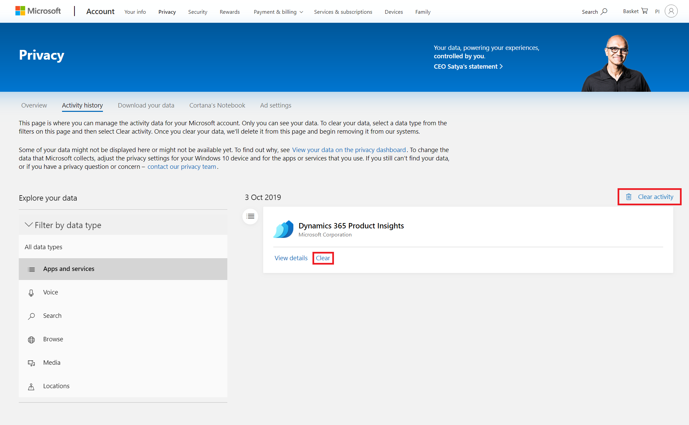
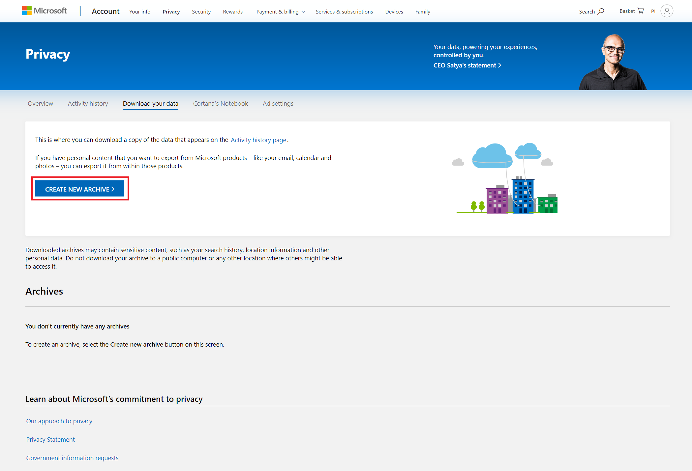
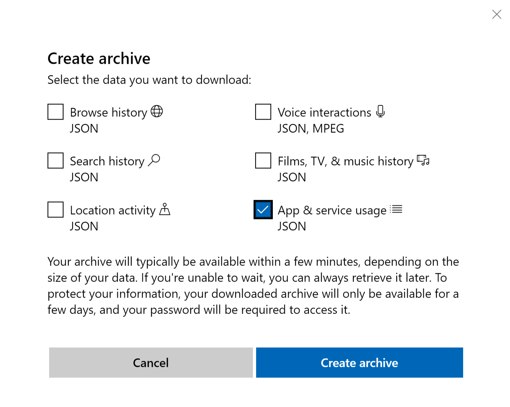

# How to control the lifecycle of user content and application usage data

[!INCLUDE [cc-beta-prerelease-disclaimer]( includes/cc-beta-prerelease-disclaimer.md)]

## Overview

While using Product Insights, two different types of user related content will eventually be created:

1. Content created directly by users like yourself—such as settings, dashboards, and charts.
2. Usage data, which Product Insights collects from users as part of ongoing efforts to improve the product and give you a better experience.

The following sections describe how you can manage the lifecycle of your data.

## User content

As you use Product Insights, you'll create data in the form of dashboards, charts, and even just your user settings. All of the content you create can be viewed, modified, and deleted through the [Product Insights User Interface](https://pi.dynamics.com/).

## Usage data

Product Insights also continuously gathers data about how you use the service. This data is handled in a secure way in our backend services, and stored in protected databases with restricted access control.

There are two main reasons we collect usage data:

* Product improvement
* Customer support

Most of this data has a retention time of less than 30 days, and will be automatically deleted after that period. Additionally, all of your personal data will be deleted if you close your Azure Active Directory (AAD) or Microsoft service account.

You can also manually delete or export the data we gather about your usage. The steps to do so depend on the authentication mechanism used when logging into the Product Insights portal.

### Azure Active Directory accounts

Only AAD tenant admins can issue export or delete requests on behalf of the organization they manage. Please contact your AAD tenant admin to assist you. If you are an AAD tenant admin, please find detailed documentation on how to create export and delete requests [here](https://docs.microsoft.com/microsoft-365/compliance/gdpr-dsr-azure).

> [!NOTE]
> Deletion requests for usage data are triggered by deleting the associated user from the AAD tenant.

### Microsoft accounts

Go to the [Microsoft Account Privacy Dashboard](https://account.microsoft.com/privacy/) and log into your Microsoft account if you have not done so already. This is the main portal through which you can export and delete your usage data.

#### Deletion

To delete your usage data, navigate to **Activity history**. Iin the **Filter by data type** dropdown on the left hand menu, select **Apps and services**.

On the right, you should now see an activity log of your Microsoft account with a list of all applications that have gathered data about your account (grouped by date). Delete individual entries by selecting **Clear** next to each entry, or delete all entries by selecting **Clear activity** in the upper right.

#### Export

To export your usage data, navigate to **Download your data** and select **CREATE NEW ARCHIVE**.

In the selection screen, check the box next to **App & service usage JSON** and then select **Create archive**.

After a few minutes, your archive will be ready. You can download it by selecting **Download**.

> [!NOTE]
 > Any archives you create will expire within seven days.

For more information regarding Microsoft's commitment towards protecting your privacy, please read the [Microsoft Privacy Statement](https://privacy.microsoft.com/).
