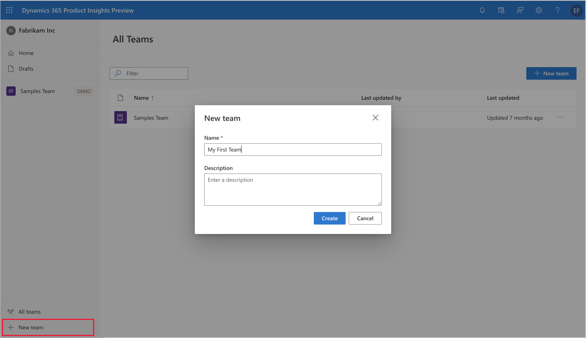
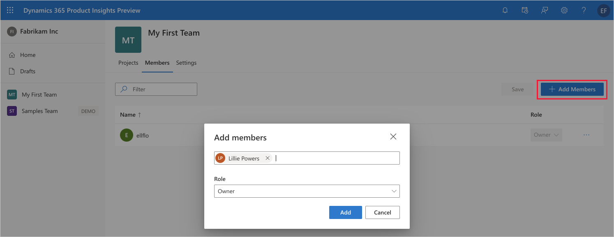
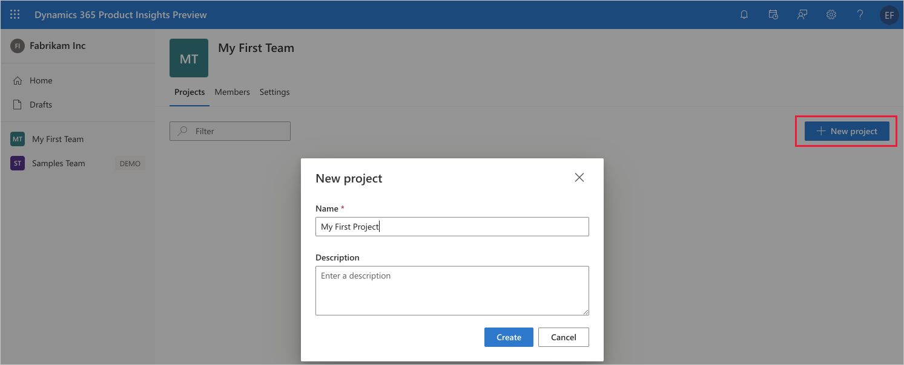

# Create a team 

## Sign up for a Product Insights preview

First, sign into Product Insights at [https://pi.dynamics.com](https://pi.dynamics.com).  

An Azure Active Directory (AAD) or Microsoft account (example: sample@outlook.com) is required for signing up for the Product Insights preview.   

>[!VIDEO https://youtube.com/embed/wTLSpr5kecQ] 

## Create a team 
To create a team, follow these steps:
1. If you are not already part of a team, select **+New team** in the bottom left corner of the portal.
1. Type a team name of choice in the **Name** field and any text for **Description**. 
1. Select **Create** to save the update.

	
  
## Add members 
To add members to your team, follow these steps:
1. Select your newly created team **<insert team name>** from the left menu.  
1. Select **Members**, and then **+Add Members** to the right of the portal.
1. Enter email addresses from your organization for any new members you would like to have access, and then select **Owner** under **Role**. 
1. Select **Add** to save the update.

	

## Create a project 
To create a project within your team, follow these steps:
1. Select **Projects** and then **+New project** to the right of the portal. 
1. Type a project name of choice in the **Name** field and any text for **Description**.  
1. Select **Create** to save the update.

	
  
