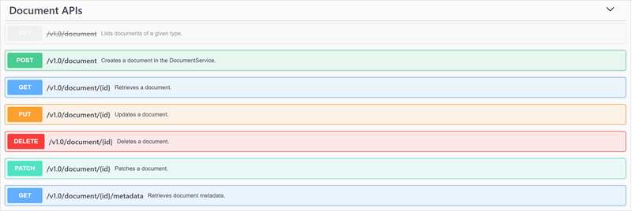
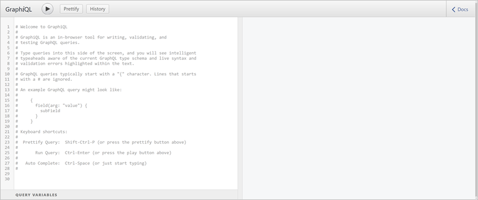

# GDPR/ Compliance 

## Background
The European Union’s General Data Protection Regulation (GDPR) that has been applied since May 25, 2018, gives significant rights to individuals with regards to their data. The GDPR is fundamentally about protecting and enabling the privacy rights of individuals. You can read more about the Microsoft commitment to security at the Microsoft Trust Center.

## How to control the lifecyle of user content and application usage data
The following sections describe how you can manage the lifecycle of your data.  

## Overview
While using Product Insights two different kinds of user related content will eventually be created:
1. **User Content** directly created by a specific user, e.g. dashboards, charts.  
2. Product Insights **Usage Data**, which is collected from users as part of Product Insights’ ongoing efforts to improve the product and give you the best experience.  

### User content
When you use Product Insights, you create several documents, such as dashboards, user settings etc. Some of them you can view/manage directly through the portal.
However for fine grained control over all your documents you can make use of our [REST API](https://msswagger/service/18751494-838b-4458-869d-0c038c0db35b/ariaapis#/Document%20APIs).

All of your documents are stored in JSON format in our backend databases and can also be viewed via our [GraphQL endpoint](https://www.aria.ms/apps/graphql-explorer/). This is the recommended approach to viewing your documents, however for create/update/delete you would have to use the REST API mentioned above.

### Usage data
As soon as you start using Product Insights, we are gathering Usage Data. This data is handled in a secure way in our backend services and send to locked down databases with restricted access control. There are two main reasons we are collecting this data:
* Product improvement
* Customer support

Most of this data has a retention of less than 30 days and will automatically be deleted after that period. You can also trigger manual deletes/exports of the data we gather about your Product Insights usage. The steps to manually delete/export this data varies with regards to the authentication mechanism you used when logging into the Product Insights Portal. In addition to that all of your personal data will be deleted once you close your  AAD or MS Account.

#### Azure Active Directory Accounts
Only Azure Active Directory (AAD) Tenant Admins can issue export/delete requests on behalf of the organization they manage. Please contact your ADD Tenant Admin to assist you. If you are an AAD Tenant Admin you can find the detailed documentation in how to create export/delete requests [here](https://docs.microsoft.com/en-us/microsoft-365/compliance/gdpr-dsr-azure).

> [!NOTE]
 > Deletion requests for **Usage Data** are triggered by deleting the associated user from the AAD Tenant.

#### Microsoft Accounts
You can delete/export your data by logging into your Microsoft Account and following the instructions on the [Privacy Dashboard](https://account.microsoft.com/privacy).

For more information regarding Microsoft's commitment towards protecting your privacy, please read the [Microsoft Privacy Statement](https://privacy.microsoft.com).
