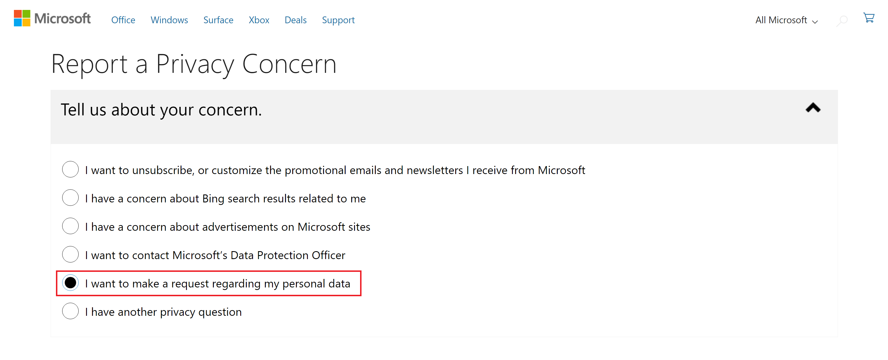
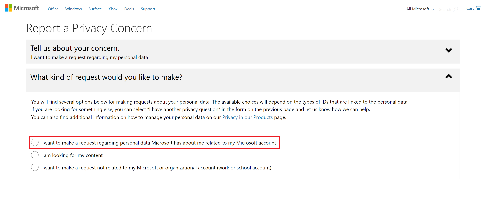
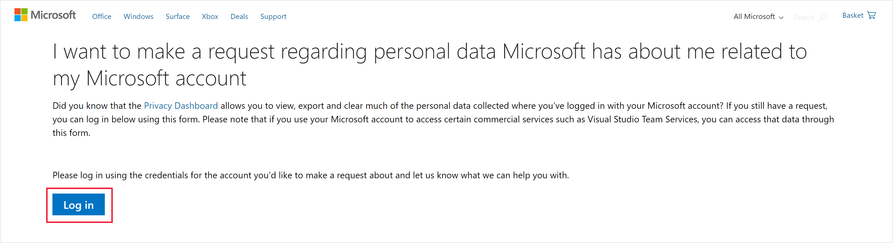
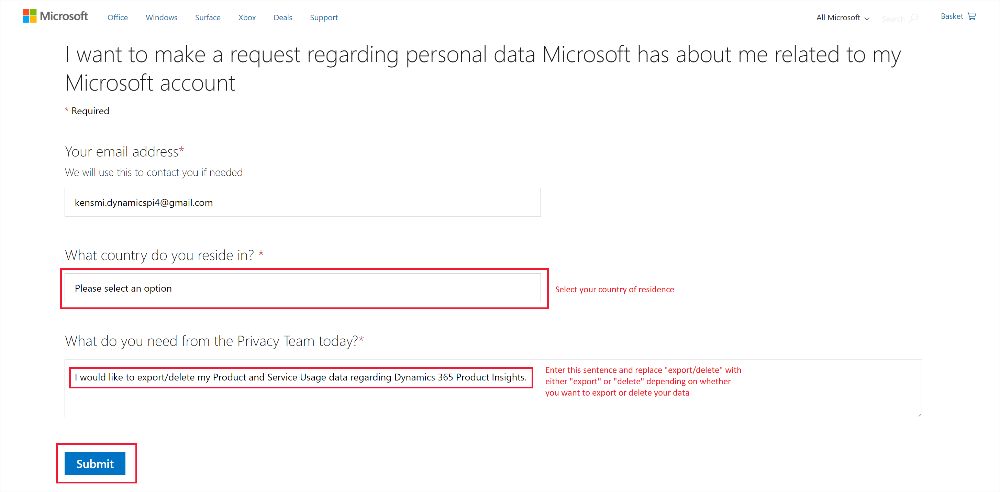

# How to control the lifecyle of user content and application usage data

## Overview
While using Product Insights two different kinds of user related content will eventually be created: 

1. User Content directly created by a specific user, e.g. dashboards, charts.
2. Product Insights Usage Data, which is collected from users as part of Product Insights’ ongoing efforts to improve the product and give you the best experience.

The following sections describe how you can manage the lifecycle of your data.

## User content
When you use Product Insights, you create several documents, such as dashboards, user settings etc. All of the content you create can be viewed modified and deleted through the [Product Insights User Interface](https://pi.dynamics.com/).

## Usage data
As soon as you start using Product Insights, we are gathering Usage Data. This data is handled in a secure way in our backend services and send to locked down databases with restricted access control. There are two main reasons we are collecting this data: 

* Product improvement 
* Customer support

Most of this data has a retention of less than 30 days and will automatically be deleted after that period. You can also trigger manual deletes/exports of the data we gather about your Product Insights usage. The steps to manually delete/export this data varies with regards to the authentication mechanism you used when logging into the Product Insights Portal. In addition to that all of your personal data will be deleted once you close your AAD or MS Account.

### Azure Active Directory Accounts
Only Azure Active Directory (AAD) Tenant Admins can issue export/delete requests on behalf of the organization they manage. Please contact your ADD Tenant Admin to assist you. If you are an AAD Tenant Admin you can find the detailed documentation in how to create export/delete requests [here](https://docs.microsoft.com/en-us/microsoft-365/compliance/gdpr-dsr-azure).

> [!NOTE] 
> Deletion requests for Usage Data are triggered by deleting the associated user from the AAD Tenant.

### Microsoft Accounts
Send a request to view/delete your information to the Microsoft Privacy team by following these steps:
1. Go to the Microsoft privacy concern page [here](https://www.microsoft.com/en-us/concern/privacy).

2. Click on "I want to make a request regarding my personal data".         

3. Select "I want to make a request regarding personal data Microsoft has about me related to my Microsoft account".  
 

4. Click the "Login" button and log into your Microsoft Account.
  

5. Select your country of residence from the drop down menu and make your request in the text box. 
You could also copy your choice of the following statements into the text box, depending on whether you want your data exported or deleted:   

    a. To delete: "I would like to delete my product and   service usage data regarding Dynamics 365 Product Insights."

    b. To export: "I would like to export my product and service usage data regarding Dynamics 365 Product Insights."

6. Finally, click "Submit" to submit your request to the Microsoft Privacy Team. 

>[!NOTE] We are currently working on making the usage data we gather about you 
accessible on your Microsoft Account Privacy Settings page. The data will be available by the end of October 2019 and will include all data gathered from October 1st 2019 onwards.
For more information regarding Microsoft's commitment towards protecting your privacy, please read the [Microsoft Privacy Statement](https://privacy.microsoft.com/).
