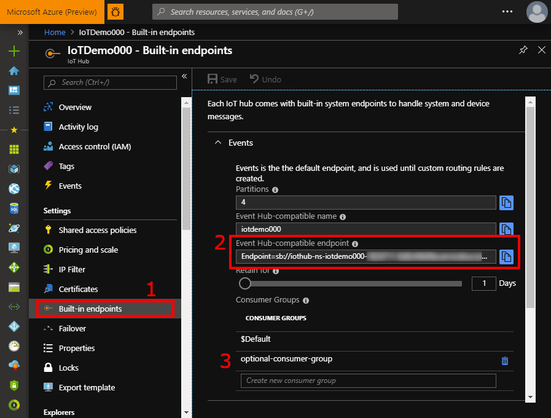
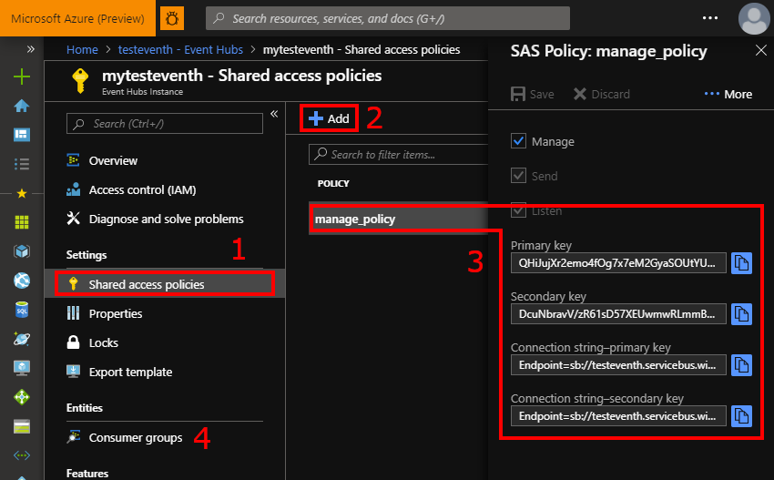

# Connecting Event Hubs to Product Insights

Creating an Event Hub or IoT Hub to Product Insights connection lets you use Product Insights with data being sent to an existing event hub. The process for connecting an Event Hub or IoT Hub to Product Insights consists of the following 3 steps:

1. Get the **connection string** for your Event Hub or IoT Hub
   * Optionally, create a **consumer group** for Product Insights to read from as well
2. Access your Product Insights project's **Settings** screen
3. Add a data source with your **connection string**, optionally using your **consumer group**.


## Obtaining your Connection String

This step differs depending on whether you're connecting to an Event Hub or an IoT Hub; instructions for both are shown here. Your connection string should look like this:

```
Endpoint=sb://your-endpoint.servicebus.windows.net/;SharedAccessKeyName=key-name;SharedAccessKey=your-access-key;EntityPath=your-entity-path
```


### Obtaining an IoT Hubs Connection String

1. On your IoT Hub's page in the [Azure Portal](https://portal.azure.com/), click on **Built-in endpoints** on the left pane, under "Settings"
2. Select and copy or click the "Copy" button for the **Event Hub-compatible endpoint**
3. (Optional) Use this page to create a new Consumer Group




### Obtaining an Event Hub Connection String

These instructions assume you have already created an event hub instance inside your Event Hubs Namespace.

1. On your Event Hub's page in the [Azure Portal](https://portal.azure.com/), click on **Shared access policies** on the left pane, under "Settings"
2. If you haven't created any access policies yet, click the "Add" button to add a policy. Make sure it has **Listen** permission.<br>
   
3. Click on the access policy you want to use and copy the **Connection string** (primary or secondary key)
4. (Optional) Use the "Consumer groups" page to create a new consumer group.




## Making an Event Hub / IoT Hub Connection

Once you have your **connection string** and, optionally, your **consumer group name**, open your project on [pi.dynamics.com](https://pi.dynamics.com/) to make the connection. Once you make a connection, your project will be backfilled with any data in the event hub, depending on its retention settings, and any future events pushed to the event hub will also be sent to Product Insights.

1. Go to the **Settings** page
2. Scroll down to **Data Sources** and click "**Add Source**"
3. Enter your **connection string**, a connection name, and optionally a **consumer group name**.
4. Click the highlighted **Add** button, and the connection will be made.


