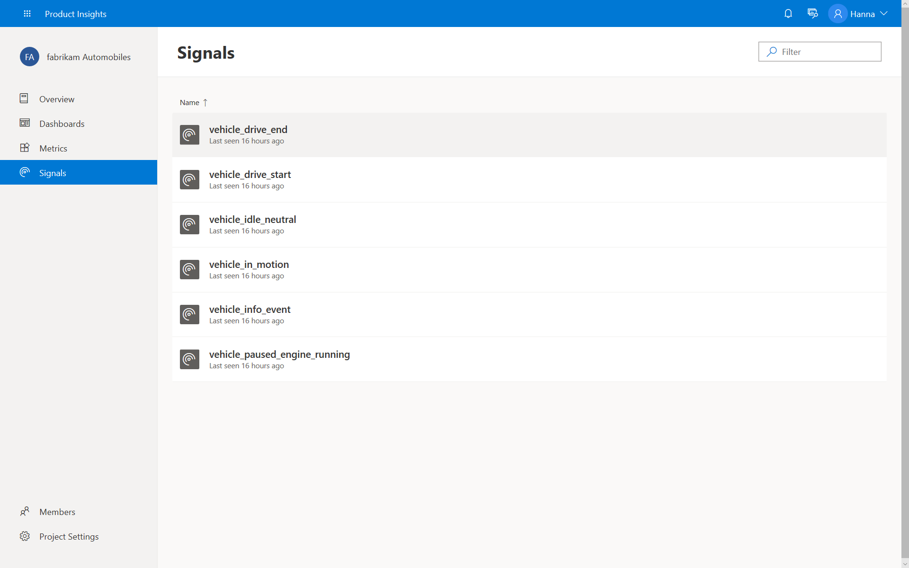

# Find incoming signals

Let's start with raw data. Log in, navigate to Fabrikam automobiles project, and select signals. See all types of signals continuously flowing into the project. Select one to check exactly what is being reported from thousands of automobiles. 

When a car completes a drive, it sends a lot of summary data. One of it is MPG - gas used per mile. We will explore this metric. Click "Explore" on top right corner. 

> [!div class="nextstepaction"]
> [Next >>](1_2_slice.md)

