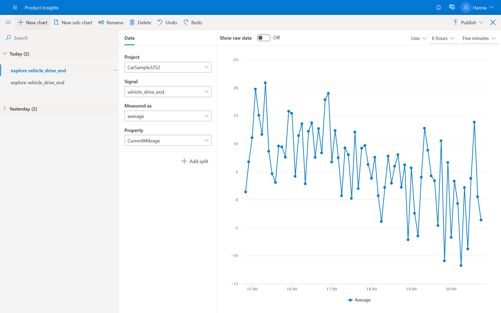

# Examine signals

You can see the MPG*  for each vehicle fuel type. Using the `vehicle_drive_end` signal, select the property `mpg`. Then select **Add Split**. Select `vehicle_fuel_type`. Now you can see average MPG values for electric, hybrid, and gas vehicles. 

 * or MPGe (miles per gallon gasoline equivalent) for electric cars! 

> [!div class="nextstepaction"]
> [Next >>](1_3_explore.md)

