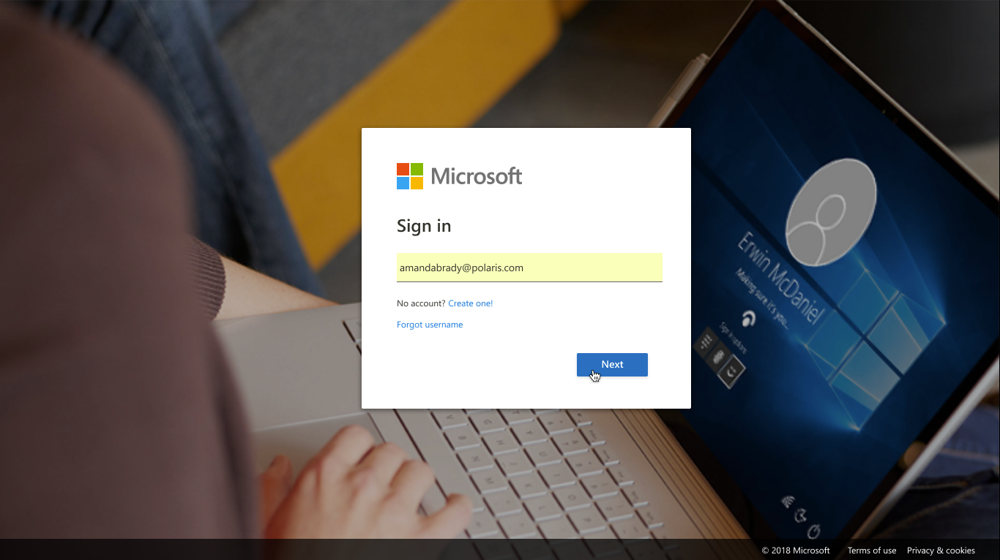

# Find signals 

A signal is a continuous flow of data. If your team is using Product Insights, you will probably find signals for your team's projects. 

In this section, you will learn to find signals, examine their contents, and learn to interact with them to get insights. We will be working with sample data for the Fabrikam Tech automobile company. 

1. Log into [Product Insights](pi.dynamics.com) to get started.

> [!div class="nextstepaction"]
> [Next >>](examine-signals.md)
