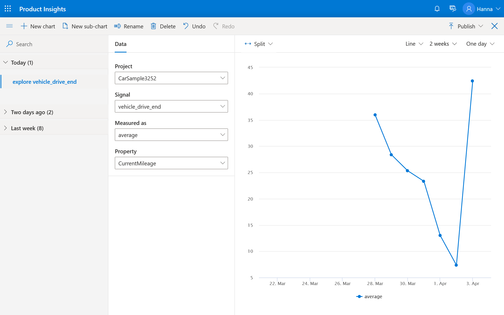

# Create a metric 

1. On the **Signals** details page, open the chart editor by selecting **Explore** at the top right corner of the screen. 

2. Under **Signal**, select **vehicle_drive_end**.
3. Under **Measured as**, select **average**.
4. Under **Property**, select **CurrentMileage**. This is what the vehicles reported as their MPGe for each trip. After these steps, you will see the chart showing average MPGe for all vehicles and all trips.

> [!div class="nextstepaction"]
> [Next >>](2_2_split-metric.md)
