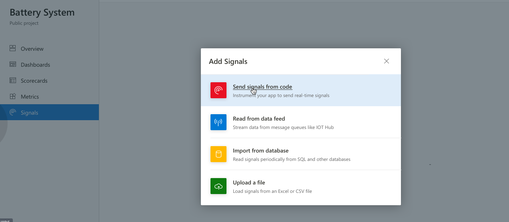

# Define your insight

Let's see count of cars divided into fuel types. That would be distinct count of VIN numbers, split into fuel types. Then only select electric. Add another split - cities. 

Now you have a chart that shows cities with the highest number of electric cars. You think this is a useful value you will re-use in the future. Then we can turn it into a metric. 

