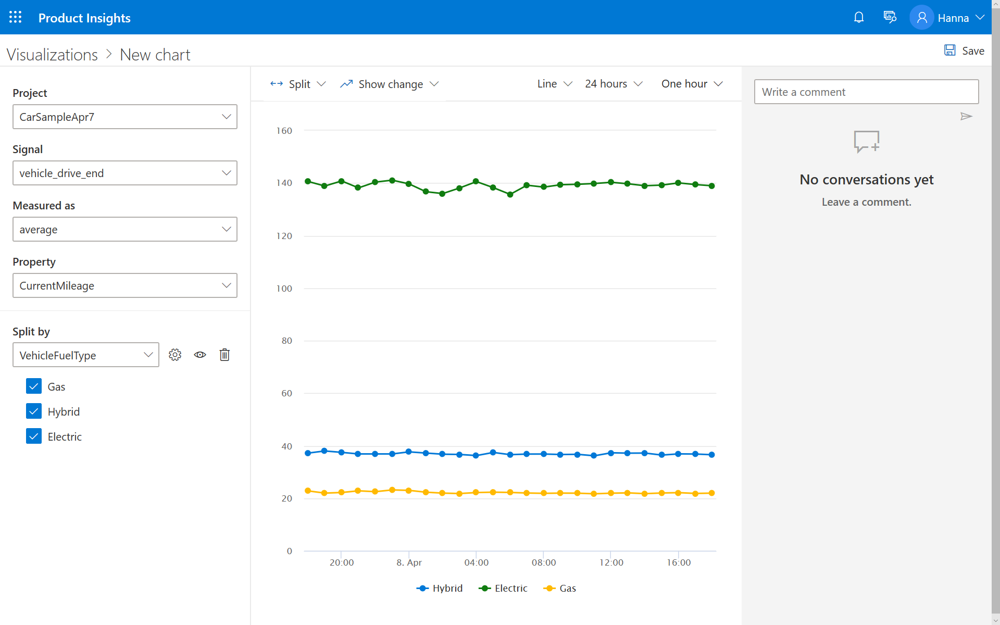

# Add splits

The MPG value you see on the chart is for all vehicles. We can add a split. 

1. To see MPGe values for different vehicle fuel types, such as electric or gasoline, select **Split** from the top left corner of the chart. 
2. Under **Split by**, select **VehicleFuelType**. 

> [!div class="nextstepaction"]
> [Next >>](2_3_publish.md)
