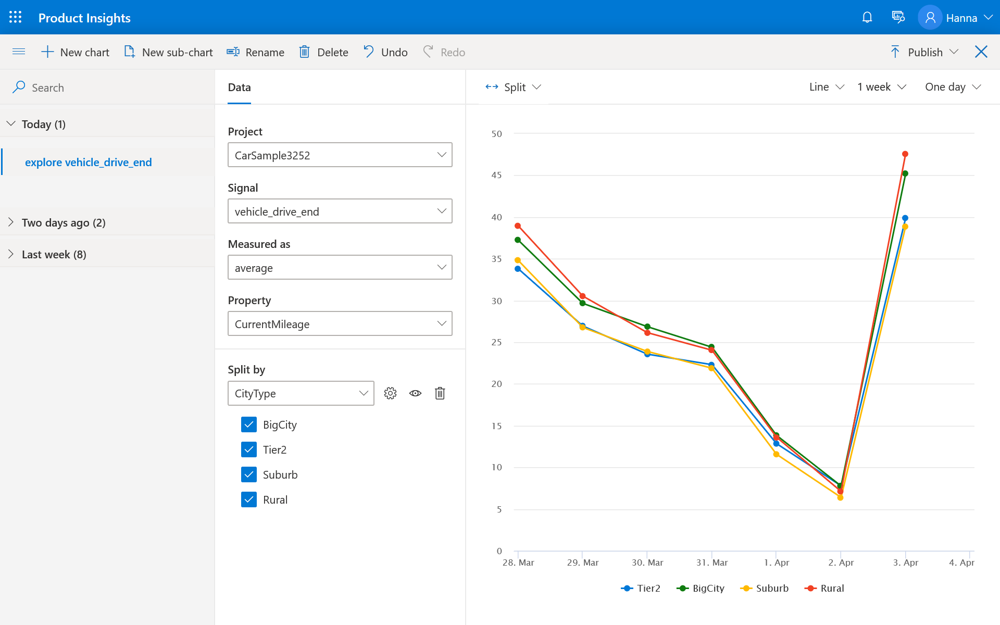

# Publish your metric

7. Now you will see multiple lines representing average MPG for each fuel type. 
8. Select **Publish** at the top right corner of the chart to publish the metric. That means this metric (MPGe per city type) will appear on the list of metrics and be available to other users. Your colleagues can then comment on the metric and create their own metrics and charts based on your metric. 

From your landing page, click on metrics. Your metric is available for use - your colleagues can also create charts based on this metric. 

