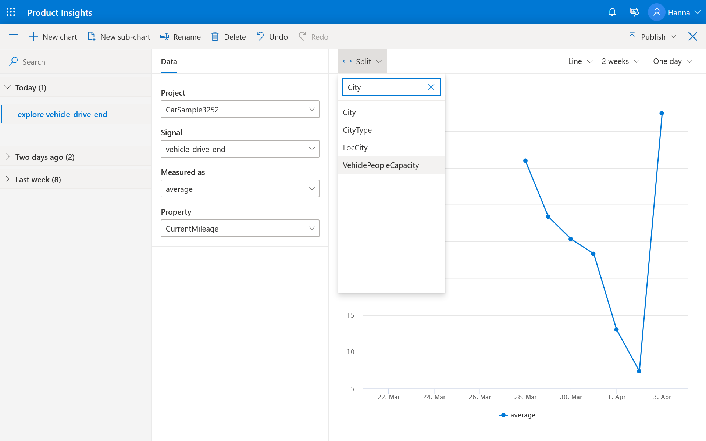

# Create your own metric  

The following steps will find the average MPGe* for each fuel type and city type. The instructions follow from the end of the previous section: [View signals](xref:developers/quick-starts/1_view-signals). 

1. On the Signals details page, open the chart editor by selecting **Explore** at the top right corner of the screen. 
2. Select a signal - vehicle_drive_end.
3. For "Measured As", select **average**.
4. For "Property", select **CurrentMileage**. This is what vehicles reported as MPG for each trip. After these steps, you will see the chart showing average MPGe for all vehicles and all trips. 

5. To see MPGe values for different vehicle fuel types, such as electric or gasoline, select **split** shown at the top left corner of the chart. 
6. Select **city types** from the dropdown. 

7. Now you should see multiple lines representing average MPGe for each city type. Select **save** to save the result as a metric.

8. Publish the metric.

Once you publish your insight as a metric, you can share it with others, and they can use it in their charts.

*MPGe: miles per gallon gasoline equivalent

> [!div class="nextstepaction"]
> [Next >>](2_1_define-measure.md)
