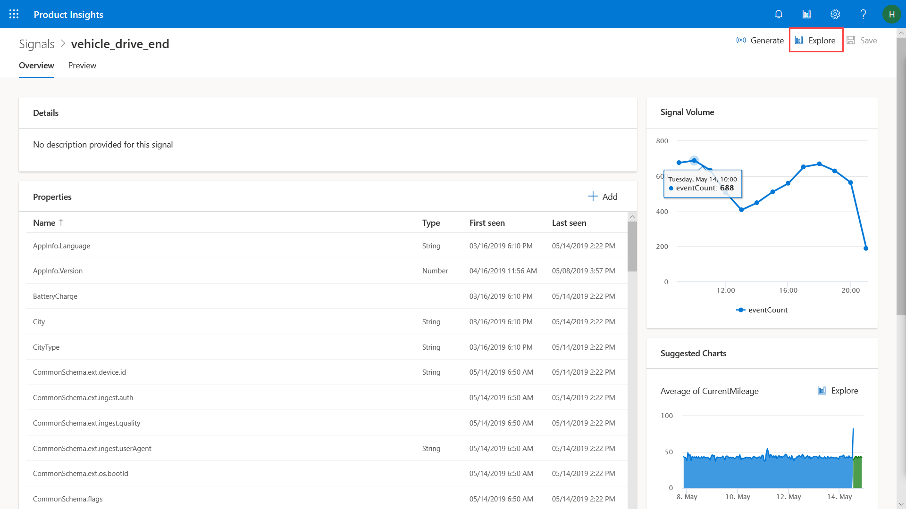
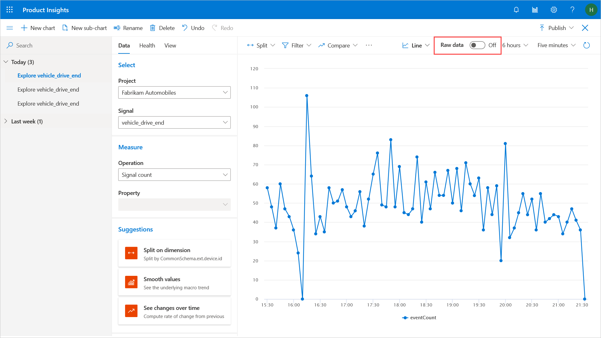
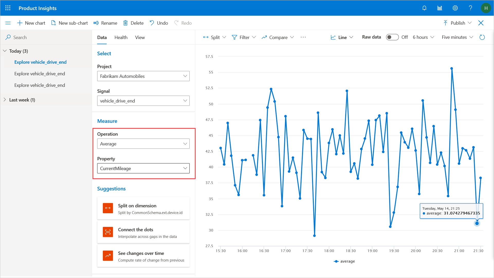
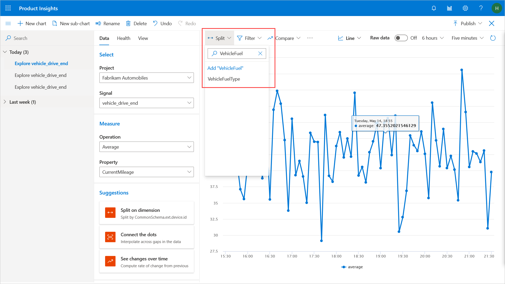
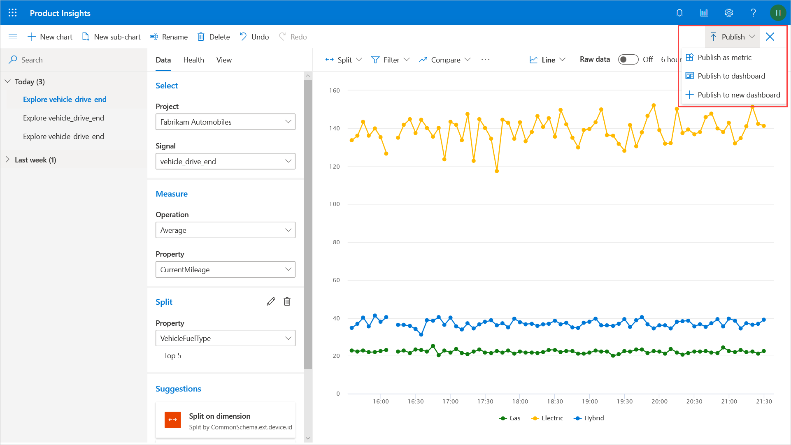

# Create metrics   

Metrics are meaningful measures that are extracted from signals. Your products would have generated and sent signals containing data relevant to operation of the product. Browse the signals that are being sent in, select a signal of interest, then drill further down to pinpoint a specific property (data) that would give you a meaningful metric. 

In this article, you will learn how to build metrics from signals in seconds. 

**vehicle_drive_end** signal is sent after a vehicle completes a trip, and the signal contains MPG* value for the whole trip. Using this property, average MPG values for different vehicle fuel types can be determined. 

To get to this signal **vehicle_drive_end**, refer to the previous section [View signals](1_view-signals). 

1. On the Signals details page for **vehicle_drive_end signal**, open the chart editor by selecting Explore at the top right corner of the screen.

2. Turn off raw data. Under Signal, select **vehicle_drive_end**, if not already selected. 

3. Under **Measured as**, select **average**.
4. Under **Property**, select **CurrentMileage**. This is what the vehicles reported as their MPGe for each trip. After these steps, you will see the chart showing average MPGe for all vehicles and all trips.

So far this MPG value is for all types of vehicles. To see MPG values for different vehicle fuel types such as electric or gasoline, you need to add splits. 

5. Select **Split** from the top left corner of the chart.
6. Under **Split**, select **VehicleFuelType**.

Now you will see multiple lines representing average MPG for each fuel type.

7. Select **Publish** at the top right corner of the chart to publish the metric.  That means this metric (MPG per city type) will appear on the list of metrics and be available to other users. Your colleagues can then comment on the metric and create their own metrics and charts based on your metric.

*For electric vehicles, the value is *MPGe - miles per gallon gasoline equivalent

> [!div class="nextstepaction"]
> [Get insights >>](3_get-insights.md)
